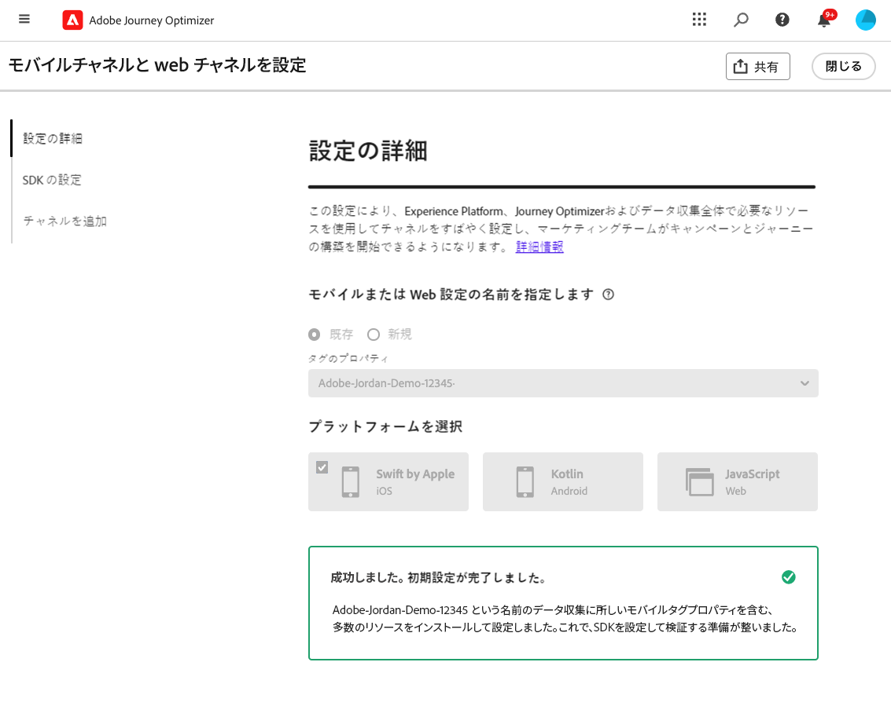
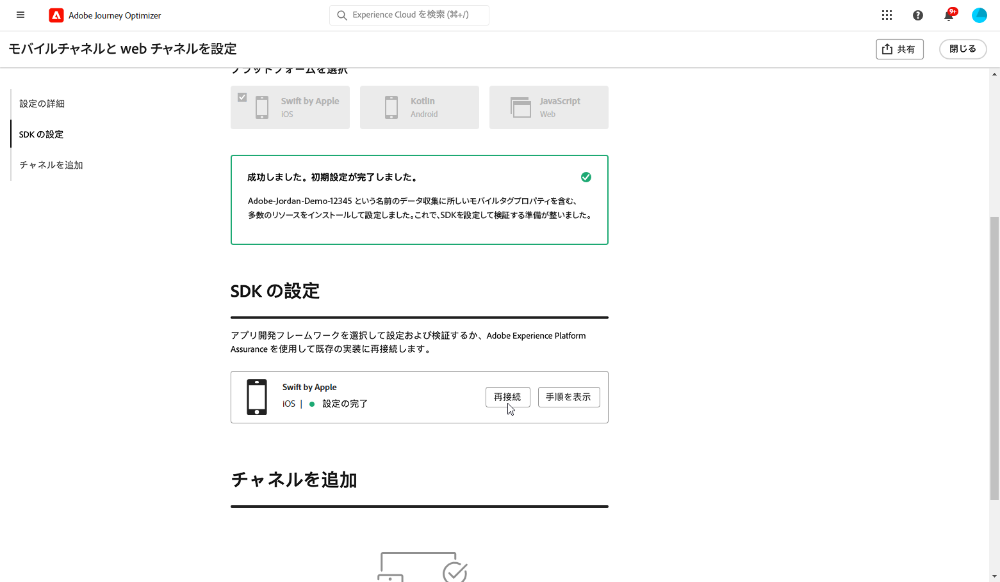

# チャネル設定の作成 {#set-mobile-ios}

>[!CONTEXTUALHELP]
>id="ajo_mobile_web_setup_javascript_code"
>title="JavaScript コード"
>abstract="head タグには、web ページのメインコンテンツの前に読み込まれる必須のメタデータとリソースが含まれています。 このセクションにコードを配置することで、コードが早い段階で適切に初期化および実行され、web ページの読み込みと機能が効率的になります。 head セクションにコードを追加すると、サイトの構造、パフォーマンス、および全体的なユーザーエクスペリエンスを向上させることができます。"

>[!CONTEXTUALHELP]
>id="ajo_mobile_web_setup_push_token"
>title="デバイストークンの取得"
>abstract="デバイスのプッシュトークンがAdobe Experience Platform プロファイルと正しく同期されていることを確認するには、次のコードをアプリケーションに組み込む必要があります。 この統合は、最新の通信機能を維持し、シームレスなユーザーエクスペリエンスを確保するために不可欠です。"

>[!CONTEXTUALHELP]
>id="ajo_mobile_web_setup_push_xcode"
>title="Xcode からのアプリケーションの起動"
>abstract="プッシュトークンを取得するには、まず Xcode を使用してアプリケーションを起動します。 アプリケーションが起動したら、アプリケーションを再起動して、検証プロセスが完了していることを確認します。 その後、Adobeは検証結果の一部としてプッシュトークンを提供します。 このトークンは、プッシュ通知を有効にするために必須であり、設定が正常に検証されると表示されます。"

>[!CONTEXTUALHELP]
>id="ajo_mobile_web_push_certificate_fcm"
>title="プッシュ証明書の指定"
>abstract=".json 秘密鍵ファイルをドラッグ&amp;ドロップします。 このファイルには、アプリケーションとサーバー間の安全な統合および通信に必要な認証情報が含まれています。"

>[!CONTEXTUALHELP]
>id="ajo_mobile_web_setup_push_certificate"
>title="プッシュ証明書の指定"
>abstract=".p8 キーファイルには、安全なプッシュ通知のために、Apple サーバーでアプリを認証するために使用される秘密鍵が含まれています。 このキーは、開発者アカウントの証明書、識別子、プロファイル ページから取得できます。"

>[!CONTEXTUALHELP]
>id="ajo_mobile_web_setup_push_key_id"
>title="キー ID"
>abstract="キー ID は、p8 認証キーの作成時に割り当てられた 10 文字の文字列で、開発者アカウントの証明書、識別子、プロファイル ページの「**キー**」タブにあります。"

>[!CONTEXTUALHELP]
>id="ajo_mobile_web_setup_push_team_id"
>title="チーム ID"
>abstract="チーム ID は、チームを識別するために使用される文字列値で、開発者アカウントの **メンバーシップ** タブに配置できます。"

この設定により、マーケティングチャネルの迅速な設定が簡単になり、すべての重要なリソースがExperience Platform、Journey Optimizerおよびデータ収集アプリで容易に使用できるようになります。 これにより、マーケティングチームはキャンペーンとジャーニーの作成をすばやく開始できます。

1. Journey Optimizer ホームページで、「**[!UICONTROL モバイルと web チャネルの設定]** カードから **[!UICONTROL 開始]** をクリックします。

   

1. **[!UICONTROL 新規]** 設定を作成します。

   既存の設定がある場合は、選択するか、新しい設定を作成するかを選択できます。

   

1. 新しい設定の **[!UICONTROL 名前]** を入力し、**[!UICONTROL データストリーム]** を選択または作成します。 この **[!UICONTROL 名前]** は、自動作成されるすべてのリソースで使用されます。

1. 組織に複数のデータストリームがある場合は、既存のオプションから 1 つ選択してください。 データストリームがない場合は、データストリームが自動作成されます。

1. プラットフォームを選択し、「**[!UICONTROL リソースの自動作成]**」をクリックします。

1. 設定プロセスを効率化するために、開始に役立つ必要なリソースが自動的に作成されます。 これには、新しい **[!UICONTROL モバイルタグプロパティ]** の作成や、拡張機能のインストールが含まれます。

[自動生成されたリソースの詳細](set-mobile-config.md#auto-create-resources)

1. リソースの生成が完了したら、ユーザーインターフェイスの指示に従って、SDK とチャネルを設定し検証します。

1. 設定が完了したら、自動生成した **[!UICONTROL チャネル設定]** を、ジャーニーやキャンペーンの作成を担当するチームメンバーと共有します。

   {zoomable="yes"}

1. キャンペーンまたはジャーニーインターフェイスで **[!UICONTROL チャネル設定]** を参照できるようになり、設定と、オーディエンスに対するターゲット設定されたジャーニーおよびキャンペーンの実行とのシームレスな関連付けが可能になります。

## モバイルの既存の設定の変更 {#reconnect}

設定を作成したら、いつでも簡単に再検討して、追加のチャネルを追加したり、ニーズに合わせてさらに調整を加えたりできます

1. Journey Optimizer ホームページで、「**[!UICONTROL モバイルと web チャネルの設定]** カードから **[!UICONTROL 開始]** をクリックします。

   

1. 「**[!UICONTROL 既存]**」を選択し、ドロップダウンから既存の **[!UICONTROL タグプロパティ]** を選択します。

   

1. 既存の設定にアクセスする場合は、Adobe保証に再接続する必要があります。 SDK 設定メニューから、「**[!UICONTROL 再接続]**」をクリックします。

   

1. **[!UICONTROL 利用可能なデバイス]** ドロップダウンからデバイスを選択し、**[!UICONTROL 接続]** をクリックします。

   {zoomable="yes"}

1. これで、必要に応じて設定を更新できます。
