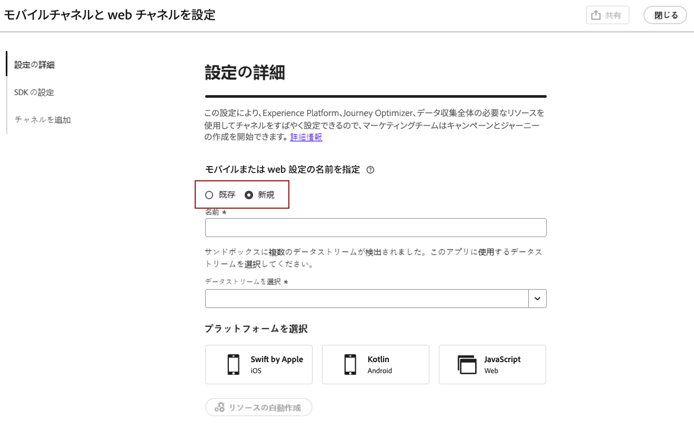
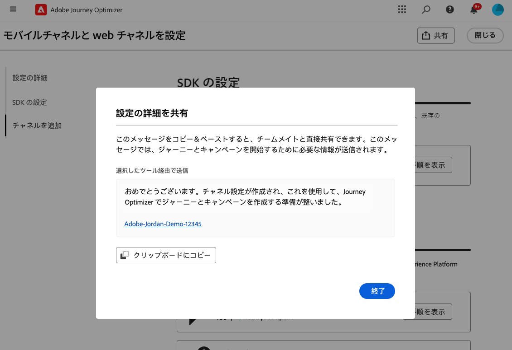
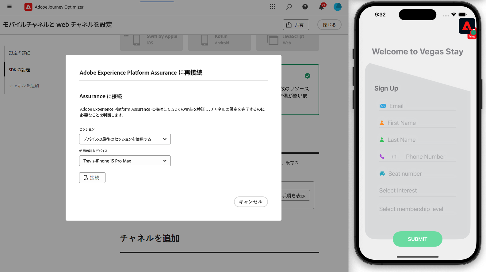

# チャネル設定の作成 {#set-mobile-ios}

>[!CONTEXTUALHELP]
>id="ajo_mobile_web_setup_javascript_code"
>title="JavaScript コード"
>abstract="head タグには、web ページのメインコンテンツの前に読み込まれる重要なメタデータとリソースが含まれています。このセクションにコードを配置すると、コードが適切に初期化され、早期に実行されるので、web ページが効率的に読み込まれ、機能するようになります。head セクションにコードを追加すると、サイトの構造、パフォーマンス、全体的なユーザーエクスペリエンスが向上します。"

>[!CONTEXTUALHELP]
>id="ajo_mobile_web_setup_push_token"
>title="デバイストークンの取得"
>abstract="デバイスのプッシュトークンが Adobe Experience Platform プロファイルと適切に同期されるようにするには、次のコードをアプリケーションに組み込む必要があります。この統合は、最新の通信機能を維持し、シームレスなユーザーエクスペリエンスを確保するのに不可欠です。"

>[!CONTEXTUALHELP]
>id="ajo_mobile_web_setup_push_xcode"
>title="Xcode からのアプリケーションの起動"
>abstract="プッシュトークンを取得するには、まず Xcode を使用してアプリケーションを起動します。アプリケーションが起動したら、再起動して、検証プロセスが完了していることを確認します。その後、アドビは検証結果の一部としてプッシュトークンを提供します。このトークンはプッシュ通知を有効にするのに不可欠であり、設定が正常に検証されると表示されます。"

>[!CONTEXTUALHELP]
>id="ajo_mobile_web_push_certificate_fcm"
>title="プッシュ証明書の指定"
>abstract=".json 秘密鍵ファイルをドラッグ＆ドロップします。このファイルには、アプリケーションとサーバー間の安全な統合と通信に必要な認証情報が含まれています。"

>[!CONTEXTUALHELP]
>id="ajo_mobile_web_setup_push_certificate"
>title="プッシュ証明書の指定"
>abstract=".p8 キーファイルには、安全なプッシュ通知のために Apple のサーバーでアプリを認証するために使用される秘密鍵が含まれます。このキーは、開発者アカウントの証明書、識別子、プロファイルページから取得できます。"

>[!CONTEXTUALHELP]
>id="ajo_mobile_web_setup_push_key_id"
>title="キー ID"
>abstract="キー ID は、p8 認証キーの作成時に割り当てられる 10 文字の文字列で、開発者アカウントの証明書、識別子、プロファイルページの「**キー**」タブにあります。"

>[!CONTEXTUALHELP]
>id="ajo_mobile_web_setup_push_team_id"
>title="チーム ID"
>abstract="チーム ID は、チームを識別するために使用される文字列値で、開発者アカウントの「**メンバーシップ**」タブにあります。"

この設定により、マーケティングチャネルの迅速な設定が簡単になり、Experience Platform、Journey Optimizer およびデータ収集アプリですべての重要なリソースがすぐに使用できるようになります。これにより、マーケティングチームはキャンペーンとジャーニーの作成をすぐに開始できます。

1. Journey Optimizer ホームページで、**[!UICONTROL モバイルチャネルと web チャネルを設定]**&#x200B;カードの「**[!UICONTROL 開始]**」をクリックします。

   

1. **[!UICONTROL 新しい]**&#x200B;設定を作成します。

   既存の設定が既にある場合は、1 つを選択するか、新しい設定を作成するかを選択できます。

   

1. 新しい設定の&#x200B;**[!UICONTROL 名前]**&#x200B;を入力し、**[!UICONTROL データストリーム]**&#x200B;を選択または作成します。この&#x200B;**[!UICONTROL 名前]**&#x200B;は、自動作成されるすべてのリソースに使用されます。

1. 組織に複数のデータストリームがある場合は、既存のオプションから 1 つを選択します。データストリームがない場合は、自動的に作成されます。

1. プラットフォームを選択し、「**[!UICONTROL リソースを自動作成]**」をクリックします。

1. 設定プロセスを効率化するために、開始に役立つ必要なリソースが自動的に作成されます。これには、新しい&#x200B;**[!UICONTROL モバイルタグプロパティ]**&#x200B;の作成と拡張機能のインストールが含まれます。

[詳しくは、自動生成されたリソースを参照してください。](set-mobile-config.md#auto-create-resources)

1. リソースの生成が完了したら、ユーザーインターフェイスの指示に従って、SDK とチャネルを設定および検証します。

1. 設定が完了したら、自動生成された&#x200B;**[!UICONTROL チャネル設定]**&#x200B;を、ジャーニーとキャンペーンの作成を担当するチームメンバーと共有します。

   {zoomable="yes"}

1. **[!UICONTROL チャネル設定]**&#x200B;は、キャンペーンまたはジャーニーインターフェイスで参照できるようになり、設定と、オーディエンスに対するターゲットジャーニーおよびキャンペーンの実行との間のシームレスな接続が可能になります。

## モバイルの既存する設定の変更 {#reconnect}

設定を作成したら、いつでも簡単に再訪問して、チャネルを追加したり、ニーズに合わせてさらに調整したりできます。

1. Journey Optimizer ホームページで、**[!UICONTROL モバイルチャネルと web チャネルを設定]**&#x200B;カードの「**[!UICONTROL 開始]**」をクリックします。

   

1. 「**[!UICONTROL 既存]**」を選択し、ドロップダウンから既存の&#x200B;**[!UICONTROL タグプロパティ]**&#x200B;を選択します。

   

1. 既存の設定にアクセスする際は、Adobe Assurance に再接続する必要があります。SDK 設定メニューから、「**[!UICONTROL 再接続]**」をクリックします。

   

1. **[!UICONTROL 使用可能なデバイス]**&#x200B;ドロップダウンからデバイスを選択し、「**[!UICONTROL 接続]**」をクリックします。

   {zoomable="yes"}

1. これで、必要に応じて設定を更新できます。
