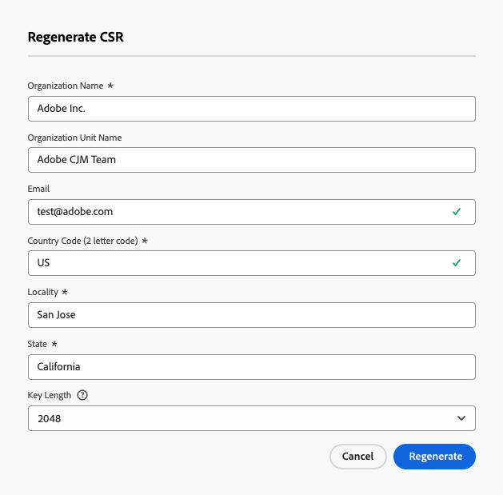
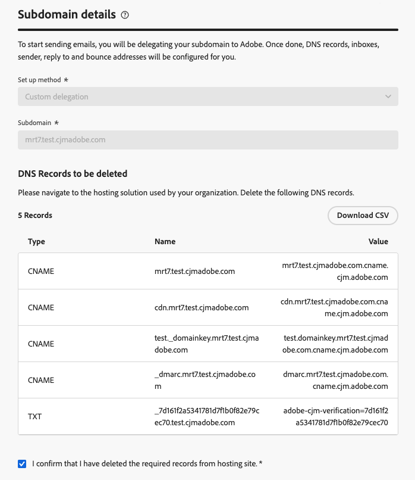

# メールサブドメインを CNAME からカスタム委任に移行する {#migrate-cname-to-custom}

>[!AVAILABILITY]
>
>この機能は、限定提供で使用できます。アクセス権を取得するには、アドビ担当者にお問い合わせください。

サブドメインが現在 [CNAME](about-subdomain-delegation.md#cname-subdomain-setup) で設定されている場合は、会社のセキュリティポリシーに合わせて **[!UICONTROL カスタムデリゲーション]** 方法に移行できます。 これにより、[!DNL Journey Optimizer] 内のサブドメインと証明書の完全な所有権と制御が可能になります。 [&#x200B; 詳しくは、カスタムサブドメインを参照してください &#x200B;](delegate-custom-subdomain.md)

このプロセスの一環として、次の操作をおこなう必要があります。

* ホスティングソリューションから [&#x200B; 既存の DNS レコードを削除 &#x200B;](#delete-dns) します
* 認証局から取得した [SSL 証明書をアップロード &#x200B;](#upload-ssl-certificate)
* ドメインの所有権を確認し、メールアドレスをレポートして、[&#x200B; フィードバックループの手順 &#x200B;](#feedback-loop) を完了します
* Adobeで生成された [&#x200B; 新しい DNS レコードセットを作成 &#x200B;](#create-dns-records) ホスティングプラットフォームに導入する

サブドメインを移行するには、次の手順に従います。

## 始める前に {#before-you-begin}

移行プロセスを開始する前に、以下の重要な情報を確認してください。

>[!IMPORTANT]
>
>移行できるのは、[CNAME メソッド &#x200B;](delegate-subdomain.md#cname-subdomain-setup) を使用して設定されたサブドメインのみです。

* **カスタムのデリゲーション方法が有効になっている** ことを確認します（この機能は現在、限定提供です。アクセス権を取得するには、Adobe担当者にお問い合わせください）。 [詳細情報](delegate-custom-subdomain.md)
* このサブドメインを使用しているアクティブなチャネル設定がないことを確認します。 移行プロセスによって、の機能が中断されます。

  >[!NOTE]
  >
  >移行を開始する前にチャネル設定を非アクティブ化した場合、移行ワークフローが完了した後でチャネル設定をアクティブ状態に戻すことができます。

* このサブドメインにリンクされたチャネル設定は配信を中断する可能性があるので、アクティブなキャンペーンやジャーニーが使用していないことを確認してください。
* 移行フローに入るとすぐにダウンタイムが始まることに注意してください。 サブドメインは処理中に **[!UICONTROL ドラフト]** に移動し、設定が完了するまで使用できません。
* したがって、SSL 証明書を準備してダウンタイムを減らすには、**移行プロセスを開始する前に移行前の手順を実行** することをお勧めします。 [詳細情報](#start-migration)

## 移行の開始 {#start-migration}

特定のサブドメインの移行を開始するには、次の手順に従います。

1. **[!UICONTROL 管理]**/**[!UICONTROL チャネル]**/**[!UICONTROL メール設定]**/**[!UICONTROL サブドメイン]** に移動します。

1. CNAME で設定されたサブドメインを選択して開きます。

1. 「**[!UICONTROL 移行前の CSR の生成]**」セクションを使用して、CSR を生成して認証局に送信し、移行プロセスの開始時に SSL 証明書を準備できます。 [詳細情報](#send-csr-to-ca)

   >[!IMPORTANT]
   >
   >移行前の手順は、この段階ではオプションですが、強くお勧めします。 移行を開始する **前に** 完了すると、ダウンタイムが短縮され、スムーズに移行できるようになります。

   {width="70%"}

1. 専用セクションの「**[!UICONTROL 今すぐ移行]**」を選択します。

   <!--{width=90%}-->

1. [&#x200B; 表示された情報 &#x200B;](#before-you-begin) を確認します。

   >[!WARNING]
   >
   >ダウンタイムは移行フローに入るとすぐに始まるので、アクティブなキャンペーンやジャーニーに影響を与えないようにしてください。

1. **[!UICONTROL はい]** をクリックします。 サブドメインは **[!UICONTROL ドラフト]** ステータスに移行し、設定が完了するまで使用できません。

## CSR を生成して認証局に送信します {#send-csr-to-ca}

移行を完了するには、認証局（CA）によって発行された SSL 証明書が必要です。 この SSL 証明書を受信するには、最初に証明書署名要求（CSR）を生成して、それを CA に送信する必要があります。

移行プロセスを既に開始しているかどうかに関係なく、次の手順に従って新しい CSR を生成し、送信します。

1. 「**[!UICONTROL CSR を再生成]**」をクリックします。

1. 表示されるフォームに入力して、証明書署名要求（CSR）を再生成します。

   {width="60%"}

   >[!NOTE]
   >
   >キーの長さは 2048 または 4096 ビットのみです。 サブドメインが送信された後は変更できません。

1. 「**[!UICONTROL CSR をダウンロード]**」をクリックして、フォームをローカルコンピュータに保存します。

1. これを認証局（CA）に送信して、SSL 証明書を取得します。この CSR を署名のために CA に送信する前に、考慮すべき重要な点がいくつかあります。

   * 手順 3 でダウンロードした CSR は、data.subdomain.com 専用です。

   * ただし、証明書は、単一の証明書内のサブジェクト代替名（SAN）エントリとして、data.subdomain.com と cdn.subdomain.com の両方に対応している必要があります。例えば、example.adobe.com をデリゲートしている場合、data.subdomain.com は data.example.adobe.com に対応し、cdn.subdomain.com は cdn.example.adobe.com に対応します。

   * データ （data.example.adobe.com）と CDN （cdn.example.adobe.com） サブドメインの両方を、同じ証明書内のピアエントリとして追加する必要があります。 この証明書には、サブドメインを追加しないでください。

   * ほとんどの CA では、署名プロセス中に SAN（CDN サブドメインなど）を追加できます

      * CA ポータル経由（使用可能な場合は推奨）、または
      * ポータルオプションが使用できない場合は、サポートチームに手動でリクエストすることで追加できます。

   * 署名が完了すると、CA はデータドメインと CDN サブドメインの両方に対応する単一の証明書を発行します。

## 既存の DNS レコードの削除 {#delete-dns}

移行プロセスを開始したら、ホスティングソリューションから既存の DNS レコードを削除する必要があります。 次の手順に従います。

1. DNS サーバーで現在設定されているレコードのリストが表示されます。

1. ドメインホスティングソリューションに移動し、DNS ホスティングから既存の CNAME エントリを削除します。

1. すべての DNS レコードが削除されていることを確認します。 完了したら、「必要なレコードをホスティングサイトから削除したことを確認します」チェックボックスをオンにします。

   {width="75%"}

## SSL 証明書のアップロード {#upload-ssl-certificate}

**[!UICONTROL SSL 証明書]** セクションでは、新しい SSL 証明書をアップロードする必要があ [!DNL Journey Optimizer] ます。

その前に、次の点を確認してください。

* [&#x200B; 移行前の手順 &#x200B;](#start-migration) の一環として CSR を既に認証局に送信している場合は、SSL 証明書を受信していることを確認してください。

* まだ行っていない場合は、手順に従って [CSR を生成、ダウンロード、送信 &#x200B;](#send-csr-to-ca) します。

<!--
    * Click **[!UICONTROL Regenerate CSR]** and fill the form to generate the Certificate Signing Request.

    * Click **[!UICONTROL Download CSR]** to save the form to your local computer.

    * Send the CSR to the Certificate Authority to get your SSL certificate.-->

1. SSL 証明書を取得したら、「**[!UICONTROL 証明書をアップロード]**」をクリックします。

   {width="75%"}

1. 完全な証明書チェーンを使用して、SSL 証明書を.pem 形式で [!DNL Journey Optimizer] にアップロードします。 .pem ファイル形式のサンプルを以下に示します。

   ```
   -----BEGIN CERTIFICATE-----
   MIIDXTCCAkWgAwIBAgIJALc3... (base64 encoded data)
   -----END CERTIFICATE-----
   ```

1. 「SSL 証明書をアップロードしたことを確認します」チェックボックスをオンにします。

## フィードバックループを完了 {#feedback-loop}

次に、フィードバックループの手順を完了して、ドメインの所有権とレポートメールアドレスを確認します。

{width="75%"}

プロセスは、新しいカスタムサブドメインを設定する場合と同じです。 [&#x200B; カスタムサブドメインの設定 &#x200B;](delegate-custom-subdomain.md#feedback-loop-steps) ページで説明されている手順に従います。


## DNS レコードの新しいセットを作成します {#create-dns-records}

移行プロセスを完了するには、ホスティングプラットフォームでAdobeが生成した新しい DNS レコードセットを作成します。

1. フィードバックループの手順が完了したら、画面の右上にある **[!UICONTROL 続行]** ボタンをクリックします。

   この手順では、以前のレコードが削除されたこと、および SSL 証明書が正しくアップロードされたことを確認します。 エラーが発生した場合は、[&#x200B; トラブルシューティングチェックリスト &#x200B;](#troubleshooting) を参照してください。

1. すべての検証が成功すると、「**[!UICONTROL 作成するレコード]** セクションが表示されます。

   {width="100%"}

1. ホスティングプラットフォームに、必要なレコードをすべて作成します。

1. すべてのレコードを作成したら、「**[!UICONTROL 送信]**」をクリックします。

   >[!NOTE]
   >
   >リストされたすべてのレコードが作成されない場合は、エラーが表示されます。 必要なレコードをすべて必ず作成してください。

送信後、必要なチェックがAdobeで実行されるまで待つ必要があります（最大で 3 時間かかることがあります）。 [詳細情報](delegate-subdomain.md#submit-subdomain)

サブドメインが再度アクティブになっても、それを使用する既存のチャネル設定に変更を加える必要はありません。以前と同様に機能します。

## トラブルシューティング チェックリスト {#troubleshooting}

カスタムサブドメインの送信中にエラーが発生した場合は、以下にリストされているトラブルシューティングアクションを実行します。

* _リソースを検証できませんでした。 DNS がまだ存在しているので、削除する必要があります。_ - ホスティングソリューションからすべてのレコードを必ず削除してください。 [詳細情報](#delete-dns)
* _リソースを検証できませんでした。 SSL 証明書をアップロードして、もう一度試してください。_:SSL 証明書はアップロードされませんでした。 必ずアップロードしてください。 [詳細情報](#upload-ssl-certificate)
* _証明書のサブジェクト代替名（SAN）に予期しないドメインが含まれています。_ – 正しい SSL 証明書をアップロードしてください。 [詳細情報](#upload-ssl-certificate)
* _証明書のサブジェクト代替名（SAN）に次の必須ドメインがありません。_ – 正しい SSL 証明書をアップロードしてください。 [詳細情報](#upload-ssl-certificate)

**関連トピック**

* [カスタムサブドメインの設定](delegate-custom-subdomain.md)
* [サブドメインのデリゲーション方法](about-subdomain-delegation.md#subdomain-delegation-methods)
