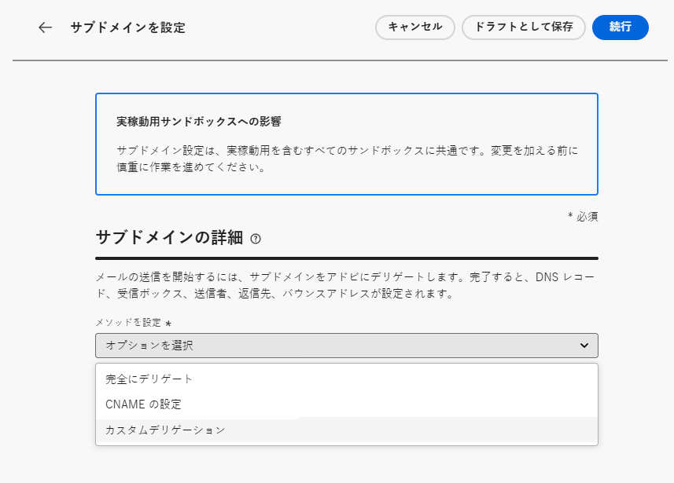
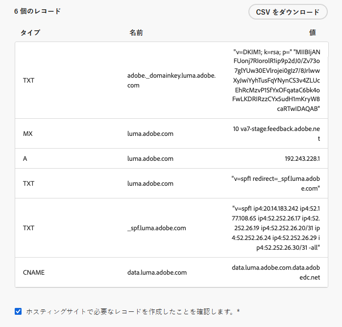
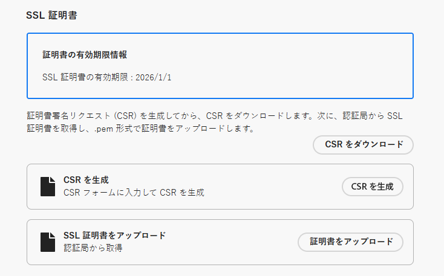
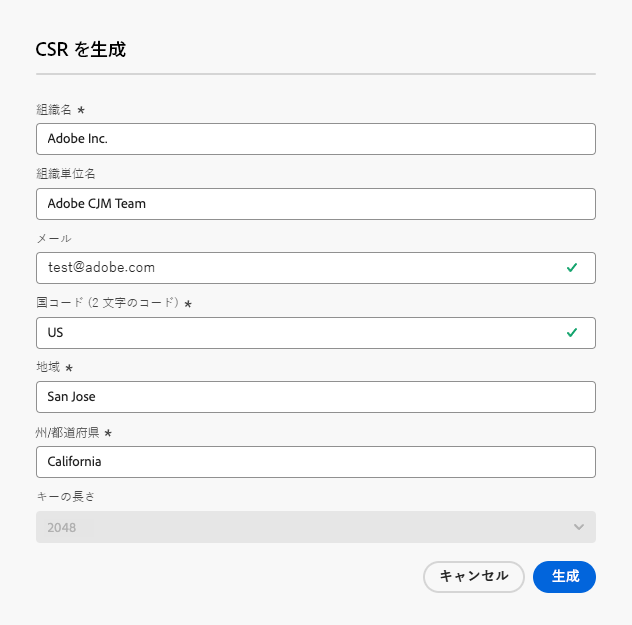
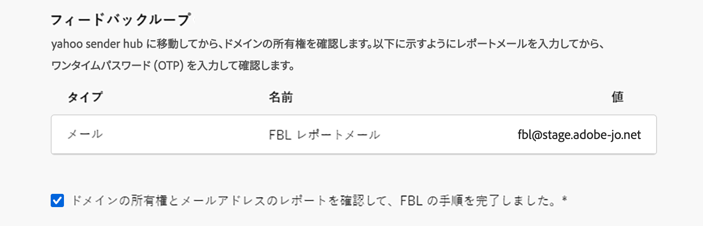

# カスタムサブドメインの設定 {#delegate-custom-subdomain}

[ 完全デリゲート ](about-subdomain-delegation.md#full-subdomain-delegation) および [CNAME 設定 ](about-subdomain-delegation.md#cname-subdomain-delegation) 手法の代わりに、**カスタムデリゲーション** 手法を使用して、Journey Optimizer A 内のサブドメインの所有権を取得し、生成された証明書を完全に制御できます。 [詳細情報](about-subdomain-delegation.md#custom-subdomain-delegation)

このプロセスの一環として、Adobeでは、メッセージの配信、レンダリング、トラッキングに合わせて DNS が適切に設定されていることを確認する必要があります。 このため、認証局から取得した [SSL 証明書をアップロード ](#upload-ssl-certificate) し、ドメインの所有権を確認してメールアドレスをレポートすることで [ フィードバックループの手順 ](#feedback-loop-steps) を完了する必要があります。

カスタムサブドメインを設定するには、次の手順に従います。

1. **[!UICONTROL 管理]**/**[!UICONTROL チャネル]**/**[!UICONTROL メール設定]**/**[!UICONTROL サブドメイン]** メニューにアクセスします。

1. 「**[!UICONTROL サブドメインを設定]**」をクリックします。

1. **[!UICONTROL メソッドの設定]** セクションから、「**[!UICONTROL カスタム委任]**」を選択します。

   {width=90%}

1. デリゲートするサブドメインの名前を指定します。

   >[!CAUTION]
   >
   >[!DNL Adobe Journey Optimizer] と別の製品（[!DNL Adobe Campaign] または [!DNL Adobe Marketo Engage] など）から同じ送信ドメインを使用してメッセージを送信することはできません。

## DNS レコードの作成 {#create-dns-records}

>[!CONTEXTUALHELP]
>id="ajo_admin_subdomain_custom_dns"
>title="一致する DNS レコードを生成"
>abstract="カスタムサブドメインをアドビにデリゲートするには、Journey Optimizer インターフェイスに表示されるネームサーバー情報を、ドメインホストソリューションにコピー＆ペーストし、一致する DNS レコードを生成する必要があります。"

1. DNS サーバーに配置するレコードのリストが表示されます。これらのレコードを 1 つずつコピーするか、CSV ファイルをダウンロードします。

1. ドメインホスティングソリューションに移動して、一致する DNS レコードを生成します。

1. すべての DNS レコードがドメインホスティングソリューションに生成されていることを確認します。

1. すべてが正しく設定されている場合は、「確認しました」チェックボックスをオンにします。

   {width="75%"}

## SSL 証明書のアップロード {#upload-ssl-certificate}

>[!CONTEXTUALHELP]
>id="ajo_admin_subdomain_custom-ssl"
>title="証明書署名リクエストの生成"
>abstract="新しいカスタムサブドメインを設定する場合、証明書署名リクエスト（CSR）を生成し、入力して認証局に送信し、Journey Optimizer にアップロードする必要がある SSL 証明書を取得する必要があります。"

>[!CONTEXTUALHELP]
>id="ajo_admin_subdomain_key_length"
>title="xxx"
>abstract=""

1. 「**[!UICONTROL SSL 証明書]**」セクションで、「**[!UICONTROL CSR を生成]**」をクリックします。

   {width="85%"}

   >[!NOTE]
   >
   >SSL 証明書の有効期限が表示されます。 日付に達したら、新しい証明書をアップロードする必要があります。

1. 表示されるフォームに入力し、証明書署名要求（CSR）を生成します。

   {width="70%"}

   >[!NOTE]
   >
   >キーの長さは 2048 または 4096 ビットのみです。 サブドメインが送信された後は変更できません。

1. 「**[!UICONTROL CSR をダウンロード]**」をクリックして、フォームをローカルコンピューターに保存します。 これを認証局に送信して、SSL 証明書を取得します。

1. 取得したら、「**[!UICONTROL SSL 証明書をアップロード]**」をクリックし、証明書を.pem 形式でアップロード [!DNL Journey Optimizer] ます。

## フィードバックループの手順の完了 {#feedback-loop-steps}

>[!CONTEXTUALHELP]
>id="ajo_admin_subdomain_feedback-loop"
>title="フィードバックループの手順の完了"
>abstract="Yahoo! Sender Hub に移動し、フォームに入力してドメインの所有権を確認します。 以下に示す FBL レポートのメールアドレスを入力し、受信する OTP を使用して Yahoo! Sender Hub の所有権を確認します。"

1. [Yahoo! Sender Hub](https://senders.yahooinc.com/) web サイトを開き、ドメインの所有権を確認するために必要なフォームに入力します。

1. ドメインの所有権を確認するには、Yahoo! 送信者ハブでは、メールアドレスを入力する必要があります。 **[!UICONTROL 値]** の下にリストされている FBL レポート電子メールアドレスを入力します。 これは、Adobeが所有するメールアドレスです。

1. Yahoo! Sender Hub が生成するワンタイムパスワード（OTP）は、このAdobe アドレスに送信されます。

1. この OTP を提供するAdobe配信品質チームにお問い合わせください。<!--Specify how to reach out + any information that customer should share in the request to deliverability team to get access to the right OTP-->

   >[!CAUTION]
   >
   >OTP は 24 時間のみ有効なので、OTP が生成されたら直ちにAdobeに連絡してください。<!--TBC?-->
   >
   >OTP リクエストは平日にのみ実行できます。 週末のサポートはありません。<!--Add times + timezone-->

1. Yahoo！で OTP を入力 Sender Hub の所有権を確認します。

1. フィードバックループのすべての手順が完了していることを確認します。

1. すべてが正しく設定されている場合は、「完了しました」チェックボックスをオンにします。

   {width="85%"}

1. 「**[!UICONTROL 続行]**」をクリックして、ホスティングソリューションでレコードが正常に生成されていることをAdobeが確認するまで待ちます。 この処理には最大 2 分かかる場合があります。

   >[!NOTE]
   >
   >続行する前に、すべてのレコードが正しく作成されていることを確認します。

1. アドビは SSL CDN URL 検証レコードを生成します。この検証レコードをホスティングプラットフォームにコピーします。ホスティングソリューションでこのレコードを適切に作成している場合は、「確認しました」チェックボックスをオンにします。

1. 「**[!UICONTROL 送信]**」をクリックして、Adobeで必要なチェックを実行します。 [詳細情報](delegate-subdomain.md#submit-subdomain)

## トラブルシューティングチェックリスト {#check-list}

カスタムサブドメインの送信中にエラーが発生した場合は、以下に示すトラブルシューティングアクションを実行します。

* DNS ルックアップツールを使用して、すべての DNS レコードが正しく反映されていることを確認します。

* 証明書がアップロード前のすべての技術要件を満たしていることを確認します。

* 証明書が正しい形式でアップロードされていることを確認します。
