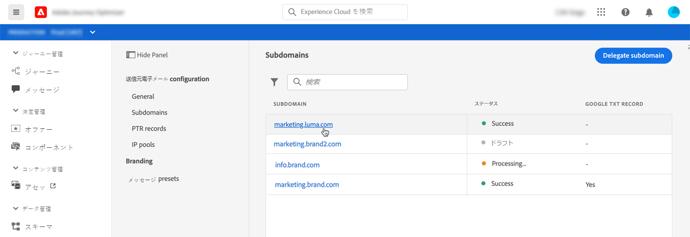

# サブドメインのデリゲート

ドメイン名のデリゲーションによって、ドメイン名（技術的には DNS ゾーン）の所有者はその一部（技術的にはその配下の DNS ゾーン。サブゾーンと呼ばれることもあります）を別のエンティティにデリゲートできます。基本的に、お客様が「example.com」ゾーンを処理する場合、サブゾーン「marketing.example.com」をAdobeにデリゲートできます。

[!DNL Journey Optimizer] で使用するサブドメインをデリゲートすると、クライアントはメールマーケティングに関する業界標準の配信品質要件を満たすために必要な、DNS インフラストラクチャの管理をアドビに依存しながら、自分たちで社内メール用ドメインの DNS を管理および制御することができます。

[!DNL Journey Optimizer] では、サブドメインを製品インターフェイスから直接アドビに、完全にデリゲートできます。アドビは、メールキャンペーンの配信、レンダリング、トラッキングに必要な DNS のあらゆる側面を制御および管理することで、メッセージをマネージドサービスとして提供できます。

>[!NOTE]
>
>デフォルトでは、[!DNL Journey Optimizer] ライセンス契約で、最大 10 個のサブドメインをデリゲートできます。この制限を引き上げる場合は、アドビの担当者にお問い合わせください。
>
>サブドメインのデリゲーションに対する CNAME の使用は、現在 Journey Optimizer ではサポートされていません。

新しいサブドメインをデリゲートするには、次の手順に従います。

1. **[!UICONTROL チャネル]**／**[!UICONTROL サブドメイン]**&#x200B;メニューにアクセスし、「**[!UICONTROL サブドメインをデリゲート]**」をクリックします。

   

1. デリゲートするサブドメインの名前を指定します。

   

   >[!CAUTION]
   >
   >無効なサブドメインをアドビにデリゲートすることはできません。組織が所有する有効なサブドメイン（marketing.yourcompany.com など）を入力してください。
   >
   >email.marketing.yourcompany.com などマルチレベルのサブドメインは、現在サポートされていません。

1. DNS サーバーに配置するレコードのリストが表示されます。これらのレコードを 1 つずつコピーするか、CSV ファイルをダウンロードしてから、ドメインのホスティングソリューションに移動して、一致する DNS レコードを生成します。

1. ドメインをホストするソリューションに、すべての DNS レコードが生成されていることを確認してください。すべてが正しく設定されている場合は、「確認しました」チェックボックスをオンにし、「**[!UICONTROL 送信]**」をクリックします。

   

   >[!NOTE]
   >
   >後から「**[!UICONTROL ドラフトとして保存]**」ボタンを使用してレコードを作成し、サブドメイン設定を送信できます。 その後、サブドメインリストからサブドメインのデリゲーションを開くことで、再開できます。

1. サブドメインのデリゲーションが送信されると、そのサブドメインは「**[!UICONTROL 処理中]**」ステータスでリストに表示されます。サブドメインのステータスについて詳しくは、[この節](access-subdomains.md)を参照してください。

   

   そのサブドメインを使用してメッセージを送信する前に、Adobeが必要なチェックを実行するまで待つ必要があります（最大 3 時間かかります）。 詳しくは、[この節](#subdomain-validation)を参照してください。

1. チェックが正常に完了すると、サブドメインのステータスが&#x200B;**[!UICONTROL 成功]**&#x200B;になります。 メッセージの配信に使用する準備が整いました。

   <!-- later on, users will be notified in Pulse -->

   

## サブドメインの検証 {#subdomain-validation}

以下のチェックとアクションは、サブドメインが検証され、サブドメインを使用してメッセージを送信できる状態になるまで実行されます。

>[!NOTE]
>
>これらの手順はAdobeが実行し、最大 3 時間かかる場合があります。

1. **事前検証**:Adobeは、サブドメインがAdobeDNS（NS レコード、SOA レコード、ゾーン設定、所有権レコード）にデリゲートされたかどうかを確認します。検証前の手順が失敗した場合は、対応する理由と共にエラーが返され、それ以外の場合は、次の手順にAdobeが進みます。

1. **ドメインの DNS を設定します**。

   * **MX レコード**:Mail eXchange record — サブドメインに送信されたインバウンド E メールを処理するメールサーバーレコード。
   * **SPF レコード**:送信者ポリシーフレームワークレコード — サブドメインから E メールを送信できるメールサーバーの IP を一覧表示します。
   * **DKIM レコード**:DomainKeys 識別されたメール標準レコード — 公開鍵暗号化を使用して、スプーフィングを避けるためにメッセージを認証します。
   * **A**:デフォルトの IP マッピング。

1. **トラッキング URL とミラー URL の作成**:ドメインが email.example.com の場合、tracking/mirror ドメインは data.email.example.com になります。SSL 証明書をインストールすることで保護されます。

1. **CDN CloudFront のプロビジョニング**:CDN がまだ設定されていない場合、Adobeはその CDN をインソーグ用にプロビジョニングします。

1. **CDN ドメインの作成**:ドメインが email.example.com の場合、CDN ドメインは cdn.email.example.com になります。

1. **CDN SSL 証明書の作成と添付**:Adobeは、CDN ドメイン用の CDN 証明書を作成し、その証明書を CDN ドメインに添付します。

1. **転送 DNS の作成**:これが最初にデリゲートするサブドメインである場合、Adobeは PTR レコードを作成するために必要な転送 DNS を作成します。IP ごとに 1 つずつ作成します。

1. **PTR レコードの作成**:PTR レコード（逆引き DNS レコードとも呼ばれます）は、E メールをスパムとしてマークしないように、ISP に必要です。また、Gmail は、各 IP に PTR レコードを持つことを推奨します。 Adobeは、最初のサブドメインをデリゲートした場合にのみ PTR レコードを作成します。各 IP に対して 1 つずつ、最初のサブドメインを指すすべての IP がデリゲートされます。 例えば、IP が *192.1.2.1* で、サブドメインが *email.example.com* の場合、PTR レコードは次のようになります。*192.1.2.1 PTR r1.email.example.com* 後で PTR レコードを更新して、新しいデリゲートドメインを指すことができます。
