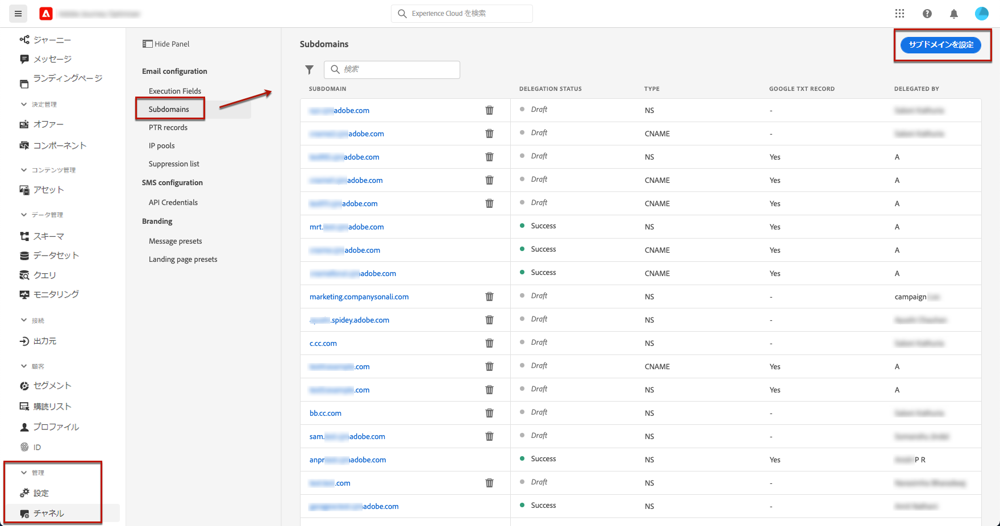
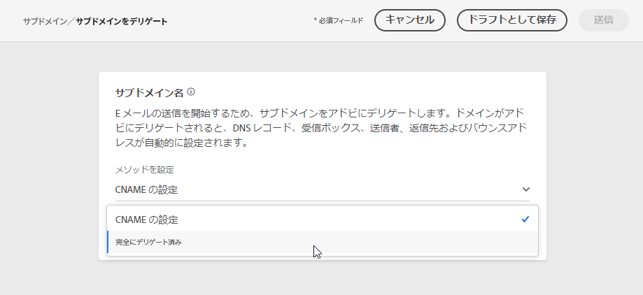
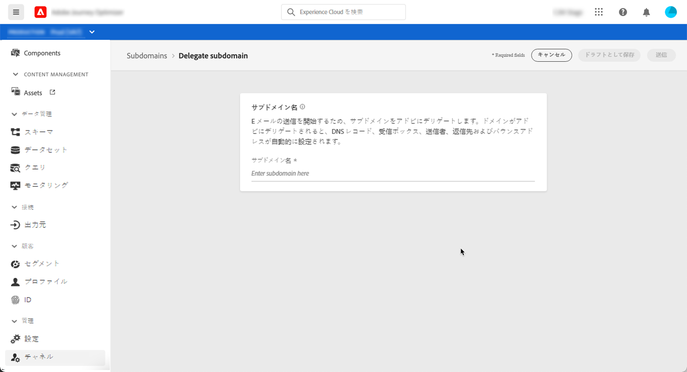
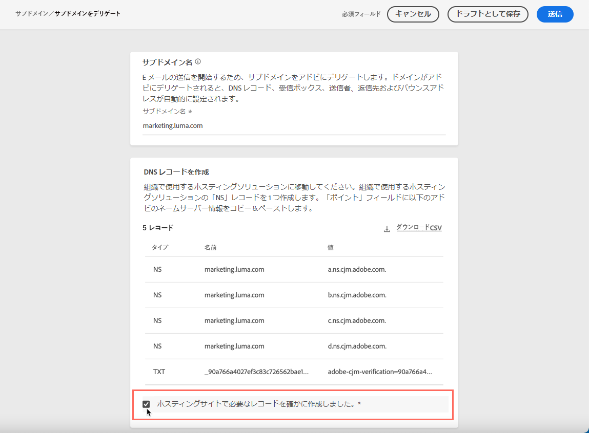
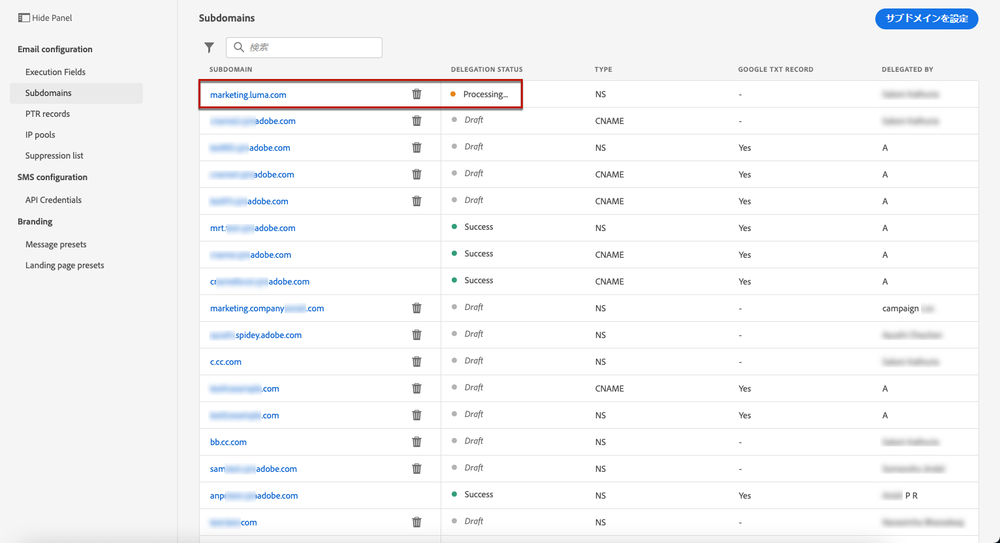
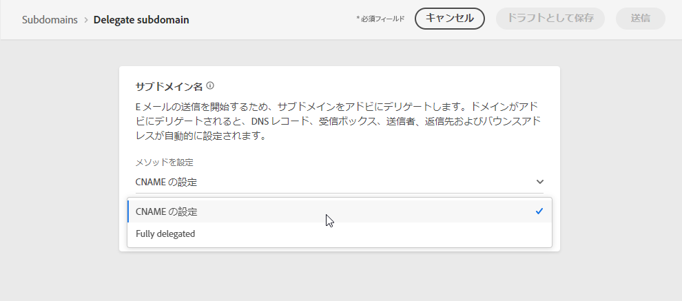
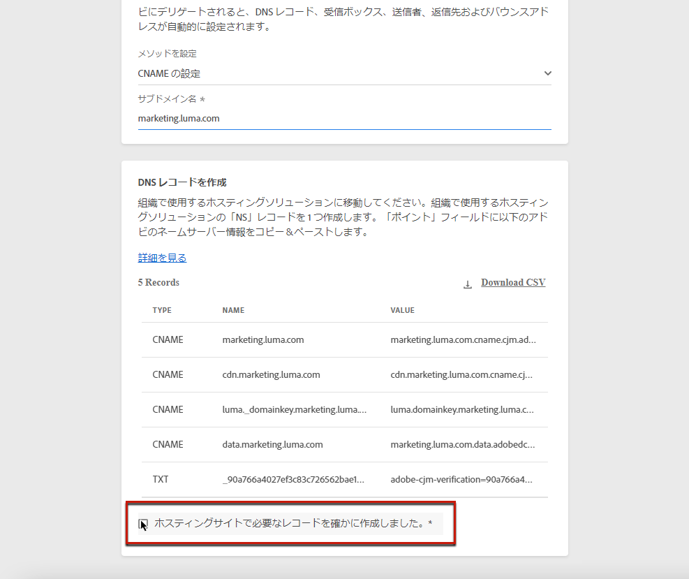

# サブドメインのデリゲート {#delegate-subdomain}

>[!CONTEXTUALHELP]
>id="ajo_admin_subdomainname"
>title="サブドメインのデリゲーションについて"
>abstract="Journey Optimizerを使用すると、サブドメインをAdobeに完全にデリゲートできます。 Adobeは、DNS のあらゆる側面を制御し、維持することで、管理対象のサービスとしてメッセージを配信できます。"

ドメイン名のデリゲーションによって、ドメイン名（技術的には DNS ゾーン）の所有者はその一部（技術的にはその配下の DNS ゾーン。サブゾーンと呼ばれることもあります）を別のエンティティにデリゲートできます。基本的に、お客様が「example.com」ゾーンを扱う場合、サブゾーン「marketing.example.com」をアドビにデリゲートできます。

[!DNL Journey Optimizer] で使用するサブドメインをデリゲートすると、クライアントはメールマーケティングに関する業界標準の配信品質要件を満たすために必要な DNS インフラストラクチャの管理をアドビに依存しながら、自社で社内メール用ドメインの DNS を管理および制御できます。

## 完全なサブドメインのデリゲーション {#full-subdomain-delegation}

[!DNL Journey Optimizer] では、サブドメインを製品インターフェイスから直接アドビに、完全にデリゲートできます。アドビは、メールキャンペーンの配信、レンダリング、トラッキングに必要な DNS のあらゆる側面を制御および管理することで、メッセージをマネージドサービスとして提供できます。

>[!NOTE]
>
>デフォルトでは、[!DNL Journey Optimizer] ライセンス契約で、最大 10 個のサブドメインをデリゲートできます。この制限を引き上げる場合は、アドビの担当者にお問い合わせください。

新しいサブドメインをデリゲートするには、次の手順に従います。

1. **[!UICONTROL 管理]**／**[!UICONTROL チャネル]**／**[!UICONTROL サブドメイン]**&#x200B;メニューにアクセスし、「**[!UICONTROL サブドメインの設定]**」をクリックします。

   

1. 「**[!UICONTROL 完全にデリゲート済み]**」を「**[!UICONTROL メソッドの設定]**」セクションから選択します。

   

1. デリゲートするサブドメインの名前を指定します。

   

   >[!CAUTION]
   >
   >無効なサブドメインをアドビにデリゲートすることはできません。組織が所有する有効なサブドメイン（marketing.yourcompany.com など）を入力してください。
   >
   >email.marketing.yourcompany.com などマルチレベルのサブドメインは、現在サポートされていません。

1. DNS サーバーに配置するレコードのリストが表示されます。これらのレコードを 1 つずつコピーするか、CSV ファイルをダウンロードしてから、ドメインのホスティングソリューションに移動して、一致する DNS レコードを生成します。

1. ドメインをホストするソリューションに、すべての DNS レコードが生成されていることを確認してください。すべてが正しく設定されている場合は、「確認しました」チェックボックスをオンにし、「**[!UICONTROL 送信]**」をクリックします。

   

   >[!NOTE]
   >
   >後から「**[!UICONTROL ドラフトとして保存]**」ボタンを使用してレコードを作成し、サブドメイン設定を送信できます。 その後、サブドメインリストからサブドメインのデリゲーションを開くことで、再開できます。

1. 完全なサブドメインのデリゲーションが送信されると、そのサブドメインは「**[!UICONTROL 処理中]**」ステータスでリストに表示されます。サブドメインのステータスについて詳しくは、[この節](access-subdomains.md)を参照してください。

   

   そのサブドメインを使用してメッセージを送信できるようになるには、必要なチェックがアドビで実行されるまで待つ必要があります（最大で 3 時間かかることがあります）。詳しくは、[この節](#subdomain-validation)を参照してください。

   >[!NOTE]
   >
   >見つからないレコード（ホスティングソリューションでまだ作成されていないレコード）が表示されます。

1. チェックが正常に完了すると、サブドメインのステータスが&#x200B;**[!UICONTROL 成功]**&#x200B;になります。 メッセージの配信に使用する準備が整いました。

   >[!NOTE]
   >
   >ホスティングソリューションで検証レコードを作成できなかった場合、サブドメインは「**[!UICONTROL 失敗]**」としてマークされます。

   <!-- later on, users will be notified in Pulse -->

サブドメインが [!DNL Journey Optimizer] でアドビにデリゲートされると、PTR レコードが自動的に作成され、このサブドメインに関連付けられます。[詳細情報](ptr-records.md)

>[!CAUTION]
>
>サブドメインの並列実行は、現在 [!DNL Journey Optimizer] ではサポートされていません。別のサブドメインのステータスが&#x200B;**[!UICONTROL 処理中]**&#x200B;となっているときに、サブドメインをデリゲーション用に送信しようとすると、エラーメッセージが表示されます。

## CNAME サブドメインのデリゲーション {#cname-subdomain-delegation}

ドメイン固有の制限ポリシーがあり、アドビが DNS の一部を制御する必要がある場合は、自社で DNS 関連のすべてのアクティビティを実行するように選択できます。

CNAME サブドメインデリゲーションを使用すると、サブドメインを作成し、CNAME を使用してアドビ固有のレコードを指定できます。この設定を使用すると、 メールの送信、レンダリング、トラッキングの環境を設定するために、DNS の管理に対する責任を、お客様とアドビで共有します。

>[!CAUTION]
>
>組織のポリシーで完全なサブドメインデリゲーション方法が制限されている場合は、この方法をお勧めします。このアプローチでは、DNS レコードを自社で維持および管理する必要があります。アドビは、CNAME メソッドを使用して設定されたサブドメインの DNS の変更、維持または管理をサポートできなくなります。

CNAME を使用してサブドメインをデリゲートするには、次の手順に従います。

1. **[!UICONTROL 管理]**／**[!UICONTROL チャネル]**／**[!UICONTROL サブドメイン]**&#x200B;メニューにアクセスし、「 **[!UICONTROL サブドメインの設定]**」をクリックします。

1. **[!UICONTROL CNAME の設定]**&#x200B;メソッドを選択します。

   

1. デリゲートするサブドメインの名前を指定します。

   >[!CAUTION]
   >
   >無効なサブドメインをアドビにデリゲートすることはできません。組織が所有する有効なサブドメイン（marketing.yourcompany.com など）を入力してください。
   >
   >email.marketing.yourcompany.com などマルチレベルのサブドメインは、現在サポートされていません。

1. DNS サーバーに配置するレコードのリストが表示されます。これらのレコードを 1 つずつコピーするか、CSV ファイルをダウンロードしてから、ドメインのホスティングソリューションに移動して、一致する DNS レコードを生成します。

1. ドメインをホストするソリューションに、すべての DNS レコードが生成されていることを確認してください。すべてが正しく設定されている場合は、「確認しました」チェックボックスをオンにします。

   

   >[!NOTE]
   >
   >後で「**[!UICONTROL ドラフトとして保存]**」ボタンを使用してレコードを作成できます。その後、サブドメインリストでサブドメインのデリゲーションを開くことにより、この段階から再開できます。

1. これらのレコードがスティングソリューションで生成され。エラーが発生していないことをアドビが確認するまで待ちます。この処理には最大 2 分かかる場合があります。

   >[!NOTE]
   >
   >見つからないレコード（ホスティングソリューションでまだ作成されていないレコード）が表示されます。

1. アドビは SSL CDN URL 検証レコードを生成します。この検証レコードをホスティングプラットフォームにコピーします。ホスティングソリューションでこのレコードを適切に作成している場合は、「確認しました」チェックボックスをオンにし、「**[!UICONTROL 送信]**」をクリックします。

   

   >[!NOTE]
   >
   >後から「**[!UICONTROL ドラフトとして保存]**」ボタンを使用して検証レコードを作成し、サブドメイン設定を送信することもできます。その後、サブドメインリストからサブドメインのデリゲーションを開くことで、そのデリゲーションを再開できます。

1. CNAME サブドメインのデリゲーションが送信されると、そのサブドメインは「**[!UICONTROL 処理中]**」ステータスでリストに表示されます。サブドメインのステータスについて詳しくは、[この節](access-subdomains.md)を参照してください。

   そのサブドメインを使用してメッセージを送信できるようになるには、必要なチェックがアドビで実行されるまで待つ必要があります（通常 2〜3 時間かかります）。詳しくは、[この節](#subdomain-validation)を参照してください。

1. チェックが正常に完了すると<!--i.e Adobe validates the record you created and installs it-->、サブドメインのステータスが「**[!UICONTROL 成功]**」になります。メッセージの配信に使用する準備が整いました。

   >[!NOTE]
   >
   >ホスティングソリューションで検証レコードを作成できなかった場合、サブドメインは「**[!UICONTROL 失敗]**」とマークされます。

レコードを検証し、証明書をインストールすると、アドビは CNAME サブドメインの PTR レコードを自動的に作成します。[詳細情報](ptr-records.md)

>[!CAUTION]
>
>サブドメインの並列実行は、現在 [!DNL Journey Optimizer] ではサポートされていません。別のサブドメインのステータスが&#x200B;**[!UICONTROL 処理中]**&#x200B;となっているときに、サブドメインをデリゲーション用に送信しようとすると、エラーメッセージが表示されます。

## サブドメインの検証 {#subdomain-validation}

サブドメインの検証が完了しサブドメインを使用してメッセージを送信できるようになるまで、以下のチェックとアクションが実行されます。

>[!NOTE]
>
>これらの手順はアドビによって実行され、最大で 3 時間かかることがあります。

1. **事前検証** : サブドメインが Adobe DNS（NS レコード、SOA レコード、ゾーン設定、所有権レコード）にデリゲートされているかどうかをアドビが確認します。事前検証の手順が失敗した場合は、エラーと該当理由が返され、それ以外の場合は、アドビが次の手順に進みます。

1. **ドメインの DNS の設定**：

   * **MX レコード** : メール交換レコード - サブドメインに送信されたインバウンドメールを処理するメールサーバーレコード。
   * **SPF レコード** : 送信者ポリシーフレームワークレコード - サブドメインからメールを送信できるメールサーバーの IP をリストします。
   * **DKIM レコード** : DomainKeys Identified Mail の標準レコード - 公開キー／秘密キーの暗号化を使用してメッセージを認証し、スプーフィングを防止します。
   * **A** : デフォルトの IP マッピング。
   * **CNAME**：正規名（CNAME レコード）は、エイリアス名を真のドメイン名つまり正規ドメイン名にマッピングする DNS レコードタイプです。

1. **トラッキング URL とミラー URL の作成** : ドメインが email.example.com の場合、トラッキング／ミラードメインは data.email.example.com になります。SSL 証明書をインストールすることで保護されます。

1. **CDN CloudFront のプロビジョニング** : CDN がまだセットアップされていない場合は、アドビが IMS 組織用に CDN をプロビジョニングします。

1. **CDN ドメインの作成** : ドメインが email.example.com の場合、CDN ドメインは cdn.email.example.com になります。

1. **CDN SSL 証明書の作成とアタッチ** : アドビが CDN ドメイン用の CDN 証明書を作成して CDN ドメインにアタッチします。

1. **転送 DNS の作成** : これが最初にデリゲートするサブドメインである場合は、PTR レコードの作成に必要な転送 DNS をアドビが IP ごとに 1 つ作成します。

1. **PTR レコードの作成** : PTR レコード（リバース DNS レコードとも呼ばれます）は、メールをスパムとしてマークしないようにするために ISP に必要になるものです。Gmail では、IP ごとに PTR レコードを用意することも推奨しています。アドビは、サブドメインを初めてデリゲートするときにのみ PTR レコードを作成します（IP ごとに 1 つずつ、すべての IP がそのサブドメインを指します）。例えば、IP が *192.1.2.1* で、サブドメインが *email.example.com* の場合、PTR レコードは *192.1.2.1 PTR r1.email.example.com* のようになります。後から PTR レコードを更新して、新しいデリゲートドメインを指すようにすることができます。[PTR レコードの詳細情報](ptr-records.md)
