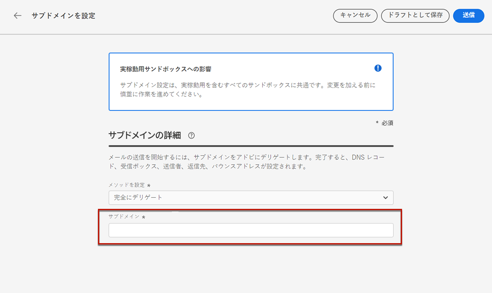

# サブドメインのデリゲート {#delegate-subdomain}

>[!CONTEXTUALHELP]
>id="ajo_admin_subdomainname"
>title="サブドメインデリゲーション"
>abstract="Journey Optimizer を使用すると、サブドメインをアドビにデリゲートできます。サブドメインを完全にアドビにデリゲートできます。これは推奨される方法です。 CNAME を使用してAdobe固有のレコードを指すサブドメインを作成することもできますが、この方法では、DNS レコードを独自に維持管理する必要があります。"
>additional-url="https://experienceleague.adobe.com/ja/docs/journey-optimizer/using/configuration/delegate-subdomains/about-subdomain-delegation#subdomain-delegation-methods" text="サブドメインの設定方法"

>[!CONTEXTUALHELP]
>id="ajo_admin_subdomainname_header"
>title="サブドメインデリゲーション"
>abstract="メールの送信を開始するには、サブドメインをアドビにデリゲートします。完了すると、DNS レコード、受信ボックス、送信者、返信先、バウンスアドレスが設定されます。"

ドメイン名のデリゲートという方法を使うと、ドメイン名（技術的には DNS ゾーン）の所有者は、その一部（技術的にはその配下の DNS ゾーンであり、サブゾーンとも呼ばれます）を別のエンティティにデリゲートできます。基本的に、お客様が「example.com」ゾーンを扱う場合、サブゾーン「marketing.example.com」をアドビにデリゲートできます。詳しくは、[サブドメインデリゲーション](about-subdomain-delegation.md)を参照してください

デフォルトでは、[!DNL Journey Optimizer] では&#x200B;**最大 10 個のサブドメイン**&#x200B;をデリゲートできます。ただし、ライセンス契約によっては、最大 100 個のサブドメインをデリゲートできる場合があります。自身が使用資格を持つサブドメインの数について詳しくは、アドビの連絡先にお問い合わせください。

以下のいずれかを実行できます。

* サブドメインの完全なデリゲート - [ 詳細 ](#set-up-subdomain)
* CNAME を使用してサブドメインを作成し、Adobe固有のレコードを指すようにします [ 方法については、こちらを参照 ](#set-up-subdomain)。

**完全なサブドメインデリゲーション** は、推奨される方法です。 様々なサブドメイン設定方法の違いについて詳しくは、[ この節 ](about-subdomain-delegation.md#subdomain-delegation-methods) を参照してください。

>[!CAUTION]
>
>サブドメインの並列送信は、[!DNL Journey Optimizer] ではサポートされていません。別のサブドメインのステータスが&#x200B;**[!UICONTROL 処理中]**&#x200B;となっているときに、サブドメインをデリゲーション用に送信しようとすると、エラーメッセージが表示されます。

## デリゲートされたサブドメインへのアクセス {#access-delegated-subdomains}

デリゲートされたすべてのサブドメインが&#x200B;**[!UICONTROL 管理]**／**[!UICONTROL チャネル]**／**[!UICONTROL サブドメイン]**&#x200B;メニューに表示されます。フィルターを使用して、リスト（デリゲーション日、ユーザー、ステータス）を絞り込むことができます。

<!---->

**[!UICONTROL ステータス]**&#x200B;列には、サブドメインのデリゲーションプロセスに関する情報が表示されます。

* **[!UICONTROL ドラフト]**：サブドメインのデリゲーションがドラフトとして保存されました。サブドメイン名をクリックして、デリゲーションプロセスを再開します。
* **[!UICONTROL 処理中]**：サブドメインを使用する前に、いくつかの設定確認がおこなわれます。
* **[!UICONTROL 成功]**：サブドメインは正常にチェックされ、メッセージの配信に使用できます。
* **[!UICONTROL 失敗]**：サブドメインのデリゲーションが送信された後、1 つ以上の確認が失敗しました。

**[!UICONTROL 成功]**&#x200B;ステータスのサブドメインに関する詳細情報にアクセスするには、リストからサブドメインを開きます。

次のことができます。

* デリゲーションプロセス中に設定されたサブドメイン名（読み取り専用）と、生成された URL（リソース、ミラーページ、トラッキング URL）を取得します。

* Google サイト検証 TXT レコードをサブドメインに追加して、検証済みであることを確認します（[サブドメインに Google TXT レコードを追加する](google-txt.md)を参照）。

>[!CAUTION]
>
>サブドメインの設定は、すべての環境で共通です。したがって、サブドメインを変更すると、実稼働用サンドボックスにも影響します。

## Journey Optimizerでのサブドメインの設定 {#set-up-subdomain}

>[!CONTEXTUALHELP]
>id="ajo_admin_subdomain_dns"
>title="一致する DNS レコードを生成"
>abstract="新しいサブドメインをアドビに完全にデリゲートするには、Journey Optimizer インターフェイスに表示されるアドビのネームサーバー情報を、ドメインホストソリューションにコピー＆ペーストし、一致する DNS レコードを生成する必要があります。CNAME を使用してサブドメインをデリゲートするには、SSL CDN URL 検証レコードもコピー＆ペーストする必要があります。チェックが正常に完了すると、サブドメインをメッセージの配信に使用する準備が整います。"

[!DNL Journey Optimizer] で新しいサブドメインを設定するには、次の手順に従います。

>[!NOTE]
>
>この節では、完全デリゲーションまたは CNAME 方法を使用してサブドメインを設定する方法について説明します。 カスタムの委任方法について詳しくは、[ この節 ](#setup-custom-subdomain) を参照してください。

1. **[!UICONTROL 管理]**／**[!UICONTROL チャネル]**／**[!UICONTROL メール設定]**／**[!UICONTROL サブドメイン]**&#x200B;メニューにアクセスし、「**[!UICONTROL サブドメインを設定]**」をクリックします。

   <!---->

   >[!CAUTION]
   >
   >サブドメイン設定は、**すべての環境で共通**&#x200B;です。したがって、サブドメインを変更すると、実稼働サンドボックスにも影響します。

1. **[!UICONTROL メソッドの設定]** セクションで、次のいずれかを選択します。

   * 完全にデリゲート - [ 詳細情報 ](about-subdomain-delegation.md#full-subdomain-delegation)
   * CNAME の設定 – [ 詳細情報 ](about-subdomain-delegation.md#cname-subdomain-setup)

     CNAME を使用してサブドメインを設定する方法については、この [ 専用の節 ](#cname-subdomain-setup) を参照してください

   <!---->

1. デリゲートするサブドメインの名前を指定します。

   

   >[!CAUTION]
   >
   >無効なサブドメインをアドビにデリゲートすることはできません。組織が所有する有効なサブドメイン（marketing.yourcompany.com など）を入力してください。
   >
   >[!DNL Adobe Journey Optimizer] と別の製品（[!DNL Adobe Campaign] または [!DNL Adobe Marketo Engage] など）から同じ送信ドメインを使用してメッセージを送信することはできません。

   <!--Capital letters are not allowed in subdomains. TBC by PM-->

1. 専用セクションで **[!UICONTROL 0}DMARC レコード } を設定します。]**&#x200B;サブドメインに既存の [DMARC レコード ](dmarc-record.md) があり、[!DNL Journey Optimizer] によって取得される場合は、同じ値を使用するか、必要に応じて変更できます。 値を追加しない場合は、デフォルトの値が使用されます。[DMARC レコードの管理方法について説明します ](dmarc-record.md#set-up-dmarc)

   

1. 「**[!UICONTROL DNS レコード]**」セクションには、DNS サーバーに配置するレコードのリストが表示されます。 これらのレコードを 1 つずつコピーするか、CSV ファイルをダウンロードしてから、ドメインのホスティングソリューションに移動して、一致する DNS レコードを生成します。

1. ドメインをホストするソリューションに、すべての DNS レコードが生成されていることを確認してください。すべてが正しく設定されている場合は、「確認しました」チェックボックスをオンにします。

   

1. **CNAME** を使用してサブドメインを設定する場合は、[ この節 ](#cname-subdomain-setup) に移動します。

1. 「**[!UICONTROL 送信]**」をクリックして、Adobeで必要なチェックを実行します。 [詳細情報](#submit-subdomain)

## CNAME を使用したサブドメインの設定 {#cname-subdomain-setup}

>[!CONTEXTUALHELP]
>id="ajo_admin_subdomain_dns_cname"
>title="一致する DNS および検証レコードを生成"
>abstract="CNAME を使用してサブドメインをデリゲートするには、アドビのネームサーバー情報と、Journey Optimizer インターフェイスに表示される SSL CDN URL 検証レコードを、ホスティングプラットフォームにコピー＆ペーストする必要があります。チェックが正常に完了すると、サブドメインをメッセージの配信に使用する準備が整います。"

>[!CONTEXTUALHELP]
>id="ajo_admin_subdomain_cdn_cname"
>title="検証レコードのコピー"
>abstract="アドビは、検証レコードを生成します。CDN URL 検証用に、ホスティングプラットフォーム上に対応するレコードを作成する必要があります。"

サブドメインを設定する場合、CNAME を使用してAdobe固有のレコードを指定できます。 この設定を使用すると、お客様とAdobeの両方が DNS の管理に対する責任を共有します。

>[!CAUTION]
>
>組織のポリシーで完全なサブドメインデリゲーションの方法が制限されている場合は、CNAME の方法をお勧めします。このアプローチでは、DNS レコードを独自に維持および管理する必要があります。
>
>アドビは、CNAME メソッドを使用して設定されたサブドメインの DNS の変更、維持または管理をサポートできなくなります。

CNAME を使用してサブドメインを設定するには、次の手順に従います。

1. [ この節 ](#set-up-subdomain) に記載されているすべての手順を実行します。

1. サブドメイン設定を送信する前に、もう 1 つの手順を完了する必要があります。「**[!UICONTROL 続行]**」をクリックします。 ご利用のホスティングソリューションでレコードがエラーなく生成されたことを、アドビが確認するまで待ちます。この処理には最大 2 分かかる場合があります。

   >[!NOTE]
   >
   >続行する前に、すべてのレコードが正しく作成されていることを確認します。

1. アドビは SSL CDN URL 検証レコードを生成します。この検証レコードをホスティングプラットフォームにコピーします。ホスティングソリューションでこのレコードを適切に作成している場合は、「確認しました」チェックボックスをオンにします。

1. 「**[!UICONTROL 送信]**」をクリックして、Adobeで必要なチェックを実行します。 [詳細情報](#submit-subdomain)

➡️ [CNAME を使用してサブドメインを作成しアドビ固有のレコードを指すようにする方法については、このビデオをご覧ください](#video)

## サブドメインの設定を送信 {#submit-subdomain}

サブドメインのデリゲーションを完了するには、次の手順に従います。

1. 「**[!UICONTROL 送信]**」をクリックします。

   >[!NOTE]
   >
   >カスタムサブドメインの送信中にエラーが発生した場合は、[ この節 ](#check-list) を参照してください。

1. 後から **[!UICONTROL ドラフトとして保存]** ボタンを使用してレコードを作成し、サブドメイン設定を送信できます。

   >[!NOTE]
   >
   >その後、サブドメインリストからサブドメインのデリゲーションを開くことで、そのデリゲーションを再開できます。

1. サブドメインは&#x200B;**[!UICONTROL 処理中]**&#x200B;ステータスでリストに表示されます。サブドメインのステータスについて詳しくは、[この節](#access-delegated-subdomains)を参照してください。

   <!---->

1. そのサブドメインを使用してメッセージを送信できるようになるには、必要なチェックがアドビで実行されるまで待つ必要があります（最大で 3 時間かかることがあります）。[詳細情報](#subdomain-validation)

   >[!NOTE]
   >
   >続行する前に、すべてのレコードが正しく作成されていることを確認します。

### サブドメインの検証 {#subdomain-validation}

サブドメインの検証が完了し、サブドメインを使用してメッセージを送信できるようになるまで、以下のチェックとアクションが実行されます。

これらの手順はアドビによって実行され、**最大で 3 時間**&#x200B;かかることがあります。

1. **事前検証**：サブドメインが Adobe DNS（NS レコード、SOA レコード、ゾーン設定、所有権レコード）にデリゲートされているかどうかをアドビが確認します。事前検証の手順が失敗した場合は、エラーと該当理由が返され、それ以外の場合は、アドビが次の手順に進みます。

1. **ドメインの DNS の設定**：

   * **MX レコード**：メール交換レコード - サブドメインに送信されたインバウンドメールを処理するメールサーバーレコード。
   * **SPF レコード**：送信者ポリシーフレームワークレコード - サブドメインからメールを送信できるメールサーバーの IP をリストします。
   * **DKIM レコード**：DomainKeys Identified Mail の標準レコード - 公開キー／秘密キーの暗号化を使用してメッセージを認証し、スプーフィングを防止します。
   * **A**：デフォルトの IP マッピング。
   * **CNAME**：正規名（CNAME レコード）は、エイリアス名を真のドメイン名つまり正規ドメイン名にマッピングする DNS レコードタイプです。

1. **トラッキング URL とミラー URL の作成**：ドメインが email.example.com の場合、トラッキング／ミラードメインは data.email.example.com になります。SSL 証明書をインストールすることで保護されます。

1. **CDN CloudFront のプロビジョニング**：CDN がまだセットアップされていない場合は、アドビが組織 ID に CDN をプロビジョニングします。

1. **CDN ドメインの作成**：ドメインが email.example.com の場合、CDN ドメインは cdn.email.example.com になります。

1. **CDN SSL 証明書の作成とアタッチ**：アドビが CDN ドメイン用の CDN 証明書を作成して CDN ドメインにアタッチします。

1. **転送 DNS の作成**：これが最初にデリゲートするサブドメインである場合は、PTR レコードの作成に必要な転送 DNS をアドビが IP ごとに 1 つ作成します。

1. **PTR レコードの作成**：TR レコード（リバース DNS レコードとも呼ばれます）は、メールをスパムとしてマークしないようにするために ISP に必要になるものです。Gmail では、IP ごとに PTR レコードを用意することも推奨しています。アドビは、サブドメインを初めてデリゲートするときにのみ PTR レコードを作成します（IP ごとに 1 つずつ、すべての IP がそのサブドメインを指します）。例えば、IP が *192.1.2.1* で、サブドメインが *email.example.com* の場合、PTR レコードは *192.1.2.1PTR r1.email.example.com* のようになります。後から PTR レコードを更新して、新しいデリゲートドメインを指すようにすることができます。[PTR レコードについての詳細情報](ptr-records.md)

チェックが正常に完了すると、サブドメインのステータスが「**[!UICONTROL 成功]**」になります。メッセージの配信に使用する準備が整いました。

ホスティングソリューションで検証レコードを作成できなかった場合、サブドメインは「**[!UICONTROL 失敗]**」とマークされます。

レコードを検証すると、Adobeによってサブドメインの PTR レコードが自動的に作成されます。 [詳細情報](ptr-records.md)

## サブドメインのデリゲート解除 {#undelegate-subdomain}

サブドメインをデリゲート解除する場合は、アドビ担当者にお問い合わせください。

ただし、アドビにお問い合わせいただく前に、ユーザーインターフェイスでいくつかの手順を実行する必要があります。

>[!NOTE]
>
>デリゲート解除できるのは、**[!UICONTROL 成功]**&#x200B;ステータスのサブドメインのみです。**[!UICONTROL ドラフト]**&#x200B;ステータスと&#x200B;**[!UICONTROL 失敗]**&#x200B;ステータスのサブドメインは、ユーザーインターフェイスから簡単に削除できます。

まず、[!DNL Journey Optimizer] で次の手順を実行します。

1. サブドメインに関連付けられているすべてのチャネル設定を非アクティブ化します。[方法についてはこちらを参照](../configuration/channel-surfaces.md#deactivate-a-surface)

1. このサブドメインに関連付けられているランディングページサブドメイン、SMS サブドメインおよび web サブドメインをデリゲート解除します。

   [ランディングページ](../landing-pages/lp-subdomains.md#undelegate-subdomain)、[SMS](../sms/sms-subdomains.md#undelegate-subdomain) または [web サブドメイン](../web/web-delegated-subdomains.md#undelegate-subdomain)ごとに専用のリクエストを作成する必要があります。

1. サブドメインに関連付けられているアクティブなキャンペーンを停止します。[方法についてはこちらを参照](../campaigns/modify-stop-campaign.md#stop)

1. サブドメインに関連付けられているアクティブなジャーニーを停止します。[方法についてはこちらを参照](../building-journeys/end-journey.md#stop-journey)

1. サブドメインにリンクされた [PTR レコード](ptr-records.md#edit-ptr-record)を別のサブドメインに指定します。

   他にデリゲートされたサブドメインがない場合、この手順をスキップできます。

完了したら、デリゲート解除するサブドメインについて、アドビ担当者にお問い合わせください。

アドビがリクエストを処理すると、デリゲート解除したドメインはサブドメイン在庫ページに表示されなくなります。

>[!CAUTION]
>
>サブドメインをデリゲート解除すると、次の内容が適用されます。
>
>* そのサブドメインを使用していたチャネル設定を再アクティブ化することはできません。
>* ユーザーインターフェイスを通じて同じサブドメインを再度デリゲートすることはできません。ご希望の場合は、アドビ担当者にお問い合わせください。

## チュートリアルビデオ{#video}

CNAME を使用してサブドメインを作成しアドビ固有のレコードを指すようにする方法を説明します。

>[!VIDEO](https://video.tv.adobe.com/v/339484?quality=12)
