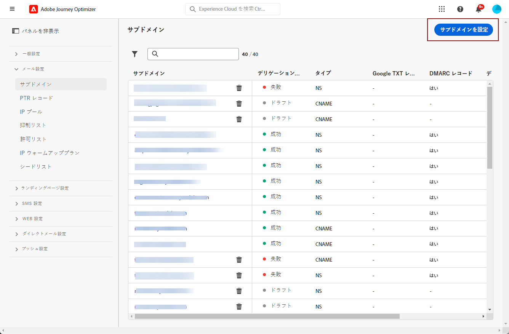
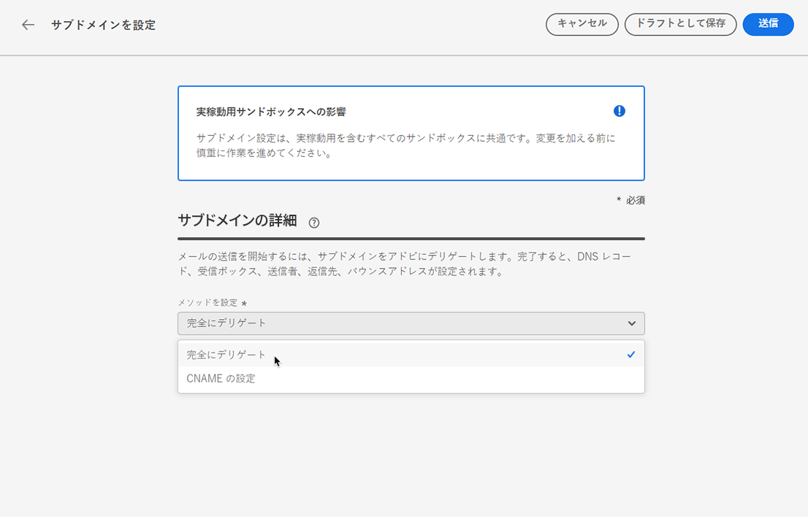
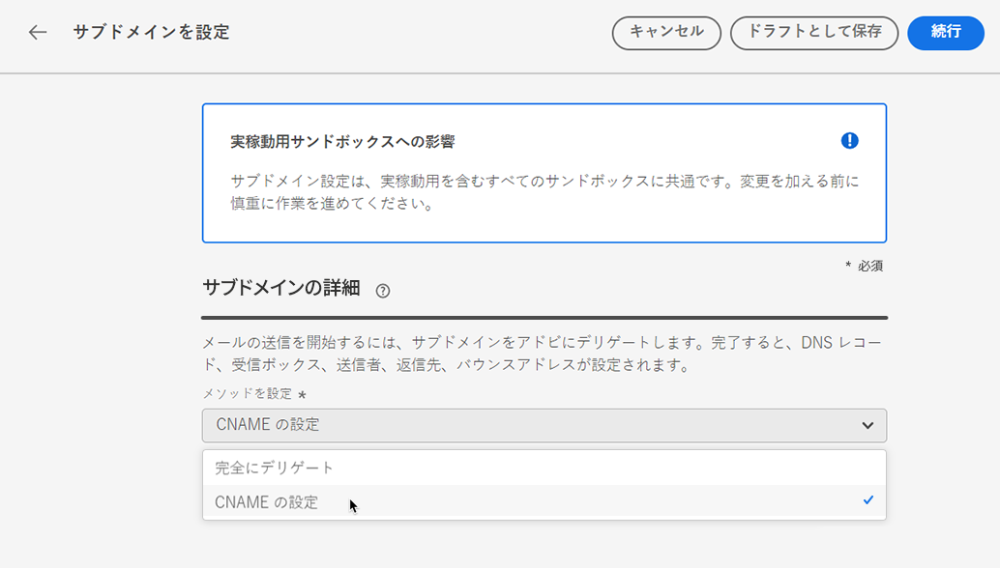
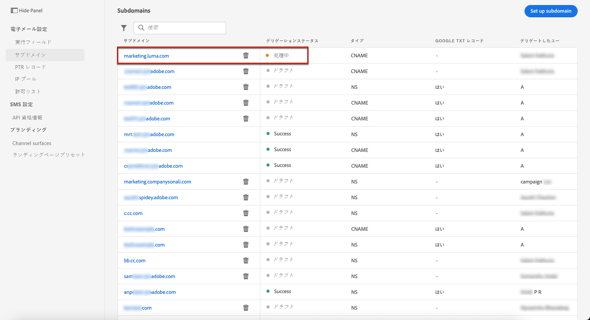

# サブドメインのデリゲート {#delegate-subdomain}

>[!CONTEXTUALHELP]
>id="ajo_admin_subdomainname"
>title="サブドメインデリゲーション"
>abstract="Journey Optimizer を使用すると、サブドメインをアドビにデリゲートできます。サブドメインを完全にアドビにデリゲートできます。これは推奨される方法です。また、CNAME を使用してアドビ固有のレコードを指すサブドメインを作成することもできますが、この方法では、DNS レコードを独自に保持および管理する必要があります。"
>additional-url="https://experienceleague.adobe.com/ja/docs/journey-optimizer/using/configuration/delegate-subdomains/about-subdomain-delegation#subdomain-delegation-methods" text="サブドメインの設定方法"

>[!CONTEXTUALHELP]
>id="ajo_admin_subdomainname_header"
>title="サブドメインデリゲーション"
>abstract="メールの送信を開始するには、サブドメインをアドビにデリゲートします。完了すると、DNS レコード、受信ボックス、送信者、返信先、バウンスアドレスが設定されます。"

## メールサブドメインの基本を学ぶ {#gs-delegate-subdomain}

ドメイン名のデリゲートという方法を使うと、ドメイン名（技術的には DNS ゾーン）の所有者は、その一部（技術的にはその配下の DNS ゾーンであり、サブゾーンとも呼ばれます）を別のエンティティにデリゲートできます。基本的に、お客様が「example.com」ゾーンを扱う場合、サブゾーン「marketing.example.com」をアドビにデリゲートできます。詳しくは、[サブドメインデリゲーション](about-subdomain-delegation.md)を参照してください

デフォルトで [!DNL Journey Optimizer]、を使用すると **最大 10 個のサブドメイン** をデリゲートできます。 ただし、ライセンス契約によっては、最大 100 個のサブドメインをデリゲートできる場合があります。自身が使用資格を持つサブドメインの数について詳しくは、アドビの連絡先にお問い合わせください。

サブドメインを完全にデリゲートするか、CNAME を使用してアドビ固有のレコードを指すサブドメインを作成できます。

完全なサブドメインデリゲーションは、推奨される方法です。詳しくは、両方の[サブドメイン設定方法](about-subdomain-delegation.md#subdomain-delegation-methods)の違いを参照してください。

サブドメインの設定は **すべての環境に共通** です。 したがって、サブドメインを変更すると、実稼動サンドボックスにも影響します。

>[!CAUTION]
>
>サブドメインの並列送信は、[!DNL Journey Optimizer] ではサポートされていません。 別のサブドメインのステータスが **[!UICONTROL 処理中]** となっているときに、サブドメインをデリゲーション用に送信しようとすると、エラーメッセージが表示されます。

## サブドメインをAdobeに完全にデリゲート {#full-subdomain-delegation}

>[!CONTEXTUALHELP]
>id="ajo_admin_subdomain_dns"
>title="一致する DNS レコードを生成"
>abstract="新しいサブドメインをアドビに完全にデリゲートするには、Journey Optimizer インターフェイスに表示されるアドビのネームサーバー情報を、ドメインホストソリューションにコピー＆ペーストし、一致する DNS レコードを生成する必要があります。CNAME を使用してサブドメインをデリゲートするには、SSL CDN URL 検証レコードもコピー＆ペーストする必要があります。チェックが正常に完了すると、サブドメインをメッセージの配信に使用する準備が整います。"
>additional-url="https://experienceleague.adobe.com/ja/docs/journey-optimizer/using/configuration/delegate-subdomains/delegate-subdomain#cname-subdomain-delegation" text="CNAME サブドメインのデリゲーション"

[!DNL Journey Optimizer] では、サブドメインを製品インターフェイスから直接アドビに、完全にデリゲートできます。アドビは、メールキャンペーンの配信、レンダリング、トラッキングに必要な DNS のあらゆる側面を制御および管理することで、メッセージをマネージドサービスとして提供できます。

メールマーケティング送信ドメインに関する業界標準の配信品質要件を満たすために必要な DNS インフラストラクチャの管理はアドビに任せ、引き続き社内メール用ドメインの DNS を管理し、制御できます。

サブドメインをアドビに完全にデリゲートするには、次の手順に従います。

1. **[!UICONTROL 管理]**／**[!UICONTROL チャネル]**／**[!UICONTROL メール設定]**／**[!UICONTROL サブドメイン]**&#x200B;メニューにアクセスし、「**[!UICONTROL サブドメインを設定]**」をクリックします。

   

1. 「**[!UICONTROL 完全にデリゲート済み]**」を「**[!UICONTROL メソッドの設定]**」セクションから選択します。

   

1. デリゲートするサブドメインの名前を指定します。

   

   >[!CAUTION]
   >
   >無効なサブドメインをアドビにデリゲートすることはできません。組織が所有する有効なサブドメイン（marketing.yourcompany.com など）を入力してください。

   <!--Capital letters are not allowed in subdomains. TBC by PM-->

1. DNS サーバーに配置するレコードのリストが表示されます。これらのレコードを 1 つずつコピーするか、CSV ファイルをダウンロードしてから、ドメインのホスティングソリューションに移動して、一致する DNS レコードを生成します。

1. ドメインをホストするソリューションに、すべての DNS レコードが生成されていることを確認してください。すべてが正しく設定されている場合は、「確認しました」チェックボックスをオンにします。

   

1. DMARC レコードを設定します。サブドメインに DMARC レコードが既に存在し [!DNL Journey Optimizer] で取得する場合は、同じ値を使用することも、必要に応じて変更することもできます。値を追加しない場合は、デフォルトの値が使用されます。[詳細情報](dmarc-record.md)

   

1. 「**[!UICONTROL 送信]**」をクリックします。

   後から「**[!UICONTROL ドラフトとして保存]**」ボタンを使用してレコードを作成し、サブドメイン設定を送信できます。その後、サブドメインリストからサブドメインのデリゲーションを開くことで、そのデリゲーションを再開できます。

1. サブドメインは&#x200B;**[!UICONTROL 処理中]**&#x200B;ステータスでリストに表示されます。サブドメインのステータスについて詳しくは、[この節](about-subdomain-delegation.md#access-delegated-subdomains)を参照してください。

   

   そのサブドメインを使用してメッセージを送信できるようになるには、必要なチェックがアドビで実行されるまで待つ必要があります（最大で 3 時間かかることがあります）。詳しくは、[この節](#subdomain-validation)を参照してください。

   >[!NOTE]
   >
   >見つからないレコード（ホスティングソリューションでまだ作成されていないレコード）が表示されます。

1. チェックが正常に完了すると、サブドメインのステータスが「**[!UICONTROL 成功]**」になります。メッセージの配信に使用する準備が整いました。

   ホスティングソリューションで検証レコードを作成できなかった場合、サブドメインは「**[!UICONTROL 失敗]**」とマークされます。

サブドメインが [!DNL Journey Optimizer] でアドビにデリゲートされると、PTR レコードが自動的に作成され、このサブドメインに関連付けられます。[詳細情報](ptr-records.md)

## CNAME を使用したサブドメインの設定 {#cname-subdomain-delegation}

>[!CONTEXTUALHELP]
>id="ajo_admin_subdomain_dns_cname"
>title="一致する DNS および検証レコードを生成"
>abstract="CNAME を使用してサブドメインをデリゲートするには、アドビのネームサーバー情報と、Journey Optimizer インターフェイスに表示される SSL CDN URL 検証レコードを、ホスティングプラットフォームにコピー＆ペーストする必要があります。チェックが正常に完了すると、サブドメインをメッセージの配信に使用する準備が整います。"

>[!CONTEXTUALHELP]
>id="ajo_admin_subdomain_cdn_cname"
>title="検証レコードのコピー"
>abstract="アドビは、検証レコードを生成します。CDN URL 検証用に、ホスティングプラットフォーム上に対応するレコードを作成する必要があります。"

ドメイン固有の制限ポリシーがあり、アドビが DNS の一部を制御する必要がある場合は、自社で DNS 関連のすべてのアクティビティを実行するように選択できます。

CNAME サブドメイン設定では、サブドメインを作成し、CNAME を使用してアドビ固有のレコードを示すことができます。この設定を使用すると、メールの送信、レンダリング、トラッキングの環境を設定するために、DNS の管理に対する責任を、お客様とアドビで共有します。

>[!CAUTION]
>
>組織のポリシーで完全なサブドメインデリゲーションの方法が制限されている場合は、CNAME の方法をお勧めします。このアプローチでは、DNS レコードを自社で維持および管理する必要があります。アドビは、CNAME メソッドを使用して設定されたサブドメインの DNS の変更、維持または管理をサポートできなくなります。

➡️ [CNAME を使用してサブドメインを作成しアドビ固有のレコードを指すようにする方法については、こちらのビデオを参照してください](#video)

CNAME を使用してサブドメインを設定するには、次の手順に従います。

1. **[!UICONTROL 管理]**／**[!UICONTROL チャネル]**／**[!UICONTROL メール設定]**／**[!UICONTROL サブドメイン]**&#x200B;メニューにアクセスし、「**[!UICONTROL サブドメインを設定]**」をクリックします。

1. **[!UICONTROL CNAME の設定]**&#x200B;メソッドを選択します。

   

1. デリゲートするサブドメインの名前を指定します。

   >[!CAUTION]
   >
   >無効なサブドメインをAdobeにデリゲートしないでください。 **組織が所有** する、有効なサブドメイン（marketing.yourcompany.comなど）を入力してください。

   <!--Capital letters are not allowed in subdomains. TBC by PM-->

1. DNS サーバーに配置するレコードのリストが表示されます。これらのレコードを 1 つずつコピーするか、CSV ファイルをダウンロードしてから、ドメインのホスティングソリューションに移動して、一致する DNS レコードを生成します。

1. ドメインをホストするソリューションに、すべての DNS レコードが生成されていることを確認してください。すべてが正しく設定されている場合は、「確認しました」チェックボックスをオンにします。

   

1. DMARC レコードを設定します。サブドメインに DMARC レコードが既に存在し [!DNL Journey Optimizer] で取得する場合は、同じ値を使用することも、必要に応じて変更することもできます。値を追加しない場合は、デフォルトの値が使用されます。[詳細情報](dmarc-record.md)

   

1. 「**[!UICONTROL 続行]**」をクリックします。

   後で「**[!UICONTROL ドラフトとして保存]**」ボタンを使用してレコードを作成できます。その後、サブドメインリストでサブドメインのデリゲーションを開くことにより、この段階から再開できます。

1. ご利用のホスティングソリューションでレコードがエラーなく生成されたことを、アドビが確認するまで待ちます。この処理には最大 2 分かかる場合があります。

   >[!NOTE]
   >
   >見つからないレコード（ホスティングソリューションでまだ作成されていないレコード）が表示されます。

1. アドビは SSL CDN URL 検証レコードを生成します。この検証レコードをホスティングプラットフォームにコピーします。ホスティングソリューションでこのレコードを適切に作成している場合は、「確認しました」チェックボックスをオンにし、「**[!UICONTROL 送信]**」をクリックします。

   <!---->

1. CNAME サブドメインのデリゲーションが送信されると、そのサブドメインは「**[!UICONTROL 処理中]**」ステータスでリストに表示されます。サブドメインのステータスについて詳しくは、[この節](about-subdomain-delegation.md#access-delegated-subdomains)を参照してください。

   

   そのサブドメインを使用してメッセージを送信できるようになるには、必要なチェックがアドビで実行されるまで待つ必要があります（通常 2〜3 時間かかります）。詳しくは、[この節](#subdomain-validation)を参照してください。

1. チェックが正常に完了すると<!--i.e Adobe validates the record you created and installs it-->、サブドメインのステータスが「**[!UICONTROL 成功]**」になります。メッセージの配信に使用する準備が整いました。

   ホスティングソリューションで検証レコードを作成できなかった場合、サブドメインは「**[!UICONTROL 失敗]**」とマークされます。

レコードを検証し、証明書をインストールすると、アドビは CNAME サブドメインの PTR レコードを自動的に作成します。[詳細情報](ptr-records.md)

## サブドメインの検証 {#subdomain-validation}

以下のチェックとアクションは、サブドメインが検証され、サブドメインを使用してメッセージを送信できる状態になるまで実行されます。

これらの手順はAdobeによって実行され、実行には **最大 3 時間** かかる場合があります。

1. **事前検証**：サブドメインが Adobe DNS（NS レコード、SOA レコード、ゾーン設定、所有権レコード）にデリゲートされているかどうかをアドビが確認します。事前検証の手順が失敗した場合は、エラーと該当理由が返され、それ以外の場合は、アドビが次の手順に進みます。

1. **ドメインの DNS の設定**：

   * **MX レコード**：メール交換レコード - サブドメインに送信されたインバウンドメールを処理するメールサーバーレコード。
   * **SPF レコード**：送信者ポリシーフレームワークレコード - サブドメインからメールを送信できるメールサーバーの IP をリストします。
   * **DKIM レコード**：DomainKeys Identified Mail の標準レコード - 公開キー／秘密キーの暗号化を使用してメッセージを認証し、スプーフィングを防止します。
   * **A**：デフォルトの IP マッピング。
   * **CNAME**：正規名（CNAME レコード）は、エイリアス名を真のドメイン名つまり正規ドメイン名にマッピングする DNS レコードタイプです。

1. **トラッキング URL とミラー URL の作成**：ドメインが email.example.com の場合、トラッキング／ミラードメインは data.email.example.com になります。SSL 証明書をインストールすることで保護されます。

1. **CDN CloudFront のプロビジョニング**：CDN がまだセットアップされていない場合は、アドビが組織 ID に CDN をプロビジョニングします。

1. **CDN ドメインの作成**：ドメインが email.example.com の場合、CDN ドメインは cdn.email.example.com になります。

1. **CDN SSL 証明書の作成とアタッチ**：アドビが CDN ドメイン用の CDN 証明書を作成して CDN ドメインにアタッチします。

1. **転送 DNS の作成**：これが最初にデリゲートするサブドメインである場合は、PTR レコードの作成に必要な転送 DNS をアドビが IP ごとに 1 つ作成します。

1. **PTR レコードの作成**：TR レコード（リバース DNS レコードとも呼ばれます）は、メールをスパムとしてマークしないようにするために ISP に必要になるものです。Gmail では、IP ごとに PTR レコードを用意することも推奨しています。アドビは、サブドメインを初めてデリゲートするときにのみ PTR レコードを作成します（IP ごとに 1 つずつ、すべての IP がそのサブドメインを指します）。例えば、IP が *192.1.2.1* で、サブドメインが *email.example.com* の場合、PTR レコードは *192.1.2.1PTR r1.email.example.com* のようになります。後から PTR レコードを更新して、新しいデリゲートドメインを指すようにすることができます。[PTR レコードについての詳細情報](ptr-records.md)

## サブドメインのデリゲート解除 {#undelegate-subdomain}

サブドメインのデリゲートを解除する場合は、Adobe担当者にお問い合わせください。

ただし、Adobeにアクセスする前に、ユーザーインターフェイスでいくつかの手順を実行する必要があります。

>[!NOTE]
>
>**[!UICONTROL 成功]** ステータスのサブドメインのみをデリゲート解除できます。 **[!UICONTROL ドラフト]** および **[!UICONTROL 失敗]** ステータスのサブドメインは、ユーザーインターフェイスから削除できます。

まず、[!DNL Journey Optimizer] で次の手順を実行します。

1. サブドメインに関連付けられているすべてのチャネル設定をディアクティベートします。 [方法についてはこちらを参照](../configuration/channel-surfaces.md#deactivate-a-surface)

1. ランディングページのサブドメイン、SMS サブドメイン、およびこのサブドメインに関連付けられた web サブドメインのデリゲートを解除します。

   [ ランディングページ ](../landing-pages/lp-subdomains.md#undelegate-subdomain)、[SMS](../sms/sms-subdomains.md#undelegate-subdomain) または [web サブドメイン ](../web/web-delegated-subdomains.md#undelegate-subdomain) ごとに専用のリクエストを生成する必要があります。

1. サブドメインに関連付けられているアクティブなキャンペーンを停止します。 [方法についてはこちらを参照](../campaigns/modify-stop-campaign.md#stop)

1. サブドメインに関連付けられたアクティブなジャーニーを停止します。 [方法についてはこちらを参照](../building-journeys/end-journey.md#stop-journey)

1. サブドメインにリンクされた [PTR レコード ](ptr-records.md#edit-ptr-record) を別のサブドメインに指定します。

   これが唯一のデリゲートされたサブドメインである場合、この手順をスキップできます。

完了したら、デリゲート解除するサブドメインをAdobe担当者に連絡します。

リクエストがAdobeによって処理されると、デリゲートされていないドメインはサブドメインインベントリページに表示されなくなります。

>[!CAUTION]
>
>サブドメインがデリゲート解除された後：
>
>   * そのサブドメインを使用していたチャネル設定を再アクティブ化することはできません。
>   * ユーザーインターフェイスを使用して正確なサブドメインを再度デリゲートすることはできません。 その場合は、Adobeの担当者にお問い合わせください。

## チュートリアルビデオ{#video}

CNAME を使用してサブドメインを作成しアドビ固有のレコードを指すようにする方法を説明します。

>[!VIDEO](https://video.tv.adobe.com/v/339484?quality=12)
