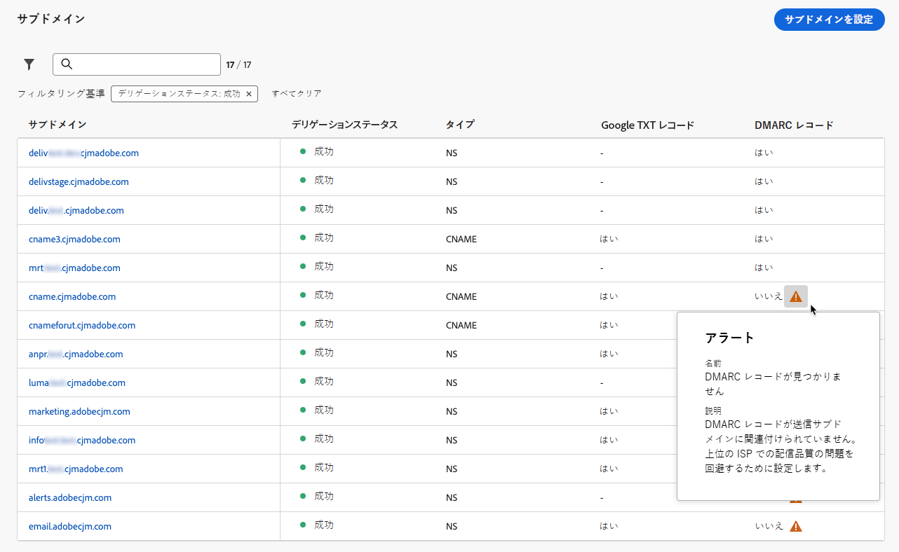

# DMARC レコード {#dmarc-record}

>[!CONTEXTUALHELP]
>id="ajo_admin_dmarc_record"
>title="DMARC レコードの設定"
>abstract="DMARC は、ドメインの所有者がドメインを不正使用から保護し、メールボックスプロバイダーでの配信品質の問題を回避できるメール認証方法です。 Google と Yahoo! は、業界のベストプラクティス実施の一環として、メールの送信に使用するドメインの DMARC レコードを要求しています。"

## DMARC とは {#what-is-dmarc}

DMARC（Domain-based Message Authentication, Reporting, and Conformance）は、ドメイン所有者が自身のドメインを不正使用から保護できるようにするメール認証方式です。メールプロバイダーやインターネットサービスプロバイダー（ISP）明確なポリシーを提供することで、自分のドメインから悪意のある関係者がメールを送信するのを防ぐことができます。DMARC を実装すると、正当なメールがスパムとしてマークされたり拒否されたりするリスクが軽減され、メールの配信品質が向上します。

また、DMARC では、認証に失敗したメッセージに関するレポートを提供し、DMARC 検証に合格しないメールの処理を制御できます。実装されている [DMARC ポリシー](#dmarc-policies)に応じて、これらのメールは監視、強制隔離または拒否できます。これらの機能を使用すると、潜在的なエラーを軽減し、対処するための行動をとることが可能になります。

認証に失敗したメールを制御しながら配信品質の問題を防止できるように、[!DNL Journey Optimizer] は現在、直接管理インターフェイスで DMARC 技術をサポートしています。[詳細情報](#implement-dmarc)

### DMARC の仕組み {#how-dmarc-works}

SPF と DKIM はいずれも、メールをドメインに関連付け、連携してメールを認証するために使用されます。DMARC はこれをさらに一歩進め、DKIM と SPF によってチェックされたドメインと照合することで、詐称を防止します。

>[!NOTE]
>
>Journey Optimizer では、SPF と DKIM が設定されています。

DMARC 認証に合格するには、メッセージが SPF または DKIM に合格する必要があります。

* SPF（Sender Policy Framework）は、送信サーバーの IP アドレスをドメインの認証済み IP アドレスのリストと照らし合わせて確認することで、メールメッセージが許可された送信元から送信されたものであることを確認するのに役立ちます。
* DKIM（DomainKeys Identified Mail）はデジタル署名をメールメッセージに追加し、受信者がメッセージの完全性と真正性を検証できるようにします。

これらの両方またはいずれかが認証に失敗した場合、DMARC は失敗し、選択した DMARC ポリシーに従ってメールが配信されます。

<!--DMARC requires alignment between the 'From" and 'Return-Path' address.-->

### DMARC ポリシー {#dmarc-policies}

メールが DMARC 認証に失敗した場合、そのメッセージに適用するアクションを決定できます。DMARC には次の 3 つのポリシーオプションがあります。

* モニター（p=none）：メッセージに対する通常の処理をすべて実行するよう、メールボックスプロバイダー／ISP に指示します。
* 強制隔離（p=quarantine）：DMARC 認証に失敗するメールを受信者のスパムフォルダーまたは迷惑メールフォルダーに配信するよう、メールボックスプロバイダー／ISP に指示します。
* 拒否（p=reject）：DMARC 認証に失敗してバウンスが発生するメールをブロックするよう、メールボックスプロバイダー／ISP に指示します。

>[!NOTE]
>
>[!DNL Journey Optimizer] で DMARC ポリシーを設定する方法について詳しくは、[この節](#set-up-dmarc)を参照してください。

## DMARC 要件の更新 {#dmarc-update}

Google と Yahoo! は、業界のベストプラクティス実施の一環として、メール送信に使用するすべてのドメインに対して **DMARC レコード**&#x200B;を要求しています。この新しい要件は、**2024年2月1日（PT）**&#x200B;から適用されます。

>[!CAUTION]
>
>Gmail と Yahoo! のこの新しい要件に準拠しない場合、メールがスパムフォルダーに分類されたり、ブロックされたりすることが予想されます。

そのため、アドビでは、次のアクションを実行することを強くお勧めします。

* [!DNL Journey Optimizer] でアドビに&#x200B;**委任済みのすべてのサブドメイン**&#x200B;に対して、**DMARC レコード**&#x200B;が設定されていることを確認してください。[方法についてはこちらを参照](#check-subdomains-for-dmarc)

* アドビに&#x200B;**新しいサブドメインをデリゲート**&#x200B;すると、直接 **[!DNL Journey Optimizer] 管理インターフェイス**&#x200B;で **DMARC を設定**&#x200B;できるようになります。[方法についてはこちらを参照](#implement-dmarc)

## [!DNL Journey Optimizer] での DMARC の実装 {#implement-dmarc}

[!DNL Journey Optimizer] 管理インターフェイスを使用すると、アドビに委任した、または委任しているすべてのサブドメインに対して DMARC レコードを設定できます。詳しい手順は以下の通りです。

### DMARC の既存のサブドメインを確認します。 {#check-subdomains-for-dmarc}

[!DNL Journey Optimizer] で委任したすべてのサブドメインに対して DMARC レコードが設定されていることを確認するには、次の手順に従います。

1. **[!UICONTROL 管理]**／**[!UICONTROL チャネル]**／**[!UICONTROL メール設定]**／**[!UICONTROL サブドメイン]**&#x200B;メニューにアクセスし、「**[!UICONTROL サブドメインを設定]**」をクリックします。

1. 委任されたサブドメインごとに、**[!UICONTROL DMARC レコード]**&#x200B;列を確認します。指定のサブドメインのレコードが見つからなかった場合は、アラートが表示されます。

   

   >[!CAUTION]
   >
   >Gmail および Yahoo! の新しい要件に準拠し、上位の ISP の配信品質の問題を回避するには、すべての委任されたサブドメインに対して DMARC レコードを設定することをお勧めします。[詳細情報](dmarc-record-update.md)

1. DMARC レコードが関連付けられていないサブドメインを選択し、組織の要件に応じて **[!UICONTROL DMARC レコード]**&#x200B;セクションに入力します。DMARC レコードフィールドに値を入力する手順について詳しくは、[この節](#implement-dmarc)を参照してください。

   <!---->

   >[!NOTE]
   >
   >親ドメインで DMARC レコードが見つかるかどうかに応じて、親ドメインの値を使用するか、アドビに DMARC レコードを管理させるかを選択できます。[詳細情報](#implement-dmarc)

1. サブドメインを編集する場合：

   * アドビに[完全にデリゲート](delegate-subdomain.md#full-subdomain-delegation)されているので、それ以上のアクションは必要ありません。

   * [CNAME](delegate-subdomain.md#cname-subdomain-delegation) を使用して設定する場合、一致する DNS レコードを生成するには、DMARC の DNS レコードをホストするソリューションにコピーする必要があります。

     

     DNS レコードがドメインホスティングソリューションに生成されていることを確認し、「...確認します」チェックボックスをオンにします。

1. 変更を保存します。

### 新しいサブドメイン用の DMARC の設定 {#set-up-dmarc}

[!DNL Journey Optimizer] で新しいサブドメインをアドビに委任すると、お使いのドメインの DNS に DMARC レコードが作成されます。DMARC を実装するには、以下の手順に従います。

>[!CAUTION]
>
>Gmail および Yahoo! の新しい要件に準拠し、上位の ISP の配信品質の問題を回避するには、すべての委任されたサブドメインに対して DMARC レコードを設定することをお勧めします。[詳細情報](dmarc-record-update.md)

<!--If you fail to comply with the new requirement from Gmail and Yahoo! to have DMARC record for all sending domains, your emails are expected to land into the spam folder or to get blocked.-->

1. 新しいサブドメインの設定[方法についてはこちらを参照](delegate-subdomain.md)

1. 「**[!UICONTROL DMARC レコード]**」セクションに移動します。

1. サブドメインに関連付けられた親ドメインで DMARC レコードが使用可能な場合は、次の 2 つのオプションが表示されます。

   

   * **[!UICONTROL アドビで管理]**：サブドメインの DMARC レコードをアドビに管理させることができます。[この節](#manage-dmarc-with-adobe)で説明する手順に従います。

   * **[!UICONTROL 独自に管理]**：<!--This option is selected by default.-->このオプションを使用すると、親ドメインの値を使用して、[!DNL Journey Optimizer] の外部で DMARC レコードを管理できます。これらの値はインターフェイスに表示されますが、編集できません。

     {width="80%"}

1. 親ドメインに DMARC レコードが見つからない場合は、「**[!UICONTROL アドビで管理]**」オプションのみが使用できます。サブドメインの DMARC レコードを設定するには、[以下](#manage-dmarc-with-adobe)の手順に従います。

   {width="80%"}

### アドビでの DMARC レコードの管理 {#manage-dmarc-with-adobe}

アドビに DMARC レコードを管理させるには、「**[!UICONTROL アドビで管理]**」オプションを選択し、以下の手順に従います。

>[!NOTE]
>
>[!DNL Journey Optimizer] で取得した場合は、インターフェイスでハイライト表示されているのと同じ値を使用したり、必要に応じて変更したりできます。

{width="80%"}

>[!NOTE]
>
>値を追加しない場合は、事前に入力されたデフォルト値が使用されます。

1. DMARC が失敗した場合に受信者サーバーが実行するアクションを定義します。適用したい [DMARC ポリシー](#dmarc-policies)に応じて、次の 3 つのオプションのいずれかを選択します。

   * **[!UICONTROL なし]**（デフォルト値）：DMARC 認証に失敗したメッセージに対して何のアクションも実行しない一方で、送信者にはメールレポートを送信するよう受信者に指示します。
   * **[!UICONTROL 強制隔離]**：DMARC 認証に失敗したメールを強制隔離するよう受信メールサーバーに指示します。これは、通常、受信者のスパムフォルダーまたは迷惑メールフォルダーにこれらのメッセージを配置することを意味します。
   * **[!UICONTROL 拒否]**：認証に失敗したドメインのメールを、完全に拒否（バウンス）するよう受信者に指示します。このポリシーを有効にすると、ドメインで 100％認証されたメールのみが受信トレイに配置される可能性があります。

   >[!NOTE]
   >
   >ベストプラクティスとして、DMARC の潜在的な影響を把握できるように、DMARC ポリシーを&#x200B;**なし**&#x200B;から&#x200B;**強制隔離**&#x200B;に、さらに&#x200B;**拒否**&#x200B;にエスカレーションすることで、DMARC の実装を徐々に展開することをお勧めします。

1. 必要に応じて、1 つまたは複数のメールアドレスを選択して追加し、[認証に失敗した](#how-dmarc-works)メールに関する **DMARC レポート**&#x200B;が送信される組織内の場所を指定します。レポートごとにアドレスを 5 つまで追加できます。

   >[!NOTE]
   >
   >これらのレポートを受け取ることができる正規の受信ボックス（アドビ以外）を管理下に置いてください。

   ISP が生成するレポートには、送信者が DMARC ポリシーの RUA/RUF タグを通じて受信できるものが 2 種類あります。

   * **集計レポート**（RUA）：GDPR に触れる可能性のある PII（個人を特定できる情報）は含まれていません。
   * **フォレンジック失敗レポート**（RUF）：GDPR に触れるメールアドレスが含まれています。利用する前に、GDPR に準拠する必要がある情報の処理方法を社内で確認してください。

   >[!NOTE]
   >
   >これらの高度に技術的なレポートでは、スプーフィング（なりすまし）を試みたメールの概要を提供します。これらはサードパーティーのツールを使用するとよく解釈できます。

1. DMARC の対象となるメールの&#x200B;**適用割合**&#x200B;を選択します。

   この割合は、ご利用のメールインフラストラクチャに対する信頼度と、誤検知（正当なメールが不正と判定されること）の許容度によって異なります。組織では、DMARC ポリシーの設定を&#x200B;**なし**&#x200B;から始め、徐々に DMARC ポリシーの割合を増やし、正当なメール配信への影響を注意深く監視するのが一般的です。

   >[!NOTE]
   >
   >メール管理者や IT チームと協力し、メール認証の実践に自信を持てるようになるのにつれ、割合を徐々に増やしていきます。

   ベストプラクティスとして、DMARC のコンプライアンス率を高め（理想的には 100 %に近い水準に目標を定め）、誤検出のリスクを最小限に抑えながら、セキュリティ上のメリットを最大限に活用します。

1. **レポート間隔**&#x200B;を 24 時間から 168 時間の間で選択します。これにより、ドメイン所有者はメール認証結果に関する最新情報を定期的に受け取り、メールのセキュリティを向上させるために必要な措置を講じることができます。

<!--The DMARC reporting interval is specified in the DMARC policy published in the DNS (Domain Name System) records for a domain. The reporting interval can be set to daily, weekly, or another specified frequency, depending on the domain owner's preferences.

The default value (24 hours) is generally the email providers' expectation.

**********

Setting up a DMARC record involves adding a DNS TXT record to your domain's DNS settings. This record specifies your DMARC policy, such as whether to quarantine or reject messages that fail authentication. Implementing DMARC is a proactive step towards enhancing email security and protecting both your organization and your recipients from email-based threats.

DMARC helps prevent malicious actors from sending emails that appear to come from your domain. By setting up DMARC, you can specify how email providers should handle messages that fail authentication checks, reducing the likelihood that phishing emails will reach recipients.

DMARC helps improve email deliverability by providing a clear policy for email providers to follow when encountering messages claiming to be from your domain. This can reduce the chances of legitimate emails being marked as spam or rejected.

DMARC helps protect against email spoofing, phishing, and other fraudulent activities.

It allows you to decide how a mailbox provider should handle emails that fail SPF and DKIM checks, providing a way to authenticate the sender's domain and prevent unauthorized use of the domain for malicious purposes.

## What are the benefits of DMARC? {#dmarc-benefits}

The key benefits or DMARC are as folllows:

* DMARC allows email receivers to easily identify the authentication of emails, which could potentially improve delivery.

* It offers reporting on which messages fail SPF and/or DKIM, enabling senders to gain visibility.

* This increased visibility allows for steps to be taken to mitigate further errors. It gives senders a degree of control over what happens with mail that does not pass either of these authentication methods.

-->
