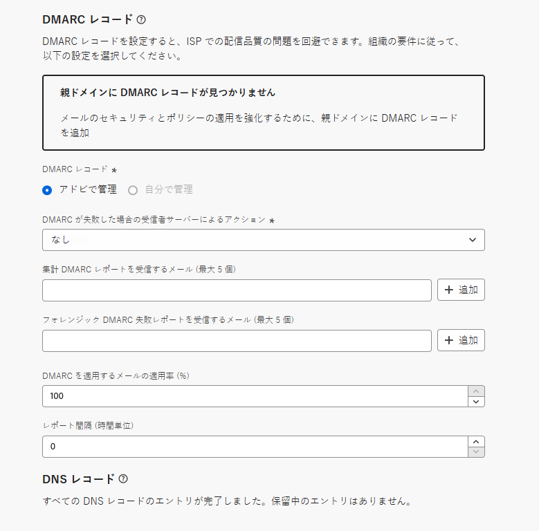
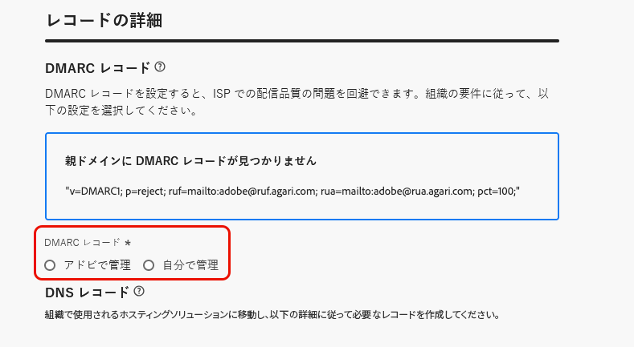

# DMARC レコード {#dmarc-record}

>[!CONTEXTUALHELP]
>id="ajo_admin_dmarc_record"
>title="DMARC レコードを設定"
>abstract="DMARC は、ドメインの所有者がドメインを不正使用から保護し、メールボックスプロバイダーの配信品質の問題を回避できる E メール認証方法です。 Googleと Yahoo は、業界のベストプラクティスの実施の一環として、E メールを送信する際に使用するすべてのドメインに対して DMARC レコードを持つことを求めています。"

## DMARC とは {#what-is-dmarc}

DMARC（の略） **ドメインベースのメッセージ認証、レポート、適合**&#x200B;は、ドメインの所有者がドメインを不正使用から保護できる電子メール認証方法です。 E メールプロバイダーや ISP に明確なポリシーを提供することで、悪意のある関係者がドメインからの E メールを送信するのを防ぐことができます。 これにより、正当な E メールがスパムとしてマークされたり拒否されたりする可能性が低くなり、E メールの配信品質が向上します。

また、DMARC では、認証に失敗したメッセージに関するレポートを提供し、DMARC 検証に合格しないメールの処理を制御します。 実装されたに応じて [DMARC ポリシー](#dmarc-policies)の場合、これらの E メールは監視、強制隔離または拒否できます。 これらの機能を使用すると、潜在的なエラーを軽減し、対処するためのアクションを実行できます。

<!--To help you prevent deliverability issues by allowing ISPs to authenticate your sending domains - while gaining visibility and control over mail that fail this authentication, [!DNL Journey Optimizer] will soon be supporting the DMARC technology directly in its administration interface.-->

認証に失敗したメールを制御しながら、配信品質の問題を防ぐのに役立ちます。 [!DNL Journey Optimizer] 近日中に、DMARC テクノロジーを管理インターフェイスで直接サポートする予定です。 [詳細情報](#implement-dmarc)

### DMARC の仕組み {#how-dmarc-works}

SPF と DKIM は、E メールをドメインに関連付け、連携して E メールを認証するために使用されます。 DMARC はこの 1 つの手順をさらに進め、DKIM と SPF でチェックされたドメインと一致させ、スプーフィングを防ぐのに役立ちます。

>[!NOTE]
>
>Journey Optimizerでは、SPF と DKIM が設定されています。

DMARC を渡すには、メッセージが SPF または DKIM を渡す必要があります。

* SPF(Sender Policy Framework) は、送信サーバーの IP アドレスをドメインの承認済み IP アドレスのリストと照合することで、E メールメッセージが承認されたソースから送信されたことを確認するのに役立ちます。
* DKIM(DomainKeys Identified Mail) は、電子メールメッセージに電子署名を追加し、受信者がメッセージの整合性と信頼性を検証できるようにします。

これらの両方またはいずれかの認証が失敗した場合、DMARC は失敗し、選択した DMARC ポリシーに従って電子メールが配信されます。

<!--DMARC requires alignment between the 'From" and 'Return-Path' address.-->

### DMARC ポリシー {#dmarc-policies}

E メールが DMARC 認証に失敗した場合は、そのメッセージに適用するアクションを決定できます。 DMARC には次の 3 つのポリシーオプションがあります。

* モニター (p=none)：メールボックスプロバイダーまたは ISP に対し、通常のメッセージに対する処理を何らかの処理で実行するように指示します。
* 強制隔離 (p=quarantine):DMARC を受信者のスパムフォルダーまたは迷惑メールフォルダーに渡さないメールを配信するよう、メールボックスプロバイダーまたは ISP に指示します。
* 拒否 (p=reject):DMARC を渡さずにバウンスに至ったメールをブロックするよう、メールボックスプロバイダーまたは ISP に指示します。

>[!NOTE]
>
>を使用して DMARC ポリシーを設定する方法を説明します。 [!DNL Journey Optimizer] in [この節](#set-up-dmarc).

## DMARC 要件の更新 {#dmarc-update}

業界のベストプラクティスの実施の一環として、Googleと Yahoo は共に、 **DMARC レコード** 電子メールを送信するために使用するすべてのドメイン用。 この新しい要件は、次の日から始まります。 **2024 年 2 月 2 日**.

Googleと Yahoo の要件について詳しくは、 [この節](https://experienceleague.adobe.com/docs/deliverability-learn/deliverability-best-practice-guide/additional-resources/guidance-around-changes-to-google-and-yahoo.html?lang=en#dmarc%3A){target="_blank"}.

>[!CAUTION]
>
>Gmail および Yahoo のこの新しい要件に準拠しないと、E メールがスパムフォルダーにランディングしたりブロックされたりする可能性があります。 [詳細情報](https://experienceleague.adobe.com/docs/deliverability-learn/deliverability-best-practice-guide/additional-resources/guidance-around-changes-to-google-and-yahoo.html#how-will-this-impact-me-as-a-marketer%3F){target="_blank"}

そのため、Adobeでは、次の操作を実行することを強くお勧めします。

* 必ず **DMARC レコード** ～に向けて準備する **既にデリゲートしたすべてのサブドメイン** Adobeする [!DNL Journey Optimizer]. [方法についてはこちらを参照](#check-subdomains-for-dmarc)

* 条件 **新しいサブドメインのデリゲート** Adobeに対して、次の操作を実行できます。 **DMARC の設定** 直接 **（内） [!DNL Journey Optimizer] 管理インターフェイス**. [方法についてはこちらを参照](#implement-dmarc)

## での DMARC の実装 [!DNL Journey Optimizer] {#implement-dmarc}

開始日 **2024 年 1 月 31 日**、 [!DNL Journey Optimizer] 管理インターフェイスを使用すると、既にデリゲートしたサブドメインまたはAdobeにデリゲートするサブドメインすべてに対して DMARC レコードを設定できます。 詳細な手順を以下に示します。

### DMARC の既存のサブドメインを確認します。 {#check-subdomains-for-dmarc}

デリゲートしたすべてのサブドメインに対して DMARC レコードが設定されていることを確認するには、次の手順を実行します。 [!DNL Journey Optimizer]、次の手順に従います。

1. **[!UICONTROL 管理]**／**[!UICONTROL チャネル]**／**[!UICONTROL サブドメイン]**&#x200B;メニューにアクセスし、「**[!UICONTROL サブドメインの設定]**」をクリックします。

1. デリゲートされたサブドメインごとに、 **[!UICONTROL DMARC レコード]** 列。 特定のサブドメインのレコードが見つからなかった場合は、アラートが表示されます。

   

   >[!CAUTION]
   >
   >Gmail および Yahoo の新しい要件に準拠し、上位の ISP の配信品質の問題を回避するには、すべてのデリゲートされたサブドメインに対して DMARC レコードを設定することをお勧めします。 [詳細情報](dmarc-record-update.md)

1. DMARC レコードが関連付けられていないサブドメインを選択し、 **[!UICONTROL DMARC レコード]** セクションに含める必要があります。 DMARC レコードフィールドに値を入力する手順について詳しくは、 [この節](#implement-dmarc).

1. 次の 2 つのオプションを考えてみましょう。

   * を使用して設定されたサブドメインを編集する場合 [CNAME](delegate-subdomain.md#cname-subdomain-delegation)に設定する場合、DMARC の DNS レコードをホスティングソリューションにコピーして、一致する DNS レコードを生成する必要があります。

     

     DNS レコードがドメインホスティングソリューションに生成されていることを確認し、「確認します…」チェックボックスをオンにします。

   * サブドメインを編集している場合 [完全に委任された](delegate-subdomain.md#full-subdomain-delegation) Adobeに **[!UICONTROL DMARC レコード]** 詳細なフィールド： [この節](#implement-dmarc). それ以上のアクションは必要ありません。

     

1. 変更を保存します。

## 新しいサブドメイン用の DMARC の設定 {#set-up-dmarc}

新しいサブドメインをでAdobeにデリゲートする場合 [!DNL Journey Optimizer]の場合、DMARC レコードがドメインの DNS に作成されます。 以下の手順に従って、DMARC を実装します。

>[!CAUTION]
>
>Gmail および Yahoo の新しい要件に準拠し、上位の ISP の配信品質の問題を回避するには、すべてのデリゲートされたサブドメインに対して DMARC レコードを設定することをお勧めします。 [詳細情報](dmarc-record-update.md)

<!--If you fail to comply with the new requirement from Gmail and Yahoo to have DMARC record for all sending domains, your emails are expected to land into the spam folder or to get blocked.-->

1. 新しいサブドメインを設定します。 [方法についてはこちらを参照](delegate-subdomain.md)

1. 次に移動： **[!UICONTROL DMARC レコード]** 」セクションに入力します。

   サブドメインに既存の DMARC レコードが存在する場合、および（で取得される場合） [!DNL Journey Optimizer]を使用すると、インターフェイスで強調表示されているのと同じ値を使用したり、必要に応じて値を変更したりできます。

   

   >[!NOTE]
   >
   >値を追加しない場合は、事前入力されたデフォルト値が使用されます。

1. DMARC が失敗した場合に受信者サーバーが実行するアクションを定義します。 に応じて [DMARC ポリシー](#dmarc-policies) 適用するには、次の 3 つのオプションのいずれかを選択します。

   * **[!UICONTROL なし]** （デフォルト値）:DMARC 認証に失敗したメッセージに対して何のアクションも実行しない一方で、送信者には電子メールレポートを送信するよう受信者に指示します。
   * **[!UICONTROL 強制隔離]**:DMARC 認証に失敗した E メールを強制隔離するよう受信 E メールサーバーに指示します。これは、通常、受信者のスパムフォルダーまたは迷惑メールフォルダーにこれらのメッセージを配置することを意味します。
   * **[!UICONTROL 拒否]**：認証に失敗したドメインの E メールを完全に拒否（バウンス）するように受信者に指示します。 このポリシーを有効にすると、ドメインで 100%認証された電子メールのみがインボックスに配置される可能性もあります。

   >[!NOTE]
   >
   >ベストプラクティスとして、DMARC ポリシーを次の場所からエスカレーションし、DMARC 実装を徐々に展開することをお勧めします。 **なし**、宛先 **強制隔離**、宛先 **拒否** DMARC の潜在的な影響を理解できるように。

1. オプションで、1 つまたは複数の電子メールアドレスを追加して、どこに送信するかを指定します **DMARC レポート** 電子メールで [認証の失敗](#how-dmarc-works) 組織内に配置する必要があります。 各レポートに 5 つまでのアドレスを追加できます。

   >[!NOTE]
   >
   >これらのレポートを受け取ることができる正規のインボックス (Adobeではなく ) がコントロールにあることを確認してください。

   ISP で生成されるレポートには、送信者が DMARC ポリシーの RUA/RUF タグを通じて受信できるものが 2 種類あります。

   * **集計レポート** (RUA):GDPR に影響を受ける可能性のある PII（個人を特定できる情報）は含まれていません。
   * **法医学的失敗レポート** (RUF):GDPR に影響を受ける電子メールアドレスが含まれています。 を利用する前に、GDPR に準拠する必要がある情報の処理方法を内部的に確認してください。

   >[!NOTE]
   >
   >これらの高度な技術レポートでは、スプーフィングを試行した E メールの概要を提供します。 彼らは第三者のツールを通して最もよく消化される。

1. を選択します。 **適用率** 電子メール数を格納します。

   この割合は、E メールインフラストラクチャに対する信頼性と、偽陽性（不正としてマークされる正当な E メール）の許容度に依存します。 組織では、DMARC ポリシーを次のように設定するのが一般的です。 **なし**&#x200B;を使用して、DMARC ポリシーの割合を徐々に増やし、適切な E メール配信への影響を詳細に監視します。

   >[!NOTE]
   >
   >メール認証の慣行に自信を持つにつれ、メール管理者や IT チームと協力して、割合を徐々に増やします。

   ベストプラクティスとして、DMARC のコンプライアンス率を高め、理想的には 100 %に近い水準に目標を定め、誤検出のリスクを最小限に抑えながら、セキュリティ上のメリットを最大限に活用します。

1. を選択します。 **レポート間隔** 24 ～ 168 時間。 これにより、ドメインの所有者は、電子メール認証結果に関する定期的な更新を受け取り、電子メールのセキュリティを強化するために必要な措置を取ることができます。

   <!--The DMARC reporting interval is specified in the DMARC policy published in the DNS (Domain Name System) records for a domain. The reporting interval can be set to daily, weekly, or another specified frequency, depending on the domain owner's preferences.

    The default value (24 hours) is generally the email providers' expectation.-->

<!--

Setting up a DMARC record involves adding a DNS TXT record to your domain's DNS settings. This record specifies your DMARC policy, such as whether to quarantine or reject messages that fail authentication. Implementing DMARC is a proactive step towards enhancing email security and protecting both your organization and your recipients from email-based threats.

DMARC helps prevent malicious actors from sending emails that appear to come from your domain. By setting up DMARC, you can specify how email providers should handle messages that fail authentication checks, reducing the likelihood that phishing emails will reach recipients.

DMARC helps improve email deliverability by providing a clear policy for email providers to follow when encountering messages claiming to be from your domain. This can reduce the chances of legitimate emails being marked as spam or rejected.

DMARC helps protect against email spoofing, phishing, and other fraudulent activities.

It allows you to decide how a mailbox provider should handle emails that fail SPF and DKIM checks, providing a way to authenticate the sender's domain and prevent unauthorized use of the domain for malicious purposes.

## What are the benefits of DMARC? {#dmarc-benefits}

The key benefits or DMARC are as folllows:

* DMARC allows email receivers to easily identify the authentication of emails, which could potentially improve delivery.

* It offers reporting on which messages fail SPF and/or DKIM, enabling senders to gain visibility.

* This increased visibility allows for steps to be taken to mitigate further errors. It gives senders a degree of control over what happens with mail that does not pass either of these authentication methods.

-->

