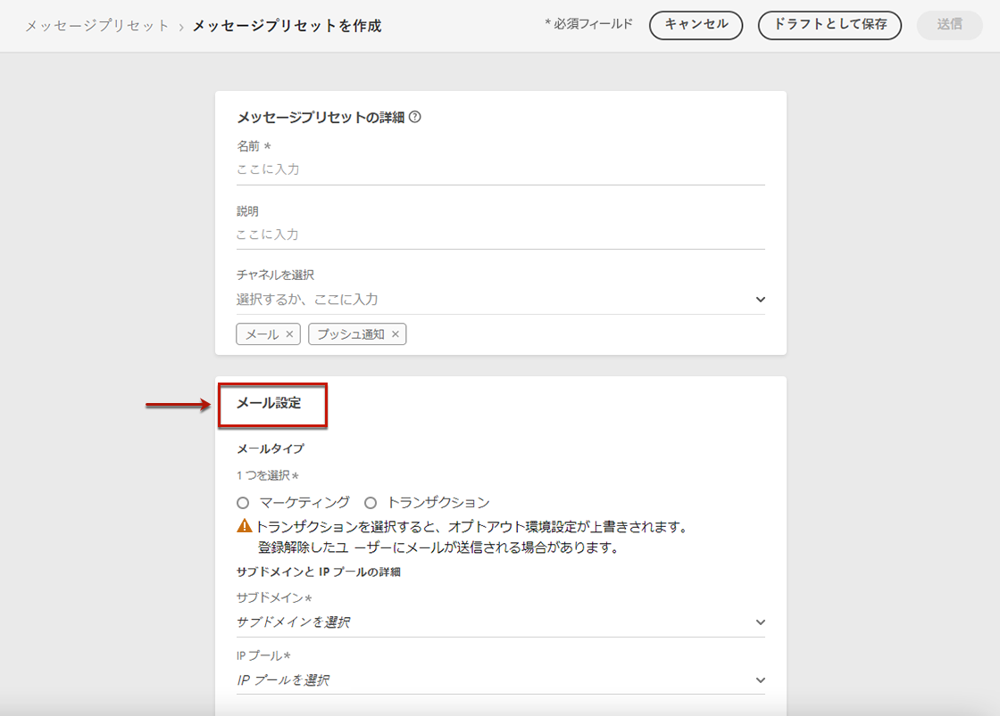
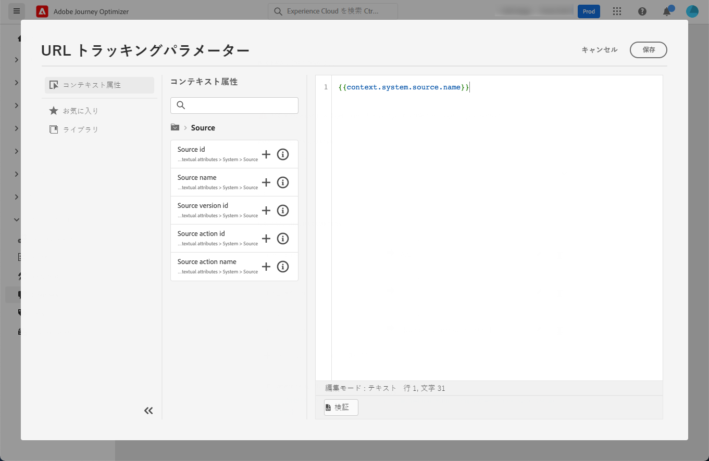
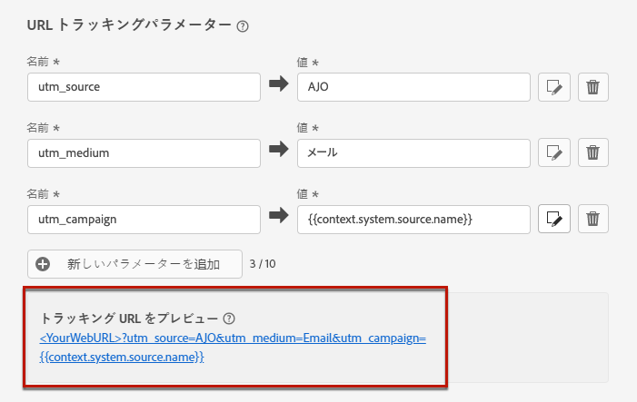

# メール設定 {#email-settings}

チャネルサーフェス（メッセージプリセットなど）の専用セクションでメール設定を定義します。サーフェスを作成する方法については、[この節](channel-surfaces.md)を参照してください。

次のロジックに従って、通信を送信する際に E メールサーフェス設定が取得されます。

* バッチジャーニーとバーストジャーニーの場合、電子メールサーフェスの設定がおこなわれる前に既に開始していたバッチ実行やバースト実行には適用されません。 変更は、次回の繰り返しまたは新しい実行時に取得されます。

* トランザクションメッセージの場合、変更は次の通信時に即座に取得されます（5 分の遅延まで）。

>[!NOTE]
>
>更新された E メールサーフェス設定は、サーフェスが使用されているジャーニーまたはキャンペーンで自動的に選択されます。

## メールのタイプ {#email-type}

>[!CONTEXTUALHELP]
>id="ajo_admin_presets_emailtype"
>title="電子メールカテゴリの定義"
>abstract="このサーフェスを使用する際に送信されるメールのタイプを選択します。ユーザーの同意が必要なプロモーションメール用の「マーケティング」または、特定のコンテキストで購読解除済みのプロファイルにも送信できる非商用メール用の「トランザクション」です。"

「**メールのタイプ**」セクションで、サーフェスと共に送信されるメッセージのタイプ（「**マーケティング**」または「**トランザクション**」）を選択します。

* プロモーションメールの場合は、「**マーケティング**」を選択します。これらのメッセージにはユーザーの同意が必要です。

* 注文確認、パスワードリセット通知、配信情報など、非商用メールの場合は、「**トランザクション**」を選択します。

>[!CAUTION]
>
>**トランザクション**&#x200B;メールは、アドビからのお知らせの購読を解除したプロファイルに送信できます。これらのメッセージは、特定のコンテキストでのみ送信できます。

[メッセージの作成](../messages/get-started-content.md)時に、メールに対して選択したカテゴリに一致する有効なチャネルサーフェスを選択する必要があります。

## サブドメインおよび IP プール {#subdomains-and-ip-pools}

「**サブドメインおよび IP プール**」セクションでは、以下を実行する必要があります。

1. メールの送信に使用するサブドメインを選択します。[詳細情報](about-subdomain-delegation.md)

1. サーフェスに関連付ける IP プールを選択します。[詳細情報](ip-pools.md)

選択した IP プールが[編集中](ip-pools.md#edit-ip-pool)（**[!UICONTROL 処理中]**&#x200B;ステータス）となっており、選択したサブドメインに関連付けられていない場合は、サーフェスの作成を続行できません。それ以外の場合は、IP プール／サブドメインの関連付けの最も古いバージョンが引き続き使用されます。その場合は、サーフェスをドラフトとして保存し、IP プールが&#x200B;**[!UICONTROL 成功]**&#x200B;ステータスになったら再試行します。

>[!NOTE]
>
>非実稼動環境の場合、アドビは、標準のテストサブドメインの作成や、共有送信 IP プールへのアクセスを許可しません。[独自のサブドメインをデリゲート](delegate-subdomain.md)して、組織に割り当てられたプールの IP を使用する必要があります。

## List-Unsubscribe {#list-unsubscribe}

リストの[サブドメインの選択](#subdomains-and-ip-pools)から、「**[!UICONTROL List-Unsubscribe を有効にする]**」オプションが表示されます。

このオプションは、デフォルトでは有効になっています。

有効にしたままにすると、次のような登録解除リンクが電子メールヘッダーに自動的に含まれます。

このオプションを無効にした場合、電子メールヘッダーに登録解除リンクは表示されません。

登録解除リンクは、次の 2 つの要素で構成されます。

* すべての登録解除リクエストの送信先となる&#x200B;**登録解除メールアドレス**。

   [!DNL Journey Optimizer] の場合、登録解除のメールアドレスは、[選択したサブドメイン](#subdomains-and-ip-pools)に基づいてチャネルサーフェスに表示されるデフォルトの&#x200B;**[!UICONTROL 宛先（登録解除）]**&#x200B;アドレスです。

   

* 購読解除後にユーザーがリダイレクトされるランディングページの URL である&#x200B;**登録解除 URL**。

   [ワンクリックオプトアウトリンク](../privacy/opt-out.md#one-click-opt-out)をこのサーフェスを使用して作成されたメッセージに加える場合、登録解除 URL は、ワンクリックオプトアウトリンク用に定義された URL になります。

   

   >[!NOTE]
   >
   >メッセージコンテンツにワンクリックオプトアウトリンクを追加しない場合、ユーザーにランディングページは表示されません。

メッセージにヘッダー登録解除リンクを追加する方法について詳しくは、[この節](../privacy/opt-out.md#unsubscribe-header)を参照してください。

<!--Select the **[!UICONTROL Custom List-Unsubscribe]** option to enter your own Unsubscribe URL and/or your own Unsubscribe email address.(to add later)-->

## ヘッダーパラメーター{#email-header}

「**[!UICONTROL ヘッダーパラメーター]**」セクションでは、そのサーフェスを使用して送信されるメールのタイプに関連付けられた送信者の名前とメールアドレスを入力します。

* **[!UICONTROL 送信者名]**：送信者の名前（会社のブランド名など）。

* **[!UICONTROL 送信者のメール]**：コミュニケーションに使用するメールアドレス。

* **[!UICONTROL 返信先（名前）]**：受信者がメールクライアントソフトウェアの「**返信**」ボタンをクリックしたときに使用する名前。

* **[!UICONTROL 返信先（メール）]**：受信者がメールクライアントソフトウェアの「**返信**」ボタンをクリックしたときに使用するメールアドレス。[詳細情報](#reply-to-email)

* **[!UICONTROL エラーメール]**：メールを配信してから数日後に ISP で発生したすべてのエラー（非同期バウンス）は、このアドレスで受信されます。

>[!CAUTION]
>
>この **[!UICONTROL 送信者の E メール]** および **[!UICONTROL エラーメール]** アドレスは、現在選択されているアドレスを使用する必要があります [委任サブドメイン](about-subdomain-delegation.md). 例えば、デリゲートされたサブドメインが *marketing.luma.com*&#x200B;を使用する場合、 *contact@marketing.luma.com* および *error@marketing.luma.com*.

>[!NOTE]
>
>アドレスは、文字（A ～ Z）で始まる必要があり、英数字のみを使用できます。アンダースコア（`_`）、ドット（`.`）、ハイフン（`-`）も使用できます。

### メールに返信 {#reply-to-email}

を定義する際に **[!UICONTROL 返信先（E メール）]** 住所を指定すると、有効な住所である場合は任意の電子メールアドレスを、正しい形式で、タイプなしで指定できます。

適切な返信管理を確実におこなうには、次の推奨事項に従います。

* 返信に使用されるインボックスは、不在通知やチャレンジ応答を含むすべての返信メールを受け取るので、このインボックスにランディングするメールを処理するための手動または自動のプロセスを用意してください。

* 専用のインボックスに、E メールサーフェスを使用して送信されたすべての返信 E メールを受信するのに十分な受信容量があることを確認します。 インボックスがバウンスを返した場合、顧客からの返信の一部が受け取られない可能性があります。

* 返信は、個人情報 (PII) を含む可能性があるので、プライバシーやコンプライアンスの義務に留意して処理する必要があります。

* 返信インボックスでメッセージをスパムとしてマークしないでください。このアドレスに送信される他のすべての返信に影響を与えます。

### メールの転送 {#forward-email}

デリゲートされたサブドメインの [!DNL Journey Optimizer] で受信したすべてのメールを特定のメールアドレスに転送する場合は、アドビカスタマーケアにお問い合わせください。以下を指定する必要があります。

* 選択した転送メールアドレス。転送メールアドレスドメインは、アドビにデリゲートされたサブドメインと同じにはできないことに注意してください。
* サンドボックス名。
* 転送メールアドレスを使用するサーフェス名。
* チャネルサーフェスレベルで設定されている現在の&#x200B;**[!UICONTROL 返信先（メール）]**&#x200B;アドレス。

>[!NOTE]
>
>サブドメインごとに転送メールアドレスを 1 つだけ指定できます。したがって、複数のサーフェスで同じサブドメインを使用する場合は、それらすべてに同じ転送メールアドレスを使用する必要があります。

転送メールアドレスはアドビが設定します。これには 3～4 日かかる場合があります。

## BCC メール {#bcc-email}

[!DNL Journey Optimizer] から送信された電子メールの同一のコピー（またはブラインドカーボンコピー）を BCC インボックスに送信できます。BCC インボックスは、コンプライアンスやアーカイブの目的で保存されます。

これを行うには、チャネルサーフェスレベルの「**[!UICONTROL BCC メール]**」オプション機能を有効化します。[詳細情報](archiving-support.md#bcc-email)

## メールの再試行パラメーター {#email-retry}

>[!CONTEXTUALHELP]
>id="ajo_admin_presets_retryperiod"
>title="再試行期間の調整"
>abstract="一時的なソフトバウンスエラーが原因でメール配信が失敗した場合は、3.5 日間（84 時間）再試行が実行されます。このデフォルトの再試行期間は、ニーズに合わせて調整できます。"
>additional-url="https://experienceleague.adobe.com/docs/journey-optimizer/using/configuration/configuration-message/email-configuration/monitor-reputation/retries.html?lang=ja" text="再試行について"

**メールの再試行パラメーター**&#x200B;を設定できます。

デフォルトでは、[再試行期間](retries.md#retry-duration)は 84 時間に設定されていますが、必要に応じてこの設定を調整できます。

次の範囲内の整数値（時間または分）を入力する必要があります。

* マーケティングメールの場合、再試行期間の下限は 6 時間です。
* トランザクションメールの場合、再試行期間の下限は 10 分です。
* どちらのメールタイプでも、再試行期間の上限は 84 時間（5040 分）です。

再試行の詳細については、[この節](retries.md)を参照してください。

## URL トラッキング {#url-tracking}

>[!CONTEXTUALHELP]
>id="ajo_admin_preset_utm"
>title="URL トラッキングパラメーターの定義"
>abstract="このセクションを使用すると、メールコンテンツに存在する URL にトラッキングパラメーターを自動的に追加できます。この機能はオプションです。"

>[!CONTEXTUALHELP]
>id="ajo_admin_preset_url_preview"
>title="URL トラッキングパラメーターのプレビュー"
>abstract="メールコンテンツに存在する URL にトラッキングパラメーターを追加する方法を確認します。"

**[!UICONTROL URL トラッキングパラメーター]**&#x200B;を使用し、チャネルをまたいでマーケティング活動の有効性を測定することができます。この機能はオプションです。

このセクションで定義されたパラメーターは、メールメッセージコンテンツに含まれる URL の末尾に追加されます。その後、これらのパラメーターを Adobe Analytics や Google Analytics などの web 分析ツールで取得し、様々なパフォーマンスレポートを作成できます。

<!--Three URL tracking parameters are auto-populated as an example when you create a channel surface. You can edit these and add up to 10 tracking parameters using the **[!UICONTROL Add new parameter]** button.-->

「**[!UICONTROL 新しいパラメーターを追加]**」ボタンを使用して最大 10 個のトラッキングパラメーターを追加できます。

URL トラッキングパラメーターを設定するには、目的の値を&#x200B;**[!UICONTROL 名前]**&#x200B;および&#x200B;**[!UICONTROL 値]**&#x200B;フィールドに直接入力することができます。

<!--You can also choose from a list of predefined values by navigating to the following objects:
* Journey attributes: **Source id**, **Source name**, **Source version id**
* Action attributes: **Action id**, **Action name**
* Offer decisioning attributes: **Offer id**, **Offer name**

>[!CAUTION]
>
>Do not select a folder: make sure to browse to the necessary folder and select a profile attribute to use as a tracking parameter value.-->

また、[式エディター](../personalization/personalization-build-expressions.md)を使用して各&#x200B;**[!UICONTROL 値]**&#x200B;フィールドを編集することもできます。「編集」アイコンをクリックして、エディターを開きます。ここから、任意のコンテキスト属性を選択したり、テキストを直接編集したりできます。

>[!NOTE]
>
>テキスト値の入力と、式エディターからのコンテキスト属性の使用を組み合わせることができます。各&#x200B;**[!UICONTROL 値]**&#x200B;フィールドには、合計 255 文字まで入力できます。

<!--You can drag and drop the parameters to reorder them.-->

以下に、Adobe Analytics および Google Analytics 互換 URL の例を示します。

* Adobe Analytics 互換 URL：`www.YourLandingURL.com?cid=email_AJO_{{context.system.source.id}}_image_{{context.system.source.name}}`

* Google Analytics 互換 URL：`www.YourLandingURL.com?utm_medium=email&utm_source=AJO&utm_campaign={{context.system.source.id}}&utm_content=image`

結果のトラッキング URL を動的にプレビューできます。パラメーターを追加、編集、または削除するたびに、プレビューが自動的に更新されます。

