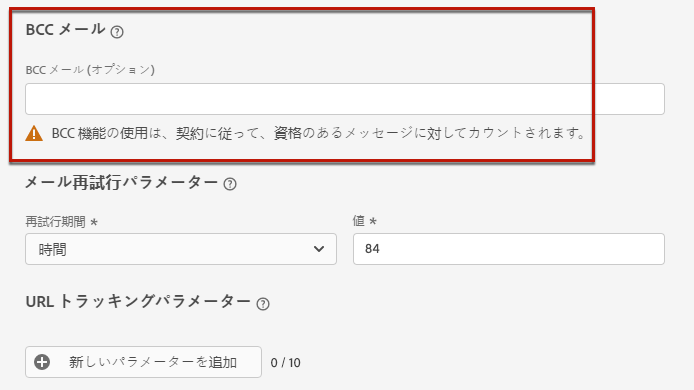
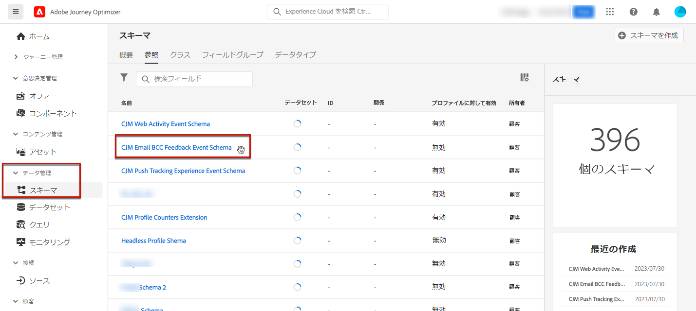
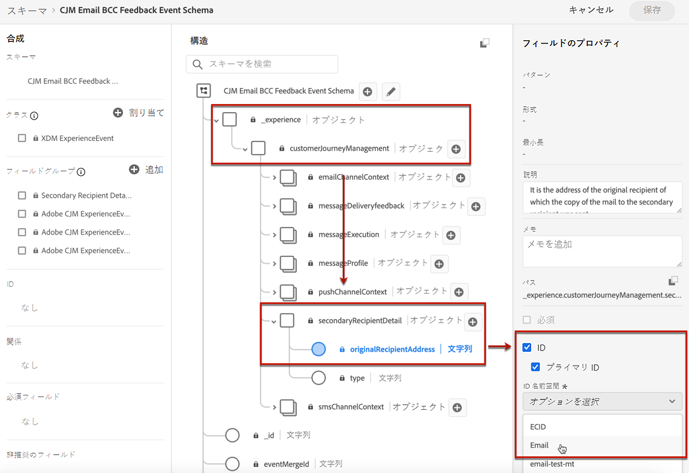

# メール設定 {#email-settings}

メッセージプリセット設定の専用のセクションで電子メール設定を定義します。 メッセージプリセットを [この節](message-presets.md).


## メールのタイプ {#email-type}

>[!CONTEXTUALHELP]
>id="ajo_admin_presets_emailtype"
>title="電子メールカテゴリの定義"
>abstract="このプリセットを使用する際に送信されるメッセージのタイプを選択します。ユーザーの同意が必要なプロモーションメッセージ用の「マーケティング」または、特定のコンテキストで購読解除済みのプロファイルにも送信できる非商用メッセージ用の「トランザクション」です。"

「**メールのタイプ**」セクションで、プリセットと共に送信されるメッセージのタイプ（「**マーケティング**」または「**トランザクション**」）を選択します。

* プロモーションメッセージの場合は、「**マーケティング**」を選択します。これらのメッセージにはユーザーの同意が必要です。

* 注文確認、パスワードリセット通知、配信情報など、非商用メッセージの場合は、「**トランザクション**」を選択します。

>[!CAUTION]
>
>**トランザクション**&#x200B;メッセージは、アドビからのお知らせで購読を解除したプロファイルに送信できます。これらのメッセージは、特定のコンテキストでのみ送信できます。

[メッセージの作成](../messages/get-started-content.md#create-new-message)時に、メッセージに対して選択したカテゴリに一致する有効なメッセージプリセットを選択する必要があります。

## サブドメインおよび IP プール {#subdomains-and-ip-pools}

「**サブドメインおよび IP プールの詳細**」セクションでは、以下を実行する必要があります。

1. メールの送信に使用するサブドメインを選択します。[詳細情報](about-subdomain-delegation.md)

1. プリセットに関連付ける IP プールを選択します。[詳細情報](ip-pools.md)


選択した IP プールが[編集中](ip-pools.md#edit-ip-pool)（**[!UICONTROL 処理中]**&#x200B;ステータス）で、選択したサブドメインに関連付けられていない場合は、プリセットの作成を続行できません。それ以外の場合は、IP プール／サブドメインの関連付けの最も古いバージョンが引き続き使用されます。その場合は、プリセットをドラフトとして保存し、IP プールが&#x200B;**[!UICONTROL 成功]**&#x200B;ステータスになったら再試行します。

>[!NOTE]
>
>非実稼動環境の場合、アドビは、標準のテストサブドメインの作成や、共有送信 IP プールへのアクセスを許可しません。[独自のサブドメインをデリゲート](delegate-subdomain.md)して、組織に割り当てられたプールの IP を使用する必要があります。

## List-Unsubscribe {#list-unsubscribe}

リストの[サブドメインの選択](#subdomains-and-ip-pools)から、「**[!UICONTROL List-Unsubscribe を有効にする]**」オプションが表示されます。


このオプションは、デフォルトでは有効になっています。

有効にしたままにすると、次のような登録解除リンクが電子メールヘッダーに自動的に含まれます。


このオプションを無効にした場合、電子メールヘッダーに登録解除リンクは表示されません。

登録解除リンクは、次の 2 つの要素で構成されます。

* すべての登録解除リクエストの送信先となる&#x200B;**登録解除メールアドレス**。

   [!DNL Journey Optimizer] の場合、登録解除の電子メールアドレスは、[選択したサブドメイン](#subdomains-and-ip-pools)に基づいてメッセージプリセットに表示されるデフォルトの&#x200B;**[!UICONTROL 宛先（登録解除）]**&#x200B;アドレスです。

   

* 購読解除後にユーザーがリダイレクトされるランディングページの URL である&#x200B;**登録解除 URL**。

   [ワンクリックオプトアウトリンク](../messages/consent.md#one-click-opt-out)をこのプリセットを使用して作成されたメッセージに加える場合、登録解除 URL は、ワンクリックオプトアウトリンク用に定義された URL になります。

   

   >[!NOTE]
   >
   >メッセージコンテンツにワンクリックオプトアウトリンクを追加しない場合、ユーザーにランディングページは表示されません。

メッセージにヘッダー登録解除リンクを追加する方法について詳しくは、[この節](../messages/consent.md#unsubscribe-header)を参照してください。

<!--Select the **[!UICONTROL Custom List-Unsubscribe]** option to enter your own Unsubscribe URL and/or your own Unsubscribe email address.(to add later)-->

## ヘッダーパラメーター{#email-header}

「**[!UICONTROL ヘッダーパラメーター]**」セクションでは、そのプリセットを使用して送信されるメッセージのタイプに関連付けられた送信者の名前とメールアドレスを入力します。

>[!CAUTION]
>
>これらのメールアドレスでは、現在選択されている[デリゲートされたサブドメイン](about-subdomain-delegation.md)を使用する必要があります。

* **[!UICONTROL 送信者名]**：送信者の名前（会社のブランド名など）。

* **[!UICONTROL 送信者のメール]**：コミュニケーションに使用するメールアドレス。例えば、デリゲートされたサブドメインが *marketing.luma.com* の場合は、*contact@marketing.luma.com* を使用できます。

* **[!UICONTROL 返信先（名前）]**：受信者がメールクライアントソフトウェアの「**返信**」ボタンをクリックしたときに使用する名前。

* **[!UICONTROL 返信先（メール）]**：受信者がメールクライアントソフトウェアの「**返信**」ボタンをクリックしたときに使用するメールアドレス。デリゲートされたサブドメインに定義されたアドレス（例：*reply@marketing.luma.com*）を使用する必要があります。このアドレスを使用していないメールは破棄されます。

* **[!UICONTROL エラーメール]**：メールを配信してから数日後に ISP で発生したすべてのエラー（非同期バウンス）は、このアドレスで受信されます。


>[!NOTE]
>
>アドレスは、文字（A ～ Z）で始まる必要があり、英数字のみを使用できます。アンダースコア（`_`）、ドット（`.`）、ハイフン（`-`）も使用できます。

### メールを転送 {#forward-email}

特定の電子メールアドレスに転送する場合は、 [!DNL Journey Optimizer] デリゲートされたサブドメインについては、Adobeカスタマーケアにお問い合わせください。 以下を指定する必要があります。

* 選択した転送メールアドレス。 転送メールアドレスドメインは、ドメインにデリゲートされたサブドメインと一致しないことに注意してください。Adobe
* サンドボックス名。
* 転送メールアドレスを使用するプリセット名。
* 現在の **[!UICONTROL 返信先（E メール）]** アドレスがプリセットレベルで設定されました。

>[!NOTE]
>
>サブドメインごとに 1 つの転送メールアドレスのみ指定できます。 その結果、複数のプリセットが同じサブドメインを使用する場合は、それらすべてに対して同じ転送用電子メールアドレスを使用する必要があります。

転送メールアドレスはAdobeが設定します。 これには 3 ～ 4 日かかる場合があります。

<!--
## BCC email {#bcc-email}

>[!CONTEXTUALHELP]
>id="ajo_admin_preset_bcc"
>title="Define a BCC email address"
>abstract="You can keep a copy of sent emails by sending them to a BCC inbox. Enter the email address of your choice so that every email sent is blind-copied to this BCC address. This feature is optional."

You can send an identical copy (or blind carbon copy) of an email sent by [!DNL Journey Optimizer] to a BCC inbox. This optional feature allows you to retain copies of email communications you send to your users for compliance and/or archival purposes. This will be invisible to the delivery recipients.

>[!CAUTION]
>
>This capability will be available starting **May, 31**.

### Enable BCC email {#enable-bcc}

To enable the **[!UICONTROL BCC email]** option, enter the email address of your choice in the dedicated field. You can specify any external address in correct format, except an email address defined on the delegated subdomain. For example, if the delegated subdomain is *marketing.luma.com*, any address like *abc@marketing.luma.com* is prohibited.

>[!NOTE]
>
>You can only define one BCC email address. Make sure the BCC address has enough reception capacity to store all the emails that are sent using the current preset.
>
>More recommendations are listed in [this section](#bcc-recommendations-limitations).



All email messages using this preset will be blind-copied to the BCC email address you entered. From there, they can be processed and archived using an external system.

>[!CAUTION]
>
>Your BCC feature usage will be counted against the number of messages you are licensed for. Hence, only enable it in the presets used for critical communications that you wish to archive. Check your contract for licensed volumes.

The BCC email address setting is immediately saved and processed at the preset level. When you [create a new message](../messages/get-started-content.md#create-new-message) using this preset, the BCC email address is automatically displayed.


However, the BCC address gets picked up for sending communications following the logic below:

* For batch and burst journeys, it does not apply to batch or burst execution that had already started before the BCC setting is made. The change will be picked up at the next recurrence or new execution.

* For transactional messages, the change is picked up immediately for the next communication (up to one minute delay).

>[!NOTE]
>
>You do not need to republish a message or journey for the BCC setting to be picked up.

### Recommendations and limitations {#bcc-recommendations-limitations}

* To ensure your privacy compliance, BCC emails must be processed by an archiving system capable of storing securely personally identifiable information (PII).

* As messages can contain sensitive or private data, such as personally identifiable information (PII), make sure the BCC address is correct, and secure the access to messages.

* Your inbox used for BCC should be properly managed for space and delivery. If the inbox returns bounces, some emails may not be received and therefore will fail to get archived.

* Messages may be delivered to the BCC email address before the target recipients. BCC messages can also been sent even though the original messages may have [bounced](../reports/suppression-list.md#delivery-failures).

    //////OR: Only successfully sent emails are taken in account. [Bounces](../reports/suppression-list.md#delivery-failures) are not. TO CHECK /////////

* Do not open or click through the emails sent to the BCC address as it is taken into account in the total opens and clicks from the send analysis, which could cause some miscalculations in [reports](../reports/message-monitoring.md). 

* Do not mark messages as spam in the BCC inbox, as it will impact all the other emails sent to this address.


>[!CAUTION]
>
>Do not click the unsubscribe link in the emails sent to the BCC address as you will immediately unsubscribe the corresponding recipients.

### GDPR compliance {#gdpr-compliance}

Regulations such as GDPR state that Data Subjects should be able to modify their consent at any time. Because the BCC emails you are sending with Journey Optimizer include securely personally identifiable information (PII), you must edit the **[!UICONTROL CJM Email BCC Feedback Event Schema]** to be able to manage these PII in compliance with GDPR and similar regulations.

To do this, follow the steps below.

1. Go to **[!UICONTROL Data management]** > **[!UICONTROL Schemas]** > **[!UICONTROL Browse]** and select **[!UICONTROL CJM Email BCC Feedback Event Schema]**.

    

1. Click to expand **[!UICONTROL _experience]**, **[!UICONTROL customerJourneyManagment]** then **[!UICONTROL secondaryRecipientDetail]**.

1. Select **[!UICONTROL originalRecipientAddress]**.

1. In the **[!UICONTROL Field properties]** on the right, scroll down to the **[!UICONTROL Identity]** checkbox.

1. Select it and also select **[!UICONTROL Primary identity]**.

1. Select a namespace from the drop-down list.

    

1. Click **[!UICONTROL Apply]**.

>[!NOTE]
>
>Learn more on managing Privacy and the applicable regulations in the [Experience Platform documentation](https://experienceleague.adobe.com/docs/experience-platform/privacy/home.html){target="_blank"}.

### BCC reporting data {#bcc-reporting}

Reporting as such on BCC is not available in the journey and message reports. However, information is stored on a system dataset called **[!UICONTROL AJO BCC Feedback Event Dataset]**. You can run queries against this dataset to find useful information for debugging purpose for example.

You can access this dataset through the user interface. Select **[!UICONTROL Data management]** > **[!UICONTROL Datasets]** > **[!UICONTROL Browse]** and enable the **[!UICONTROL Show system datasets]** toggle from the filter to display the system-generated datasets. Learn more on how to access datasets in [this section](../start/get-started-datasets.md#access-datasets).


To run queries against this dataset, you can use the Query Editor provided by the [Adobe Experience Platform Query Service](https://experienceleague.adobe.com/docs/experience-platform/query/api/getting-started.html){target="_blank"}. To access it, select **[!UICONTROL Data management]** > **[!UICONTROL Queries]** and click **[!UICONTROL Create query]**. [Learn more](../start/get-started-queries.md)


Depending on what information you are looking for, you can run the following queries.

1. For all the other queries below, you will need the journey action ID. Run this query to fetch all action IDs associated with a particular journey version ID within the last 2 days:

        ```
        SELECT
        DISTINCT
        CAST(TIMESTAMP AS DATE) AS EventTime,
        _experience.journeyOrchestration.stepEvents.journeyVersionID,
        _experience.journeyOrchestration.stepEvents.actionName, 
        _experience.journeyOrchestration.stepEvents.actionID 
        FROM journey_step_events 
        WHERE 
        _experience.journeyOrchestration.stepEvents.journeyVersionID = '<journey version id>' AND 
        _experience.journeyOrchestration.stepEvents.actionID is not NULL AND 
        TIMESTAMP > NOW() - INTERVAL '2' DAY 
        ORDER BY EventTime DESC;
        ```

    >[!NOTE]
    >
    >To get the `<journey version id>`parameter, select the corresponding [journey version](../building-journeys/journey-versions.md) from the **[!UICONTROL Journey management]** > **[!UICONTROL Journeys]** menu. The journey version ID is displayed at the end of the URL displayed in your web browser.
    >
    >

1. Run this query to fetch all message feedback events (especially feedback status) generated for a particular message targeted to a specific user within the last 2 days:

        ```
        SELECT  
        _experience.customerJourneyManagement.messageExecution.journeyVersionID AS JourneyVersionID, 
        _experience.customerJourneyManagement.messageExecution.journeyActionID AS JourneyActionID, 
        timestamp AS EventTime, 
        _experience.customerJourneyManagement.emailChannelContext.address AS RecipientAddress, 
        _experience.customerjourneymanagement.messagedeliveryfeedback.feedbackStatus AS FeedbackStatus,
        CASE _experience.customerjourneymanagement.messagedeliveryfeedback.feedbackStatus
            WHEN 'sent' THEN 'Sent'
            WHEN 'delay' THEN 'Retry'
            WHEN 'out_of_band' THEN 'Bounce' 
            WHEN 'bounce' THEN 'Bounce'
        END AS FeedbackStatusCategory
        FROM cjm_message_feedback_event_dataset 
        WHERE  
            timestamp > now() - INTERVAL '2' day  AND
            _experience.customerJourneyManagement.messageExecution.journeyVersionID = '<journey version id>' AND 
            _experience.customerJourneyManagement.messageExecution.journeyActionID = '<journey action id>' AND  
            _experience.customerJourneyManagement.emailChannelContext.address = '<recipient email address>'
            ORDER BY EventTime DESC;
        ```

    >[!NOTE]
    >
    >To get the `<journey action id>` parameter, run the first query described above using the journey version id. The `<recipient email address>` parameter is the targeted or actual recipient's email address.

1. Run this query to fetch all BCC message feedback events generated for a particular message targeted to a specific user within the last 2 days:

    ```
    SELECT   
    _experience.customerJourneyManagement.messageExecution.journeyVersionID AS JourneyVersionID, 
    _experience.customerJourneyManagement.messageExecution.journeyActionID AS JourneyActionID, 
    _experience.customerJourneyManagement.emailChannelContext.address AS BccEmailAddress,
    timestamp AS EventTime, 
    _experience.customerJourneyManagement.secondaryRecipientDetail.originalRecipientAddress AS RecipientAddress, 
    _experience.customerjourneymanagement.messagedeliveryfeedback.feedbackStatus AS FeedbackStatus,
    CASE _experience.customerjourneymanagement.messagedeliveryfeedback.feedbackStatus
                WHEN 'sent' THEN 'Sent'
                WHEN 'delay' THEN 'Retry'
                WHEN 'out_of_band' THEN 'Bounce' 
                WHEN 'bounce' THEN 'Bounce'
            END AS FeedbackStatusCategory 
    FROM ajo_bcc_feedback_event_dataset  
    WHERE  
    timestamp > now() - INTERVAL '2' day  AND
    _experience.customerJourneyManagement.messageExecution.journeyVersionID = '<journey version id>' AND 
    _experience.customerJourneyManagement.messageExecution.journeyActionID = '<journeyaction id>' AND 
    _experience.customerJourneyManagement.secondaryRecipientDetail.originalRecipientAddress = '<recipient email address>'
    ORDER BY EventTime DESC;
    ```

1. Run this query to fetch all recipient addresses who have not received the message whereas its BCC entry exists within the last 30 days:

    ```
    SELECT
        DISTINCT 
    bcc._experience.customerJourneyManagement.secondaryRecipientDetail.originalRecipientAddress AS RecipientAddressesNotRecievedMessage
    FROM ajo_bcc_feedback_event_dataset bcc
    LEFT JOIN cjm_message_feedback_event_dataset mfe
    ON 
   bcc._experience.customerJourneyManagement.messageExecution.journeyVersionID =
            mfe._experience.customerJourneyManagement.messageExecution.journeyVersionID AND    bcc._experience.customerJourneyManagement.messageExecution.journeyActionID = mfe._experience.customerJourneyManagement.messageExecution.journeyActionID AND 
   bcc._experience.customerJourneyManagement.secondaryRecipientDetail.originalRecipientAddress = mfe._experience.customerJourneyManagement.emailChannelContext.address AND
   mfe._experience.customerJourneyManagement.messageExecution.journeyVersionID = '<journey version id>' AND 
   mfe._experience.customerJourneyManagement.messageExecution.journeyActionID = '<journey action id>' AND
   mfe.timestamp > now() - INTERVAL '30' DAY AND
   mfe._experience.customerjourneymanagement.messagedeliveryfeedback.feedbackstatus IN ('bounce', 'out_of_band') 
    WHERE bcc.timestamp > now() - INTERVAL '30' DAY;
    ```
-->

## メールの再試行パラメーター {#email-retry}

>[!CONTEXTUALHELP]
>id="ajo_admin_presets_retryperiod"
>title="再試行期間の調整"
>abstract="一時的なソフトバウンスエラーが原因で電子メールメッセージが失敗した場合は、3.5 日間（84 時間）再試行が実行されます。このデフォルトの再試行期間は、ニーズに合わせて調整できます。"
>additional-url="https://experienceleague.adobe.com/docs/journey-optimizer/using/configuration/configuration-message/email-configuration/monitor-reputation/retries.html?lang=ja" text="再試行について"

**メールの再試行パラメーター**&#x200B;を設定できます。


デフォルトでは、[再試行期間](retries.md#retry-duration)は 84 時間に設定されていますが、必要に応じてこの設定を調整できます。

次の範囲内の整数値（時間または分）を入力する必要があります。

* マーケティングメールの場合、再試行期間の下限は 6 時間です。
* トランザクションメールの場合、再試行期間の下限は 10 分です。
* どちらのメールタイプでも、再試行期間の上限は 84 時間（5040 分）です。

再試行の詳細については、[この節](retries.md)を参照してください。

## URL トラッキング {#url-tracking}

>[!CONTEXTUALHELP]
>id="ajo_admin_preset_utm"
>title="URL トラッキングパラメーター"
>abstract="このセクションを使用して、E メールコンテンツに存在するキャンペーン URL にトラッキングパラメーターを自動的に追加します。"

以下を使用できます。 **[!UICONTROL URL トラッキングパラメーター]** チャネルをまたいでマーケティング活動の効果を測定する。 この機能は のオプションです。


このセクションで定義されたパラメーターは、E メールメッセージコンテンツに含まれる URL の末尾に追加されます。 その後、これらのパラメーターをAdobe AnalyticsやGoogle Analyticsなどの Web 分析ツールで取得し、様々なパフォーマンスレポートを作成できます。


例として、3 つの URL トラッキングパラメーターがメッセージプリセットの作成時に自動入力されます。 これらを編集し、を使用して最大 10 個のトラッキングパラメーターを追加できます。 **[!UICONTROL 新しいパラメーターを追加]** 」ボタンをクリックします。

URL トラッキングパラメーターを設定するには、目的の値を **[!UICONTROL 名前]** および **[!UICONTROL 値]** フィールドを選択するか、次のオブジェクトに移動して、事前定義済みの値のリストから選択します。

* ジャーニー属性：**ソース ID**、**ソース名**、**ソースバージョン ID**
* アクション属性： **アクション ID**, **アクション名**
* Offer Decisioning 属性：**オファー ID**、**オファー名**


>[!CAUTION]
>
>フォルダーは選択しないでください：必要なフォルダーを参照し、トラッキングパラメーター値として使用するプロファイル属性を選択します。

以下に、Adobe AnalyticsとGoogle Analytics互換 URL の例を示します。

* Adobe Analytics互換 URL: `www.YourLandingURL.com?cid=email_AJO_{{context.system.source.id}}_image_{{context.system.source.name}}`

* Google Analytics互換 URL: `www.YourLandingURL.com?utm_medium=email&utm_source=AJO&utm_campaign={{context.system.source.id}}&utm_content=image`

>[!NOTE]
>
>テキスト値の入力と、事前定義された値の選択を組み合わせることができます。各&#x200B;**[!UICONTROL 値]**&#x200B;フィールドには、合計 255 文字まで入力できます。
