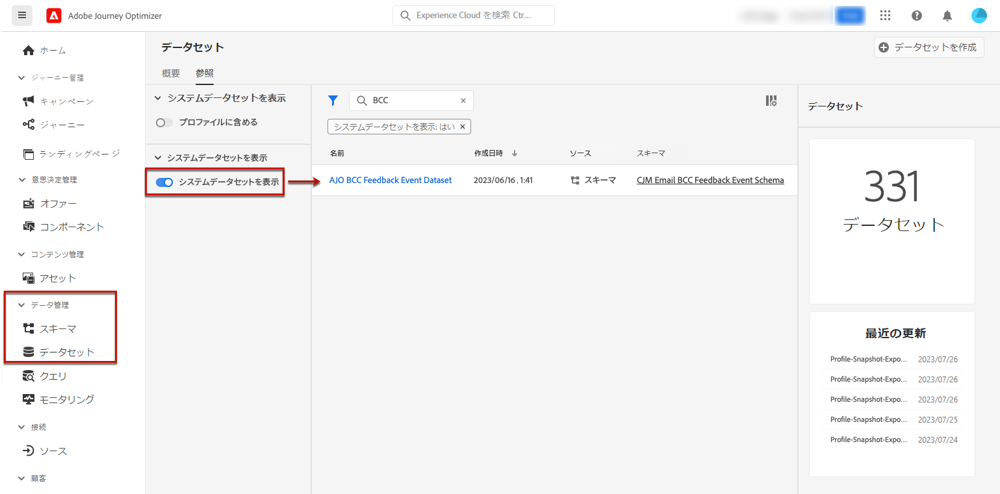
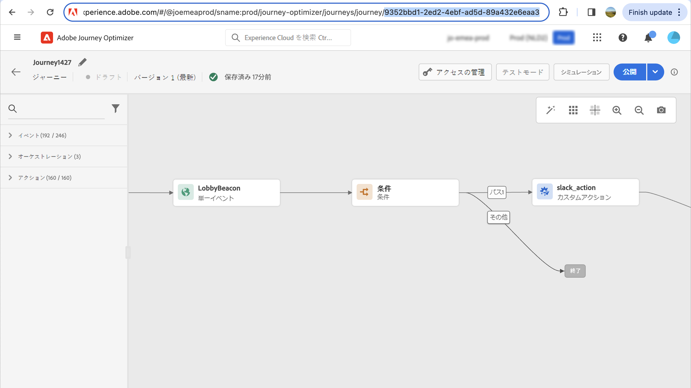

# メール設定 {#email-settings}

メッセージプリセット設定の専用のセクションで電子メール設定を定義します。 メッセージプリセットを [この節](message-presets.md).


## メールのタイプ {#email-type}

>[!CONTEXTUALHELP]
>id="ajo_admin_presets_emailtype"
>title="電子メールカテゴリの定義"
>abstract="このプリセットを使用する際に送信されるメッセージのタイプを選択します。ユーザーの同意が必要なプロモーションメッセージ用の「マーケティング」または、特定のコンテキストで購読解除済みのプロファイルにも送信できる非商用メッセージ用の「トランザクション」です。"

「**メールのタイプ**」セクションで、プリセットと共に送信されるメッセージのタイプ（「**マーケティング**」または「**トランザクション**」）を選択します。

* プロモーションメッセージの場合は、「**マーケティング**」を選択します。これらのメッセージにはユーザーの同意が必要です。

* 注文確認、パスワードリセット通知、配信情報など、非商用メッセージの場合は、「**トランザクション**」を選択します。

>[!CAUTION]
>
>**トランザクション**&#x200B;メッセージは、アドビからのお知らせで購読を解除したプロファイルに送信できます。これらのメッセージは、特定のコンテキストでのみ送信できます。

[メッセージの作成](../messages/get-started-content.md#create-new-message)時に、メッセージに対して選択したカテゴリに一致する有効なメッセージプリセットを選択する必要があります。

## サブドメインおよび IP プール {#subdomains-and-ip-pools}

「**サブドメインおよび IP プールの詳細**」セクションでは、以下を実行する必要があります。

1. メールの送信に使用するサブドメインを選択します。[詳細](about-subdomain-delegation.md)

1. プリセットに関連付ける IP プールを選択します。[詳細](ip-pools.md)


選択した IP プールが以下の場合は、プリセットの作成を続行できません [版](ip-pools.md#edit-ip-pool) (**[!UICONTROL 処理中]** ステータス ) との間に存在し、選択したサブドメインに関連付けられていない。 それ以外の場合は、IP プール/サブドメインの関連付けの最も古いバージョンが引き続き使用されます。 その場合は、プリセットをドラフトとして保存し、IP プールに **[!UICONTROL 成功]** ステータス。

>[!NOTE]
>
>非実稼動環境の場合、アドビは、標準のテストサブドメインの作成や、共有送信 IP プールへのアクセスを許可しません。[独自のサブドメインをデリゲート](delegate-subdomain.md)して、組織に割り当てられたプールの IP を使用する必要があります。

## List-Unsubscribe {#list-unsubscribe}

リストの[サブドメインの選択](#subdomains-and-ip-pools)から、「**[!UICONTROL List-Unsubscribe を有効にする]**」オプションが表示されます。


このオプションは、デフォルトでは有効になっています。

有効にしたままにすると、次のような登録解除リンクが電子メールヘッダーに自動的に含まれます。


このオプションを無効にした場合、電子メールヘッダーに登録解除リンクは表示されません。

登録解除リンクは、次の 2 つの要素で構成されます。

* すべての登録解除リクエストの送信先となる&#x200B;**登録解除メールアドレス**。

   [!DNL Journey Optimizer] の場合、登録解除の電子メールアドレスは、[選択したサブドメイン](#subdomains-and-ip-pools)に基づいてメッセージプリセットに表示されるデフォルトの&#x200B;**[!UICONTROL 宛先（登録解除）]**&#x200B;アドレスです。

   

* 購読解除後にユーザーがリダイレクトされるランディングページの URL である&#x200B;**登録解除 URL**。

   [ワンクリックオプトアウトリンク](../messages/consent.md#one-click-opt-out)をこのプリセットを使用して作成されたメッセージに加える場合、登録解除 URL は、ワンクリックオプトアウトリンク用に定義された URL になります。

   

   >[!NOTE]
   >
   >メッセージコンテンツにワンクリックオプトアウトリンクを追加しない場合、ユーザーにランディングページは表示されません。

メッセージにヘッダー登録解除リンクを追加する方法について詳しくは、[この節](../messages/consent.md#unsubscribe-header)を参照してください。

<!--Select the **[!UICONTROL Custom List-Unsubscribe]** option to enter your own Unsubscribe URL and/or your own Unsubscribe email address.(to add later)-->

## ヘッダーパラメーター{#email-header}

「**[!UICONTROL ヘッダーパラメーター]**」セクションでは、そのプリセットを使用して送信されるメッセージのタイプに関連付けられた送信者の名前とメールアドレスを入力します。

>[!CAUTION]
>
>これらのメールアドレスでは、現在選択されている[デリゲートされたサブドメイン](about-subdomain-delegation.md)を使用する必要があります。

* **[!UICONTROL 送信者名]**：送信者の名前（会社のブランド名など）。

* **[!UICONTROL 送信者のメール]**：コミュニケーションに使用するメールアドレス。例えば、デリゲートされたサブドメインが *marketing.luma.com* の場合は、*contact@marketing.luma.com* を使用できます。

* **[!UICONTROL 返信先（名前）]**：受信者がメールクライアントソフトウェアの「**返信**」ボタンをクリックしたときに使用する名前。

* **[!UICONTROL 返信先（メール）]**：受信者がメールクライアントソフトウェアの「**返信**」ボタンをクリックしたときに使用するメールアドレス。デリゲートされたサブドメインに定義されたアドレス（例：*reply@marketing.luma.com*）を使用する必要があります。このアドレスを使用していないメールは破棄されます。

* **[!UICONTROL エラーメール]**：メールを配信してから数日後に ISP で発生したすべてのエラー（非同期バウンス）は、このアドレスで受信されます。


>[!NOTE]
>
>アドレスは、文字（A ～ Z）で始まる必要があり、英数字のみを使用できます。アンダースコア（`_`）、ドット（`.`）、ハイフン（`-`）も使用できます。

### メールを転送 {#forward-email}

特定の電子メールアドレスに転送する場合は、 [!DNL Journey Optimizer] デリゲートされたサブドメインについては、Adobeカスタマーケアにお問い合わせください。 以下を指定する必要があります。

* 選択した転送メールアドレス。 転送メールアドレスドメインは、ドメインにデリゲートされたサブドメインと一致しないことに注意してください。Adobe
* サンドボックス名。
* 転送メール（「返信先」）アドレスを使用するプリセット名です。
* 現在の **[!UICONTROL 返信先（E メール）]** アドレスがプリセットレベルで設定されました。

>[!NOTE]
>
>サブドメインごとに 1 つの転送メールアドレスのみ指定できます。 その結果、複数のプリセットが同じサブドメインを使用する場合は、それらすべてに対して同じ転送用電子メールアドレスを使用する必要があります。

転送メールアドレスはAdobeが設定します。 これには 3 ～ 4 日かかる場合があります。

## BCC 電子メール {#bcc-email}

>[!CONTEXTUALHELP]
>id="ajo_admin_preset_bcc"
>title="BCC 電子メールアドレスを定義"
>abstract="BCC 受信トレイに送信することで、送信済み E メールのコピーを保持できます。 送信されたすべての電子メールがこの BCC アドレスにブラインドコピーされるように、目的の電子メールアドレスを入力します。 この機能は のオプションです。
"

から送信された E メールの同一のコピー（またはブラインドカーボンコピー）を送信できます [!DNL Journey Optimizer] を BCC インボックスに追加します。 このオプション機能を使用すると、コンプライアンスやアーカイブの目的でユーザーに送信する電子メール通信のコピーを保持できます。 これは、配信の受信者には表示されません。

### BCC 電子メールの有効化 {#enable-bcc}

を有効にするには、以下を実行します。 **[!UICONTROL BCC 電子メール]** 」オプションの上にマウスポインターを置き、該当するフィールドに選択した E メールアドレスを入力します。 デリゲートされたサブドメインで定義された E メールアドレスを除き、任意の外部アドレスを正しい形式で指定できます。 例えば、デリゲートされたサブドメインが *marketing.luma.com* の場合、*abc@marketing.luma.com* のようなアドレスは禁止されます。

>[!NOTE]
>
>BCC 電子メールアドレスは 1 つだけ定義できます。 現在のプリセットを使用して送信されるすべての電子メールを保存するのに十分な受信容量が BCC アドレスにあることを確認します。


このプリセットを使用するすべての電子メールメッセージは、入力した BCC 電子メールアドレスにブラインドコピーされます。 ここから、外部システムを使用して処理およびアーカイブできます。

>[!CAUTION]
>
>BCC 機能の使用状況は、ライセンスを受けたメッセージの数に対してカウントされます。 したがって、アーカイブする重要な通信に使用されるプリセット内でのみ有効にします。 契約書でライセンスを取得したボリュームを確認します。

BCC 電子メールアドレスの設定は、事前設定されたレベルで直ちに保存および処理されます。 次の場合： [新しいメッセージを作成](../messages/get-started-content.md#create-new-message) このプリセットを使用すると、BCC 電子メールアドレスが自動的に表示されます。


ただし、BCC アドレスは、次のロジックに従って通信を送信するために取得されます。

* バッチジャーニーとバーストジャーニーの場合、BCC 設定がおこなわれる前に既に開始していたバッチ実行やバースト実行には適用されません。 変更は、次回の繰り返しまたは新しい実行時に取得されます。

* トランザクションメッセージの場合、変更は次の通信で直ちに取得されます（1 分以内）。

>[!NOTE]
>
>BCC 設定を取得するために、メッセージやジャーニーを再公開する必要はありません。

### Recommendationsと限界 {#recommendations-limitations}

* BCC 電子メールアドレスが正しく設定されていることを確認します。 該当しない場合、クライアントの個人を特定できる情報 (PII) が不要なアドレスに送信される可能性があります。

* プライバシー上の理由から、BCC電子メールは、個人の身元を特定できる情報(PII)を安全に保存できるアーカイブシステムで処理する必要があります。

* この機能は、受信者に配信する前に BCC 電子メールアドレスに配信される可能性があり、元の配信に含まれている場合でも BCC メッセージが送信される可能性があります [バウンス](../reports/suppression-list.md#delivery-failures).

   <!--OR: Only successfully sent emails are taken in account. [Bounces](../reports/suppression-list.md#delivery-failures) are not. TO CHECK -->

* BCC アドレスに送信された電子メールが開封され、クリックされた場合は、送信分析からの合計開封数とクリック数に考慮されます。これは、 [レポート](../reports/message-monitoring.md). 同様に、受信ボックスにランディングした BCC 電子メールをスパムとしてマークすると、電子メールが受信ボックスのスパムフォルダーに送られる可能性があります。

* BCC に使用するインボックスは、領域と配信に対して適切に管理される必要があります。 インボックスがバウンスを返した場合、一部の E メールが受信されないので、アーカイブに失敗します。

>[!CAUTION]
>
>BCC アドレスに送信される E メールの配信停止リンクをクリックするのを避けます。対応する受信者を直ちに配信停止にするからです。

### GDPR への準拠 {#gdpr-compliance}

GDPR などの規制では、データ主体はいつでも同意を変更できると規定されています。 Journey Optimizerで送信する BCC 電子メールには、安全に個人を特定できる情報 (PII) が含まれているので、 **[!UICONTROL CJM 電子メール BCC フィードバックイベントスキーマ]** を使用すれば、GDPR や同様の規制に準拠してこれらの PII を管理できます。

それには、次の手順に従います。

1. に移動します。 **[!UICONTROL データ管理]** > **[!UICONTROL スキーマ]** > **[!UICONTROL 参照]** を選択し、 **[!UICONTROL CJM 電子メール BCC フィードバックイベントスキーマ]**.

   

1. クリックして展開 **[!UICONTROL _experience]**, **[!UICONTROL customerJourneyManagement]** その後 **[!UICONTROL secondaryRecipientDetail]**.

1. 選択 **[!UICONTROL originalRecipientAddress]**.

1. 内 **[!UICONTROL フィールドプロパティ]** 右側で、 **[!UICONTROL ID]** チェックボックス。

1. 選択し、「 」も選択します。 **[!UICONTROL プライマリID]**.

1. ドロップダウンリストから名前空間を選択します。

   

1. 「**[!UICONTROL 適用]**」をクリックします。

>[!NOTE]
>
>プライバシーの管理と適用される法規制について詳しくは、[Experience Platform のドキュメント](https://experienceleague.adobe.com/docs/experience-platform/privacy/home.html?lang=ja){target=&quot;_blank&quot;}を参照してください。

### BCC レポートデータ {#bcc-reporting}

BCC に関するようなレポートは、ジャーニーレポートとメッセージレポートでは使用できません。 ただし、情報は、 **[!UICONTROL AJO BCC フィードバックイベントデータセット]**. このデータセットに対してクエリを実行すると、デバッグ目的などに役立つ情報を見つけることができます。

このデータセットには、ユーザーインターフェイスからアクセスできます。 選択 **[!UICONTROL データ管理]** > **[!UICONTROL データセット]** > **[!UICONTROL 参照]** また、 **[!UICONTROL システムデータセットを表示]** フィルターを切り替えて、システム生成データセットを表示します。 でデータセットにアクセスする方法の詳細 [この節](../start/get-started-datasets.md#access-datasets).



このデータセットに対してクエリを実行するには、 [Adobe Experience Platform Query Service](https://experienceleague.adobe.com/docs/experience-platform/query/api/getting-started.html?lang=ja){target=&quot;_blank&quot;}。 アクセスするには、 **[!UICONTROL データ管理]** > **[!UICONTROL クエリ]** をクリックし、 **[!UICONTROL クエリを作成]**. [詳細情報](../start/get-started-queries.md)


どの情報を探しているかに応じて、次のクエリを実行できます。

1. 以下に示すその他すべてのクエリには、ジャーニーアクション ID が必要です。 このクエリを実行して、過去 2 日間に特定のジャーニーバージョン ID に関連付けられたすべてのアクション ID を取得します。

       &quot;&#39;
       選択
       DISTINCT
       CAST(TIMESTAMP AS DATE) AS EventTime,
       _experience.journeyOrchestration.stepEvents.journeyVersionID,
       _experience.journeyOrchestration.stepEvents.actionName,
       _experience.journeyOrchestration.stepEvents.actionID
       FROM journey_step_events
       ここで、
       _experience.journeyOrchestration.stepEvents.journeyVersionID = &#39;&lt;journey version=&quot;&quot; id=&quot;&quot;>&#39;および
       _experience.journeyOrchestration.stepEvents.actionID が NULL ではなく、
       TIMESTAMP > NOW() — 間隔&#39;2&#39;日
       ORDER BY EventTime DESC;
       &quot;&#39;
   
   >[!NOTE]
   >
   >次の手順で `<journey version id>`パラメーターを選択し、 [ジャーニーバージョン](../building-journeys/journey-versions.md) から **[!UICONTROL ジャーニー管理]** > **[!UICONTROL ジャーニー]** メニュー ジャーニーバージョン ID は、Web ブラウザーに表示される URL の末尾に表示されます。
   >
   >

1. このクエリを実行すると、過去 2 日間に特定のユーザーをターゲットとした特定のメッセージに対して生成されたすべてのメッセージフィードバックイベント（特にフィードバックステータス）が取得されます。

       &quot;&#39;
       選択
       _experience.customerJourneyManagement.messageExecution.journeyVersionID AS JourneyVersionID,
       _experience.customerJourneyManagement.messageExecution.journeyActionID AS JourneyActionID,
       timestamp AS EventTime,
       _experience.customerJourneyManagement.emailChannelContext.address AS RecipientAddress,
       _experience.customerjourneymanagement.messagedeliveryfeedback.feedbackStatus AS FeedbackStatus,
       CASE _experience.customerjourneymanagement.messagedeliveryfeedback.feedbackStatus
       「送信済み」の場合、「送信済み」
       WHEN &#39;delay&#39; THEN &#39;Retry&#39;
       WHEN &#39;out_of_band&#39; THEN &#39;Bounce&#39;
       「バウンス」の場合は「バウンス」
       END AS FeedbackStatusCategory
       FROM cjm_message_feedback_event_dataset
       ここで、
       timestamp > now() - INTERVAL &#39;2&#39;日 AND
       _experience.customerJourneyManagement.messageExecution.journeyVersionID = &#39;&lt;journey version=&quot;&quot; id=&quot;&quot;>&#39;および
       _experience.customerJourneyManagement.messageExecution.journeyActionID = &#39;&lt;journey action=&quot;&quot; id=&quot;&quot;>&#39;および
       _experience.customerJourneyManagement.emailChannelContext.address = &#39;&lt;recipient email=&quot;&quot; address=&quot;&quot;>&#39;
       ORDER BY EventTime DESC;
       &quot;&#39;
   
   >[!NOTE]
   >
   >次の手順で `<journey action id>` パラメーターを使用する場合は、上記の最初のクエリを、ジャーニーバージョン id を使用して実行します。 この `<recipient email address>` パラメーターは、ターゲットとなる、または実際の受信者の E メールアドレスです。

1. このクエリを実行して、過去 2 日間に特定のユーザーをターゲットとした特定のメッセージに対して生成されたすべての BCC メッセージフィードバックイベントを取得します。

   ```
   SELECT   
   _experience.customerJourneyManagement.messageExecution.journeyVersionID AS JourneyVersionID, 
   _experience.customerJourneyManagement.messageExecution.journeyActionID AS JourneyActionID, 
   _experience.customerJourneyManagement.emailChannelContext.address AS BccEmailAddress,
   timestamp AS EventTime, 
   _experience.customerJourneyManagement.secondaryRecipientDetail.originalRecipientAddress AS RecipientAddress, 
   _experience.customerjourneymanagement.messagedeliveryfeedback.feedbackStatus AS FeedbackStatus,
   CASE _experience.customerjourneymanagement.messagedeliveryfeedback.feedbackStatus
               WHEN 'sent' THEN 'Sent'
               WHEN 'delay' THEN 'Retry'
               WHEN 'out_of_band' THEN 'Bounce' 
               WHEN 'bounce' THEN 'Bounce'
           END AS FeedbackStatusCategory 
   FROM ajo_bcc_feedback_event_dataset  
   WHERE  
   timestamp > now() - INTERVAL '2' day  AND
   _experience.customerJourneyManagement.messageExecution.journeyVersionID = '<journey version id>' AND 
   _experience.customerJourneyManagement.messageExecution.journeyActionID = '<journeyaction id>' AND 
   _experience.customerJourneyManagement.secondaryRecipientDetail.originalRecipientAddress = '<recipient email address>'
   ORDER BY EventTime DESC;
   ```

1. このクエリを実行すると、過去 30 日以内に BCC エントリが存在するのに対し、メッセージを受信しなかったすべての受信者アドレスが取得されます。

   ```
   SELECT
       DISTINCT 
   bcc._experience.customerJourneyManagement.secondaryRecipientDetail.originalRecipientAddress AS RecipientAddressesNotRecievedMessage
   FROM ajo_bcc_feedback_event_dataset bcc
   LEFT JOIN cjm_message_feedback_event_dataset mfe
   ON 
   bcc._experience.customerJourneyManagement.messageExecution.journeyVersionID =
           mfe._experience.customerJourneyManagement.messageExecution.journeyVersionID AND    bcc._experience.customerJourneyManagement.messageExecution.journeyActionID = mfe._experience.customerJourneyManagement.messageExecution.journeyActionID AND 
   bcc._experience.customerJourneyManagement.secondaryRecipientDetail.originalRecipientAddress = mfe._experience.customerJourneyManagement.emailChannelContext.address AND
   mfe._experience.customerJourneyManagement.messageExecution.journeyVersionID = '<journey version id>' AND 
   mfe._experience.customerJourneyManagement.messageExecution.journeyActionID = '<journey action id>' AND
   mfe.timestamp > now() - INTERVAL '30' DAY AND
   mfe._experience.customerjourneymanagement.messagedeliveryfeedback.feedbackstatus IN ('bounce', 'out_of_band') 
   WHERE bcc.timestamp > now() - INTERVAL '30' DAY;
   ```

## メールの再試行パラメーター {#email-retry}

>[!CONTEXTUALHELP]
>id="ajo_admin_presets_retryperiod"
>title="再試行期間の調整"
>abstract="一時的なソフトバウンスエラーが原因で電子メールメッセージが失敗した場合は、3.5 日間（84 時間）再試行が実行されます。このデフォルトの再試行期間は、ニーズに合わせて調整できます。"
>additional-url="https://experienceleague.adobe.com/docs/journey-optimizer/using/configuration/configuration-message/email-configuration/monitor-reputation/retries.html?lang=ja" text="再試行について"

**メールの再試行パラメーター**&#x200B;を設定できます。


デフォルトでは、[再試行期間](retries.md#retry-duration)は 84 時間に設定されていますが、必要に応じてこの設定を調整できます。

次の範囲内の整数値（時間または分）を入力する必要があります。

* マーケティングメールの場合、再試行期間の下限は 6 時間です。
* トランザクションメールの場合、再試行期間の下限は 10 分です。
* どちらのメールタイプでも、再試行期間の上限は 84 時間（5040 分）です。

再試行の詳細については、[この節](retries.md)を参照してください。

## URL トラッキング {#url-tracking}

>[!CONTEXTUALHELP]
>id="ajo_admin_preset_utm"
>title="URL トラッキングパラメーター"
>abstract="このセクションを使用して、E メールコンテンツに存在するキャンペーン URL にトラッキングパラメーターを自動的に追加します。"

以下を使用できます。 **[!UICONTROL URL トラッキングパラメーター]** チャネルをまたいでマーケティング活動の効果を測定する。 この機能は のオプションです。


このセクションで定義されたパラメーターは、E メールメッセージコンテンツに含まれる URL の末尾に追加されます。 その後、これらのパラメーターをAdobe AnalyticsやGoogle Analyticsなどの Web 分析ツールで取得し、様々なパフォーマンスレポートを作成できます。


例として、3 つの URL トラッキングパラメーターがメッセージプリセットの作成時に自動入力されます。 これらを編集し、を使用して最大 10 個のトラッキングパラメーターを追加できます。 **[!UICONTROL 新しいパラメーターを追加]** 」ボタンをクリックします。

URL トラッキングパラメーターを設定するには、目的の値を **[!UICONTROL 名前]** および **[!UICONTROL 値]** フィールドを選択するか、次のオブジェクトに移動して、事前定義済みの値のリストから選択します。

* ジャーニー属性： **ソース ID**, **ソース名**, **ソースバージョン ID**
* アクション属性： **アクション ID**, **アクション名**
* Offer decisioning属性： **オファー ID**, **オファー名**


>[!CAUTION]
>
>フォルダーは選択しないでください：必要なフォルダーを参照し、トラッキングパラメーター値として使用するプロファイル属性を選択します。

以下に、Adobe AnalyticsとGoogle Analytics互換 URL の例を示します。

* Adobe Analytics互換 URL: `www.YourLandingURL.com?cid=email_AJO_{{context.system.source.id}}_image_{{context.system.source.name}}`

* Google Analytics互換 URL: `www.YourLandingURL.com?utm_medium=email&utm_source=AJO&utm_campaign={{context.system.source.id}}&utm_content=image`

>[!NOTE]
>
>テキスト値の入力と、事前定義された値の選択を組み合わせることができます。 各 **[!UICONTROL 値]** フィールドには、合計 255 文字まで入力できます。
