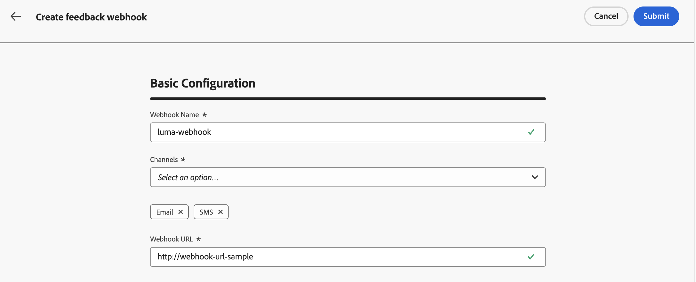

# API トリガーキャンペーン用のフィードバック Webhook の作成 {#webhooks}

フィードバック Webhook を使用すると、トランザクション API トリガーキャンペーンを通じて送信されたメッセージに対して、リアルタイムのステータス更新を受け取ることができます。Webhook を設定すると、配信の結果をシステムに直接自動的に受信できるようになり、監視、ログ記録、自動処理が可能になります。

Webhook 設定は、**[!UICONTROL 管理]**／**[!UICONTROL チャネル]**／**[!UICONTROL フィードバック Webhook 設定]**&#x200B;メニューから管理できます。


>[!NOTE]
>**組織 + サンドボックス**&#x200B;の組み合わせごとに、1 つの Webhook 設定のみが許可されます。

## フィードバック Webhook の作成

Webhook を作成するには、次の手順に従います。

1. **[!UICONTROL 管理]**／**[!UICONTROL チャネル]**／**[!UICONTROL フィードバック Webhook 設定]**&#x200B;に移動します。

1. 「**フィードバック Webhook を作成**」をクリックします。

1. 「**[!UICONTROL 基本設定]**」セクションで、次の詳細を指定します。

   

   * **Webhook 名** - Webhook を識別するわかりやすい名前を入力します。
   * **チャネル** – この Webhook がフィードバックを受信するチャネル（メールまたは SMS）を選択します。
   * **Webhook URL** - フィードバックイベントを配信する必要がある HTTPS エンドポイントを指定します。

1. 「**[!UICONTROL 認証]**」セクションで、認証方法を選択します。

   

   * **認証なし** - 認証ヘッダーは追加されません。
   * **JWT 認証** - エンドポイントで JWT 認証が必要な場合は、必要な詳細を指定します。

1. 「**[!UICONTROL ヘッダーパラメーター]**」セクションでは、各 Webhook リクエストと共に送信される追加のカスタムヘッダーを設定します。

   

1. 「**[!UICONTROL 送信]**」をクリックして設定を保存します。

>[!NOTE]
>
>Webhook はいつでも編集できます。これを行うには、インベントリから開き、「**[!UICONTROL 編集]**」ボタンをクリックします。

## Webhook ペイロード構造

メッセージの実行後、**[!DNL Journey Optimizer]** は次のペイロードを設定済みのエンドポイントに送信します。

```
{
  "requestId": "8NoByJneShCdCGRnrGS1t1m3CdA73dhR",
  "imsOrg": "myImsOrg",
  "sandbox": {
    "id": "068abf40-575e-11ea-8512-9b1bfdb82603",
    "name": "prod"
  },
  "channel": "email",
  "eventType": "message.feedback",
  "messageExecution": {
    "messageExecutionID": "HUMA-26362805",
    "messageType": "transactional",
    "campaignID": "16f24a15-7e21-477c-848a-d5695ca7f137",
    "campaignVersionID": "2ca10c10-56dd-4505-87cd-fa5da84e7a5d"
  },
  "messageDeliveryFeedback": {
    "feedbackStatus": {
      "value": "bounce"
    },
    "offers": null,
    "messageExclusion": null,
    "messageFailure": {
      "category": "sync",
      "type": "Ignored",
      "code": "25",
      "reason": "Admin Failure"
    },
    "retryCount": 0
  },
  "identityMap": {
    "email": [
      {
        "id": "john.doe@luma.com",
        "primary": true
      }
    ]
  }
}
```

Webhook は、次のイベントをキャプチャできます。

* 送信済み
* 配信済み
* バウンス（上記の例を参照）
* エラー

すべての受信リクエストには、Webhook に送り返される一意の requestId も含まれます。

## 次の手順 {#next}

フィードバック Webhook が作成されると、**トランザクション API トリガーキャンペーン**&#x200B;オーディエンスを設定する際にそれを有効にすることができます。詳しくは、[Webhook の有効化](../campaigns/api-triggered-campaign-audience.md#webhook)の節を参照してください
