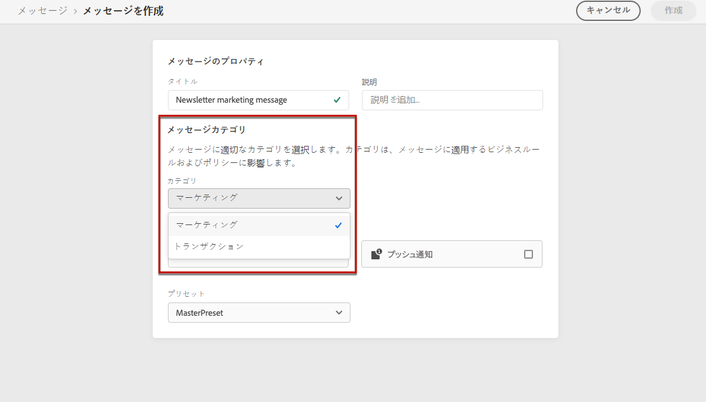
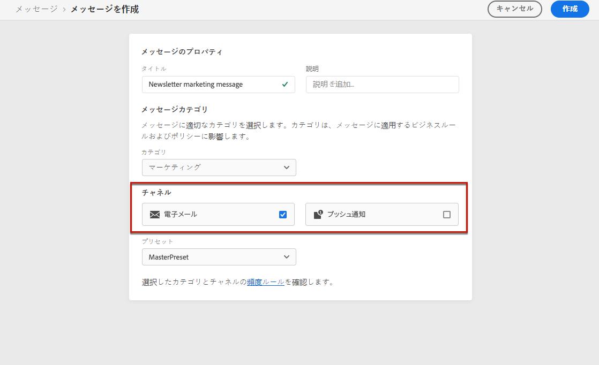
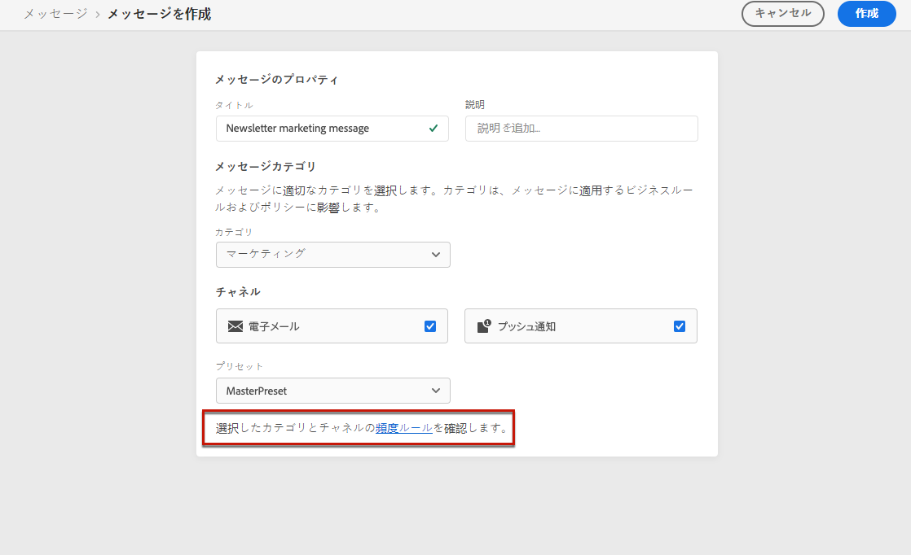
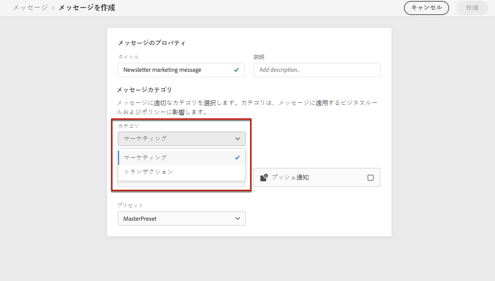
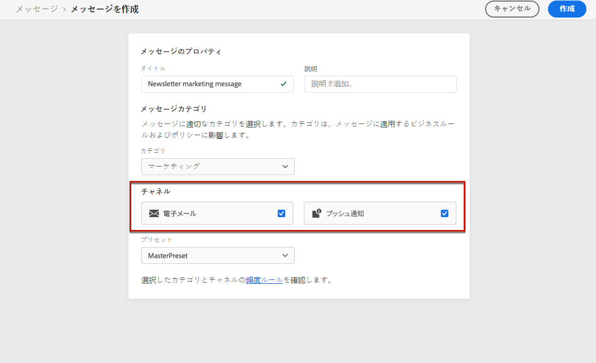

# メッセージ頻度ルール {#frequency-rules}

[!DNL Journey Optimizer] では、過剰に配信を受けているプロファイルをメッセージやアクションから自動的に除外するクロスチャネルルールを設定することで、ユーザーがメッセージを受け取ったり、ジャーニーにエントリする頻度を制御できます。

例えば、ブランドが顧客に送信するメッセージを 1 か月に 3 件以内に抑える場合などです。

これを行うには、頻度ルールを使用して、月別のカレンダー期間に、1 つ以上のチャネルに基づいて送信されるメッセージの件数に上限を設定することができます。

>[!NOTE]
>
>メッセージ頻度ルールは、ユーザーがブランドからの通信の受信を登録解除できる、オプトアウト管理とは異なります。[詳細情報](../messages/consent.md#opt-out-management)

## アクセスルール {#access-rules}

ルールは、**[!UICONTROL 管理]**／**[!UICONTROL ルール]**&#x200B;メニューから利用できます。すべてのルールが、変更日順に表示されます。

フィルターアイコンを使用して、カテゴリ、ステータスまたはチャネル（あるいはその両方）に基づいてフィルターを適用します。また、メッセージラベルで検索することもできます。

### 権限{#permissions-frequency-rules}

メッセージ頻度ルールにアクセス、作成、編集または削除するには、**[!UICONTROL 頻度ルールの管理]**&#x200B;権限を備えている必要があります。

を持つ **[!UICONTROL 頻度ルールを表示]** 権限ではルールを表示できますが、変更や削除はできません。

権限について詳しくは、[この節](../administration/high-low-permissions.md)を参照してください。

## ルールの作成 {#create-new-rule}

新しいルールを作成するには、次の手順に従います。

1. **[!UICONTROL メッセージ頻度ルール]**&#x200B;リストにアクセスし、「**[!UICONTROL ルールを作成]**」をクリックします。

   

1. ルール名を定義します。

   

1. メッセージルールカテゴリを選択します。

   >[!NOTE]
   >
   >現在、**[!UICONTROL マーケティング]**&#x200B;カテゴリのみが使用可能です。

1. ルールにキャッピングを設定します。キャッピングは、毎月個々のユーザープロファイルに送信できるメッセージの最大数を意味します。

   

   >[!NOTE]
   >
   >フリークエンシーキャップは、月別のカレンダー期間に基づいています。毎月初めにリセットされます。

1. このルールに使用するチャネルを「**[!UICONTROL メール]**」または「**[!UICONTROL プッシュ通知]**」から選択します。

   

   >[!NOTE]
   >
   >ルールを作成するためには、少なくとも 1 つのチャネルを選択する必要があります。

1. 選択したすべてのチャネルに対して合計数としてキャッピングを適用する場合は、複数のチャネルを選択します。

   例えば、「キャッピング」を 15 に設定し、E メールチャネルとプッシュチャネルの両方を選択します。 プロファイルが既に 10 件のマーケティングメールと 5 件のマーケティングプッシュ通知を受信している場合、このプロファイルは、次に配信されるマーケティングメールまたはプッシュ通知の対象から除外されます。

1. 「**[!UICONTROL ドラフトとして保存]**」をクリックして、ルールの作成を確定します。メッセージがルールリストに追加され、 **[!UICONTROL ドラフト]** ステータス。

   

## ルールをアクティブ化 {#activate-rule}

メッセージ頻度ルールを作成すると、 **[!UICONTROL ドラフト]** ステータスであり、まだメッセージに影響を与えていません。 有効にするには、ルールの横の楕円をクリックし、「**[!UICONTROL アクティブ化]**」を選択します。

ルールをアクティブ化すると、次回の実行時に適用されるメッセージに影響します。[メッセージに頻度ルールを適用する](#apply-frequency-rule)方法を説明します。

>[!NOTE]
>
>ルールが完全にアクティブ化されるまでに最大 10 分かかる場合があります。 ルールを有効にするために、メッセージやジャーニーを変更または再公開する必要はありません。

メッセージ頻度ルールを非アクティブ化するには、ルールの横の「...」をクリックし、「**[!UICONTROL 非アクティブ化]**」を選択します。

ルールのステータスは、「**[!UICONTROL 非アクティブ]**」に変わり、今後のメッセージの実行にはルールが適用されません。現在実行中のメッセージは影響を受けません。

>[!NOTE]
>
>ルールのアクティベートを解除しても、個々のプロファイルのカウントに影響したり、リセットしたりすることはありません。

## メッセージに頻度ルールを適用する {#apply-frequency-rule}

メッセージに頻度ルールを適用するには、次の手順に従います。

1. メッセージを作成。[詳細情報](../messages/get-started-content.md#create-new-message)

1. 定義したカテゴリを[作成したルール](#create-new-rule)に選択します。

   

   >[!NOTE]
   >
   >現在、**[!UICONTROL マーケティング]**&#x200B;カテゴリのみが、メッセージ頻度ルールで使用できます。

1. メッセージ用に選択したチャネルを選択します。

   

1. **[!UICONTROL 頻度ルール]**&#x200B;リンクをクリックして、選択したカテゴリおよびチャネルに適用される頻度ルールを表示します。

   

   新しいタブが開き、一致するメッセージ頻度ルールが表示されます。

1. メッセージを[デザイン](../design/design-emails.md)して[公開](../messages/publish-manage-message.md)します。

選択したカテゴリとチャネルに一致するすべての頻度ルールが、このメッセージに自動的に適用されます。

>[!NOTE]
>
>メッセージ <!--that do not have any selected category or messages -->選択したカテゴリが **[!UICONTROL トランザクション]** は頻度ルールに対して評価されません。

<!--Clicking the link out button next to the category selector will jump you over to the rules inventory screen to see which rules will be applied to the message.-->

配信から除外されたプロファイルの数を[ライブ表示とグローバル表示](../reports/message-monitoring.md)および[メールライブレポート](../reports/email-live-report.md)で表示でき、配信から除外されたユーザーの理由として考えられる頻度ルールが示されます。

>[!NOTE]
>
>複数のルールを同じチャネルに適用できますが、下限に達すると、プロファイルは次の配信から除外されます。

## 例：複数のルールを組み合わせる {#frequency-rule-example}

次の例に示すように、複数のメッセージ頻度ルールを組み合わせることができます。

1. 「*全マーケティングキャッピング*」という名前の[ルールを作成](#create-new-rule)します。

   * すべてのチャネル（メール、プッシュ）を選択します。
   * キャッピングを 12 に設定します。

   

1. ユーザーに送信されるマーケティングベースのプッシュ通知の数をさらに制限するには、2 つ目のルールとして「*プッシュマーケティングの上限*」という名前のルールを作成します。

   * 「プッシュ」チャネルを選択します。
   * キャッピングを 4 に設定します。

   

1. ルールを保存して[アクティブ化](#activate-rule)します。

1. メッセージを作成。[詳細情報](../messages/get-started-content.md#create-new-message)

1. **[!UICONTROL マーケティング]**&#x200B;カテゴリを選択します。

   

1. **[!UICONTROL 電子メール]**&#x200B;および&#x200B;**[!UICONTROL プッシュ通知]**&#x200B;チャネルを選択します。

   

1. **[!UICONTROL 頻度ルール]**&#x200B;リンクをクリックして、選択したカテゴリおよびチャネルに適用される頻度ルールを表示します。

1. メッセージを[デザイン](../design/design-emails.md)して[公開](../messages/publish-manage-message.md)します。

このシナリオでは、個々のプロファイルは次のようになります。
* 1 か月に最大 12 件のマーケティングメッセージを受信できます。
* ただし、4 件のプッシュ通知を受信した後は、マーケティングプッシュ通知から除外されます。

>[!NOTE]
>
>頻度ルールをテストする場合、新しく作成した [テストプロファイル](../segment/creating-test-profiles.md)を使用する場合、プロファイルの頻度キャップに達すると、翌月までカウンターをリセットする方法がなくなります。 ルールを非アクティブ化すると、上限を設定されたプロファイルがメッセージを受け取ることができますが、カウンター増分は削除もされません。
