# メッセージ頻度ルール {#frequency-rules}

[!DNL Journey Optimizer] では、過剰に配信を受けているプロファイルをメッセージやアクションから自動的に除外するクロスチャネルルールを設定することで、ユーザーがメッセージを受け取ったり、ジャーニーにエントリする頻度を制御できます。

例えば、あるブランドについて、顧客に月に 4 件を超えるマーケティングメッセージを送信しないというルールを設定できます。これを行うには、頻度ルールを使用して、月別のカレンダー期間に、1 つ以上のチャネルに基づいて送信されるメッセージの件数に上限を設定することができます。

>[!NOTE]
>
>メッセージ頻度ルールは、ユーザーがブランドからの通信の受信を登録解除できる、オプトアウト管理とは異なります。[詳細情報](../privacy/opt-out.md#opt-out-management)

➡️ [この機能をビデオで確認](#video)

## アクセスルール {#access-rules}

ルールは、**[!UICONTROL 管理]**／**[!UICONTROL ルール]**&#x200B;メニューから利用できます。すべてのルールが、変更日順に表示されます。

フィルターアイコンを使用して、カテゴリ、ステータスまたはチャネル（あるいはその両方）に基づいてフィルターを適用します。また、メッセージラベルで検索することもできます。

### 権限{#permissions-frequency-rules}

メッセージ頻度ルールにアクセス、作成、編集または削除するには、**[!UICONTROL 頻度ルールの管理]**&#x200B;権限を備えている必要があります。

**[!UICONTROL 頻度ルールの表示]**&#x200B;権限を持つユーザーはルールを表示できますが、変更や削除はできません。

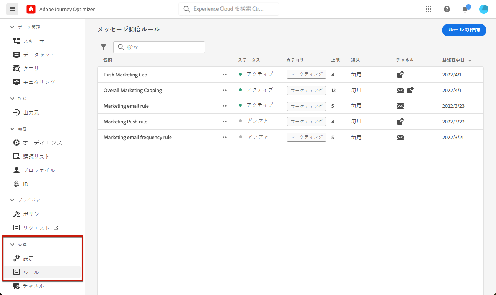

権限について詳しくは、[この節](../administration/high-low-permissions.md)を参照してください。

## ルールの作成 {#create-new-rule}

>[!CONTEXTUALHELP]
>id="ajo_rules_category"
>title="メッセージルールカテゴリの選択"
>abstract="アクティブ化してメッセージに適用すると、選択したカテゴリに一致するすべての頻度ルールがこのメッセージに自動的に適用されます。現在、マーケティングカテゴリのみが使用可能です。"

>[!CONTEXTUALHELP]
>id="ajo_rules_capping"
>title="ルールのキャッピングの設定"
>abstract="選択した時間枠内に顧客プロファイルに送信されるメッセージの最大数を指定します。フリークエンシーキャップは、選択したカレンダー期間に基づき、対応する時間枠の開始時にリセットされます。"

>[!CONTEXTUALHELP]
>id="ajo_rules_channel"
>title="ルールを適用するチャネルの定義"
>abstract="少なくとも 1 つのチャネルを選択します。キャッピングは、チャネル間で合計カウントとして適用されます。"

新しいルールを作成するには、次の手順に従います。

1. **[!UICONTROL メッセージ頻度ルール]**&#x200B;リストにアクセスし、「**[!UICONTROL ルールを作成]**」をクリックします。

   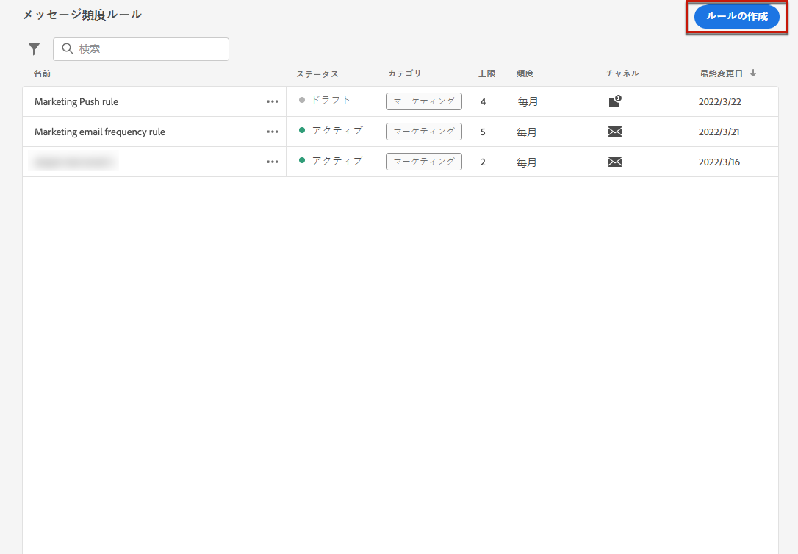

1. ルール名を定義し、メッセージルールのカテゴリを選択します。

   >[!NOTE]
   >
   >**[!UICONTROL マーケティング]**&#x200B;カテゴリのみが使用可能です。

   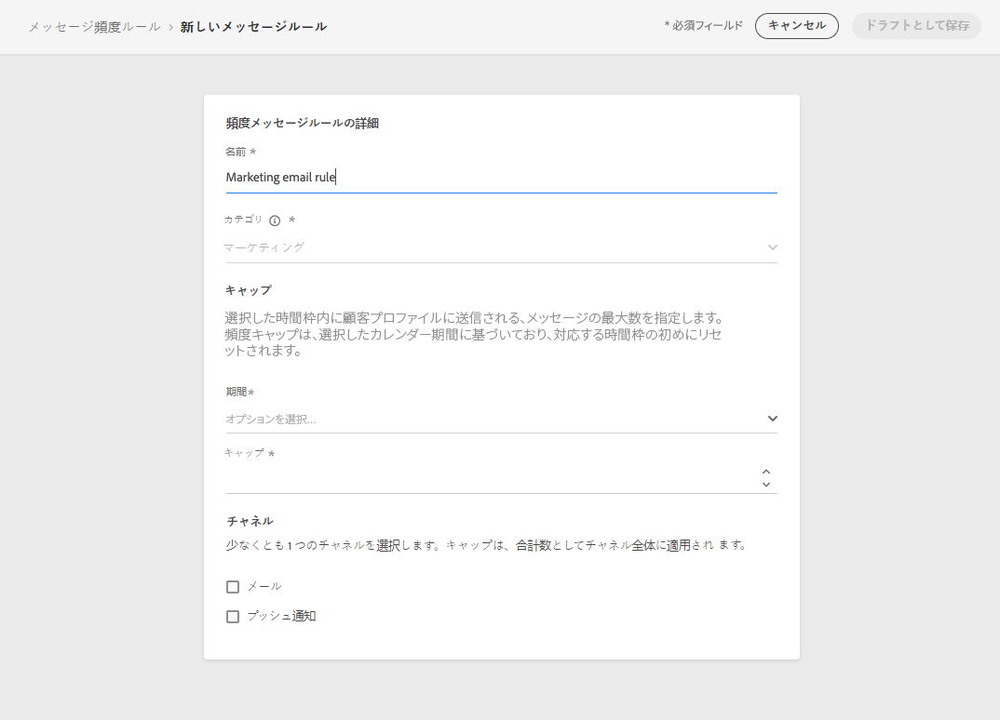

1. **[!UICONTROL 期間]**&#x200B;ドロップダウンリストから、キャッピングを適用する時間枠を選択します。[詳細情報](#frequency-cap)

1. ルールのキャッピングを設定します。これは、上記の選択に応じて、1 つの個別ユーザープロファイルに送信できる、1 か月または 1 週間あたり<!--or day-->のメッセージの最大数を意味します。

   <!--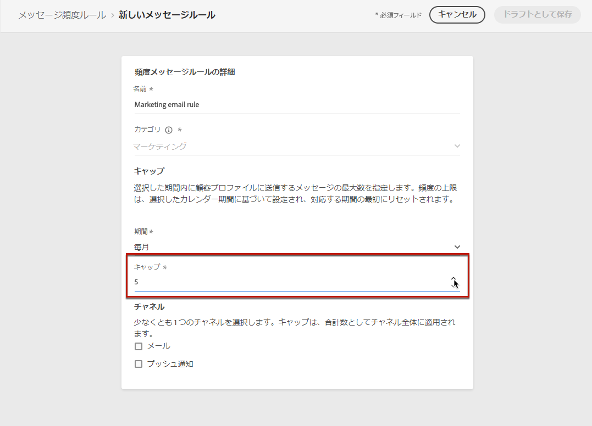-->

1. このルールに使用するチャネルを「**[!UICONTROL メール]**」、「**[!UICONTROL プッシュ通知]**」、「**[!UICONTROL SMS]**」または「**[!UICONTROL ダイレクトメール]**」から選択します。

   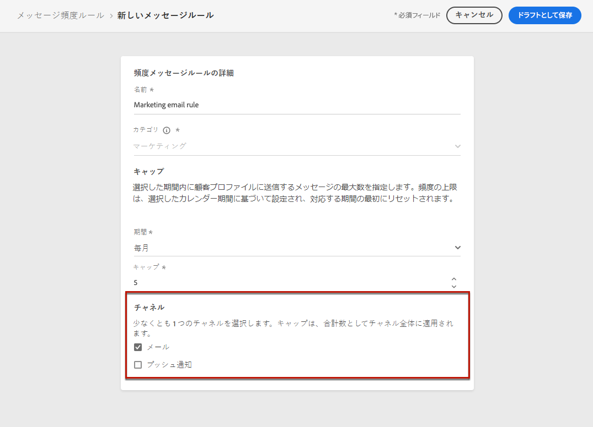

   >[!NOTE]
   >
   >ルールを作成するためには、少なくとも 1 つのチャネルを選択する必要があります。

1. 選択したすべてのチャネルに対して合計数としてキャッピングを適用する場合は、複数のチャネルを選択します。

   例えば、キャッピングを 15 に設定し、メールチャネルとプッシュチャネルの両方を選択します。プロファイルが既に 10 件のマーケティングメールと 5 件のマーケティングプッシュ通知を受信している場合、このプロファイルは、次に配信されるマーケティングメールまたはプッシュ通知の対象から除外されます。

1. 「**[!UICONTROL ドラフトとして保存]**」をクリックして、ルールの作成を確定します。メッセージが&#x200B;**[!UICONTROL ドラフト]**&#x200B;ステータスで、ルールリストに追加されます。

   

### フリークエンシーキャップ {#frequency-cap}

**[!UICONTROL 期間]**&#x200B;ドロップダウンリストから、キャッピングを毎月に適用するか毎週に適用するかを選択します。

>[!NOTE]
>
>また、日別のフリークエンシーキャップは、オンデマンドでも使用可能です。[詳細情報](#daily-frequency-cap)

フリークエンシーキャップは、選択したカレンダーの期間に基づきます。対応する時間枠の開始時にリセットされます。

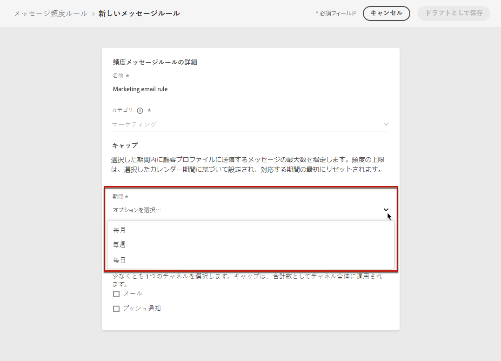

各期間のカウンターの有効期限は次のとおりです。

* **[!UICONTROL 毎月]**：フリークエンシーキャップは、その月の最終日の 23:59:59 UTC まで有効です。例えば、1 月の月次有効期限は 1/31 23:59:59 UTC です。

* **[!UICONTROL 毎週]**：フリークエンシーキャップは、暦週が日曜日に始まるため、その週の土曜日 23:59:59 UTC まで有効です。有効期限は、ルールの作成に関係なく設定されます。例えば、木曜日にルールが作成された場合、このルールは土曜日の 23:59:59 まで有効です。

### 日別のフリークエンシーキャップ {#daily-frequency-cap}

月別と週別に加えて、日別のフリークエンシーキャップもオンデマンドで使用可能です。詳しくは、アドビ担当者にお問い合わせください。

日別のフリークエンシーキャップは、その日の 23:59:59 UTC まで有効で、翌日の開始とともに 0 にリセットされます。

>[!NOTE]
>
>毎日の頻度キャップルールの正確性を確保するために、 [ストリーミングセグメント化](https://experienceleague.adobe.com/docs/experience-platform/segmentation/ui/streaming-segmentation.html?lang=ja){target="_blank"} をお勧めします。 オーディエンスの評価方法について詳しくは、[この節](../audience/about-audiences.md#evaluation-method-in-journey-optimizer)を参照してください。

## ルールのアクティブ化 {#activate-rule}

作成時、メッセージ頻度ルールは&#x200B;**[!UICONTROL ドラフト]**&#x200B;ステータスであり、まだどのメッセージにも影響を与えていません。有効にするには、ルールの横の楕円をクリックし、「**[!UICONTROL アクティブ化]**」を選択します。

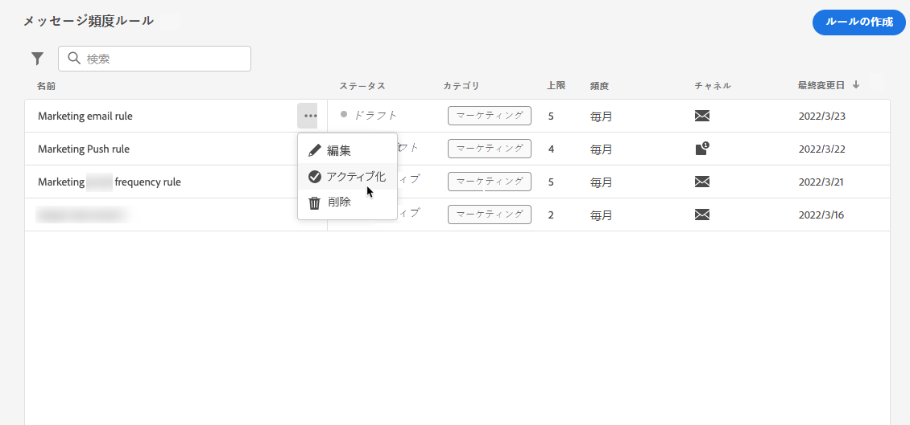

ルールをアクティブ化すると、次回の実行時に適用されるメッセージに影響します。[メッセージに頻度ルールを適用する](#apply-frequency-rule)方法を説明します。

>[!NOTE]
>
>ルールが完全にアクティブ化されるまでに、最大 10 分かかる場合があります。ルールを有効にするために、メッセージを変更したり、ジャーニーを再公開したりする必要はありません。

メッセージ頻度ルールを非アクティブ化するには、ルールの横の「...」をクリックし、「**[!UICONTROL 非アクティブ化]**」を選択します。

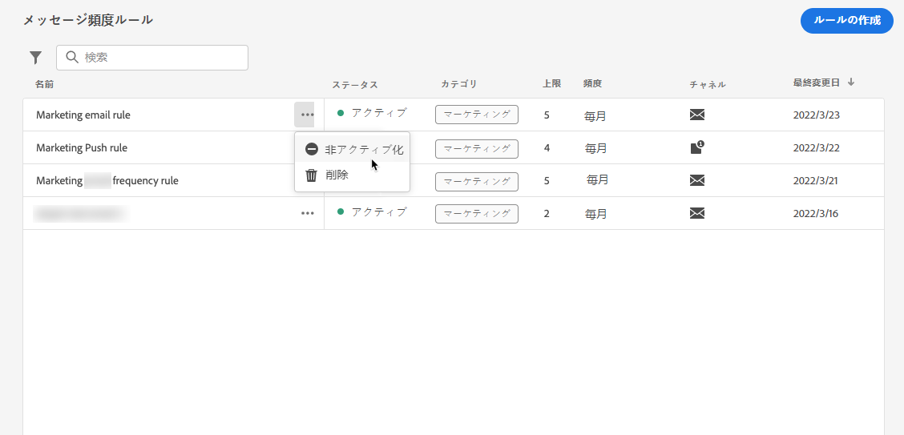

ルールのステータスは、「**[!UICONTROL 非アクティブ]**」に変わり、今後のメッセージの実行にはルールが適用されません。現在実行中のメッセージは影響を受けません。

>[!NOTE]
>
>ルールのアクティベートを解除しても、個々のプロファイルのカウントに影響したり、リセットしたりすることはありません。

## メッセージに頻度ルールを適用する {#apply-frequency-rule}

メッセージに頻度ルールを適用するには、次の手順に従います。

1. [ジャーニー](../building-journeys/journey-gs.md)を作成する際は、ルールに定義したチャネルの 1 つを選択してメッセージを追加します。

1. 定義したカテゴリを[作成したルール](#create-new-rule)に選択します。

   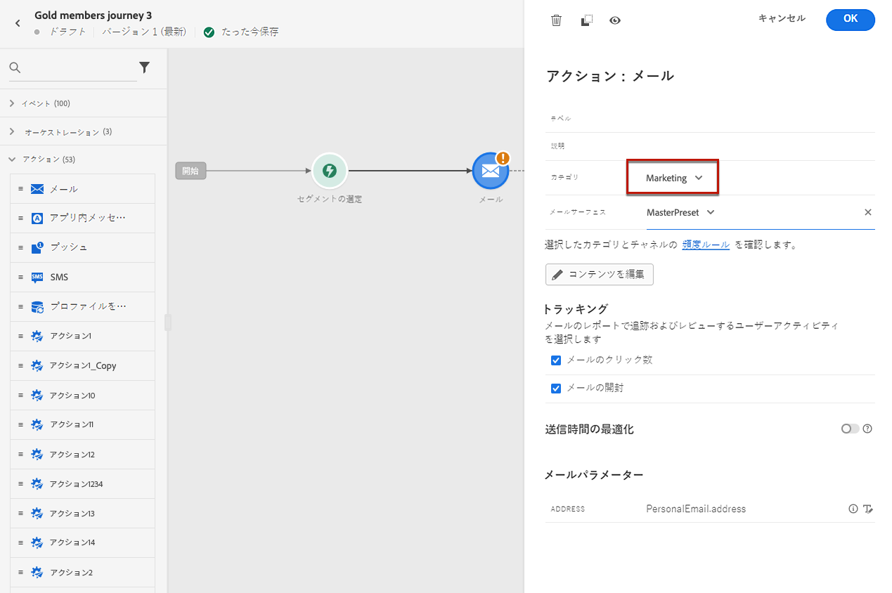

   >[!NOTE]
   >
   >現在、**[!UICONTROL マーケティング]**&#x200B;カテゴリのみが、メッセージ頻度ルールで使用できます。

1. **[!UICONTROL 頻度ルール]**&#x200B;リンクをクリックすると、頻度ルール画面が新しいタブで表示されます。[詳細情報](#access-rules)

   選択したカテゴリとチャネルに一致するすべての頻度ルールが、このメッセージに自動的に適用されます。

   >[!NOTE]
   >
   >**[!UICONTROL トランザクション]**&#x200B;カテゴリを選択したメッセージは、頻度ルールに照らして評価されません。

1. [グローバルレポート](../reports/global-report.md)および[ライブレポート](../reports/live-report.md)では、配信から除外されたプロファイルの数を確認でき、配信から除外されたユーザーの理由として考えられる頻度ルールが一覧表示されます。

>[!NOTE]
>
>複数のルールを同じチャネルに適用できますが、下限に達すると、プロファイルは次の配信から除外されます。

## 例：複数のルールを組み合わせる {#frequency-rule-example}

次の例に示すように、複数のメッセージ頻度ルールを組み合わせることができます。

1. 「*全マーケティングキャッピング*」という名前の[ルールを作成](#create-new-rule)します。

   * すべてのチャネルを選択します。
   * キャッピングを月単位で 12 に設定します。

   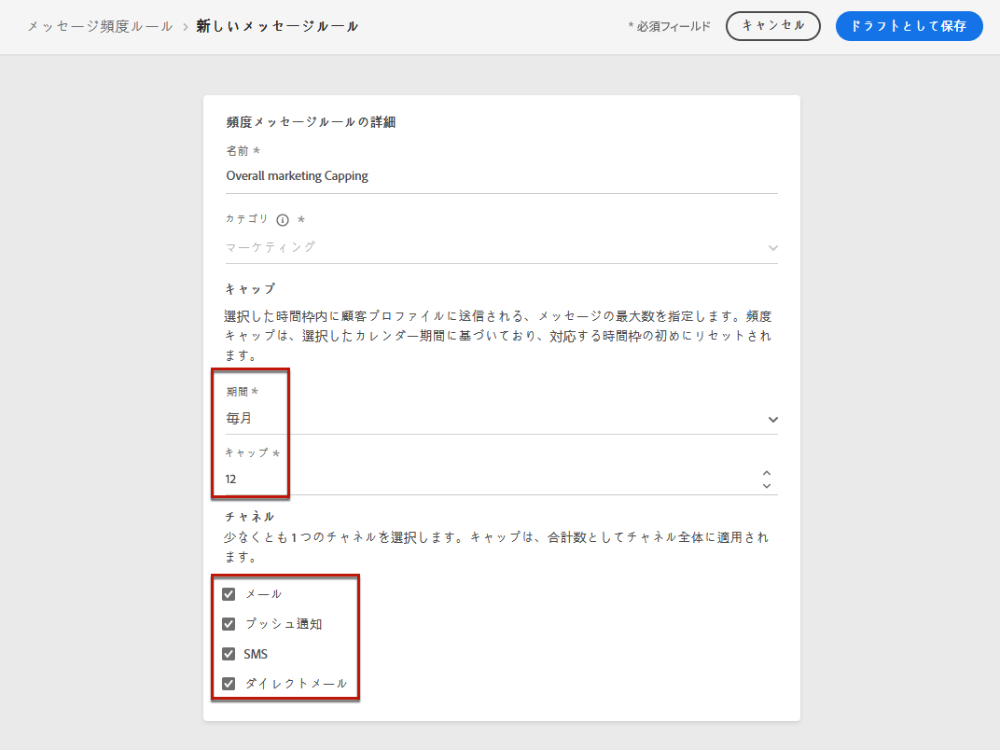

1. ユーザーに送信されるマーケティングベースのプッシュ通知の数をさらに制限するには、2 つ目のルールとして「*プッシュマーケティングの上限*」という名前のルールを作成します。

   * 「プッシュ」チャネルを選択します。
   * キャッピングを月単位で 4 に設定します。

   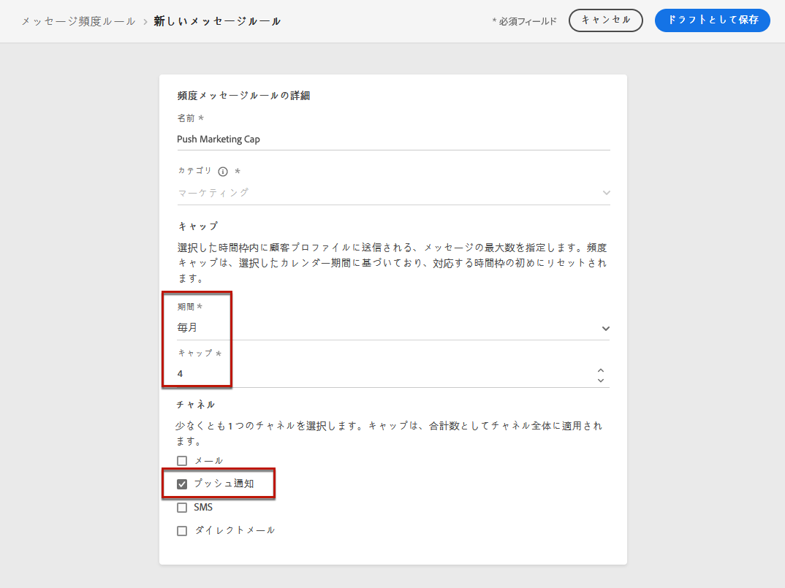

1. ルールを保存して[アクティブ化](#activate-rule)します。

1. 通信したいチャネルごとに[メッセージを作成](../building-journeys/journeys-message.md)し、メッセージごとに&#x200B;**[!UICONTROL マーケティング]**&#x200B;カテゴリを選択します。[頻度ルールの適用方法を学ぶ](#apply-frequency-rule)

   

<!--
Learn how to create a message for the different channels in the following sections:
* [Create an email](../email/create-email.md)
* [Create a push notification](../push/create-push.md)
* [Create an SMS](../sms/create-sms.md)
* [Create a direct mail](../direct-mail/create-direct-mail.md)

Create an email and select the **[!UICONTROL Marketing]** category for that message. [Learn more](../email/create-email.md)

Create a push notification and select the **[!UICONTROL Marketing]** category for that message. [Learn more](../push/create-push.md)

Create an SMS and select the **[!UICONTROL Marketing]** category for that message. [Learn more](../sms/create-sms.md)

Create a direct mail and select the **[!UICONTROL Marketing]** category for that message. [Learn more](../direct-mail/create-direct-mail.md)
-->

このシナリオでは、個々のプロファイルは次のようになります。
* 1 か月に最大 12 件のマーケティングメッセージを受信できます。
* ただし、4 件のプッシュ通知を受信した後は、マーケティングプッシュ通知から除外されます。

>[!NOTE]
>
>プロファイルのフリークエンシーキャップに達すると、翌月までカウンターをリセットする方法はないので、頻度ルールをテストする場合は、新しく作成した[テストプロファイル](../audience/creating-test-profiles.md)を使用することをお勧めします。ルールを非アクティブ化すると、上限を設定されたプロファイルがメッセージを受け取ることはできますが、カウンターの増分は削除されません。

## チュートリアルビデオ {#video}

頻度ルールを作成、アクティブ化、テスト、およびレポートする方法について説明します。

>[!VIDEO](https://video.tv.adobe.com/v/344451?quality=12)
