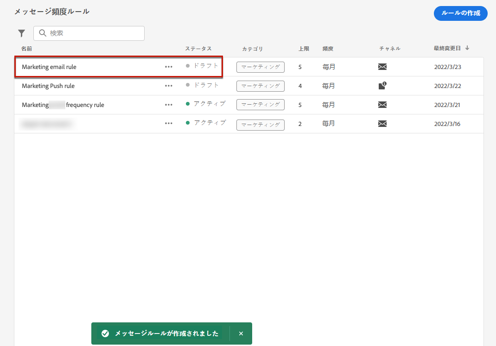

# メッセージ頻度ルール {#frequency-rules}

[!DNL Journey Optimizer] では、ユーザーがメッセージやアクションからの超過要請プロファイルを自動的に除外するクロスチャンネルルールを設定して、ユーザーによるメッセージの受信頻度を制御できます。

例えば、毎月3件を超えるマーケティングメッセージを顧客に送信することはできません。

これを行うには、月間カレンダー期間中に1つまたは複数のチャネルに基づいて送信されたメッセージの数を上限となる頻度ルールを使用できます。

>[!NOTE]
>
>メッセージの頻度ルールはオプトイン管理とは異なります。これにより、ユーザーは、どのような場合でも、ユーザーがブランドからの通信の受信を停止することができます。 [詳細情報](../privacy/opt-out.md#opt-out-management)

➡️ [ ビデオでのこの機能の検出](#video)

## アクセスルール {#access-rules}

ルールについては、> **[!UICONTROL Rules]** メニューを参照して **[!UICONTROL Administration]** ください。すべてのルールが、変更日でソートされて一覧表示されます。

「フィルター」アイコンを使用して、カテゴリー、ステータス、チャネルのいずれかを選択します。 メッセージラベルで検索することもできます。

### パーミッション{#permissions-frequency-rules}

メッセージ頻度ルールにアクセスし、作成、編集、または削除するには、アクセス権が必要 **[!UICONTROL Manage frequency rules]** です。

権限を持つ **[!UICONTROL View frequency rules]** ユーザーはルールを表示できますが、修正や削除はできません。

この節 ](../administration/high-low-permissions.md) では、 [ パーミッションについて詳しく説明しています。

## ルールの作成 {#create-new-rule}

新しいルールを作成するには、次の手順を実行します。

1. リストに **[!UICONTROL Message frequency rules]** アクセスし、をクリック **[!UICONTROL Create rule]** します。

   

1. ルール名を定義します。

   

1. 「メッセージルール」カテゴリを選択します。

   >[!NOTE]
   >
   >現在、 **[!UICONTROL Marketing]** カテゴリのみを使用できます。

1. ルールの上限を設定します。つまり、毎月個別のユーザープロファイルに送信可能なメッセージの最大数を指定します。

   

   >[!NOTE]
   >
   >Frequency cap は、月間カレンダー期間に基づいています。 この設定は、毎月の開始時にリセットされます。

1. このルールに使用するチャネル: **[!UICONTROL Email]** または **[!UICONTROL Push notification]** を選択します。

   

   >[!NOTE]
   >
   >ルールを作成できるようにするには、少なくとも1つのチャンネルを選択する必要があります。

1. 選択したすべてのチャンネルに対して「上限」を適用する場合は、複数のチャンネルを選択します。

   例えば、「上限」を15に設定し、電子メールとプッシュチャンネルの両方を選択します。 プロファイルに既に10件のマーケティング電子メールが受信され、5つのマーケティングプッシュ通知が通知される場合、このプロファイルは、マーケティング電子メールまたはプッシュ通知の次の配信から除外されます。

1. ルールの作成を確定するには、をクリック **[!UICONTROL Save as draft]** します。 メッセージがルールリストに追加され、 **[!UICONTROL Draft]** 状態が表示されます。

   

## ルールの有効化 {#activate-rule}

メッセージ頻度ルールは、作成時にステータスが **[!UICONTROL Draft]** 表示され、メッセージには影響しません。 これを有効にするには、ルールの横にある省略記号をクリックし、を選択 **[!UICONTROL Activate]** します。

ルールをアクティブにすると、そのルールが適用されるメッセージに影響します。これにより、次の処理が実行されます。 頻度ルールをメッセージ ](#apply-frequency-rule) に適用する方法に [ ついて説明します。

>[!NOTE]
>
>ルールが完全にアクティブになるまでには最大10分の時間がかかります。 ルールを有効にするには、メッセージを変更する、または journeys を再パブリッシュする必要はありません。

メッセージ頻度ルールを非アクティブ化するには、ルールの横にある省略記号をクリックし、を選択 **[!UICONTROL Deactivate]** します。

ルールの状態がに **[!UICONTROL Inactive]** 変更され、その後のメッセージ実行にはルールが適用されません。 現在実行中のメッセージは影響を受けません。

>[!NOTE]
>
>ルールを非アクティブにしても、個々のプロファイルのカウントは変更されません。

## メッセージへの頻度ルールの適用 {#apply-frequency-rule}

メッセージに頻度ルールを適用するには、次の手順を実行します。

1. ルール用に定義したいずれかのチャネルを選択して、メッセージを作成します。

1. 作成 ](#create-new-rule) したルールに対し [ て定義したカテゴリーを選択します。

   

   >[!NOTE]
   >
   >現在のところ、メッセージの頻度ルールではその **[!UICONTROL Marketing]** カテゴリのみを使用できます。

   <!--
   1. You can click the **[!UICONTROL Frequency rule]** link to view the frequency rules that will apply for the selected category and channel(s). A new tab will open to display the matching message frequency rules.-->

1. 選択したカテゴリとチャンネルに一致するすべての頻度ルールが、このメッセージに自動的に適用されます。

   >[!NOTE]
   >
   ><!--that do not have any selected category or messages -->選択されたカテゴリーが **[!UICONTROL Transactional]** 頻度ルールに対して評価されることはありません。

   <!--Clicking the link out button next to the category selector will jump you over to the rules inventory screen to see which rules will be applied to the message.-->

1. グローバルレポート ](../reports/global-report.md) [ で [ 配信から除外されたプロファイル数を表示したり、ライブレポート ](../reports/live-report.md) で表示することができます。これにより、ユーザーが出荷から除外する可能性のある理由として頻度ルールがリストされます。

>[!NOTE]
>
>1つのチャンネルに適用できるルールもありますが、下位の cap に到達すると、そのプロファイルは次の配信から除外されます。

## 例: 複数のルールを組み合わせる {#frequency-rule-example}

次の例に示すように、複数のメッセージ頻度ルールを組み合わせることができます。

1. [全体的なマーケティング上限 *と呼ばれる* 規則 ](#create-new-rule) を作成します。

   * 電子メールを選択し、チャネルを押します。
   * 上限を12に設定します。

   

1. ユーザーに送信されるマーケティングベースのプッシュ通知の回数をさらに制限するには、プッシュマーケティング Cap *という名前* の2番目のルールを作成します。

   * 「プッシュチャンネル」を選択します。
   * 上限を4に設定します。

   

1. ルールを保存し [ 、アクティブ ](#activate-rule) にします。

1. 電子メールを作成し、 **[!UICONTROL Marketing]** そのメッセージのカテゴリーを選択します。 [詳細情報](../email/create-email.md)

1. プッシュ通知を作成し、そのメッセージのカテゴリを選択 **[!UICONTROL Marketing]** します。 [詳細情報](../push/create-push.md)

このシナリオでは、個々のプロファイルを次のようにします。
* 1カ月に最大12件のマーケティングメッセージを受信することができます。
* ただし、プッシュ通知が4回受信されると、マーケティングプッシュ通知から除外されます。

>[!NOTE]
>
>頻度ルールをテストする際には、新しく作成さ [ れたテストプロファイル ](../segment/creating-test-profiles.md) を使用することをお勧めします。これにより、プロファイルの頻度上限に達すると、来月に戻ることができなくなります。 ルールを非アクティブにすると、上限のプロファイルでメッセージを受信することはできますが、カウンター増分が削除または削除されることはありません。

## 操作方法のビデオ {#video}

頻度ルールの作成、アクティブ化、テストおよびレポートを行う方法について説明します。

>[!VIDEO](https://video.tv.adobe.com/v/344451?quality=12)
