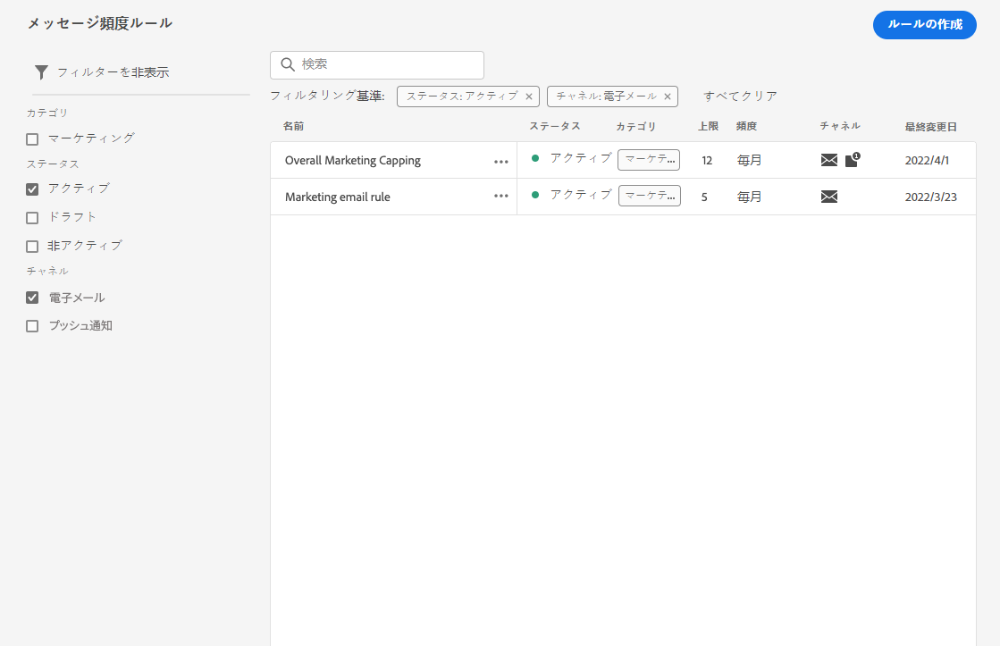
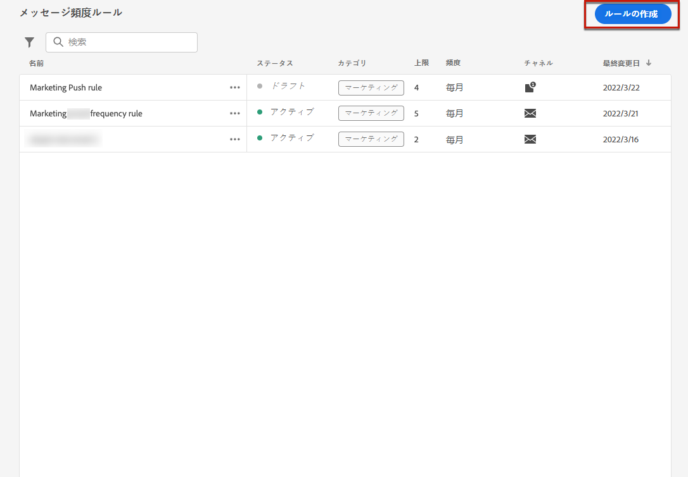

# メッセージ頻度ルール {#frequency-rules}

[!DNL Journey Optimizer] では、過剰に配信を受けているプロファイルをメッセージやアクションから自動的に除外するクロスチャネルルールを設定することで、ユーザーがメッセージを受け取ったり、ジャーニーにエントリする頻度を制御できます。

例えば、ブランドが 1 ヶ月に 3 件を超えるマーケティングメッセージを顧客に送信したくない場合などです。

これをおこなうには、頻度ルールを使用して、月別のカレンダー期間に 1 つ以上のチャネルに基づいて送信されるメッセージ数を制限できます。

>[!NOTE]
>
>メッセージ頻度ルールは、ユーザーがブランドからの通信の受信を登録解除できる、オプトアウト管理とは異なります。 [詳細情報](../messages/consent.md#opt-out-management)

## アクセスルール {#access-rules}

ルールは、 **[!UICONTROL 管理]** > **[!UICONTROL ルール]** メニュー すべてのルールが、変更日順に表示されます。

<!--To access, create, edit or delete message frequency rules, you must have the message configuration permission. [Learn more](../administration/high-low-permissions.md#administration-permissions)-->

フィルターアイコンを使用して、カテゴリ、ステータスまたはチャネル（あるいはその両方）に基づいてフィルターを適用します。 また、メッセージラベルを検索することもできます。

## ルールの作成 {#create-new-rule}

新しいルールを作成するには、次の手順に従います。

1. 次にアクセス： **[!UICONTROL メッセージ頻度ルール]** リストを開き、「 **[!UICONTROL ルールを作成]**.

   

1. ルール名を定義します。

   

1. メッセージルールカテゴリを選択します。

   >[!NOTE]
   >
   >現在、 **[!UICONTROL マーケティング]** カテゴリが使用可能です。

1. ルールの上限を設定します。つまり、毎月個々のユーザープロファイルに送信できるメッセージの最大数を示します。

   

   >[!NOTE]
   >
   >頻度キャップは、月別のカレンダー期間に基づいています。 毎月初めにリセットされます。

1. このルールに使用するチャネルを選択します。 **[!UICONTROL 電子メール]** または **[!UICONTROL プッシュ通知]**.

   

   >[!NOTE]
   >
   >ルールを作成するには、少なくとも 1 つのチャネルを選択する必要があります。

1. 選択したすべてのチャネルに対して合計数として制限を適用する場合は、複数のチャネルを選択します。

   例えば、「キャッピング」を 15 に設定し、E メールチャネルとプッシュチャネルの両方を選択します。 プロファイルが既に 10 件のマーケティング電子メールと 5 件のマーケティングプッシュ通知を受信している場合、このプロファイルは、マーケティング電子メールまたはプッシュ通知の次の配信から除外されます。

1. クリック **[!UICONTROL ドラフトとして保存]** をクリックして、ルールの作成を確定します。 メッセージがルールリストに追加され、 **[!UICONTROL ドラフト]** ステータス。

   

## ルールをアクティブ化する {#activate-rule}

メッセージ頻度ルールをアクティブにするには、ルールの横の省略記号をクリックし、「 」を選択します **[!UICONTROL 有効化]**.

ルールをアクティブ化すると、次回の実行時に適用されるメッセージに影響します。 方法を学ぶ [メッセージに頻度ルールを適用する](#apply-frequency-rule).

>[!NOTE]
>
>ルールを有効にするために、メッセージやジャーニーを変更または再公開する必要はありません。

メッセージ頻度ルールを非アクティブ化するには、ルールの横の省略記号をクリックし、「 」を選択します **[!UICONTROL 無効化]**.

ルールのステータスは、 **[!UICONTROL 非アクティブ]** また、今後のメッセージの実行にはルールが適用されません。 現在実行中のメッセージは影響を受けません。

>[!NOTE]
>
>ルールを非アクティブ化しても、個々のプロファイルのカウントに影響したり、リセットしたりすることはありません。

## メッセージに頻度ルールを適用する {#apply-frequency-rule}

頻度ルールをメッセージに適用するには、次の場合に、このルール用に定義したカテゴリを選択するだけで済みます。 [メッセージの作成](../messages/get-started-content.md#create-new-message).

次を選択すると、 **[!UICONTROL マーケティング]** カテゴリの場合、一致するすべてのメッセージ頻度ルールがこのメッセージに自動的に適用されます。

<!--Clicking the link out button next to the category selector will jump you over to the rules inventory screen to see which rules will be applied to the message.-->

配信から除外されたプロファイルの数を [ライブビューとグローバルビュー](../reports/message-monitoring.md)、および [メールライブレポート](../reports/email-live-report.md)：頻度ルールが、配信から除外されたユーザーに考えられる理由として表示されます。

## 例

次の例に示すように、複数のメッセージ頻度ルールを組み合わせることができます。

1. という名前のルールを作成します。 *マーケティングキャッピング全体*:

   * すべてのチャネル（E メール、プッシュ）を選択します。
   * キャッピングを 12 に設定します。

1. ユーザーが送信されるマーケティングベースのプッシュ通知の数をさらに制限するには、2 つ目のルールとして *マーケティングプッシュの制限*:

   * 「プッシュチャネル」を選択します。
   * キャッピングを 4 に設定します。

このシナリオでは、個々のプロファイルは 1 ヶ月に最大 12 件のマーケティングメッセージを受信できますが、4 件のプッシュ通知を受信した後でマーケティングプッシュ通知から除外されます。
