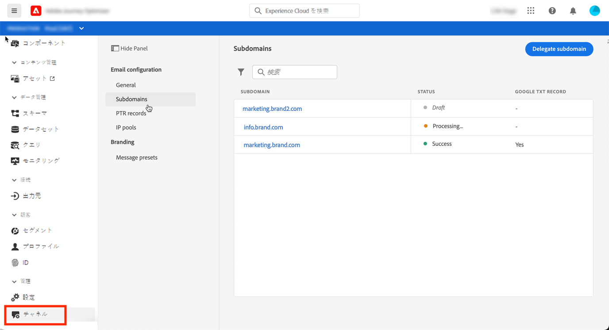
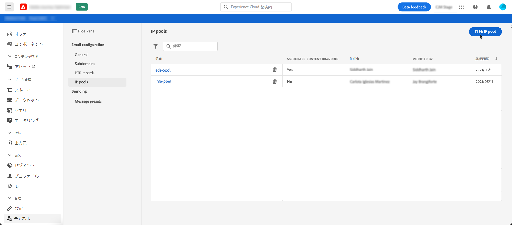

# [!DNL Journey Optimizer] 設定の基本を学ぶ

[!DNL Journey Optimizer]に初めてアクセスする際には、実稼動用サンドボックスがプロビジョニングされ、契約に応じて一定数の IP が割り当てられます。

ジャーニーを作成してメッセージを送信するには、次の設定手順に従う必要があります。

1. **メッセージとチャネルを設定**：プリセットの定義、メールおよびプッシュメッセージの適応とカスタマイズ

   * [!DNL Adobe Experience Platform]と[!DNL Adobe Experience Platform Launch]の両方でプッシュ通知の設定を定義します。 [詳細](../push-gs.md)

   * メッセージプリセットを作成して、メールおよびプッシュ通知メッセージに必要なすべての技術パラメーターを設定します。 [詳細](message-presets.md)

   * Adobe Experience Platform で使用可能なアドレスが複数ある場合、受信者に優先して使用するメールアドレスを決定します。 [詳細](primary-email-addresses.md)

   * 抑制リストにメールアドレスを送信する前に再試行が実行される日数を管理します。 [詳細](manage-suppression-list.md)

   <!--
    * Understand push notification flow. [Learn more](../push-gs.md)
    -->

1. **サブドメインをデリゲート**：Journey Optimizer で新規サブドメインを使用する場合、最初の手順としてそのサブドメインをデリゲートします。[詳細](about-subdomain-delegation.md)

   

1. **IP プールの作成**：インスタンスでプロビジョニングされた IP アドレスをグループ化することで、E メールの配信品質と評判を向上させます。[詳細](ip-pools.md)

   

1. **ジャーニーの設定**：ジャーニーを作成するには、**[!UICONTROL データソース]**、**[!UICONTROL イベント]** と **[!UICONTROL アクション]**&#x200B;を設定する必要があります。[詳細](about-data-sources-events-actions.md)

   

   * **データソース**&#x200B;を設定すると、ジャーニーで使用される追加情報を取得するため、システムへの接続を定義できます。データソースについて詳しくは、この[節](../datasource/about-data-sources.md)を参照してください

   * **イベント**&#x200B;を使用すると、ジャーニーをまとめてトリガーし、ジャーニーに流入してくる個人にリアルタイムでメッセージを送信できます。イベントの設定では、ジャーニーで必要なイベントを設定します。受信イベントのデータは、Adobe Experience Data Model（XDM）に従って正規化されます。イベントは、認証済みイベントと未認証イベント（Adobe Mobile SDK イベントなど）のストリーミング取得 API から取得します。イベントについて詳しくは、この[節](../event/about-events.md)を参照してください

   * [!DNL Journey Optimizer] には、コンテンツをデザインし、メッセージを公開できる組み込みのメッセージ機能が備わっています。サードパーティシステムを使用してメッセージを送信する場合は、**カスタムアクション**&#x200B;を作成します。アクションについて詳しくは、この[節](../action/action.md)を参照してください