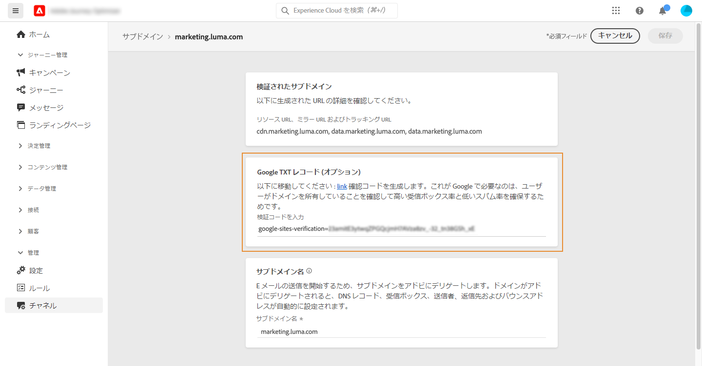

# サブドメインへの Google TXT レコードの追加 {#google-txt-record}

>[!CONTEXTUALHELP]
>id="ajo_admin_subdomain_google"
>title="Google TXT レコード"
>abstract="Gmail アドレス宛ての E メールを確実に配信するには、サブドメインに特別なGoogleサイト検証 TXT レコードを追加して、サブドメインが確実に検証されていることを確認します。"

TXT レコードは、ドメインに関するテキスト情報を提供するための一種の DNS レコードで、外部ソースから読み取ることができます。

Gmail アドレスへの E メールの配信品質を最適化し、正常な配信を実現するには、次の手順を実行します。 [!DNL Journey Optimizer] では、サブドメインに特別なGoogleサイト検証 TXT レコードを追加して、検証されていることを確認できます。

>[!CAUTION]
>
> この操作は、サブドメインのステータスが&#x200B;**[!UICONTROL 成功]**&#x200B;の場合にのみ実行できます。 サブドメインのステータスについて詳しくは、[この節](access-subdomains.md)を参照してください。

サブドメインに Google TXT レコードを追加するには、次の手順に従います。

1. **[!UICONTROL チャネル]**／**[!UICONTROL サブドメイン]**&#x200B;メニューからサブドメインを開きます。

1. 「**[!UICONTROL Google txt レコード]**」セクションで、[Google Workspace](https://support.google.com/a/answer/183895){target=&quot;_blank&quot;}<!--G Suite Admin tools-->から生成された確認コードを入力し、「**[!UICONTROL 保存]**」をクリックします。

   

1. TXT レコードを追加したら、Google で検証する必要があります。これをおこなうには、[Google Workspace](https://support.google.com/a/answer/183895){target=&quot;_blank&quot;}<!--G Suite Admin tools-->に移動し、検証手順を開始します。
