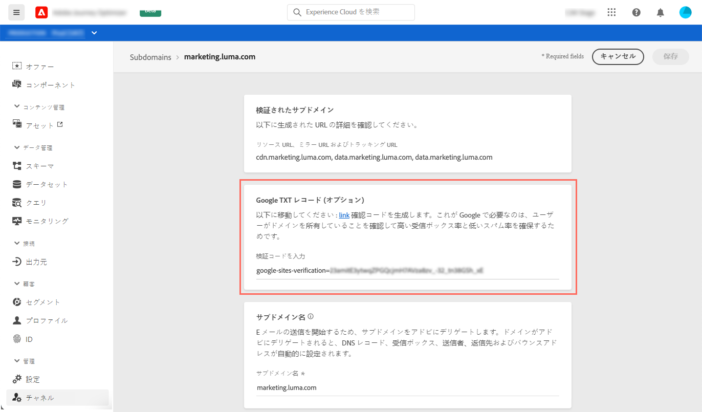

# サブドメインへのGoogle TXTレコードの追加

TXT レコードは、ドメインに関するテキスト情報を提供するための一種の DNS レコードで、外部ソースから読み取ることができます。

顧客ジャーニー管理では、Gmailアドレス宛てのEメールの配信品質を確保し、配信を成功させるために、サブドメインにGoogleサイト検証用の特別なTXTレコードを追加して、検証を確実におこなうことができます。

>[!NOTE]
>
> この操作は、サブドメインのステータスが&#x200B;**[!UICONTROL 成功]**&#x200B;の場合にのみ実行できます。 サブドメインのステータスについて詳しくは、[この節](access-subdomains.md)を参照してください。

サブドメインにGoogle TXTレコードを追加するには、次の手順に従います。

1. **[!UICONTROL チャネル]** / **[!UICONTROL サブドメイン]**&#x200B;メニューからサブドメインを開きます。

1. 「Google txtレコード」セクションで、[G Suite管理ツール](https://support.google.com/a/answer/183895)で生成された検証コードを入力し、「**[!UICONTROL 保存]**」をクリックします。

   

1. TXT レコードを追加したら、Google で検証する必要があります。これをおこなうには、G Suite管理ツールに移動し、検証手順を実行します。
