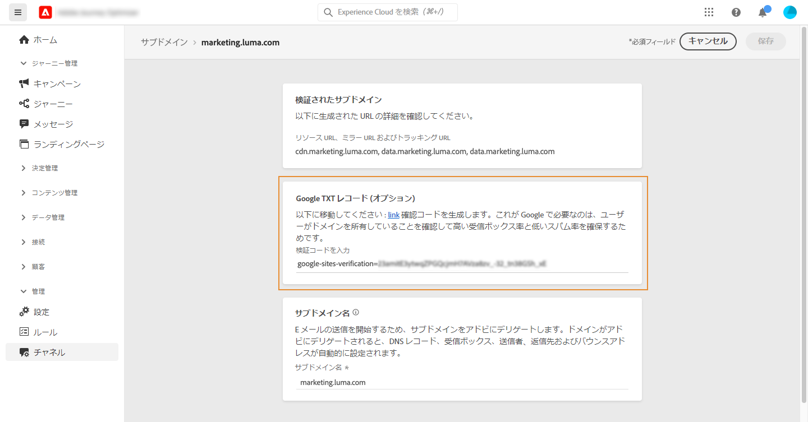

# サブドメインへの Google TXT レコードの追加 {#google-txt-record}

>[!BEGINSHADEBOX]

**このページ：** サブドメインにGoogle サイト検証TXT レコードを追加および更新して、Gmail アドレスへのメール配信を成功させる方法を説明します。

>[!ENDSHADEBOX]

>[!CONTEXTUALHELP]
>id="ajo_admin_subdomain_google"
>title="Google TXT レコード"
>abstract="Gmail アドレス宛ての電子メールを確実に配信するには、サブドメインに特別な Google サイト検証 TXT レコードを追加して、サブドメインが確実に検証されていることを確認します。"

TXT レコードは、ドメインに関するテキスト情報を提供するために使用される DNS レコードの一種で、外部ソースから読み取ることができます。

[!DNL Journey Optimizer] では、Gmail アドレス宛てのメールの最高の配信品質を確保して確実な配信を行うために、サブドメインに Google サイト検証用の特別な TXT レコードを追加して、確実な検証を行えます。

>[!CAUTION]
>
> この操作は、サブドメインのステータスが&#x200B;**[!UICONTROL 成功]**&#x200B;の場合にのみ実行できます。 サブドメインのステータスについて詳しくは、[この節](delegate-subdomain.md#access-delegated-subdomains)を参照してください。

## Google TXT レコードの追加 {#add-google-txt-record}

サブドメインに Google TXT レコードを追加するには、次の手順に従います。

1. **[!UICONTROL チャネル]**／**[!UICONTROL メール設定]**／**[!UICONTROL サブドメイン]**&#x200B;メニューからサブドメインを開きます。

1. 「**[!UICONTROL Google txt レコード]**」セクションで、[Google Workspace](https://support.google.com/a/answer/183895){target="_blank"}<!--G Suite Admin tools--> から生成された確認コードを入力し、「**[!UICONTROL 保存]**」をクリックします。

   

1. TXT レコードを追加したら、Google で検証する必要があります。 これを行うには、[Google Workspace](https://support.google.com/a/answer/183895){target="_blank"}<!--G Suite Admin tools--> に移動し、検証手順を開始します。

## Google TXT レコードの更新 {#update-google-txt-record}

既存の Google TXT レコードを更新するには、次の手順に従います。

1. **[!UICONTROL サブドメイン]**&#x200B;メニューからサブドメインを開きます。

1. 「**[!UICONTROL Google TXT レコード]**」フィールドの既存の値をクリアし、「**[!UICONTROL 保存]**」をクリックします。 この手順では、前の Google TXT レコード値を空の文字列に置き換えます。

1. 次に、同じサブドメインを再度開き、新しい確認コードを入力します。

1. もう一度「**[!UICONTROL 保存]**」をクリックします。

1. [Google Workspace](https://support.google.com/a/answer/183895){target="_blank"} を通じて更新したレコードを確認します。
