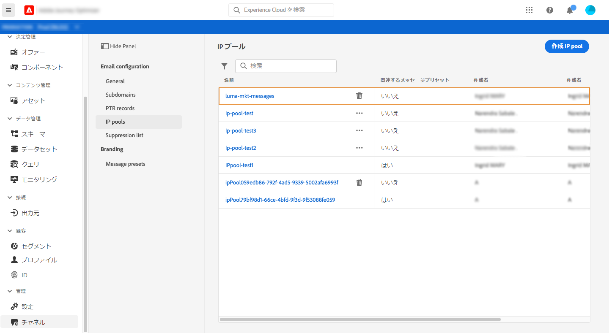
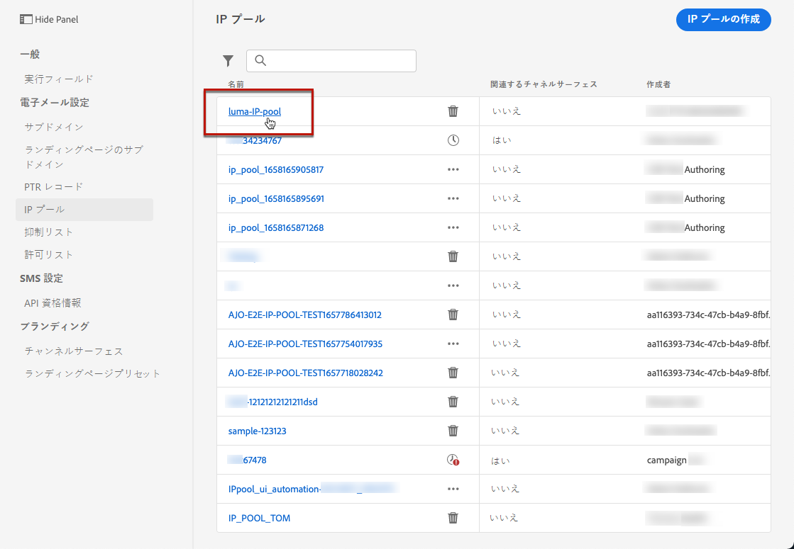

# IP プールの作成 {#create-ip-pools}

>[!CONTEXTUALHELP]
>id="ajo_admin_ip_pool"
>title="IP プールの設定"
>abstract="IP プールを作成して、サブドメインの IP アドレスをグループ化し、電子メールの配信品質を向上させることができます。"

## IP プールについて {#about-ip-pools}

[!DNL Journey Optimizer] では、IP プールを作成して、サブドメインの IP アドレスをグループ化できます。

メールの配信品質を高めるには、IP プールの作成を強くお勧めします。これにより、サブドメインの評判が他のサブドメインに影響を与えるのを防ぐことができます。

例えば、マーケティングメッセージ用に 1 つの IP プールを用意し、トランザクションメッセージ用に別の IP プールを用意することをお勧めします。こうすることで、マーケティングメッセージの 1 つがうまく機能せず、顧客によってスパムと指定された場合でも、この顧客に送信されるトランザクションメッセージには影響せず、顧客は引き続きトランザクションメッセージ（購入確認、パスワード回復メッセージなど）を受信します。

## IP プールの作成 {#create-ip-pool}

IP プールを作成するには、次の手順に従います。

1. 次にアクセス： **[!UICONTROL 管理]** > **[!UICONTROL チャネル]** > **[!UICONTROL IP プール]** メニュー、次に「 **[!UICONTROL IP プールの作成]**.

   

1. IP プールの名前と説明（オプション）を入力します。

   >[!NOTE]
   >
   >名前は文字（A～Z）で始め、英数字または特殊文字（_, ., - ）のみを使用してください。

1. プールに含める IP アドレスをドロップダウンリストから選択し、「**[!UICONTROL 送信]**」をクリックします。

   

   >[!NOTE]
   >
   >インスタンスでプロビジョニングされた IP アドレスがすべてリストに表示されます。

IP プールが作成され、リストに表示されるようになりました。これを選択してプロパティにアクセスし、関連するチャネルサーフェス（メッセージプリセット）を表示できます。 チャネルサーフェスを IP プールに関連付ける方法の詳細については、を参照してください。 [この節](message-presets.md).

## IP プールの編集 {#edit-ip-pool}

IP プールを編集するには :

1. リストで IP プール名をクリックして開きます。

   

1. その IP プールのプロパティを必要に応じて編集します。説明を変更したり、IP アドレスを追加または削除したりできます。

   >[!NOTE]
   >
   >IP プール名は編集できません。変更する場合は、その IP プールを削除し、任意の名前で別の IP プールを作成する必要があります。

   

   >[!CAUTION]
   >
   >IP の削除を検討する際は、細心の注意を払う必要があります。他の IP にかかる負荷が増え、配信品質に重大な影響が出る可能性があるからです。不明な点がある場合は、配信品質のエキスパートにお問い合わせください。

1. 変更を保存します。

更新は、 [チャンネル表面](message-presets.md) または次の場合は除外します。

* IP プールが **not** チャンネルサーフェスに関連付けられている場合、更新は即時 (**[!UICONTROL 成功]** ステータス )。
* IP プールの場合 **が** チャネルサーフェスに関連付けられている場合、更新には最大 3 時間かかる場合があります (**[!UICONTROL 処理中]** ステータス )。

>[!NOTE]
>
>条件 [チャネルサーフェスの作成](message-presets.md#create-message-preset)エディション中の IP プール (**[!UICONTROL 処理中]** ステータス ) に関連付けられ、そのサーフェスに対して選択されたサブドメインに関連付けられていない場合は、サーフェスの作成を続行できません。 [詳細情報](message-presets.md#subdomains-and-ip-pools)

IP プールの更新ステータスを確認するには、「**[!UICONTROL その他のアクション]**」ボタンをクリックし、「**[!UICONTROL 最近の更新]**」を選択します。

>[!NOTE]
>
>IP プールが正常に更新された後、次の時間待機しなければならない場合があります。
>* 単一メッセージで使用されるまでに数分間
>* IP プールの次のバッチがバッチメッセージで有効になるまで

「**[!UICONTROL 削除]**」ボタンを使用して IP プールを削除することもできます。チャネルサーフェスに関連付けられた IP プールは削除できないことに注意してください。

