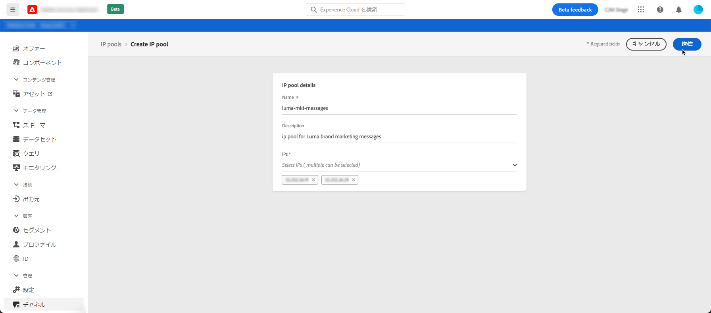
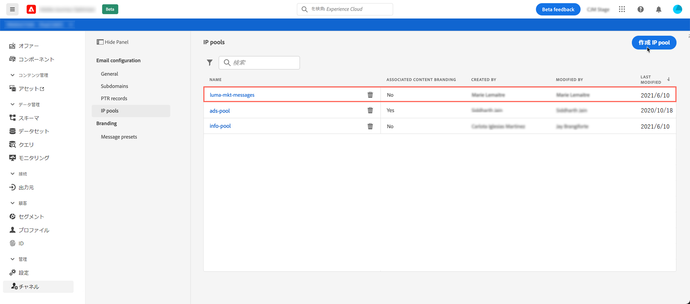

# IP プールの作成 {#create-ip-pools}

## IP プールについて {#about-ip-pools}

Journey Optimizer では、IP プールを作成して、サブドメインの IP アドレスをグループ化できます。

E メールの配信品質を高めるには、IP プールの作成を強くお勧めします。 これにより、サブドメインの評判が他のサブドメインに影響を与えるのを防ぐことができます。

例えば、マーケティングメッセージ用に 1 つの IP プールを用意し、トランザクションメッセージ用に別の IP プールを用意することをお勧めします。 こうすることで、マーケティングメッセージの 1 つがうまく機能せず、顧客によってスパムと指定された場合でも、この顧客に送信されるトランザクションメッセージには影響せず、顧客は引き続きトランザクションメッセージ（購入確認、パスワード回復メッセージなど）を受信します。

## IP プールの作成 {#create-ip-pool}

IP プールを作成するには、次の手順に従います。

1. **[!UICONTROL チャネル]**／**[!UICONTROL IP プール]**&#x200B;メニューにアクセスし、**[!UICONTROL IP プールの作成]**&#x200B;をクリックします。

   

1. IP プールの名前と説明（オプション）を入力します。

   >[!NOTE]
   >
   >サブドメインの名前は文字（A～Z）で始め、英数字または特殊文字（_, ., - ）のみを使用してください。

1. プールに含める IP アドレスをドロップダウンリストから選択し、「**[!UICONTROL 送信]**」をクリックします。

   

   >[!NOTE]
   >
   >インスタンスでプロビジョニングされた IP アドレスがすべてリストに表示されます。

IP プールが作成され、リストに表示されるようになりました。 選択してプロパティにアクセスし、関連するメッセージプリセットを表示することができます。 メッセージプリセットと IP プールを関連付ける方法の詳細は、[この節](message-presets.md))を参照してください。

## IP プールの編集 {#edit-ip-pool}

IP プールを編集するには :

1. リストで IP プール名をクリックして開きます。

   

1. その IP プールのプロパティを必要に応じて編集します。 説明を変更したり、IP アドレスを追加または削除したりできます。

   

   >[!CAUTION]
   >
   >IP の削除を検討する際は、細心の注意を払う必要があります。他の IP にかかる負荷が増え、配信品質に重大な影響が出る可能性があるからです。 不明な点がある場合は、配信品質のエキスパートにお問い合わせください。

1. 変更を保存します。

>[!NOTE]
>
>IP プール名は編集できません。 変更する場合は、その IP プールを削除し、任意の名前で別の IP プールを作成する必要があります。

更新は、IP プールが[メッセージプリセット](message-presets.md)に関連付けられているかどうかに応じて、直ちにまたは非同期に有効になります。

* IP プールがメッセージプリセットで選択されて&#x200B;**いない**&#x200B;場合、更新は直ちに行われます（**[!UICONTROL 成功]**&#x200B;ステータス）。
* IP プールがメッセージプリセットで選択されて&#x200B;**いる**&#x200B;場合、更新には最大 7 ～ 10 営業日かかることがあります（**[!UICONTROL 処理中]**&#x200B;ステータス）。

IP プールの更新ステータスを確認するには、「**[!UICONTROL その他のアクション]**」ボタンをクリックし、「**[!UICONTROL 最近の更新]**」を選択します。

>[!NOTE]
>
>IP プールが正常に更新された後、次の時間待機しなければならない場合があります。
>* 単一メッセージで消費されるまで数分間
>* IP プールの次のバッチがバッチメッセージで有効になるまで

「**[!UICONTROL 削除]**」ボタンを使用して IP プールを削除することもできます。 メッセージプリセットに関連付けられている IP プールは削除できません。

