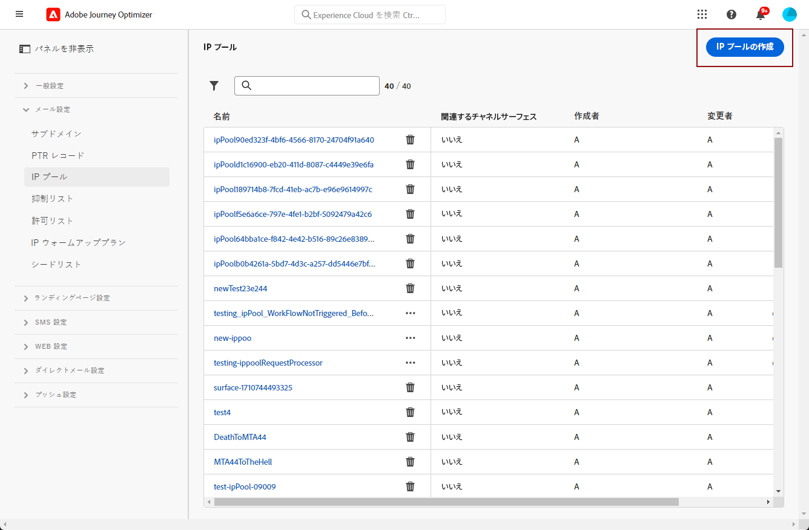

# IP プールの作成 {#create-ip-pools}

>[!CONTEXTUALHELP]
>id="ajo_admin_ip_pool_header"
>title="IP プールの設定"
>abstract="IP プールは、サブドメインの IP アドレスを収集して、メールの配信品質を向上させます。"

>[!CONTEXTUALHELP]
>id="ajo_admin_ip_pool"
>title="IP プールの設定"
>abstract="Journey Optimizer では、IP プールを作成して、サブドメインの IP アドレスをグループ化できます。これにより、サブドメインの評価が他のサブドメインに影響を与えるのを防ぐことができるので、メールの配信品質が大幅に向上する可能性があります。"

## IP プールについて {#about-ip-pools}

[!DNL Journey Optimizer] では、IP プールを作成して、サブドメインの IP アドレスをグループ化できます。

メールの配信品質を高めるには、IP プールの作成を強くお勧めします。これにより、サブドメインの評判が他のサブドメインに影響を与えるのを防ぐことができます。

例えば、マーケティングメッセージ用に 1 つの IP プールを用意し、トランザクションメッセージ用に別の IP プールを用意することをお勧めします。こうすることで、マーケティングメッセージの 1 つがうまく機能せず、顧客によってスパムと指定された場合でも、この顧客に送信されるトランザクションメッセージには影響せず、顧客は引き続きトランザクションメッセージ（購入確認、パスワード回復メッセージなど）を受信します。

>[!CAUTION]
>
>IP プールの設定は、すべての環境に共通です。したがって、IP プールの作成や編集は、実稼動用サンドボックスにも影響を与えます。

## IP プールの作成 {#create-ip-pool}

IP プールを作成するには、次の手順に従います。

1. **[!UICONTROL 管理]**／**[!UICONTROL チャネル]**／**[!UICONTROL メール設定]**／**[!UICONTROL IP プール]**&#x200B;メニューにアクセスし、「**[!UICONTROL IP プールを作成]**」をクリックします。

   

1. IP プールの名前と説明（オプション）を入力します。

   >[!NOTE]
   >
   >名前は文字（A～Z）で始め、英数字または特殊文字（_, ., - ）のみを使用してください。

1. プールに含める IP アドレスをドロップダウンリストから選択し、「**[!UICONTROL 送信]**」をクリックします。

   

   >[!NOTE]
   >
   >インスタンスでプロビジョニングされた IP アドレスがすべてリストに表示されます。

IP を選択すると、IP に関連付けられた PTR レコードがリストから表示されます。 これにより、IP プールを作成する際に各 IP のブランディング情報を検証し、例えば同じブランディング情報を持つ IP を選択できます。 [PTR レコードについての詳細情報](ptr-records.md)

>[!NOTE]
>
>IP に対して PTR レコードが設定されていない場合は、その IP を選択できません。その IP の PTR レコードを設定するには、アドビ担当者にお問い合わせください。<!--Now this only happens when first subdomain delegated to Adobe is with CNAME method.-->

IP プールが作成された後、IP プールのドロップダウンリストの下に表示される IP アドレスにカーソルを合わせると、PTR 情報が表示されます。

IP プールが作成され、リストに表示されるようになりました。選択してプロパティにアクセスし、関連するチャネル設定（メッセージプリセットなど）を表示することができます。チャネル設定と IP プールを関連付ける方法について詳しくは、[この節](channel-surfaces.md)を参照してください。

## IP プールの編集 {#edit-ip-pool}

IP プールを編集するには、次の手順に従います。

1. リストで IP プール名をクリックして開きます。

1. その IP プールのプロパティを必要に応じて編集します。説明を変更したり、IP アドレスを追加または削除したりできます。

   >[!NOTE]
   >
   >IP プール名は編集できません。変更する場合は、その IP プールを削除し、任意の名前で別の IP プールを作成する必要があります。

   

   >[!CAUTION]
   >
   >IP の削除を検討する際は、細心の注意を払う必要があります。他の IP にかかる負荷が増え、配信品質に重大な影響が出る可能性があるからです。不明な点がある場合は、配信品質のエキスパートにお問い合わせください。

1. 変更を保存します。

更新は、IP プールが[チャネル設定](channel-surfaces.md)に関連付けられているかどうかに応じて、直ちにまたは非同期に有効になります。

* IP プールがチャネル設定に関連付けられて&#x200B;**いない**&#x200B;場合、更新は直ちに行われます（**[!UICONTROL 成功]**&#x200B;ステータス）。
* IP プールがチャネル設定に関連付けられて&#x200B;**いる**&#x200B;場合、更新には最大 3 時間かかることがあります（**[!UICONTROL 処理中]**&#x200B;ステータス）。

>[!NOTE]
>
>[チャネル設定の作成](channel-surfaces.md#create-channel-surface)時、編集中の IP プール（**[!UICONTROL 処理中]**&#x200B;ステータス）を選択しており、その設定用に選択されたサブドメインに関連付けられていない場合は、設定の作成を続行できません。[詳細情報](channel-surfaces.md#create-channel-surface)

IP プールの更新ステータスを確認するには、「**[!UICONTROL その他のアクション]**」ボタンをクリックし、「**[!UICONTROL 最近の更新]**」を選択します。

>[!NOTE]
>
>IP プールが正常に更新された後、次の時間待機しなければならない場合があります。
>
>* 単一メッセージで使用されるまでに数分間
>* IP プールの次のバッチがバッチメッセージで有効になるまで

「**[!UICONTROL 削除]**」ボタンを使用して IP プールを削除することもできます。チャネル設定に関連付けられている IP プールは削除できません。

