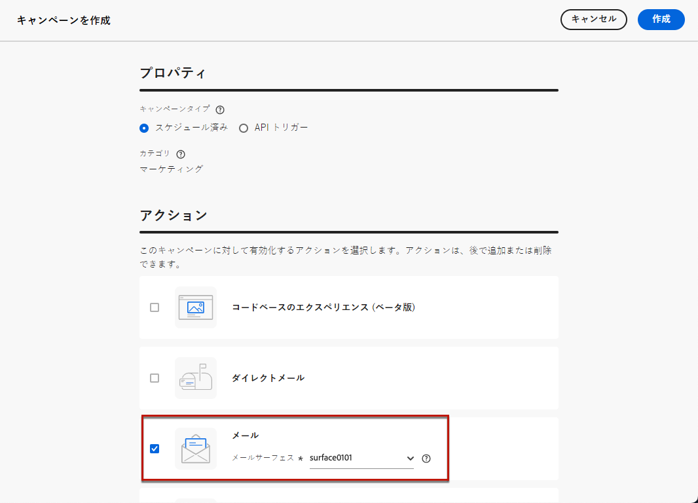
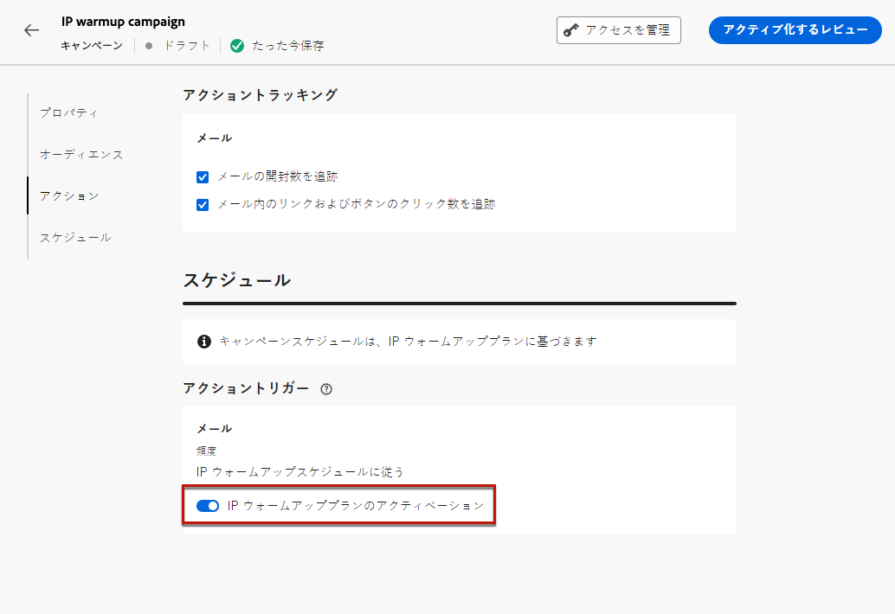
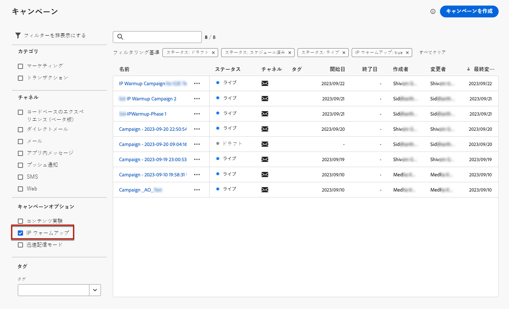

# IP ウォームアップキャンペーンを作成 {#create-ip-warmup-campaign}

>[!CONTEXTUALHELP]
>id="ajo_campaign_ip_warmup"
>title="IP ウォームアッププランオプションを有効にする"
>abstract="このオプションを選択すると、キャンペーンを IP ウォームアッププランで使用できます。その後、キャンペーンスケジュールは、関連付けられている IP ウォームアッププランによって実行されます。"

[!DNL Journey Optimizer] で IP ウォームアッププラン自体を作成する前に、まず IP ウォームアッププランで使用するために特別に設計された 1 つ以上のキャンペーンを作成する必要があります<!--through a dedicated option-->。

IP ウォームアップキャンペーンを作成するには、次の手順に従います。

1. ドメインの [ メール ](../email/email-settings.md) チャネル [ 設定 ](channel-surfaces.md) と、ウォームアッププランのために識別した IP を作成します。

   >[!NOTE]
   >
   >メール設定で使用するドメインと IP を選択する方法については、[ この節 ](../email/email-settings.md#subdomains-and-ip-pools) を参照してください。
   >
   >* 配信品質コンサルタントと協力して、IP ウォームアッププランに使用するドメインと IP を特定します。<!--TBC-->

1. スケジュールされたマーケティング[キャンペーン](../campaigns/create-campaign.md)を作成し、[メール](../email/create-email.md#create-email-journey-campaign)アクションを選択します。

   <!--Select the Marketing category. The IP warmup plan activation option is only available for  marketing-type campaigns.-->

1. IP ウォームアップ用に作成した設定を選択します。

   

   <!--You must use the same configuration as the one that will be used for the asociated IP warmup plan. [Learn how to create an IP warmup plan](#create-ip-warmup-plan)-->

1. 「**[!UICONTROL 作成]**」をクリックします。

1. 「**[!UICONTROL スケジュール]**」セクションから、「**[!UICONTROL IP ウォームアッププランのアクティブ化]**」を選択します。

   

   キャンペーン[スケジュール](../campaigns/create-campaign.md#schedule)が、関連付けられる IP ウォームアッププランによって実行されます。つまり、スケジュールはキャンペーン自体で定義されなくなります。

1. キャンペーンプロパティ、[オーディエンス](../audience/about-audiences.md)<!--best practices for IP warmup in terms of audience?-->、[コンテンツ](../email/get-started-email-design.md#key-steps)など、メールキャンペーンを作成する手順を完了します。

   IP ウォームアップキャンペーンでは、ルールベースのオーディエンスを選択する必要があります。[詳細情報](../audience/creating-a-segment-definition.md)

   キャンペーンの設定方法について詳しくは、[このページ](../campaigns/get-started-with-campaigns.md)を参照してください。

1. キャンペーンを[アクティブ化](../campaigns/review-activate-campaign.md)します。ステータスは、「**[!UICONTROL ライブ]**」に変わります。

   IP ウォームアッププランではビジネスルールを使用しないでください。これらのルールを適用すると、キャンペーンのターゲットプロファイルの希望数に到達できなくなる可能性があります。

   IP ウォームアッププランが有効化されたライブキャンペーンの場合、**[!UICONTROL 削除]**&#x200B;ボタンは、IP ウォームアッププランに関連付けられるまで使用できます。プランで使用すると、キャンペーンは削除できなくなります。

1. キャンペーンが&#x200B;**[!UICONTROL キャンペーン]**&#x200B;リストに表示されます。現在のサンドボックスで作成されたすべての IP ウォームアップキャンペーンを簡単に取得するには、**[!UICONTROL IP ウォームアップ]**&#x200B;キャンペーンオプションでフィルタリングできます。

   

ライブになると、キャンペーンは IP ウォームアッププランで使用できる状態になります。[詳細情報](ip-warmup-plan.md)

IP ウォームアップキャンペーンは、1 つの IP ウォームアッププランでのみ使用できます。ただし、同じ IP ウォームアッププランの 1 つ以上のフェーズで同じキャンペーンを使用できます。[詳細情報](ip-warmup-plan.md#define-phases)

>[!NOTE]
>
>ライブキャンペーンが IP ウォームアッププランで使用されている場合、プランが[完了済みとしてマーク](ip-warmup-execution.md#mark-as-completed)されると、そのキャンペーンのステータスは 「**[!UICONTROL 停止済み]**」に変わります。

