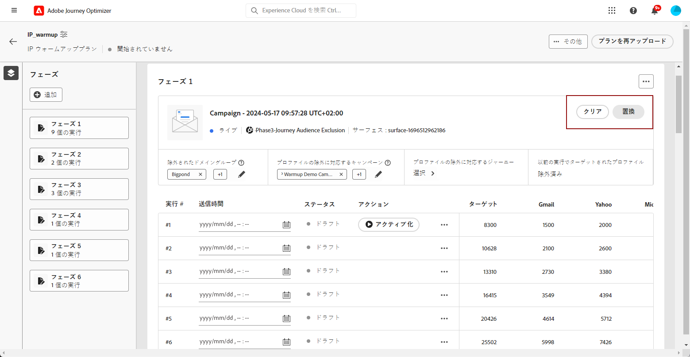
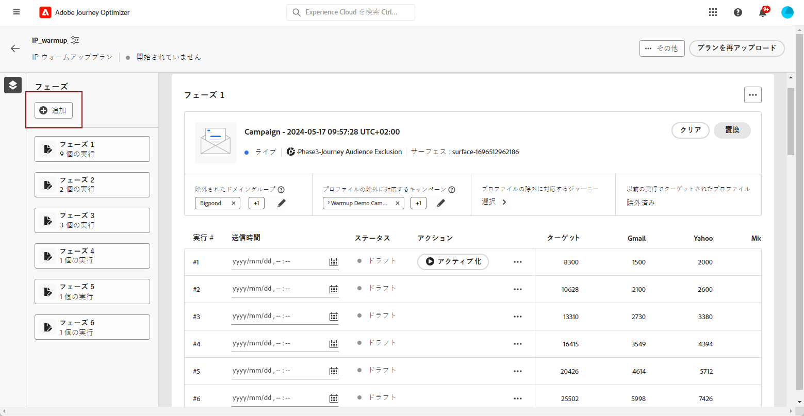
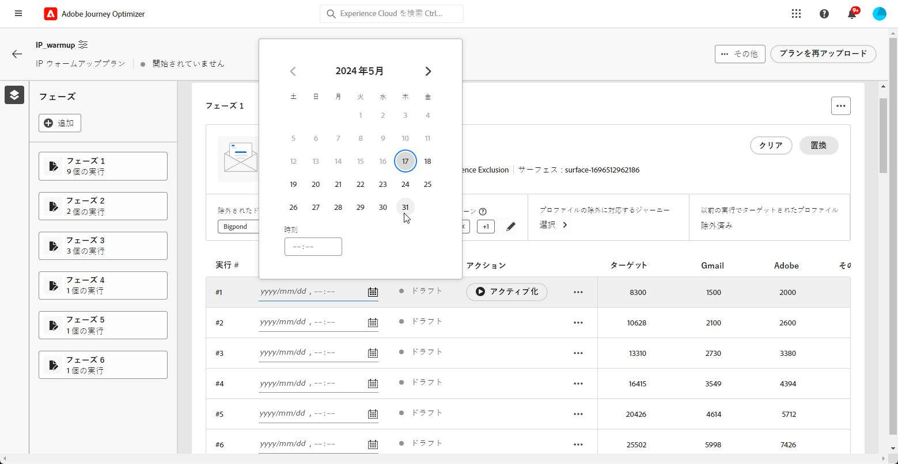
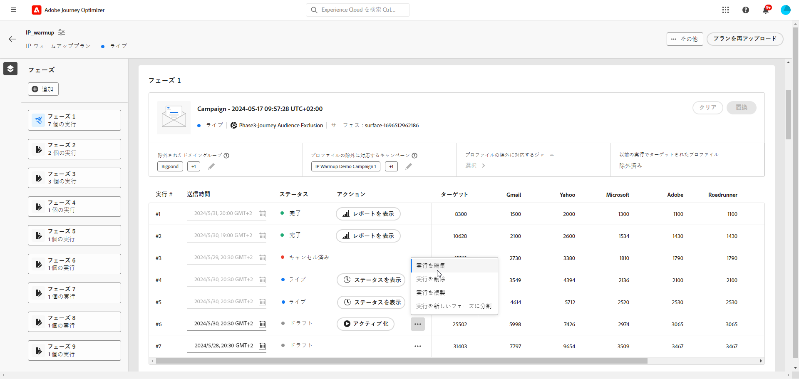
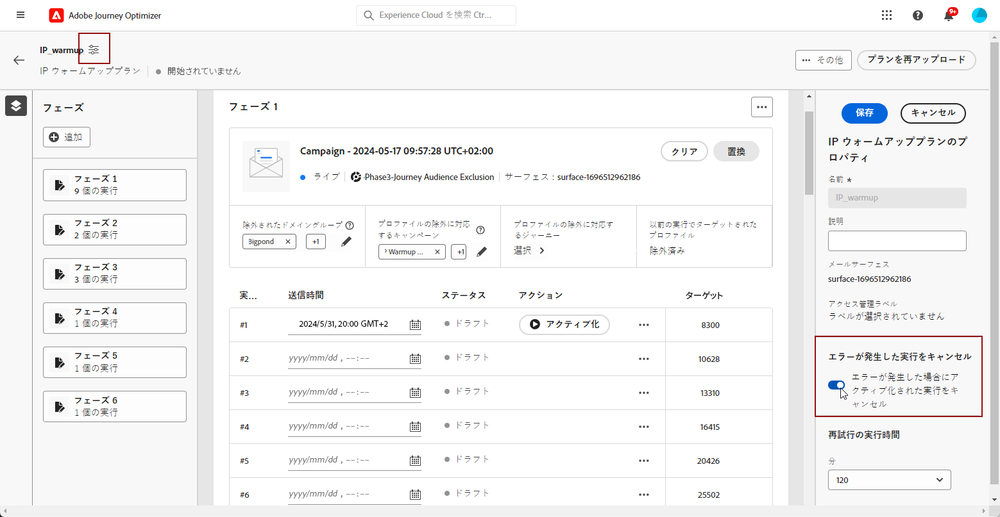
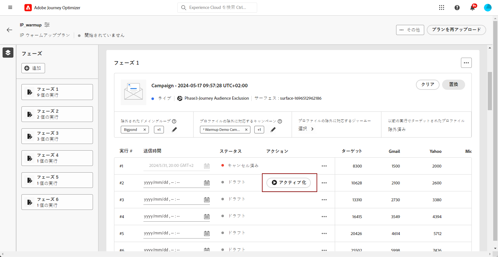
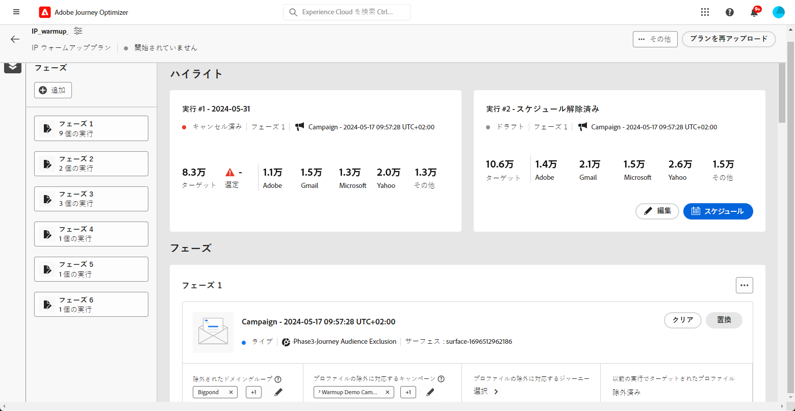
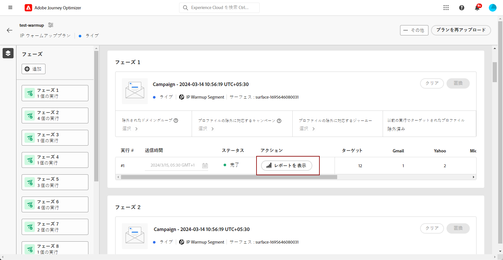
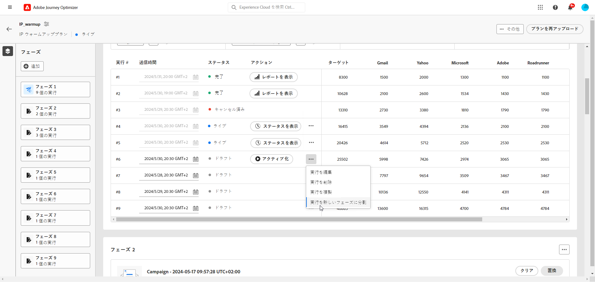

# IP ウォームアッププランを実行 {#ip-warmup-running}

>[!BEGINSHADEBOX]

このドキュメントガイドの内容は次のとおりです。

* [IP ウォームアッププランの概要](ip-warmup-gs.md)
* [IP ウォームアップキャンペーンを作成](ip-warmup-campaign.md)
* [IP ウォームアッププランを作成](ip-warmup-plan.md)
* **[IP ウォームアッププランの実行](ip-warmup-execution.md)**

>[!ENDSHADEBOX]

[IP ウォームアッププランを作成](ip-warmup-plan.md)し、配信品質コンサルタントと共に準備したファイルをアップロードしたら、プランのフェーズと実行を定義できます。

各フェーズは複数の実行で構成され、それらの実行に 1 つのキャンペーンを割り当てます。

## フェーズの定義 {#define-phases}

>[!CONTEXTUALHELP]
>id="ajo_admin_ip_warmup_campaigns_excluded"
>title="キャンペーンオーディエンスの除外"
>abstract="現在のフェーズからオーディエンスを除外するキャンペーンを選択します。これは、他のフェーズや他の IP ウォームアッププランから以前にコンタクトされたプロファイルが、再びターゲットにされるのを防ぐためです。"

>[!CONTEXTUALHELP]
>id="ajo_admin_ip_warmup_domains_excluded"
>title="ドメイングループの除外"
>abstract="現在のフェーズから除外するドメインを選択します。ドメインの除外には実行されないフェーズが必要なので、場合によっては、実行フェーズを分割して除外を追加する必要があります。"
>additional-url="https://experienceleague.adobe.com/docs/journey-optimizer/using/configuration/implement-ip-warmup-plan/ip-warmup-execution.html?lang=ja#split-phase" text="フェーズの分割"

>[!CONTEXTUALHELP]
>id="ajo_admin_ip_warmup_phases"
>title="プランのフェーズの定義"
>abstract="各フェーズは複数の実行で構成され、それらの実行に 1 つのキャンペーンを割り当てます。"

<!--You need to associate the campaign and audience at phase level and turns on some settings as needed for all runs associated with a single creative/campaign

At phase level, system ensures that previously targeted + new profiles are picked up AND at iteration level, system ensures that each run is having unique profiles and the count matches what is stated in plan-->

<!---->

1. フェーズごとに、IP ウォームアッププランのこのフェーズに関連付けるキャンペーンを選択します。

   >[!NOTE]
   >
   >別の IP ウォームアッププランで既に使用中のキャンペーンは選択できません。ただし、同じ IP ウォームアッププランの 1 つ以上のフェーズで同じキャンペーンを使用できます。

   

   >[!IMPORTANT]
   >
   >* 「**[!UICONTROL IP ウォームアッププランのアクティベーション]**」オプションが有効になっているキャンペーンのみを選択できます。[詳細情報](#create-ip-warmup-campaign)
   >
   >* 現在の IP ウォームアッププランで選択したものと同じサーフェスを使用するキャンペーンを選択する必要があります。

1. 現在のフェーズでキャンペーンを選択すると、プロファイル、キャンペーンオーディエンス、ドメイングループを除外するセクションが表示されます。

   >[!NOTE]
   >
   >実行をアクティブ化すると、新しいフェーズに[実行を分割](#split-phase)しない限り、除外を変更することはできません。

   1. 「**[!UICONTROL 除外されたドメイングループ]**」セクションで、そのフェーズから除外するドメインを選択します。

      >[!NOTE]
      >
      >ドメインの除外には実行されないフェーズが必要なので、場合によっては、[実行フェーズを分割](#split-phase)して除外を追加する必要があります。

      

      例えば、IP ウォームアップを数日間実行した後、ドメイン（Adobe など）での ISP の評判が良くないことに気付き、IP ウォームアッププランを停止せずに解決したいとします。このような場合は、Adobe ドメイングループを除外できます。

      >[!NOTE]
      >
      >除外できるのは、[IP ウォームアッププランテンプレート](ip-warmup-plan.md#prepare-file)に追加されたカスタムドメイングループのみです。そうでない場合は、除外するカスタムドメイングループでテンプレートを更新し、[プランを再度アップロード](#re-upload-plan)します。

   1. から **[!UICONTROL プロファイル除外キャンペーン]** 「」セクションで、現在のフェーズから除外するオーディエンスを持つキャンペーンを選択します。

      

      例えば、フェーズ 1 の実行中に、何らかの理由で[フェーズを分割](#split-phase)する必要があったとします。そのため、フェーズ 1 で使用したキャンペーンを除外して、フェーズ 1 で以前にコンタクトしたプロファイルがフェーズ 2 に含まれないようにすることができます。他の IP ウォームアッププランからキャンペーンを除外することもできます。

   1. から **[!UICONTROL プロファイルの除外ジャーニー]** 「」セクションで、現在のフェーズから除外するオーディエンスを含むジャーニーを選択します。

+++ プロファイルの除外にジャーニーオプションを使用するには、AJO メッセージフィードバックイベントと AJO エンティティレコードスキーマの間に関係を確立する必要があります。

      1. カスタムの作成 **名前空間** これは、以下の手順の ID タイプとして機能します。

      1. からAdobe Experience Platformへのアクセス **スキーマ** メニューで、 **AJO エンティティレコードスキーマ** を設定して、 **_id** 「」フィールドにプライマリ id を入力し、以前に作成した名前空間をとして選択します **ID 名前空間**.

      1. から **スキーマ** メニューで、 **AJO メッセージフィードバックイベントスキーマ**&#x200B;に移動し、に移動します **_messageID** フィールド。 を選択 **関係を追加** を選択します **AJO エンティティレコードスキーマ** as the **参照スキーマ** および以前に作成した名前空間を **参照 ID 名前空間**.
+++

   1. が含まれる **[!UICONTROL 以前の実行でターゲット設定されたプロファイル]** セクションを見ると、そのフェーズの以前の実行からのプロファイルが常に除外されていることがわかります。 例えば、実行 #1 で、ターゲットとなる最初の 4,800 人のユーザーがプロファイルに含まれていた場合、システムは自動的に、同じプロファイルが実行 #2 でメールを受信しないようにします。

      >[!NOTE]
      >
      >このセクションは編集できません。

1. 必要に応じて、を使用してキャンペーンを置換できます **[!UICONTROL 置換]** ボタン。 選択したキャンペーンをクリアするには、 **[!UICONTROL 消去]** ボタン。 その後、すぐに新しいキャンペーンを選択することも、後で選択することもできます。

   

   >[!NOTE]
   >
   >このアクションは、フェーズの最初の実行をアクティブ化する前にのみ可能です。実行をアクティブ化すると、新しいフェーズに[実行を分割](#split-phase)しない限り、キャンペーンを置き換えることはできません。

1. 必要に応じて、フェーズを追加できます。現在の最終フェーズの後に追加されます。

   

1. 「**[!UICONTROL フェーズを削除]**」ボタンを使用して、不要なフェーズを削除します。このアクションは、フェーズで実行が行われない場合にのみ使用できます。<!--Once a run is executed, deletion is not allowed.-->

   >[!CAUTION]
   >
   >を元に戻すことはできません **[!UICONTROL フェーズを削除]** アクション。

   

   >[!NOTE]
   >
   >IP ウォームアッププランからすべてのフェーズを削除する場合は、プランを再アップロードすることをお勧めします。[詳細情報](#re-upload-plan)

## 実行の定義 {#define-runs}

>[!CONTEXTUALHELP]
>id="ajo_admin_ip_warmup_run"
>title="各実行の定義"
>abstract="すべてのフェーズの各実行を定義しアクティブ化します。"

>[!CONTEXTUALHELP]
>id="ajo_admin_ip_warmup_last_engagement"
>title="エンゲージメントに関するフィルタリング"
>abstract="この列は、例えば、過去 20 日間にブランドとエンゲージしたユーザーのみをターゲットにするフィルターです。この設定は、「**実行を編集**」オプションから変更することもできます。"

>[!CONTEXTUALHELP]
>id="ajo_admin_ip_warmup_retry"
>title="時間枠を設定"
>abstract="セグメント化ジョブに遅延が生じた場合に、IP ウォームアップキャンペーンを実行できる時間枠を定義できます。"

>[!CONTEXTUALHELP]
>id="ajo_admin_ip_warmup_pause"
>title="オーディエンスエラーによる実行をキャンセル"
>abstract="オーディエンスが実行に対して評価された後で、適格なプロファイルより小さい場合に、このオプションを選択して実行をキャンセルします。"

>[!CONTEXTUALHELP]
>id="ajo_admin_ip_warmup_qualified"
>title="認定プロファイルを表示"
>abstract="この列には、認定プロファイルの数が表示されます。オーディエンスが実行に対して評価された後も、認定されたプロファイルよりもターゲットプロファイルが多い場合は、次の場合を除き、実行が実行されます。 **エラーが発生した場合はアクティブ化された実行をキャンセル** 」オプションが有効になっています。 この場合、実行はキャンセルされます。"

1. 各実行のスケジュールを選択して、指定した時間に実行されるようにします。

   

1. オプションで、[オーディエンスの評価](https://experienceleague.adobe.com/docs/experience-platform/segmentation/home.html?lang=ja#how-segmentation-works){target="_blank"}に遅延が生じた場合に、IP ウォームアップキャンペーンを実行できる時間枠を定義できます。これを行うには、左上のプラン名の横にある「プロパティ」アイコンをクリックし、**[!UICONTROL 再試行の実行時間]**&#x200B;ドロップダウンリストを使用して、最大 240 分（4 時間）の期間を選択します。

   >[!NOTE]
   >
   >再試行は、定義された時間枠が終了するまで 30 分ごとに行われます。

   

   例えば、特定の日の午前 9 時に送信時間を設定し、再試行の実行時間として 120 分を選択すると、オーディエンスの評価に予期しない遅延が生じた場合に備えて、実行を行う機会が 2 時間（午前 9 時～午前 11 時）になります。

   >[!NOTE]
   >
   >時間枠を指定しない場合、送信時に実行が試行され、オーディエンスの評価が完了していないと失敗します。

1. 必要に応じて、その他のアクションアイコンから「**[!UICONTROL 実行を編集]**」を選択します。各列のアドレス数を更新できます。を更新することもできます **[!UICONTROL 前回のエンゲージメント]** 例えば、過去 20 日間にブランドとエンゲージしたユーザーのみをターゲットにするフィールドです。

   >[!NOTE]
   >
   >配信品質のエキスパートに相談して、これらの数値を変更することをお勧めします。

   

   >[!NOTE]
   >
   >実行にエンゲージメント期間を適用しない場合は、 **[!UICONTROL 前回のエンゲージメント]** フィールド。

1. 「」を選択します **[!UICONTROL エラーが発生した場合はアクティブ化された実行をキャンセル]** オーディエンスが評価された実行で、認定プロファイルがターゲットプロファイルよりも少ない場合に、実行をキャンセルするオプション。 その場合、実行は&#x200B;**[!UICONTROL 失敗]**&#x200B;ステータスになります。

   

1. 実行を&#x200B;**[!UICONTROL アクティブ化]**&#x200B;します。[詳細情報](#activate-run)

1. この実行のステータスは、**[!UICONTROL ライブ]**&#x200B;に変わります。つまり、システムが実行をスケジュールするリクエストを受け入れたことになります。

   >[!NOTE]
   >
   >様々な実行ステータスは、[この節](#monitor-plan)に記載されています。

1. キャンペーンの実行が開始されていない場合は、ライブ実行をキャンセルできます。 このアクションは、実行スケジュールを実際にキャンセルします。送信は停止されません。

   

1. ドラフト、ライブまたは完了した実行を複製するには、以下を選択します。 **[!UICONTROL 実行を複製]**. 複製時に、「実行を編集」メニューが表示され、ユーザーが以下を調整できます **[!UICONTROL 合計ターゲットプロファイル数]** および **[!UICONTROL 送信時間]** 必要に応じて。

   

## 実行をアクティブ化 {#activate-run}

実行をアクティブ化するには、「**[!UICONTROL アクティブ化]**」ボタンを選択します。その後、日単位で次の実行をアクティブ化できます。

複数の IP ウォームアッププランを同時に実行する場合、すべてが同じ IP プールとドメインをターゲットにしているので、潜在的な結果を予測することが重要です。 例えば、ISP が 1 日に 100 通のメールという制限を適用している場合、同じドメインをターゲットにして複数のプランを実行すると、このしきい値を超える可能性があります。

[オーディエンスの評価](https://experienceleague.adobe.com/docs/experience-platform/segmentation/home.html?lang=ja#how-segmentation-works){target="_blank"}を実行するのに十分な時間をスケジュールしていることを確認してください。

>[!CAUTION]
>
>各実行は、実際の送信時間の 12 時間以上前にアクティブ化する必要があります。そうしない場合、オーディエンスの評価が完了しない場合があります。

実行をアクティブ化すると、複数のオーディエンスが自動的に作成されます。

* フェーズの最初の実行をアクティブ化する場合：

   * [オーディエンス](https://experienceleague.adobe.com/docs/experience-platform/segmentation/ui/segment-builder.html?lang=ja){target="_blank"}は、除外されたキャンペーンオーディエンス（存在する場合）に対して、`<warmupName>_Phase<phaseNo>-Audience Exclusion` という命名規則で作成されます。

   * 除外されたドメイングループ（存在する場合）に対して別のオーディエンスが、`<warmupName>_Phase<phaseNo>-Domain Exclusion` という命名規則で作成されます。

  >[!NOTE]
  >
  >ウォームアッププランが完了とマークされた後、オーディエンスはクリーンアップされます。
  >
  >後のフェーズで除外されたキャンペーンオーディエンスまたはドメイングループに変更がない場合、システムは新しいオーディエンスを作成しません。

* 任意の実行をアクティブ化する場合：

   * 最後のエンゲージメントフィルターに対して別のオーディエンスが、`<warmupName>_Phase<phaseNo>_Run<runNo>-Engagement Filter` という命名規則で作成されます。

     >[!NOTE]
     >
     >ウォームアッププランが完了とマークされた後、オーディエンスはクリーンアップされます。
     >
     >後のフェーズで最後のエンゲージメントフィルターに変更がない場合、システムは新しいオーディエンスを作成しません。

   * [オーディエンスの構成](https://experienceleague.adobe.com/docs/experience-platform/segmentation/ui/audience-composition.html?lang=ja){target="_blank"}は、`<warmupName>-Phase<phaseNo>-Run<runNo>` という命名規則に従って、キャンペーンの送信先となるオーディエンスに対応して作成されます。

     >[!NOTE]
     >
     >実行ごとに新しいオーディエンス構成が作成されます。 上限が 10 の場合、公開済みのオーディエンス構成を使用して複数のキャンペーン、ジャーニー、IP ウォームアッププランを同時に実行するユーザーは、並列操作に対してこの上限内に収まるように事前に計画する必要があります。
     >
     >次の反復をアクティブ化すると、オーディエンスの構成（つまり出力オーディエンス）がクリーンアップされます。

<!--How do you know when segmentation is complete? Is there a way to prevent user from scheduling less than 12 hours before the segmentation job?-->

<!--Sart to execute on every day basis by simply clicking the play button > for each run? do you have to come back every day to activate each run? or can you schedule them one after the other?)-->

<!--Upon activation, when the segment evaluation happens, more segments will be created by the IP warmup service and will be leveraged in an audience composition and a new audience will be created for each run splitted into the different selected domains.-->

## プランを監視 {#monitor-plan}

IP ウォームアッププランを正常に実行するには、レポートを監視し、実行をアクティブ化して、そのステータスを日単位で確認する必要があります。

### 「ハイライト」セクションを使用 {#highlights}

フェーズに対して最初の実行をアクティブ化すると、「**[!UICONTROL ハイライト]**」セクションが表示されます。

これにより、現在の実行と今後の実行に関する簡単な概要を表示できます。また、このセクションから、次の実行を編集してアクティブ化することもできます。

### 実行ステータスを確認 {#run-statuses}

IP ウォームアッププラン自体は、1 か所で統合レポートとして機能します。各フェーズの「**[!UICONTROL ライブ]**」または「**[!UICONTROL 完了]**」の実行数などの要素をチェックして、IP ウォームアッププランの進捗状況を確認できます。

>[!NOTE]
>
>ベストプラクティスとして、IP ウォームアッププランを日単位で監視することをお勧めします。

実行には以下のステータスがあります。

* **[!UICONTROL ドラフト]**：「[新しいプランを作成](ip-warmup-plan.md)」する際、またはユーザーインターフェイスから「[実行を追加](#define-runs)」する際、実行が作成されるたびに、その実行は&#x200B;**[!UICONTROL ドラフト]**&#x200B;ステータスになります。
* **[!UICONTROL ライブ]**：実行をアクティブ化するたびに、**[!UICONTROL ライブ]**&#x200B;ステータスが取得されます。つまり、システムが実行のスケジュール設定のリクエストを受け入れたことを意味し、送信が開始されたことではありません。 この段階で、をクリックすると、ライブ実行のステータスを確認できます。 **[!UICONTROL ステータスを表示]** テーブル内のボタン。 これにより、実際に認定されたターゲットプロファイルの数を追跡できます。
* **[!UICONTROL 完了済み]**：この実行のキャンペーン実行が完了しました。 詳細な実行レポートにアクセスするには、 **[!UICONTROL レポートを表示]** ボタンをクリックします。 このオプションを使用すると、強化されたモニタリング用のドメイングループに固有の分類など、実行のメール配信ステータスを追跡できます。 [詳細情報](#reports)
* **[!UICONTROL キャンセル済み]**:a **[!UICONTROL ライブ]** の実行はを使用してキャンセルされました **[!UICONTROL 停止]** ボタンをクリックするか、 **[!UICONTROL エラーが発生した場合はアクティブ化された実行をキャンセル]** オプションとエラーが発生しました。 [詳細情報](#define-runs)
* **[!UICONTROL 失敗]**：システムでエラーが発生したか、現在のフェーズで使用されているキャンペーンが停止されました。実行が失敗した場合は、別の実行を次の日にスケジュールできます。

### レポートを使用 {#reports}

より一般的に、プランの影響を測定するには、[!DNL Journey Optimizer] キャンペーンレポートを使用して IP ウォームアップキャンペーンのパフォーマンスを確認できます。これを行うには、完了した実行ごとに、「**[!UICONTROL レポートを表示]**」ボタンをクリックします。キャンペーンメールについて詳しくは、[ライブレポート](../reports/campaign-live-report.md#email-live)と[グローバルレポート](../reports/campaign-global-report.md#email-global)を参照してください。

また、プランでは別のキャンペーンが使用されている可能性があるので、[キャンペーンメニュー](../campaigns/modify-stop-campaign.md#access)からレポートにアクセスすることもできます。

## プランを管理 {#manage-plan}

IP ウォームアッププランが期待どおりに実行されない場合は、いつでも以下のアクションを実行できます。

### フェーズの分割 {#split-phase}

特定の実行から始まる新しいフェーズを追加する場合は、 **[!UICONTROL 新しいフェーズへの分割の実行]** 「その他のアクション」アイコンからオプションを選択します。

現在のフェーズの残りの実行に対して新しいフェーズが作成されます。

例えば、実行 #4 に対してこのオプションを選択すると、実行 #4～#8 は現在のフェーズ直後の新規フェーズに移動します。

[上記](#define-phases)の手順に従って、新しいフェーズを定義します。

* を使用できます **[!UICONTROL 置換]** または **[!UICONTROL 消去]** その新しいフェーズのオプション。

* 前のキャンペーンやパパフォーマンスの低いドメインを除外することもできます。[この節](#define-phases)でその方法を説明します。

<!--
You don't have to decide the campaign upfront. You can do a split later. It's a work in progress plan: you activate one run at a time with a campaign and you always have the flexibility to modify it while working on it.

But need to explain in which case you want to modify campaigns, provide examples
-->

### IP ウォームアッププランを再アップロード {#re-upload-plan}

IP ウォームアッププランが期待どおりに実行されない場合（一部の ISP がメッセージをスパムとしてマークしている場合など）は、配信品質のエキスパートに別の IP ウォームアッププランファイルを設定するよう依頼し、対応するボタンを使用して再アップロードできます。

以前に実行されたすべての実行は読み取り専用になります。最初のプランの下に新しいプランが表示されます。

[上記](#define-phases)の手順に従って、新しいプランのフェーズを定義します。

>[!NOTE]
>
>IP ウォームアッププランの詳細は、新しくアップロードされたファイルに従って変更されます。以前に実行した実行（[ステータス](#monitor-plan)に関係なく）は影響を受けません。

例を見てみましょう。

* 初期の IP のウォームアッププランでは、フェーズ 2 は 9 回実行されました。

* 4 回の実行が実行されました（失敗したか、完了したか、キャンセルされたかは関係ありません<!--as long as a run has been attempted, it is an executed run-->）。

* 新しいプランを再アップロードすると、最初の 4 回の実行を含むフェーズ 2 は読み取り専用モードになります。

* 残りの 5 回の実行（ドラフト状態）は、新たにアップロードされたプランに従って表示される新規フェーズ（フェーズ 3）に移動します。

### プランを完了済みとしてマーク {#mark-as-completed}

プランのパフォーマンスが不十分な場合や、プランを削除して別のプランを作成する場合は、プランを完了とマークできます。

これを行うには、IP ウォームアッププランの右上にある「**[!UICONTROL その他]**」ボタンをクリックして、「**[!UICONTROL 完了済みとしてマーク]**」を選択します。

このオプションは、プラン内のすべての実行が「**[!UICONTROL 完了]**」または「**[!UICONTROL ドラフト]**」ステータスである場合にのみ使用できます。実行が「**[!UICONTROL ライブ]**」の場合、オプションはグレー表示になります。

様々な実行ステータスは、[この節](#monitor-plan)に記載されています。

