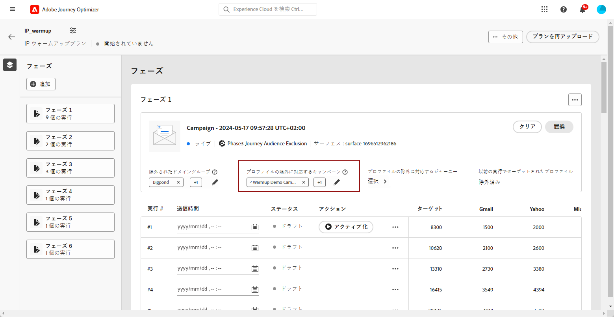
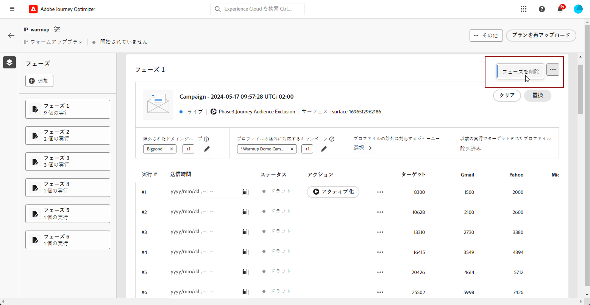
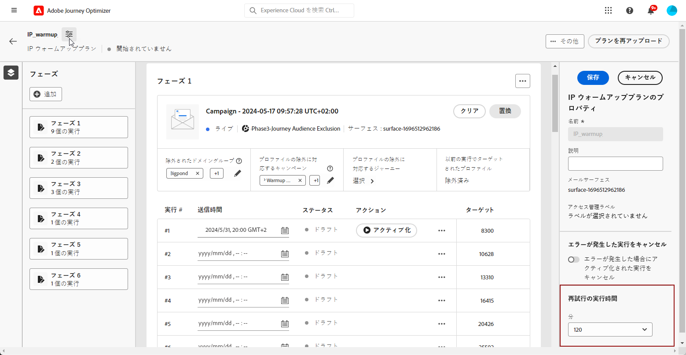

# IP ウォームアッププランを実行 {#ip-warmup-running}

>[!BEGINSHADEBOX]

このドキュメントガイドの内容は次のとおりです。

* [IP ウォームアップの概要](ip-warmup-gs.md)
* [IP ウォームアップキャンペーンを作成](ip-warmup-campaign.md)
* [IP ウォームアッププランを作成](ip-warmup-plan.md)
* **[IP ウォームアッププランを実行](ip-warmup-execution.md)**

>[!ENDSHADEBOX]

一度 [IP ウォームアッププランを作成しました](ip-warmup-plan.md) および配信品質コンサルタントと共に準備されたファイルをアップロードした場合は、プランのフェーズと実行を定義できます。

各フェーズは、1 つのキャンペーンを割り当てる複数の実行で構成されます。

## フェーズを定義する {#define-phases}

>[!CONTEXTUALHELP]
>id="ajo_admin_ip_warmup_campaigns_excluded"
>title="キャンペーンオーディエンスの除外"
>abstract="現在のフェーズから除外する他のキャンペーンのオーディエンスを選択します。 これは、他のフェーズや他の IP ウォームアップ計画から以前に連絡されたプロファイルが再びターゲットにされるのを防ぐためです。"

>[!CONTEXTUALHELP]
>id="ajo_admin_ip_warmup_domains_excluded"
>title="ドメイングループを除外"
>abstract="現在のフェーズから除外するドメインを選択します。 ドメインの除外には実行されないフェーズが必要なので、除外を追加するには、実行フェーズを分割する必要が生じる場合があります。"
>additional-url="https://experienceleague.adobe.com/docs/journey-optimizer/using/configuration/implement-ip-warmup-plan/ip-warmup-execution.html#split-phase" text="フェーズの分割"

>[!CONTEXTUALHELP]
>id="ajo_admin_ip_warmup_phases"
>title="プランのフェーズを定義する"
>abstract="各フェーズは、1 つのキャンペーンを割り当てる複数の実行で構成されます。"

<!--You need to associate the campaign and audience at phase level and turns on some settings as needed for all runs associated with a single creative/campaign

At phase level, system ensures that previously targeted + new profiles are picked up AND at iteration level, system ensures that each run is having unique profiles and the count matches what is stated in plan-->

<!---->

1. 各フェーズで、IP ウォームアッププランのこのフェーズに関連付けるキャンペーンを選択します。

   

   >[!IMPORTANT]
   >
   >    * 次を含むキャンペーンのみ： **[!UICONTROL IP ウォームアッププランの有効化]** オプション有効 <!--and live?--> は選択可能です。 [詳細情報](#create-ip-warmup-campaign)
   >
   >* 現在の IP ウォームアッププランで選択したものと同じサーフェスを使用するキャンペーンを選択する必要があります。
   >
   >* 別の IP ウォームアップキャンペーンで既に使用中のキャンペーンは選択できません。

1. Adobe Analytics の **[!UICONTROL プロファイルの除外]** 「 」セクションでは、そのフェーズの以前の実行からのプロファイルが常に除外されることを確認できます。 例えば、「実行」で#1対象となる最初の 4800 人のユーザーがプロファイルの対象となった場合、「実行」で同じプロファイルが電子メールを受信しないように自動的にシス#2ムが保証しす。

1. 次から： **[!UICONTROL 除外されたキャンペーンオーディエンス]** セクションで、他のオーディエンスを選択します <!--executed/live?-->現在のフェーズから除外するキャンペーン。

   

   たとえば、フェーズ 1 の実行時に、次の手順を実行する必要がありました。 [分割する](#split-phase) 何らかの理由で したがって、フェーズ 1 で使用するキャンペーンを除外して、以前にフェーズ 1 から連絡したプロファイルがフェーズ 2 に含まれないようにすることができます。 他の IP ウォームアッププランからキャンペーンを除外することもできます。

1. 次から： **[!UICONTROL 除外されたドメイングループ]** 「 」セクションで、そのフェーズから除外するドメインを選択します。

   >[!NOTE]
   >
   >ドメインの除外には実行されないフェーズが必要なので、実行が必要になる場合があります [実行段階を分割する](#split-phase) 除外を追加します。

   

   例えば、IP ウォームアップを数日間実行した後、ドメイン (Adobeなど ) での ISP の評判が良くないことに気が付き、IP ウォームアップ計画を停止せずに解決したいと考えます。 この場合、ドメインドメイングループを除外するAdobeドメイングループを指定できます。

   >[!NOTE]
   >
   >ドメインが標準のドメイングループでない場合は、担当の配信品質コンサルタントに依頼して、このドメインを [IP ウォームアッププランファイル](ip-warmup-plan.md#prepare-file) および [再度アップロード](#re-upload-plan) を使用して、そのドメインを除外できます。

1. 必要に応じて、フェーズを追加できます。 これは、最後の現在のフェーズの後に追加されます。

   

1. 以下を使用します。 **[!UICONTROL フェーズを削除]** ボタンをクリックして、不要なフェーズを削除します。

   

   >[!CAUTION]
   >
   >この操作を元に戻すことはできません。 **[!UICONTROL 削除]** アクション。
   >
   >IP ウォームアッププランからすべてのフェーズを削除する場合は、プランを再度アップロードすることをお勧めします。 [詳細情報](#re-upload-plan)

## 実行の定義 {#define-runs}

>[!CONTEXTUALHELP]
>id="ajo_admin_ip_warmup_run"
>title="各実行を定義"
>abstract="すべてのフェーズの各実行を定義してアクティブ化します。"

>[!CONTEXTUALHELP]
>id="ajo_admin_ip_warmup_last_engagement"
>title="エンゲージメントに対するフィルター"
>abstract="この列は、例えば、過去 20 日間にブランドにエンゲージしたユーザーのみをターゲットにするフィルターです。 この設定は、 **実行を編集** オプション。"

>[!CONTEXTUALHELP]
>id="ajo_admin_ip_warmup_retry"
>title="時間枠の設定"
>abstract="セグメント化ジョブに遅延が生じた場合に IP ウォームアップキャンペーンを実行できる時間枠を定義できます。"

>[!CONTEXTUALHELP]
>id="ajo_admin_ip_warmup_pause"
>title="オーディエンスエラーのある実行をキャンセル"
>abstract="オーディエンスが実行の評価後に対象プロファイルより小さい場合に、このオプションを選択して実行をキャンセルします。"

>[!CONTEXTUALHELP]
>id="ajo_admin_ip_warmup_qualified"
>title="認定プロファイルの表示"
>abstract="この列には、認定プロファイルの数が表示されます。 オーディエンスの実行の評価が完了した後も、対象プロファイルが認定プロファイルより多い場合、実行は実行されます ( ただし、 **エラーのために一時停止** 」オプションが有効になっている。 この場合、実行はキャンセルされます。"

1. 各実行のスケジュールを選択します。

   

1. オプションとして、IP ウォームアップキャンペーンが実行可能な期間を定義できます。この期間は、 [セグメント化](https://experienceleague.adobe.com/docs/experience-platform/segmentation/home.html#how-segmentation-works){target="_blank"} ジョブ。 これをおこなうには、左上のプラン名の横にあるプロパティアイコンをクリックし、 **[!UICONTROL 実行時間を再試行]** ドロップダウンリストで、最大 240 分（4 時間）の期間を選択できます。

   

   例えば、指定した日の午前 9 時に送信時間を設定し、再試行実行時間として 120 分を選択した場合、セグメント化ジョブを実行する機会が 2 時間（午前 9 時～午前 11 時）あるとします。

   >[!NOTE]
   >
   >時間枠を指定しない場合、送信時に実行が試行され、セグメント化ジョブが完了していない場合は失敗します。

1. 必要に応じて、「 」を選択します。 **[!UICONTROL 実行を編集]** 「その他のアクション」アイコンから。 各列のアドレス数を更新できます。 また、 **[!UICONTROL 最後のエンゲージメント]** フィールドを使用して、例えば、過去 20 日間にブランドにエンゲージしたユーザーのみをターゲットに設定します。

   

1. を選択します。 **[!UICONTROL エラーのために一時停止]** オーディエンスが実行の評価後に対象プロファイルより小さい適格プロファイルが対象プロファイルに含まれる場合に実行をキャンセルするオプションを使用します。

   

1. **[!UICONTROL 有効化]** ラン。 [詳細情報](#activate-run)

1. この実行のステータスは、 **[!UICONTROL ライブ]**. 様々な実行ステータスについては、 [この節](#monitor-plan).

1. キャンペーンの実行が開始されていない場合は、ライブ実行を停止できます。<!--why?-->

   

   >[!NOTE]
   >
   >キャンペーンの実行が開始されると、 **[!UICONTROL 停止]** ボタンが使用できなくなります。

1. 実行を追加するには、「 **[!UICONTROL 下に実行を追加]** 「その他のアクション」アイコンから。

   

## 実行のアクティブ化 {#activate-run}

実行をアクティブ化するには、 **[!UICONTROL 有効化]** 」ボタンをクリックします。

次の期間を考慮するために十分な時間をスケジュールしていることを確認します。 [セグメント化](https://experienceleague.adobe.com/docs/experience-platform/segmentation/home.html#how-segmentation-works){target="_blank"} ジョブを実行します。

>[!CAUTION]
>
>各実行は、実際の送信時間の 12 時間以上前に有効化する必要があります。 そうしないと、セグメント化が完了しない場合があります。

実行をアクティブ化すると、複数のセグメントが自動的に作成されます。

* フェーズの最初の実行をアクティブ化する場合：

   * A [セグメント](https://experienceleague.adobe.com/docs/experience-platform/segmentation/ui/segment-builder.html?lang=ja){target="_blank"} 除外されたキャンペーンオーディエンス用にが作成されます（存在する場合）。
   * 除外されたドメイングループに対して別のセグメントが作成されます（存在する場合）。

* 実行をアクティブ化する場合：

   * 最後のエンゲージメントフィルターに対して別のセグメントが作成されます。
   * An [オーディエンスの構成](https://experienceleague.adobe.com/docs/experience-platform/segmentation/ui/audience-composition.html?lang=ja){target="_blank"} は、キャンペーンの送信先となるオーディエンスに対応して作成されます。

<!--How do you know when segmentation is complete? Is there a way to prevent user from scheduling less than 12 hours before the segmentation job?-->

<!--Sart to execute on every day basis by simply clicking the play button > for each run? do you have to come back every day to activate each run? or can you schedule them one after the other?)-->

<!--Upon activation, when the segment evaluation happens, more segments will be created by the IP warmup service and will be leveraged in an audience composition and a new audience will be created for each run splitted into the different selected domains.-->

## プランを管理 {#manage-plan}

IP ウォームアップ計画が期待どおりに実行されない場合は、いつでも以下のアクションを実行できます。

### フェーズの分割 {#split-phase}

特定の実行から開始する新しいフェーズを追加する場合は、 **[!UICONTROL 新しいフェーズに分割オプション]** 「その他のアクション」アイコンから。

現在のフェーズの残りの実行に対して新しいフェーズが作成されます。

たとえば、[ 実行#4] でこのオプションを選択した場合、[ 実#4から#8へ ] は現在のフェーズの直後に新しいフェーズに移動します。

手順に従います。 [上](#define-phases) をクリックして、新しいフェーズを定義します。

* 以下を使用すると、 **[!UICONTROL キャンペーンの置換]** オプションを使用できます。

* また、前のキャンペーンやパフォーマンスの低いドメインを除外することもできます。 [この節](#define-phases)でその方法を説明します。

<!--
You don't have to decide the campaign upfront. You can do a split later. It's a work in progress plan: you activate one run at a time with a campaign and you always have the flexibility to modify it while working on it.

But need to explain in which case you want to modify campaigns, provide examples
-->

### プランを完了済みとしてマーク {#mark-as-completed}

プランのパフォーマンスが不十分な場合や、プランをドロップして別のプランを作成する場合は、完了とマークできます。

これをおこなうには、 **[!UICONTROL その他]** IP ウォームアッププランの右上にあるボタンをクリックし、 **[!UICONTROL 完了済みとしてマーク]**.

このオプションは、プラン内のすべての実行が **[!UICONTROL 完了]** または **[!UICONTROL ドラフト]** ステータス。 実行が **[!UICONTROL ライブ]**&#x200B;に設定しない場合、オプションはグレー表示になります。

様々な実行ステータスについては、 [この節](#monitor-plan).

### IP ウォームアッププランを再度アップロード {#re-upload-plan}

IP ウォームアップ計画が期待どおりに実行されない場合（一部の ISP がメッセージをスパムとしてマークしている場合など）は、配信品質のエキスパートに別の IP ウォームアップ計画ファイルを設定するよう依頼し、対応するボタンを使用して再アップロードできます。

以前に実行された実行はすべて読み取り専用になります。 最初のプランの下に新しいプランが表示されます。

手順に従います。 [上](#define-phases) をクリックして、新しいプランのフェーズを定義します。

>[!NOTE]
>
>IP ウォームアッププランの詳細は、新しくアップロードされたファイルに従って変更されます。 以前に実行した実行（実行内容に関係なく） [ステータス](#monitor-plan)) は影響を受けません。

例を見てみましょう。

* 最初の IP のウォームアップ計画で、フェーズ 2 は 9 回実行しました。

* 4 回の実行が実行されました（失敗したか、完了したか、キャンセルされたかは関係ありません）<!--as long as a run has been attempted, it is an executed run-->) をクリックします。

* 新しいプランを再アップロードすると、最初に実行された 4 回の実行を含むフェーズ 2 は読み取り専用モードになります。

* 残りの 5 回の実行（ドラフト状態）は、新たにアップロードされたプランに従って表示される新しいフェーズ（フェーズ 3）に移動します。

## プランの監視 {#monitor-plan}

プランの影響を測定するには、 [!DNL Journey Optimizer] キャンペーンレポート。 これをおこなうには、完了した各実行に対して、 **[!UICONTROL レポートの表示]** 」ボタンをクリックします。 キャンペーン E メールの詳細を表示 [ライブレポート](../reports/campaign-live-report.md#email-live) および [グローバルレポート](../reports/campaign-global-report.md##email-global).

IP 暖機プラン自体も、1 か所で統合レポートとして機能します。 次の数のような要素を確認できます。 **[!UICONTROL ライブ]** または **[!UICONTROL 完了]** は各フェーズで実行され、IP ウォームアップ計画の進行状況を確認します。

実行には、次のステータスがあります。

* **[!UICONTROL ドラフト]** ：実行が作成されたときは常に、 [新しいプランの作成](ip-warmup-plan.md) または [実行の追加](#define-runs) ユーザーインターフェイスから、 **[!UICONTROL ドラフト]** ステータス。
* **[!UICONTROL ライブ]**：実行をアクティブ化するたびに、実行が必要になります **[!UICONTROL ライブ]** ステータス。
* **[!UICONTROL 完了]**：この実行のキャンペーンの実行が完了しました。 <!--i.e. campaign execution has started, no error happened and emails have reached users? to check with Sid-->
* **[!UICONTROL キャンセル]**: a **[!UICONTROL ライブ]** を使用して実行がキャンセルされました **[!UICONTROL 停止]** 」ボタンをクリックするか、 **[!UICONTROL エラーのために一時停止]** 」オプションが表示され、エラーが発生しました。 [詳細情報](#define-runs)
* **[!UICONTROL 失敗]**：システムでエラーが発生したか、現在のフェーズで使用されているキャンペーンが停止しました。 実行が失敗した場合は、別の実行を次の日にスケジュールできます。
