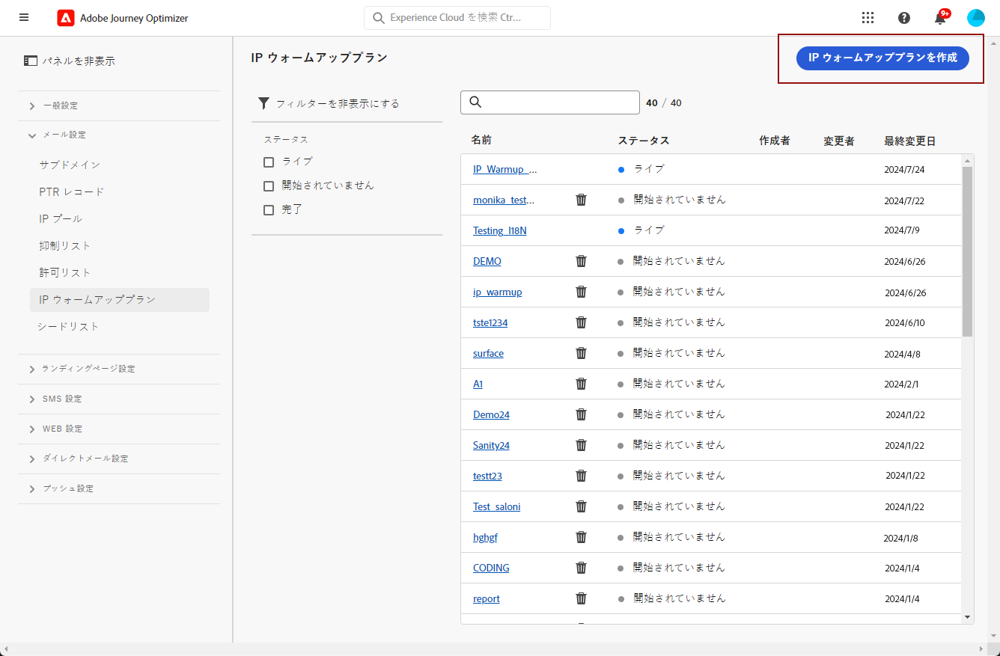
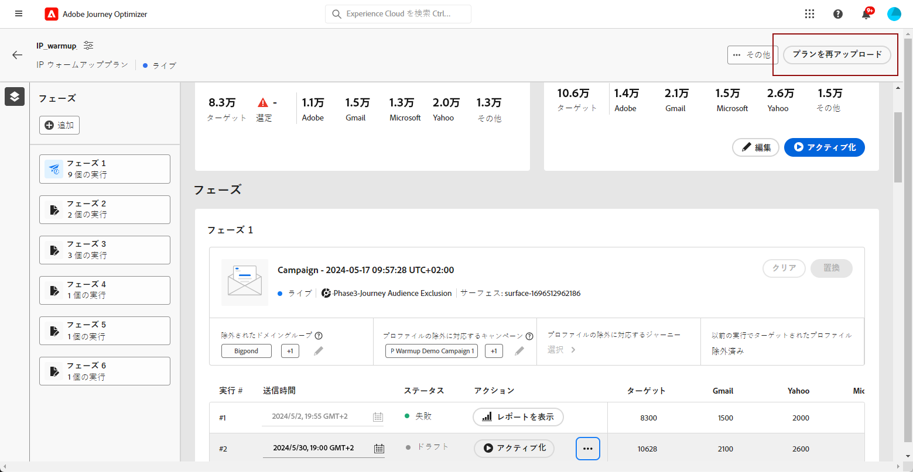

# IP ウォームアッププランを作成する {#ip-warmup}

>[!BEGINSHADEBOX]

このドキュメントガイドの内容は次のとおりです。

* [IP ウォームアップの概要](ip-warmup-gs.md)
* [IP ウォームアップキャンペーンを作成](ip-warmup-campaign.md)
* **[IP ウォームアッププランを作成する](ip-warmup-plan.md)**
* [IP ウォームアッププランを実行する](ip-warmup-running.md)

>[!ENDSHADEBOX]

1 つ以上の [IP ウォームアップキャンペーン](ip-warmup-campaign.md) 専用のサーフェスと対応するオプションを有効にした状態で、IP ウォームアッププランの作成を開始できます。

## IP ウォームアップテンプレートを入力します。 {#upload-plan}

Journey Optimizerインターフェイスで IP ウォームアッププランを作成する前に、プランに入力するすべてのデータを Excel 形式でテンプレートに入力する必要があります。

>[!CAUTION]
>
>配信品質コンサルタントと協力して、IP ウォームアッププランファイルが正しく設定されていることを確認します。

以下は、IP ウォームアップ計画を含むファイルの例です。

### [IP ウォームアッププラン ] タブ

IP ウォームアップは、正当な送信者としての評判を確立するために、IP およびドメインからメインのインターネットサービスプロバイダー (ISP) に送られる E メールの量を徐々に増やすことで構成されるアクティビティです。

このアクティビティは、業界ドメイン、使用例、地域、ISP、その他の様々な要因に基づいて適切に計画を立てる、配信品質コンサルタントまたはエキスパートの助けを借りて、通常実行されます。

* この例では、17 日間にわたる計画を準備し、ターゲットボリュームの xxx プロファイルに到達するようにしています。

* この計画は、6 つのフェーズを経て実行されます。

* 配信先のドメインに対して、必要な数の列を設定できます。 この例では、プランは、プランで使用するドメイングループに対応する 4 つの列 (Gmail、Adobe、Yahoo、その他 ) に分割されます。

最初の段階で実行を増やし、実行数を減らしながら、ターゲットアドレスの数を徐々に増やすことをお勧めします。

標準ドメインのリストを次に示します。

* Gmail
* Adobe
* WP
* Comcast
* Yahoo
* Bigpond
* オレンジ
* Softbank
* ドコモ
* United Internet
* Microsoft
* KDDI
* Italia Online
* ラポステ
* Apple

### 「カスタムドメイングループ」タブ

また、カスタムドメイングループでさらに列を追加することもできます。

以下を使用します。 **[!UICONTROL カスタムドメイングループ]** 「 」タブを使用して新しいドメインを定義し、各ドメインに対して、対象となるすべてのサブドメインを追加できます。<!--TBC-->

## IP ウォームアッププランへのアクセスと管理 {#manage-ip-warmup-plans}

1. 次にアクセス： **[!UICONTROL 管理]** > **[!UICONTROL チャネル]** > **[!UICONTROL IP 暖機プラン]** メニュー。 これまでに作成した IP ウォームアップ計画がすべて表示されます。

   

1. ステータスに基づいてフィルタリングできます。 様々なステータスを次に示します。

   * **未開始**：実行はまだアクティブ化されていません。 [詳細情報](ip-warmup-running.md#define-runs)
   * **処理中/ライブ**：プランは、最初のフェーズの最初の実行が正常にアクティブ化されるとすぐに、このステータスを取ります。 [詳細情報](ip-warmup-running.md#define-runs)
   * **完了**：プランは完了とマークされています。 このオプションは、プラン内のすべての実行が **[!UICONTROL 成功]** または **[!UICONTROL ドラフト]** ステータス（実行不可） **[!UICONTROL ライブ]**) をクリックします。 [詳細情報](ip-warmup-running.md#define-runs#mark-as-completed)
   * **一時停止**<!--: to check (user action)-->

1. IP ウォームアッププランを削除するには、 **[!UICONTROL 削除]** リスト項目の横にあるアイコンをクリックし、削除を確定します。

   

   >[!CAUTION]
   >
   >選択した IP ウォームアッププランは完全に削除されます。

## IP ウォームアッププランを作成する {#create-ip-warmup-plan}

>[!CONTEXTUALHELP]
>id="ajo_admin_ip_warmup_upload"
>title="IP ウォームアッププランを指定"
>abstract="CSV テンプレートをダウンロードし、IP ウォームアップフェーズのデータと、ターゲットプロファイル数を入力します。"

>[!CONTEXTUALHELP]
>id="ajo_admin_ip_warmup_surface"
>title="マーケティングサーフェスを選択"
>abstract="IP ウォームアッププランに関連付けるキャンペーンで選択したサーフェスと同じサーフェスを選択する必要があります。"
>additional-url="https://experienceleague.adobe.com/docs/journey-optimizer/using/configuration/channel-surfaces.html?lang=ja" text="チャネルサーフェスの設定"
>additional-url="https://experienceleague.adobe.com/docs/journey-optimizer/using/configuration/channel-surfaces.html?lang=ja" text="IP ウォームアップキャンペーンを作成"

1 つ以上のライブキャンペーンで **[!UICONTROL IP ウォームアッププランの有効化]** オプションが有効になっている場合は、IP ウォームアッププランに関連付けることができます。

>[!CAUTION]
>
>IP ウォームアッププランを作成、編集、削除するには、 **[!UICONTROL 配信品質コンサルタント]** 権限。 <!--Learn more on managing [!DNL Journey Optimizer] users' access rights in [this section](../administration/permissions-overview.md).-->
>
>配信品質コンサルタントと協力して、IP ウォームアッププランテンプレートが正しく設定されていることを確認します。 <!--TBC-->

1. 次にアクセス： **[!UICONTROL 管理]** > **[!UICONTROL チャネル]** > **[!UICONTROL IP 暖機プラン]** メニュー、次に「 **[!UICONTROL IP ウォームアッププランを作成]**.

   

1. IP ウォームアッププランの詳細を入力し、名前と説明を入力します。

   

1. を選択します。 [表面](channel-surfaces.md). 選択できるのはマーケティングサーフェスのみです。 [電子メールのタイプの詳細を説明します](../email/email-settings.md#email-type)

   >[!CAUTION]
   >
   >IP ウォームアッププランに関連付けるキャンペーンで選択したサーフェスと同じサーフェスを選択する必要があります。 [IP ウォームアップキャンペーンの作成方法を説明します](#create-ip-warmup-campaign)

1. IP ウォームアッププランを含む Excel ファイルをアップロードします<!--which formats are allowed?-->. 配信品質チームが提供するテンプレートを使用できます。<!--TBC?--> [詳細情報](#upload-plan)
   <!--
    You can also download the Excel template from the [!DNL Journey Optimizer] user interface and upload it after filling it with the IP warmup details.-->

   

1. 「**[!UICONTROL 作成]**」をクリックします。アップロードしたファイルで定義されたフェーズの数が自動的に表示され、各フェーズのすべての実行が表示されます。 [詳細情報](#upload-plan)

   

## IP ウォームアッププランを再度アップロード {#re-upload-plan}

対応するボタンを使用して、別の IP ウォームアッププランを再度アップロードできます。

>[!NOTE]
>
>IP ウォームアッププランの詳細は、新しくアップロードされたファイルに従って変更されます。 実行の完了とアクティブ化された実行は影響を受けません。