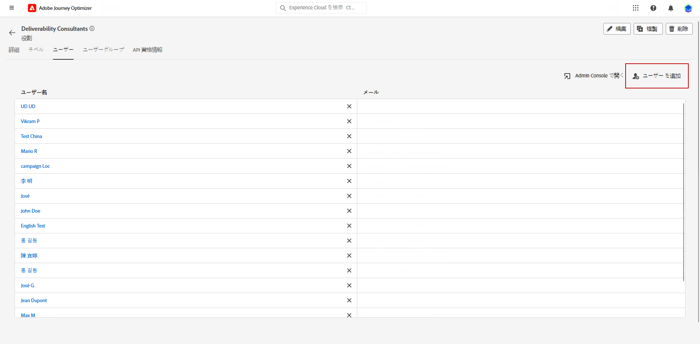

# IP ウォームアッププランを作成 {#ip-warmup}

>[!BEGINSHADEBOX]

このドキュメントガイドの内容は次のとおりです。

* [IP ウォームアッププランの概要](ip-warmup-gs.md)
* [IP ウォームアップキャンペーンを作成](ip-warmup-campaign.md)
* **[IP ウォームアッププランを作成](ip-warmup-plan.md)**
* [IP ウォームアッププランを実行](ip-warmup-execution.md)

>[!ENDSHADEBOX]

専用のサーフェスと対応するオプションを有効にして、1 つ以上の [IP ウォームアップキャンペーン](ip-warmup-campaign.md)を作成したら、IP ウォームアッププランの作成を開始できます。

IP ウォームアッププランへのアクセス、作成、編集および削除には、**[!UICONTROL 配信品質コンサルタント]**&#x200B;の役割または IP ウォームアッププラン関連の権限が必要です。

+++配信品質コンサルタントの役割または IP ウォームアッププラン関連の権限を割り当てる方法を学ぶ

オブジェクトレベルのアクセス制御により、データを保護し、プランを表示および管理するための特定のアクセス権を付与できます。IP ウォームアッププランにラベルが割り当てられていない場合は、すべてのユーザーが表示および編集できるようになります。

**[!UICONTROL IP ウォームアッププランを表示]**&#x200B;権限を付与すると、アクセスは表示と公開のみに制限されますが、**[!UICONTROL IP ウォームアッププランの管理]**&#x200B;権限を割り当てると、ユーザーはプランの表示と編集の両方を行うことができます。

該当する権限を特定の&#x200B;**[!UICONTROL 役割]**&#x200B;に割り当てるには、次の手順に従います。

1. [!DNL Permissions] 製品から、**[!UICONTROL 役割]**&#x200B;メニューに移動して、新しい **[!UICONTROL IP ウォームアップ設定]**&#x200B;権限で更新する役割を選択します。

1. **[!UICONTROL 役割]**&#x200B;ダッシュボードで、「**[!UICONTROL 編集]**」をクリックします。

   

1. **[!UICONTROL IP ウォームアッププラン]**&#x200B;リソースをドラッグ＆ドロップして、権限を割り当てます。

1. **[!UICONTROL IP ウォームアップ設定]**&#x200B;リソースドロップダウンから、ユーザーが必要とする権限（**[!UICONTROL IP ウォームアッププランを表示]**、**[!UICONTROL IP ウォームアッププランを管理]**、**[!UICONTROL IP ウォームアップレポートを表示]**）を選択します。必要に応じて、すべて一度に選択できます。

   

1. 「**[!UICONTROL 保存]**」をクリックします。

該当する役割を&#x200B;**[!UICONTROL ユーザー]**&#x200B;に割り当てるには、次の手順に従います。

1. [!DNL Permissions] 製品から、**[!UICONTROL 役割]**&#x200B;メニューに移動して、**[!UICONTROL 配信品質コンサルタント]**&#x200B;の組み込みの役割を選択します。

1. **[!UICONTROL 役割]**&#x200B;ダッシュボードで、「**[!UICONTROL ユーザー]**」タブにアクセスします。

   

1. 「**[!UICONTROL ユーザーを追加]**」をクリックして、**[!UICONTROL 配信品質コンサルタント]**&#x200B;の組み込みの役割を割り当てます。

   

1. 「**[!UICONTROL ユーザー]**」を選択し、「**[!UICONTROL 保存]**」をクリックします。

   

+++

## IP ウォームアッププランファイルを準備 {#prepare-file}

IP ウォームアップは、正当な送信者としての評判を確立するために、IP およびドメインから主要なインターネットサービスプロバイダー（ISP）に送信されるメールの量を徐々に増やすことで構成されるアクティビティです。

このアクティビティは、通常、配信品質の専門家の支援を受けて実施されます。配信品質の専門家の助けを借りて、業界ドメイン、ユースケース、地域、ISP、その他の様々な要因に基づいて綿密に検討されたプランを準備することができます。

<!--When working with the [!DNL Journey Optimizer] IP warmup feature, this plan takes the form of an Excel file that must contain a number of predefined columns.-->

IP ウォームアッププランを [!DNL Journey Optimizer] インターフェイスで作成する前に、プランにフィードするすべてのデータを Excel テンプレートに入力する必要があります。

* ユーザーインターフェイスから、空白の Excel [IP ウォームアッププランテンプレート](assets/IPWarmupPlan-Template.xlsx)をダウンロードして入力できます。

* また、例として使用できるデータが既に入力されている[サンプルの IP ウォームアッププラン](assets/IPWarmupPlan-Sample.xlsx)をダウンロードすることもできます。

<!--
* From the user interface you can download the blank Excel IP warmup plan template to fill in.

* You can also download a sample IP warmup plan already filled in with some data you can use as an example.
-->

>[!CAUTION]
>
>配信品質コンサルタントと協力して、IP ウォームアッププランファイルが正しく設定されていることを確認します。
>
>必ず、テンプレートで指定された形式を使用してください。

以下は、IP ウォームアッププランを含むファイルの例です。

### 「IP ウォームアッププラン」タブ {#ip-warmup-plan-tab}

* この例では、100 万を超えるプロファイルのターゲットボリュームを達成するために、17 日間にわたるプラン（「**実行**」と呼ばれる）を準備しました。

* この計画は 6 つの&#x200B;**フェーズ**&#x200B;を通じて実行され、各フェーズには少なくとも 1 回の実行が含まれます。

* 最大 6 列（ドメイングループの場合は 5 列、ドメイングループの場合は 1 列）を持つことができます **その他** 列）に含まれます。 この例では、計画は次の 6 つの列に分割されます。

   * そのうち 4 列は&#x200B;**標準のドメイングループ**&#x200B;を対応し、プランに使用します（Gmail、Microsoft、Yahoo、Orange）。
   * 1 列は、カスタムドメイングループに対応します（このグループを「[カスタムドメイングループ](#custom-domain-group-tab)」タブを使用して追加する必要があります）。
   * 6 列目の&#x200B;**その他**&#x200B;には、プランで明示的に適用されない他のドメインの残りのすべてのアドレスが含まれます。この列はオプションです。省略した場合、メールは指定したドメインにのみ送信されます。

このアイデアでは、各フェーズの実行数を減らしながら、各実行でターゲットアドレスの数を徐々に増やしていきます。

プランに追加できる標準のメインドメイングループを以下に示します。

<!--
* Gmail
* Adobe
* WP
* Comcast
* Yahoo
* Bigpond
* Orange
* Softbank
* Docomo
* United Internet
* Microsoft
* KDDI
* Italia Online
* La Poste
* Apple
-->

+++ Gmail
gmail.com、google.com、googlemail.com、googlemail.co.uk
+++

+++WP
wp.pl;o2.pl
+++

+++Comcast
comcast.net
+++

+++Yahoo
aol.fi、games.com、cs.com、yahoo.com.in、y7mail.com、yahoo.co.uk、yahoo.hu、yahoo.co.hu、yahoo.cn、yahoogroups.com.sg、yahoogroups.com.au、aol.es、yahoo.com.au、yahoo.com.vn、yahoo.ca、aol.hk、aol.co.nz、yahoo.com.br、aolpoland.pl、aolnorge.no、yahoo.ne.jp、yahoo.fi、ymail.com、netscape.com、yahoo.com.pe、yahoo.hr、aol.cz、yahoo.ee、aol.be、aolcom.tr、yahoo.si、yahoo.co.id、aol.it、citlink.net、wmconnect.com、yahoo.es、yahoo.dk、yahoogroups.ca、yahoo.com.jp、yahoo.com.hk、aol.kr、yahoo.ie、aol.jp、aol.com.br、yahoo.lt、yahoo.co.kr、aol.nl、yahoo.com.ar、yahoo.bg、ygm.com、yahoo.co.nz、aol.se、aol.com、yahoo.de、goowy.com、rocketmail.com、frontiernet.net、aim.com、yahoo.nl、yahoogroups.co.in、aol.dk、netscape.net、aol.cl、luckymail.com、yahoo.no、yahoo.co.jp、yahoo.com.kr、yahoo.cz、yahoo.co.za、yahoo.sk、verizon.net、yahoogroups.de、yahoo.gr、aol.com.ve、aol.com.ar、yahoo.ro、aol.com.co、wild4music.com、yahoo.at、yahoogroups.com.cn、yahoo.com.co、wow.com、aol.fr、yahoo.in、aol.in、yahoo.com、yahoo.rs、aol.de、yahooxtra.co.nz、yahoo.com.mx、yahoo.com.ph、sky.com、aol.com.mx、aol.com.au、yahoo.se、myaol.jp、aolchina.com、yahoo.pt、yahoo.com.net、yahoo.com.tw、yahoogrupper.dk、yahoo.fr、talk21.com、compuserve.com、aol.pl、yahoo.com.sg、yahoogroups.com.tw、aol.ch、yahoo.it、frontier.com、yahoo.co.in、aolpolcka.pl、yahoo.co.il、verizon.net.in、yahoogruppi.it、yahoo.com.tr、yahoo.cl、yahoogroups.com.hk、yahoogroups.co.uk、yahoo.com.biz、yahoo.com.hr、yahoo.be、aol.co.uk、ybb.ne.jp、aol.tw、yahoogroups.co.kr、yahoo.com.my、rogers.com、gte.net、yahoogroups.com、yahoo.co.th、yahoo.com.cn、love.com、bellatlantic.net、aol.ru、yahoo.com.ve、yahoo.com.ua、yahoo.lv、aolpolska.pl、aol.at、yahoo.pl
+++

+++Bigpond
bigpond.com、bigpond.com.au、bigpond.net、telstra.com、bigpond.net.au
+++

+++Orange
voila.com、francetelecom.com、orange.com、orange.fr、wanadoo.fr、voila.fr
+++

+++Softbank
c.vodafone.ne.jp、jp-h.ne.jp、k.vodafone.ne.jp、jp-d.ne.jp、jp-c.ne.jp、t.vodafone.ne.jp、h.vodafone.ne.jp、r.vodafone.ne.jp、q.vodafone.ne.jp、jp-t.ne.jp、jp-q.ne.jp、s.vodafone.ne.jp、jp-s.ne.jp、jp-r.ne.jp、jp-k.ne.jp、n.vodafone.ne.jp、d.vodafone.ne.jp、softbank.ne.jp、jp-n.ne.jp
+++

+++Docomo
docomo.ne.jp
+++

+++United Internet
gmx.de、1and1.com、gmx.fr、mail.com、1und1.de、gmx.com、gmx.net、gmx.at、web.de、gmx.ch
+++

+++Microsoft
hotmail.com.tr、live.de、live.ru、live.nl、windowslive.com、live.jp、mts.net、xbox.com、hotmail.fr、hotmail.cl、hotmail.jp、live.cl、live.at、live.com.au、hotmail.co.th、live.hk、hotmail.com.au、hotmail.com、live.com.my、hotmail.co.kr、live.ie、outlook.com.br、hotmail.co.il、hotmail.dk、live.co.kr、live.co.uk、live.com.mx、outlook.ie、live.cn、hotmail.co.uk、live.com.sg、hotmail.es、live.fr、live.no、live.dk、hotmail.it、msn.com、live.se、hotmail.co.jp、live.be、live.co.za、live.in、hotmail.se、live.com.pt、hotmail.ch、outlook.com、live.com、hotmail.gr、live.it、live.com.ar、hotmail.ca、hotmail.com.br、hotmail.com.ar、live.ca、hotmail.de
+++

+++KDDI
au.com、ezweb.ne.jp、uqmobile.jp
+++

+++Italia Online
inwind.it、blu.it、virgilio.it、giallo.it、iol.it、libero.it
+++

+++La Poste
laposte.net
+++

+++Apple
mac.com、icloud.com、apple.com、me.com
+++

### 「カスタムドメイングループ」タブ {#custom-domain-group-tab}

また、カスタムドメイングループを含めることで、プランに列を追加することもできます。

「**[!UICONTROL カスタムドメイングループ]**」タブをクリックして、新しいドメイングループを定義します。各ドメインに対して、対象となるすべてのサブドメインを追加できます。<!--TBC-->

この計画で使用するドメイン グループについては、各ドメインがドメイン グループに固有であり、他のドメイン グループと重複していないことを確認してください。 グローバルドメイングループは自動的に定義されるので、ユーザーはカスタムドメイングループを作成する際にこれを考慮する必要があります。

例えば、カスタムドメイン Luma を追加する場合、サブドメイン（luma.com、luma.co.uk、luma.it、luma.fr、luma.de など）を含めます。

### 例 {#example}

次の 2 つのカスタムドメイングループがあるとします。

* 1 つは Hotmail ドメイン専用です。
* もう 1 つは、ドメイングループ Microsoft からの他のすべてのドメイン用です（したがって、すべての Hotmail ドメインを除く）。

Hotmail 以外のドメインと、ドメイン グループ Microsoftのドメインは、 **[!UICONTROL その他]** 列。

1. 「**[!UICONTROL カスタムドメイングループ]**」タブで、**Hotmail** ドメイングループを作成します。

1. 同じ行にすべての Hotmail ドメインを追加します。

   [「IP ウォームアッププラン」タブ](#ip-warmup-plan-tab)のセクションにリストされる Hotmail のすべてのドメインを[コピーして貼り付け](#copy-paste)ます。

1. 別の行を追加します。

1. **Microsoft_X** ドメイングループを作成します。

1. Hotmail 以外の Microsoft ドメインをすべて同じ行に追加します。同様に、上のリストからコピーして貼り付けることができます。[詳細情報](#copy-paste)

1. 「**[!UICONTROL IP ウォームアッププラン]**」タブに戻ります。

1. 3 列を作成します。1 列は、**Hotmail** 用に、もう 1 列は、**Microsoft_X** 用に、そしてもう 1 列は、**その他**&#x200B;用に作成します。

1. 必要に応じて、列に入力します。

<!--Only the domain groups listed in the **[!UICONTROL IP Warmup Plan]** tab will be taken into account.-->

### デフォルトのドメインをコピー＆ペースト {#copy-paste}

例えば、すべての Hotmail ドメインを含むカスタムドメイングループを作成する場合は、[上記の](#ip-warmup-plan-tab)デフォルトのリストからドメインをコピーして貼り付けることができます。

次に、Excel コンバージョンツールを使用して、テキストを列に変換します。

1. **[!UICONTROL データ]**／**[!UICONTROL テキストから列へ…]**&#x200B;を選択し、「**[!UICONTROL 区切り]**」、「**[!UICONTROL 次へ]**」の順に選択します。

1. 「**[!UICONTROL セミコロン]**」を選択し、「**[!UICONTROL 次へ]**」および「**[!UICONTROL 終了]**」をクリックします。

各ドメインが同じ行の異なる列に表示されるようになりました。

## IP ウォームアッププランへのアクセスと管理 {#manage-ip-warmup-plans}

1. **[!UICONTROL 管理]**／**[!UICONTROL チャネル]**／**[!UICONTROL IP ウォームアッププラン]**&#x200B;メニューにアクセスします。これまでに作成した IP ウォームアッププランがすべて表示されます。

   

1. ステータスに基づいてフィルタリングできます。 様々なステータスを以下に示します。

   * **未開始**：実行はまだアクティブ化されていません。 [詳細情報](ip-warmup-execution.md#define-runs)
   * **ライブ**：最初のフェーズの最初の実行が正常にアクティブ化されると、プランは直ちにこのステータスに変わります。[詳細情報](ip-warmup-execution.md#define-runs)
   * **完了**：プランは完了とマークされています。<!--This option is only available if all the runs in the plan are in **[!UICONTROL Completed]** or **[!UICONTROL Draft]** status (no run can be **[!UICONTROL Live]**).-->  [詳細情報](ip-warmup-execution.md#mark-as-completed)
     <!--* **Paused**: to check (user action)-->

1. IP ウォームアッププランを削除するには、プラン名の横にある「**[!UICONTROL 削除]**」アイコンを選択し、削除を確定します。

   >[!NOTE]
   >
   >**未開始**&#x200B;のステータスのプランのみを削除できます。

   

   >[!CAUTION]
   >
   >選択した IP ウォームアッププランは完全に削除されます。

## IP ウォームアッププランを作成 {#create-ip-warmup-plan}

>[!CONTEXTUALHELP]
>id="ajo_admin_ip_warmup_upload"
>title="IP ウォームアッププランを指定"
>abstract="IP ウォームアップフェーズやターゲットプロファイル数など、プランに必要なすべてのデータを Excel テンプレートに入力し、ここにアップロードします。"
>additional-url="https://experienceleague.adobe.com/docs/journey-optimizer/using/configuration/implement-ip-warmup-plan/ip-warmup-plan.html?lang=ja#prepare-file" text="IP ウォームアッププランファイルを準備"

>[!CONTEXTUALHELP]
>id="ajo_admin_ip_warmup_surface"
>title="マーケティングサーフェスを選択"
>abstract="IP ウォームアッププランに関連付けるキャンペーンで選択したサーフェスと同じサーフェスを選択する必要があります。"
>additional-url="https://experienceleague.adobe.com/docs/journey-optimizer/using/configuration/channel-surfaces.html?lang=ja" text="チャネルサーフェスの設定"
>additional-url="https://experienceleague.adobe.com/docs/journey-optimizer/using/configuration/channel-surfaces.html?lang=ja" text="IP ウォームアップキャンペーンを作成"

IP ウォームアッププランを作成するには、次の手順に従います。

1. **[!UICONTROL 管理]**／**[!UICONTROL チャネル]**／**[!UICONTROL IP ウォームアッププラン]**&#x200B;メニューにアクセスし、「**[!UICONTROL IP ウォームアッププランを作成]**」をクリックします。

   

1. IP ウォームアッププランの詳細（名前と説明）を入力します。

   

1. ウォームアップする[サーフェス](channel-surfaces.md)を選択します。選択できるのはマーケティングサーフェスのみです。[メールのタイプの詳細情報](../email/email-settings.md#email-type)

   >[!NOTE]
   >
   >IP ウォームアッププランに関連付けるキャンペーンは、同じサーフェスを使用する必要があります。[IP ウォームアップキャンペーンの作成方法を学ぶ](ip-warmup-campaign.md)

1. IP ウォームアッププランを含む Excel ファイルをアップロードします。[詳細情報](#prepare-file)

   <!--
    You can also download the Excel template from the [!DNL Journey Optimizer] user interface and upload it after filling it with the IP warmup details.-->

   

   >[!NOTE]
   >
   >アップロードに失敗した場合は、正しい形式とファイル形式（.xls または.xlsx）を使用していることを確認してください。アドビが提供する[テンプレート](assets/IPWarmupPlan-Template.xlsx)を使用します。

1. 「**[!UICONTROL 作成]**」をクリックします。アップロードしたファイルに定義されているすべてのフェーズ、実行、列、およびそれらのコンテンツは、[!DNL Journey Optimizer] インターフェイスに自動的に表示されます。

   

   >[!NOTE]
   >
   >**[!UICONTROL ターゲット]**&#x200B;列には、各実行のターゲットとなるすべてのプロファイルの合計が表示されます。つまり、**その他**&#x200B;列（存在する場合）を含む、定義した各ドメイングループのすべてのプロファイルのことです。

これで、IP ウォームアッププランを実行する準備が整いました。[詳細情報](ip-warmup-execution.md)
