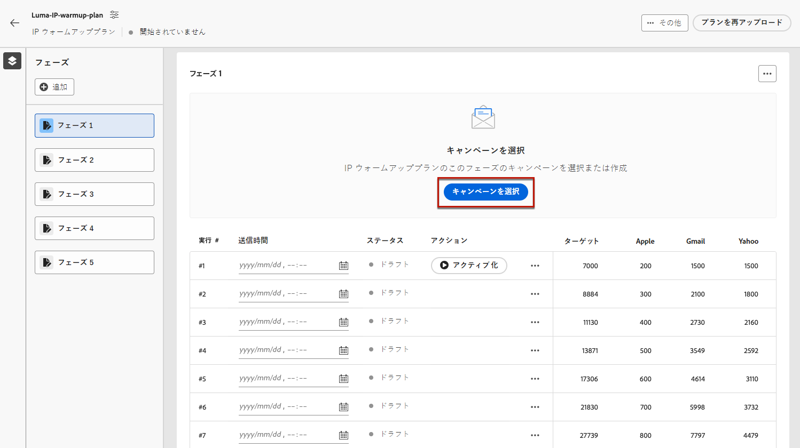

# IP ウォームアッププランを実行する {#ip-warmup-running}

>[!BEGINSHADEBOX]

このドキュメントガイドの内容は次のとおりです。

* [IP ウォームアップの概要](ip-warmup-gs.md)
* [IP ウォームアップキャンペーンを作成](ip-warmup-campaign.md)
* [IP ウォームアッププランを作成する](ip-warmup-plan.md)
* **[IP ウォームアッププランを実行する](ip-warmup-running.md)**

>[!ENDSHADEBOX]

## フェーズを定義する {#define-phases}

>[!CONTEXTUALHELP]
>id="ajo_admin_ip_warmup_campaigns_excluded"
>title="除外するキャンペーンオーディエンスを選択"
>abstract="現在のフェーズから除外する他のキャンペーンのオーディエンスを選択します。"

>[!CONTEXTUALHELP]
>id="ajo_admin_ip_warmup_domains_excluded"
>title="除外するドメイングループを選択"
>abstract="現在のフェーズから除外するドメインを選択します。"

フェーズレベルでキャンペーンとオーディエンスを関連付け、1 つのクリエイティブ/キャンペーンに関連するすべての実行で必要に応じて、一部の設定を有効にする必要があります

フェーズレベルでは、以前にターゲット設定された+新しいプロファイルが取得され、反復レベルでは、各実行に一意のプロファイルが割り当てられ、計画に記載されている値とカウントが一致するようになります

1. 各フェーズで、IP ウォームアッププランのこのフェーズに関連付けるキャンペーンを選択します。

   

   次のことに注意してください。

   * 次を含むキャンペーンのみ： **[!UICONTROL IP ウォームアッププランの有効化]** オプション有効 <!--and live?--> は選択可能です。 [詳細情報](#create-ip-warmup-campaign)

   * 現在の IP ウォームアッププランで選択したものと同じサーフェスを使用するキャンペーンを選択する必要があります。

   * 別の IP ウォームアップキャンペーンで既に使用中のキャンペーンは選択できません。

1. Adobe Analytics の **[!UICONTROL プロファイルの除外]** 「 」セクションでは、そのフェーズの以前の実行からのプロファイルが常に除外されることを確認できます。 例えば、「実行」で#1対象となる最初の 4800 人のユーザーがプロファイルの対象となった場合、「実行」で同じプロファイルが電子メールを受信しないように自動的にシス#2ムが保証しす。

1. 次から： **[!UICONTROL 除外されたキャンペーンオーディエンス]** セクションで、他のオーディエンスを選択します <!--executed/live?-->現在のフェーズから除外するキャンペーン。

   

   たとえば、フェーズ 1 の実行時に、次の手順を実行する必要がありました。 [分割する](#split-phase) 何らかの理由で したがって、フェーズ 1 から以前に連絡したプロファイルがフェーズ 2 に含まれないように、フェーズ 1 で使用するキャンペーンを除外できます。 他の IP ウォームアッププランからキャンペーンを除外することもできます。

1. 次から： **[!UICONTROL 除外されたドメイングループ]** 「 」セクションで、そのフェーズから除外するドメインを選択します。

   

   例えば、IP ウォームアップを数日間実行した後、ドメイン (Adobe) での ISP の評判が良くないことに気が付き、IP ウォームアップ計画を停止せずに解決したいと考えます。 この場合、ドメインドメイングループを除外するAdobeドメイングループを指定できます。

   >[!NOTE]
   >
   >ドメインの除外には実行されないフェーズが必要なので、除外を追加するには、実行フェーズを分割する必要が生じる場合があります。 同様に、ドメイングループが OOTB ドメイングループでない場合は、このドメイングループを Excel ファイルに追加し、アップロードしてからドメインを除外する必要があります。

   

1. 必要に応じて、フェーズを追加できます。 これは、最後の現在のフェーズの後に追加されます。

1. 以下を使用します。 **[!UICONTROL フェーズを削除]** ボタンをクリックして、不要なフェーズを削除します。

   

   >[!CAUTION]
   >
   >この操作を元に戻すことはできません。 **[!UICONTROL 削除]** アクション。
   >
   >IP ウォームアッププランからすべてのフェーズを削除する場合は、プランを再度アップロードすることをお勧めします。

## 実行の定義 {#define-runs}

1. 各実行のスケジュールを選択します。 <!--which is actually a window of opportunity. meaning? how many hours? shall we specify that to clarify?-->

   

1. 終了時間を選択します。この時間では、オーディエンスセグメントジョブの実行に遅延が生じた場合に備えて、IP ウォームアップキャンペーンを実行できる期間を定義します。 終了時間を指定しない場合は、開始時に実行が試行され、セグメント化が完了しなかった場合は失敗します。

1. 各実行をアクティブ化します。 セグメント化ジョブを実行できるように、十分な早い時間をスケジュールしてください。 <!--explain how you can evaluate a proper time-->

   >[!CAUTION]
   >
   >各実行は、実際の送信時間の 12 時間以上前に有効化する必要があります。 そうしないと、セグメント化が完了しない場合があります。 <!--How do you know when segmentation is complete? Is there a way to prevent user from scheduling less than 12 hours before the segmentation job?-->

   <!--Sart to execute on every day basis by simply clicking the play button > for each run? do you have to come back every day to activate each run? or can you schedule them one after the other?)-->

1. キャンペーンの実行が開始されていない場合は、実行を停止できます。<!--why?-->

   >[!NOTE]
   >
   >キャンペーンの実行が開始されると、 **[!UICONTROL 停止]** ボタンが使用できなくなります。 <!--TBC in UI-->

   

1. 実行を追加するには、「 **[!UICONTROL 下に実行を追加]** を 3 つのドットアイコンから選択します。

   

## フェーズの分割 {#split-phase}

特定の実行から開始する別のキャンペーンを使用する場合は、 **[!UICONTROL 新しいフェーズに分割オプション]** を 3 つのドットアイコンから選択します。

現在のフェーズの残りの実行に対して新しいフェーズが作成されます。 手順に従います。 [上](#define-phases) をクリックして、新しいフェーズを定義します。

たとえば、[ 実行 ] にこのオプションを選択す#4、[ 実行 ] から [ 実行 ] に [ 実#4] を選択する#8、新しいフェーズに移動します。

<!--
You don't have to decide the campaign upfront. You can do a split later. It's a work in progress plan: you activate one run at a time with a campaign and you always have the flexibility to modify it while working on it.

But need to explain in which case you want to modify campaigns, provide examples
-->

## プランの監視

実行には、次のステータスがあります<!--TBC with Medha-->:

* **[!UICONTROL 完了]**:
* **[!UICONTROL 失敗]**:
* **[!UICONTROL キャンセル]**：キャンペーンの実行が開始する前に実行を停止しました。

メリット :

* 現在も、同様の機能を備えたレポートがキャンペーンレベルで引き続き表示されます。 しかし、IP ウォームアップ計画は、実行回数などの 1 か所で統合レポートとしても機能します。

* IP ウォーミングの進行状況を 1 か所で管理および表示できます。

* クリエイティブ/キャンペーンレベルでの統合レポート（フェーズの実行時）