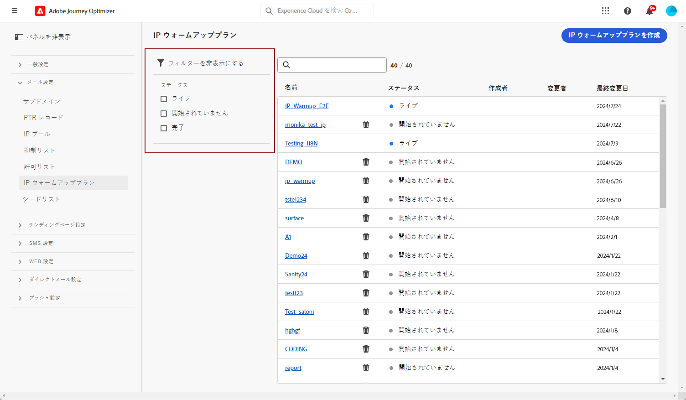

# IP ウォームアッププランの実装 {#ip-warmup}

<!--
>[!CONTEXTUALHELP]
>id="ajo_admin_ip_warmup_plan"
>title="Define your IP warmup plan"
>abstract="You can perform IP warmup workflows directly from the Journey Optimizer interface in a standardized and efficient way that follows the best practices for optimal deliverability."
-->

>[!AVAILABILITY]
>
>IP ウォームアップ機能は、現在、選択したユーザーのみを対象としたベータ版として利用できます。 ベータ版プログラムに参加するには、アドビカスタマーケアにお問い合わせください。

を使用 [!DNL Journey Optimizer]を使用すると、最適な配信品質を実現するベストプラクティスに従って、標準化された効率的な方法で、ユーザーインターフェイスから直接 IP ウォームアップワークフローを簡単に実行できます。

>[!CAUTION]
>
>これはメールチャネルにのみ適用されます。

新しいプラットフォームを使用してメールが送信された場合、インターネットサービスプロバイダー（ISP）は認識されない IP アドレスを疑わしく思います。多くの場合、大量のメールが突然送信されると、ISP はそれらのメールをスパムとしてマークします。

IP ウォームアッププラン機能を使用すると、スパムとしてマークされないように、送信されるボリュームを徐々に増やすことができます。 管理メニューの新しいオプションを使用すると、複雑なジャーニーを作成する代わりに、よりスムーズに実行できます。 この方法により、スタートアップフェーズをスムーズに進め、無効なアドレスが全体に占める割合を減らすことができます。

>[!NOTE]
>
>IP ウォーミングを使用した E メールの評判の向上について詳しくは、 [配信品質のベストプラクティスガイド](https://experienceleague.adobe.com/docs/deliverability-learn/deliverability-best-practice-guide/additional-resources/generic-resources/increase-reputation-with-ip-warming.html?lang=ja).

<!--
Here are the main steps:

1. You get a deliverability plan from the deliverability consulting team.

1. Create a campaign - marketer [Learn more](#create-ip-warmup-campaign)

1. Your associated practitioner (customer's practitioner/ACS consultant/partner consultant) creates a IP warmup object in project and uploads a plan.

    The CSV manifests itself like below with numbers showing up with/without domain bifurcation. Below screen shows one phase (creative) with associated runs (The plan obviously has more such phases)

1. Practitioner associates the campaign and audience at phase level and turns on some settings as needed for all runs associated with a single creative/campaign

1. Then start to execute on every day basis by simply clicking the play button

1. Reports will continue to show up at campaign level with similar capabilities as today. NO enhancements in BETA. But the IP warmup plan also serves as a consolidated report at one single place of how many executions were done and so on

Benefits are as follows:

* No more creation of daily journeys and associated testing

* Standardization on Campaign which will be easy for practitioners too

* No more pain of creating queries, audiences and testing those as system will create the audiences. At phase level, system ensures that previously targeted + new profiles are picked up AND at iteration level, system ensures that each run is having unique profiles and the count matches what is stated in plan

* Ease of excluding domains and changing the plan with help of simple toggles to exclude OR by editing numbers inline or create new phases or reupload plan if drastic change. No more pain of editing audience definitions, journey conditions

* Single place to manage and view how IP warm is progressing.

* Consolidated report at creative/campaign level as all runs for a phase 

* There is an expectation that with this, it will ease around 30% of effort and will be much better experience for consultant/partner/practitioner - right from planning to execution to reporting
-->

IP ウォームアップ計画を実装する主な手順は次のとおりです。

* [IP ウォームアップキャンペーンを作成](#create-ip-warmup-campaign)
* [IP ウォームアッププランを定義する](#define-ip-warmup-plan)

## IP ウォームアップキャンペーンを作成 {#create-ip-warmup-campaign}

>[!CONTEXTUALHELP]
>id="ajo_campaign_ip_warmup"
>title="IP ウォームアッププランオプションを有効にする"
>abstract="IP ウォームアッププランの有効化オプションを選択します。 キャンペーンがライブになると、IP ウォームアッププランに関連付けることができます。"

IP ウォームアッププランで使用できるよう、特定のオプションを有効にした 1 つ以上のキャンペーンを作成する必要があります。 次の手順に従います。

1. の作成 [表面](channel-surfaces.md) ウォームアッププランで特定したドメインと IP。

1. の作成 [campaign](../campaigns/create-campaign.md) をクリックし、 [電子メール](../email/create-email.md#create-email-journey-campaign) アクション。

1. IP ウォームアップ用に作成したサーフェスを選択します。

   <!--You must use the same surface as the one that will be used for the asociated IP warmup plan. [Learn how to create an IP warmup plan](#create-ip-warmup-plan)-->

1. 「**[!UICONTROL 作成]**」をクリックします。

1. 次から： **[!UICONTROL スケジュール]** セクション、選択 **[!UICONTROL IP ウォームアッププランの有効化]**.

   

   キャンペーン [スケジュール](../campaigns/create-campaign.md#schedule) は、関連付ける IP ウォームアッププランによって駆動されます。つまり、スケジュールはキャンペーン自体に定義されなくなります。

1. [有効化](../campaigns/review-activate-campaign.md) キャンペーン。 ライブが完了すると、IP ウォームアッププランで使用できる状態になります。

>[!NOTE]
>
>IP ウォームアッププランが有効化されたライブキャンペーンの場合、 **[!UICONTROL 削除]** ボタンは、IP ウォームアッププランに関連付けられるまで使用できます。

キャンペーンの設定方法について詳しくは、[このページ](../campaigns/get-started-with-campaigns.md)を参照してください。

## IP ウォームアッププランを定義する {#define-ip-warmup-plan}

### IP ウォームアッププランの管理 {#manage-ip-warmup-plans}

1. 次にアクセス： **[!UICONTROL 管理]** > **[!UICONTROL チャネル]** > **[!UICONTROL IP 暖機プラン]** メニュー。 これまでに作成した IP ウォームアップ計画がすべて表示されます。

   

1. ステータスに基づいてフィルタリングできます。 様々なステータスを次に示します。

   * **未開始**：実行が発生しませんでした
   * **処理中**:1 回の実行が開始したらすぐに <!--or is done?-->
   * **一時停止**
   * **完了**：プラン内のすべての実行が完了している

1. IP ウォームアッププランを削除するには、 **[!UICONTROL 削除]** リスト項目の横にあるアイコンをクリックし、削除を確定します。

   

   >[!CAUTION]
   >
   >選択した IP ウォームアッププランは完全に削除されます。

### IP ウォームアッププランを作成する {#create-ip-warmup-plan}

>[!CONTEXTUALHELP]
>id="ajo_admin_ip_warmup_upload"
>title="IP ウォームアッププランを指定"
>abstract="CSV テンプレートをダウンロードし、IP ウォームアップフェーズのデータと、ターゲットプロファイル数を入力します。"

>[!CONTEXTUALHELP]
>id="ajo_admin_ip_warmup_surface"
>title="マーケティングサーフェスを選択"
>abstract="IP ウォームアッププランに関連付けるキャンペーンで選択したサーフェスと同じサーフェスを選択する必要があります。"
>additional-url="https://experienceleague.adobe.com/docs/journey-optimizer/using/configuration/channel-surfaces.html?lang=ja" text="チャネルサーフェスの設定"
>additional-url="https://experienceleague.adobe.com/docs/journey-optimizer/using/configuration/channel-surfaces.html?lang=ja" text="IP ウォームアップキャンペーンを作成"

>[!CAUTION]
>
>IP ウォームアッププランを作成、編集、削除するには、 **[!UICONTROL 配信品質コンサルタント]** 権限。
<!--Learn more on managing [!DNL Journey Optimizer] users' access rights in [this section](../administration/permissions-overview.md).-->

1 つ以上のライブキャンペーンで **[!UICONTROL IP ウォームアッププランの有効化]** オプションが有効になっている場合は、IP ウォームアッププランに関連付けることができます。

>[!CAUTION]
>
>配信品質コンサルタントと協力して、IP ウォームアッププランテンプレートが正しく設定されていることを確認します。 <!--TBC-->

1. 次にアクセス： **[!UICONTROL 管理]** > **[!UICONTROL チャネル]** > **[!UICONTROL IP 暖機プラン]** メニュー、次に「 **[!UICONTROL IP ウォームアッププランを作成]**.

   

1. IP ウォームアッププランの詳細を入力し、名前と説明を入力します。

   

1. を選択します。 [表面](channel-surfaces.md). 選択できるのはマーケティングサーフェスのみです。 [電子メールのタイプの詳細を説明します](../email/email-settings.md#email-type)

   >[!CAUTION]
   >
   >IP ウォームアッププランに関連付けるキャンペーンで選択したサーフェスと同じサーフェスを選択する必要があります。 [IP ウォームアップキャンペーンの作成方法を説明します](#create-ip-warmup-campaign)

1. IP ウォームアッププランを含む Excel ファイルをアップロードします<!--which formats are allowed?-->. 配信品質チームが提供するテンプレートを使用できます。<!--TBC?--> [詳細情報](#upload-plan)
   <!--
    You can also download the Excel template from the [!DNL Journey Optimizer] user interface and upload it after filling it with the IP warmup details.-->

   

1. 「**[!UICONTROL 作成]**」をクリックします。アップロードしたファイルで定義されたフェーズの数が自動的に表示され、各フェーズのすべての実行が表示されます。 [詳細情報](#upload-plan)

   

### IP ウォームアッププランを再度アップロード {#re-upload-plan}

対応するボタンを使用して、別の IP ウォームアッププランを再度アップロードできます。

>[!NOTE]
>
>IP ウォームアッププランの詳細は、新しくアップロードされたファイルに従って変更されます。 実行の完了とアクティブ化された実行は影響を受けません。

### プランを含むファイルをアップロードします {#upload-plan}

以下は、IP ウォームアップ計画を含むファイルの例です。

各フェーズは、1 つのキャンペーンを割り当てる、複数の実行で構成される期間に対応します。

実行ごとに、一定数の受信者が存在し、この実行が実行される日付を定義します。

配信先のドメインに対して、必要な数の列を設定できます。 この例では、Gmail、Adobe、その他の 3 つの列があります。つまり、

最初の段階で実行を増やし、実行数を減らしながら、ターゲットアドレスの数を徐々に増やすことをお勧めします。

### フェーズを定義する {#define-phases}

>[!CONTEXTUALHELP]
>id="ajo_admin_ip_warmup_campaigns_excluded"
>title="除外するキャンペーンオーディエンスを選択"
>abstract="現在のフェーズから除外する他のキャンペーンのオーディエンスを選択します。"

>[!CONTEXTUALHELP]
>id="ajo_admin_ip_warmup_domains_excluded"
>title="除外するドメイングループを選択"
>abstract="現在のフェーズから除外するドメインを選択します。"

1. 各フェーズで、IP ウォームアッププランのこのフェーズに関連付けるキャンペーンを選択します。

   

   次のことに注意してください。

   * 次を含むキャンペーンのみ： **[!UICONTROL IP ウォームアッププランの有効化]** オプション有効 <!--and live?--> は選択可能です。 [詳細情報](#create-ip-warmup-campaign)

   * 現在の IP ウォームアッププランで選択したものと同じサーフェスを使用するキャンペーンを選択する必要があります。

   * 別の IP ウォームアップキャンペーンで既に使用中のキャンペーンは選択できません。

1. 各フェーズで、次のことが適用されます。

   * **[!UICONTROL プロファイルの除外]**  — 前回の実行のそのフェーズのプロファイルは、常に除外されます。 例えば、Leo が実行時#1、最初の 6300 人の人々がターゲットにされた場合、システムは自動的に Leo が実行時にメールを受け取らないことを保証#2します。

   * **[!UICONTROL 除外されたキャンペーンオーディエンス]**  — 他のオーディエンスからオーディエンスを選択します <!--executed/live?-->現在のフェーズから除外するキャンペーン。

     例えば、フェーズを実行していて、何らかの理由でフェーズを分割する必要があった場合があります。 この場合、フェーズ 2 では、フェーズ 1 で使用したキャンペーンをこのセクションに含め、フェーズ 2 では、フェーズ 1 から以前に連絡した人が含まれないようにします。 これは、同じ IP ウォームアッププランで使用されるキャンペーンだけでなく、別の IP ウォームアッププランからも実行できます。

   * **[!UICONTROL 除外されたドメイングループ]**  — そのフェーズから除外するドメイン（例：Gmail）を選択します。 <!--??-->

     IP ウォームアップを数日間実行した後、ドメインでの ISP の評判は、hotmail が良くないと言うこと、および ISP で解決したいが、IP ウォームアップ計画を停止したくないと思うことに気が付きます。 このような場合、ドメイングループ hotmail を除外されたカテゴリに入れることができます。

     >[!NOTE]
     >
     >ドメインの除外には、実行されないフェーズが必要なので、除外を追加するには、実行中のフェーズを分割する必要が生じる場合があります。 同様に、ドメイングループが OOTB ドメイングループでない場合は、Excel でドメイングループを作成し、アップロードしてから除外する必要が生じる場合があります。

   

1. 必要に応じてフェーズを追加できます。最後の現在のフェーズの後に追加されます。 以下を使用します。 **[!UICONTROL フェーズを削除]** ボタンをクリックして、不要なフェーズを削除します。

   

   >[!CAUTION]
   >
   >この操作を元に戻すことはできません。 **[!UICONTROL 削除]** アクション。
   >
   >IP ウォームアッププランからすべてのフェーズを削除する場合は、プランを再度アップロードすることをお勧めします。

### 実行の定義 {#define-runs}

1. 各実行のスケジュールを選択します。 <!--which is actually a window of opportunity. meaning? how many hours? shall we specify that to clarify?-->

   

1. 終了時間を選択します。つまり、オーディエンスジョブに遅延が生じた場合に、ウォームアップキャンペーンを実行できる期間を基本的に指定します。 指定しなかった場合は、開始時に試行し、失敗します。 終了時間が指定された場合は、そのウィンドウ間で実行が実行されます。

1. 各実行をアクティブ化します。 セグメント化ジョブを実行できるように、十分な早い時間をスケジュールしてください。 <!--explain how you can evaluate a proper time-->

   >[!CAUTION]
   >
   >各実行は、実際の送信時間の 12 時間以上前に有効化する必要があります。 そうしないと、セグメント化が完了しない場合があります。 <!--How do you know when segmentation is complete? Is there a way to prevent user from scheduling less than 12 hours before the segmentation job?-->

1. キャンペーンの実行が開始されていない場合は、実行を停止できます。

   キャンペーンの実行が開始されると、 **[!UICONTROL 停止]** ボタンが使用できなくなります。 <!--TBC in UI-->

   

1. 実行を追加するには、「 **[!UICONTROL 下に実行を追加]** を 3 つのドットアイコンから選択します。

   

1. 特定の実行から開始する別のキャンペーンを使用する場合は、 **[!UICONTROL 新しいフェーズに分割オプション]** を 3 つのドットアイコンから選択します。 現在のフェーズの残りの実行に対して新しいフェーズが作成されます。 手順に従います。 [上](#define-phases) をクリックして、新しいフェーズを定義します。

   たとえば、このオプションを実行に対して選択した場合、実行を実行#4対#8に移動します。

<!--
You don't have to decide the campaign upfront. You can do a split later. It's a work in progress plan: you activate one run at a time with a campaign and you always have the flexibility to modify it while working on it.

But need to explain in which case you want to modify campaigns, provide examples
-->

実行には、次のステータスがあります<!--TBC with Medha-->:

* **[!UICONTROL 完了]**:
* **[!UICONTROL 失敗]**:
* **[!UICONTROL キャンセル]**：キャンペーンの実行が開始する前に実行を停止しました。

