# ランディングページの設定 {#lp-configuration}

## ランディングページのサブドメインの設定 {#lp-subdomains}

>[!CONTEXTUALHELP]
>id="ajo_admin_configure_subdomain"
>title="ランディングページのサブドメインの設定"
>abstract="サブドメインを選択できるようにするには、少なくとも 1 つのランディングページサブドメインを事前に設定済みであることを確認してください。"

次の操作を実行できます。 [ランディングページプリセットを作成](#lp-create-preset)の場合は、ランディングページに使用するサブドメインを設定する必要があります。

既にドメインにデリゲートされているサブAdobeを使用するか、別のサブドメインを設定できます。 でのサブドメインのデリゲートに関するAdobeの詳細 [この節](delegate-subdomain.md).

### 既存のサブドメインを使用 {#lp-use-existing-subdomain}

既にドメインにデリゲートされているサブAdobeを使用するには、次の手順に従います。

1. 次にアクセス： **[!UICONTROL 管理]** > **[!UICONTROL チャネル]** メニューから、 **[!UICONTROL 電子メール設定]** > **[!UICONTROL ランディングページのサブドメイン]**.

   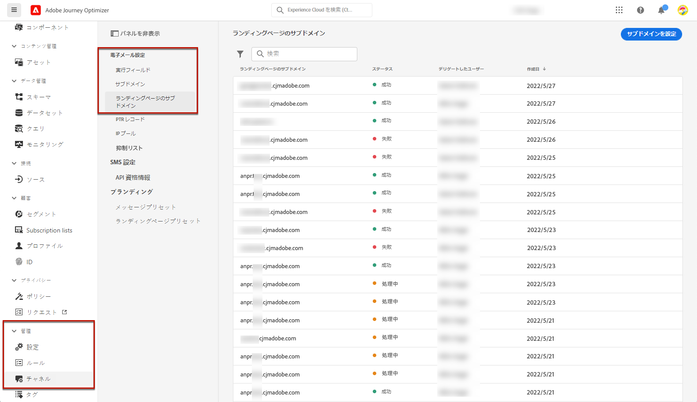

1. クリック **[!UICONTROL サブドメインの設定]**.

   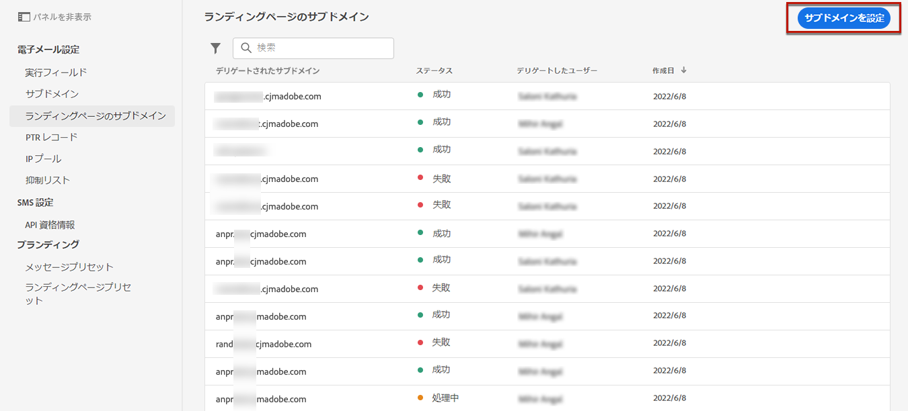

1. 選択 **[!UICONTROL デリゲートドメインを使用]** から **[!UICONTROL 設定タイプ]** 」セクションに入力します。

   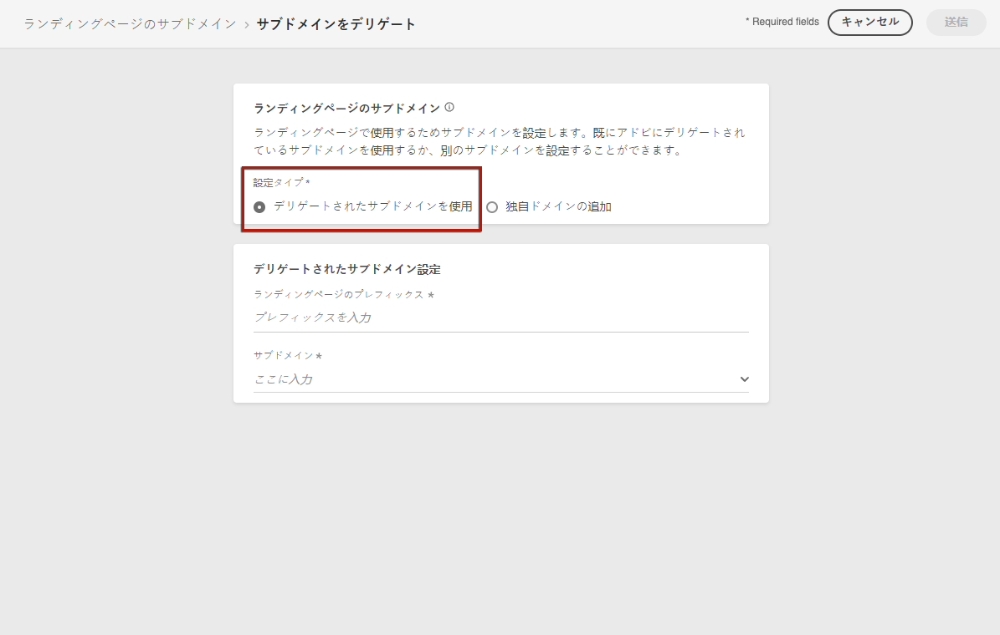

1. ランディングページの URL に表示するプレフィックスを入力します。

   >[!NOTE]
   >
   >英数字とハイフンのみを使用できます。

1. リストからデリゲートされたサブドメインを選択します。

   >[!NOTE]
   >
   >既にランディングページのサブドメインとして使用されているサブドメインは選択できません。

   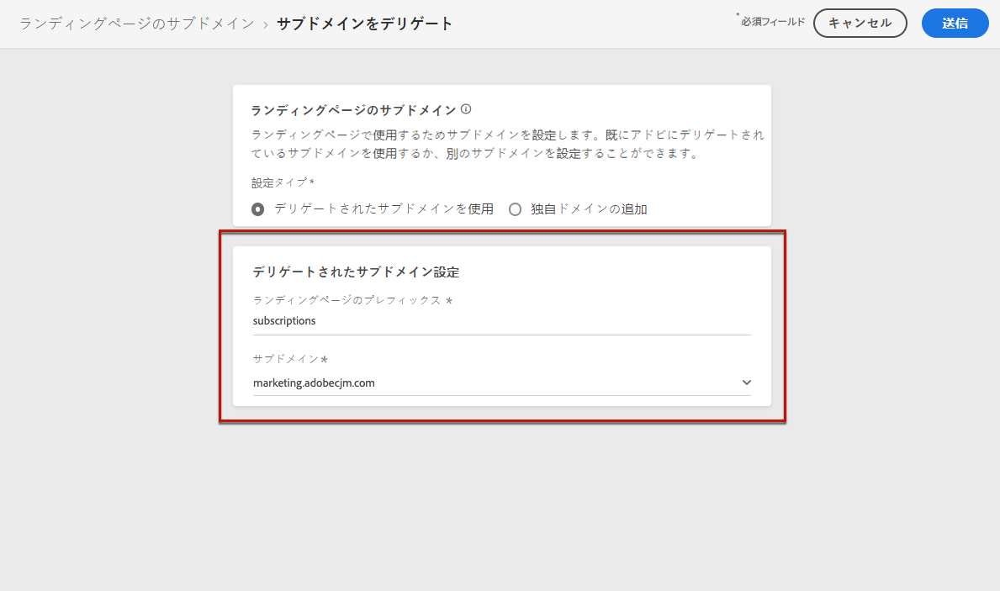

   >[!CAUTION]
   >
   >を使用してAdobeにデリゲートされたドメインを選択した場合 [CNAME メソッド](delegate-subdomain.md#cname-subdomain-delegation)を使用する場合は、ホスティングプラットフォーム上に DNS レコードを作成する必要があります。 DNS レコードを生成する手順は、新しいランディングページサブドメインを設定する際の手順と同じです。 [この節](#lp-configure-new-subdomain)の手順を参照してください。

1. 「**[!UICONTROL 送信]**」をクリックします。

1. 送信されると、サブドメインがリストに表示され、 **[!UICONTROL 処理中]** ステータス。 サブドメインのステータスについて詳しくは、[この節](access-subdomains.md)を参照してください。<!--Same statuses?-->

   

   >[!NOTE]
   >
   >そのサブドメインを使用してメッセージを送信する前に、Adobeが必要なチェックを実行するまで待つ必要があります（最大 4 時間かかる場合があります）。<!--Learn more in [this section](delegate-subdomain.md#subdomain-validation).-->

1. チェックが正常に完了すると、サブドメインのステータスが&#x200B;**[!UICONTROL 成功]**&#x200B;になります。 ランディングページプリセットの作成に使用する準備が整いました。

### 新しいサブドメインの設定 {#lp-configure-new-subdomain}

新しいサブドメインを設定するには、次の手順に従います。

1. 次にアクセス： **[!UICONTROL 管理]** > **[!UICONTROL チャネル]** メニューから、 **[!UICONTROL 電子メール設定]** > **[!UICONTROL ランディングページのサブドメイン]**.

1. クリック **[!UICONTROL サブドメインの設定]**.

1. 選択 **[!UICONTROL 独自のドメインを追加]** から **[!UICONTROL 設定タイプ]** 」セクションに入力します。

   

1. デリゲートするサブドメインを指定します。

   >[!CAUTION]
   >
   >既存のランディングページサブドメインは使用できません。

   無効なサブドメインをアドビにデリゲートすることはできません。組織が所有する有効なサブドメイン（marketing.yourcompany.com など）を入力してください。

   現在、「email.marketing.yourcompany.com」などの複数レベルのサブドメインはサポートされていません。

1. DNS サーバーに配置するレコードが表示されます。 このレコードをコピーするか、CSV ファイルをダウンロードしてから、ドメインのホスティングソリューションに移動して、一致する DNS レコードを生成します。

1. DNS レコードがドメインホスティングソリューションに生成されていることを確認します。 すべてが正しく設定されている場合は、「確認しました」チェックボックスをオンにし、「**[!UICONTROL 送信]**」をクリックします。

   

   >[!NOTE]
   >
   >新しいランディングページサブドメインを設定する場合、常に CNAME レコードを指します。

1. サブドメインのデリゲーションが送信されると、そのサブドメインは「**[!UICONTROL 処理中]**」ステータスでリストに表示されます。サブドメインのステータスについて詳しくは、[この節](access-subdomains.md)を参照してください。<!--Same statuses?-->

   >[!NOTE]
   >
   >そのサブドメインを使用してメッセージを送信する前に、Adobeが必要なチェックを実行するまで待つ必要があります（最大 4 時間かかる場合があります）。<!--Learn more in [this section](#subdomain-validation).-->

1. チェックが正常に完了すると、サブドメインのステータスが&#x200B;**[!UICONTROL 成功]**&#x200B;になります。 ランディングページプリセットの作成に使用する準備が整いました。

   サブドメインは **[!UICONTROL 失敗]** ホスティングソリューション上に検証レコードを作成できない場合。

## ランディングページプリセットの定義 {#lp-define-preset}

条件 [ランディングページの作成](../landing-pages/create-lp.md#create-a-lp)ランディングページを構築し、 **[!DNL Journey Optimizer]**.

### ランディングページプリセットへのアクセス {#lp-presets}

ランディングページプリセットにアクセスするには、次の手順に従います。

1. 次にアクセス： **[!UICONTROL 管理]** > **[!UICONTROL チャネル]** メニュー

1. 選択 **[!UICONTROL ブランディング]** > **[!UICONTROL ランディングページプリセット]**.

   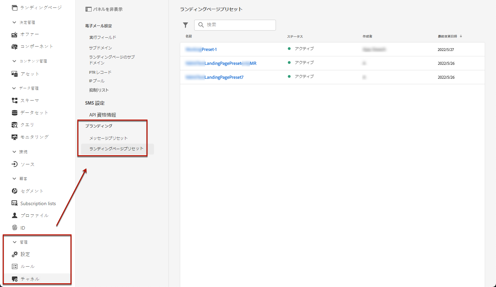

1. 任意のプリセットラベルをクリックして、ランディングページプリセットの詳細にアクセスします。

   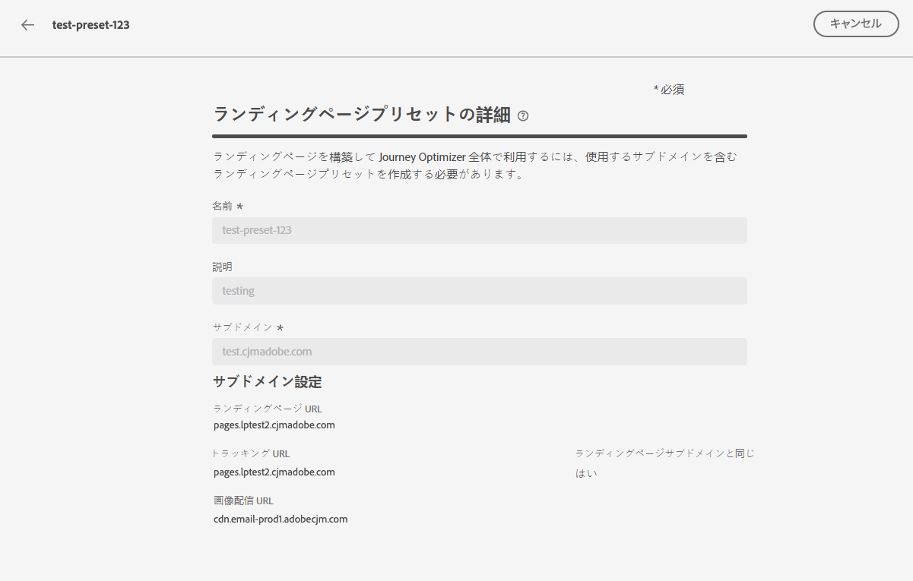

### ランディングページプリセットの作成 {#lp-create-preset}

ランディングページプリセットを作成するには、次の手順に従います。

1. 次にアクセス： **[!UICONTROL 管理]** > **[!UICONTROL チャネル]** メニューから、 **[!UICONTROL ブランディング]** > **[!UICONTROL ランディングページプリセット]**.

1. 選択 **[!UICONTROL ランディングページプリセットを作成]**.

   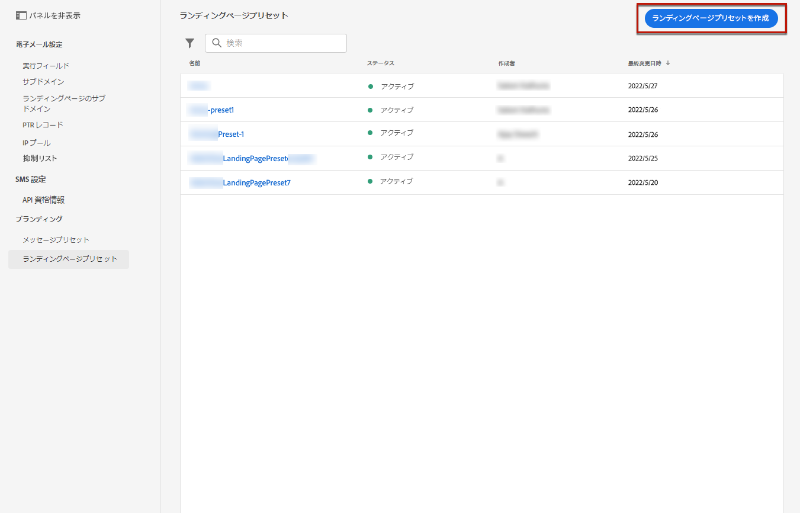

1. プリセットの名前と説明を入力します。

   >[!NOTE]
   >
   > 名前は、文字（A ～ Z）で始める必要があります。使用できるのは英数字のみです。 アンダースコア（`_`）、ドット（`.`）、ハイフン（`-`）も使用できます。

1. ドロップダウンリストからランディングページのサブドメインを選択します。

   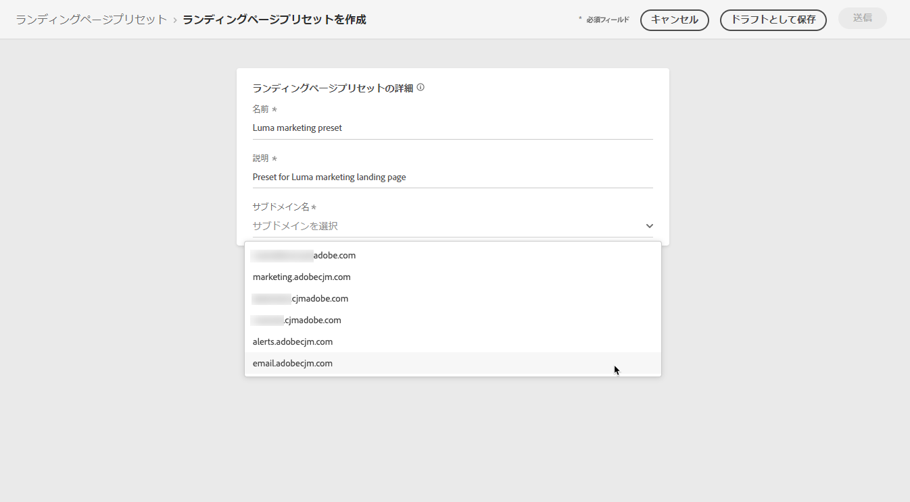

   >[!NOTE]
   >
   >サブドメインを選択できるようにするには、少なくとも 1 つのランディングページサブドメインを事前に設定済みであることを確認してください。 [方法](#lp-subdomains)

   選択したサブドメインに対応する設定が表示されます。

1. ランディングページサブドメインをトラッキング URL として選択する場合は、 **[!UICONTROL ランディングページのサブドメインと同じ]** オプション。 [トラッキングの詳細を説明します](../messages/message-tracking.md)

   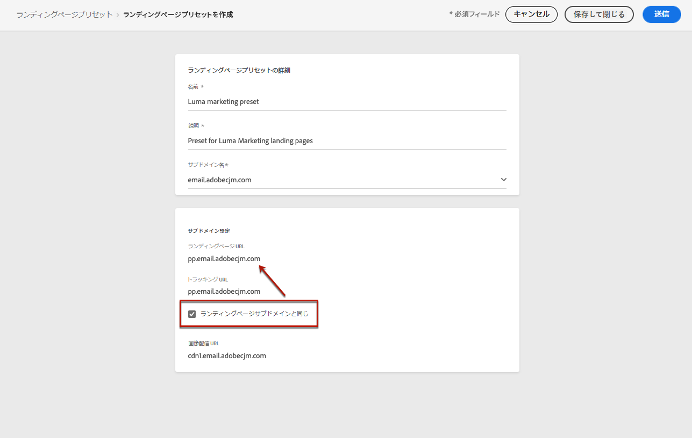

   例えば、ランディングページの URL が「pages.mail.luma.com」で、トラッキング URL が「data.mail.luma.com」の場合、トラッキングサブドメインとして「pages.mail.luma.com」を使用するように選択できます。

1. クリック **[!UICONTROL 送信]** をクリックして、ランディングページプリセットの作成を確定します。 また、プリセットをドラフトとして保存し、後で設定を再開することもできます。

   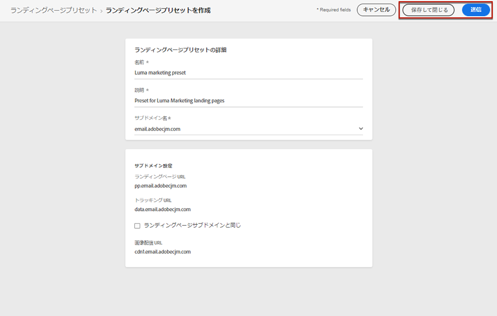

1. ランディングページプリセットを作成すると、リストに **[!UICONTROL アクティブ]** ステータス。 これで、ランディングページで使用する準備が整いました。

   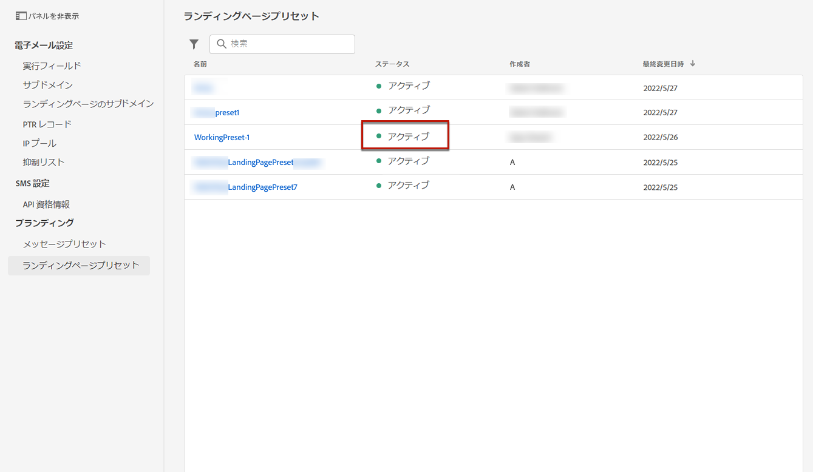

これで、次の準備が整いました。 [ランディングページの作成](../landing-pages/create-lp.md) in [!DNL Journey Optimizer].

>[!NOTE]
>
>プッシュ通知および電子メール用のメッセージプリセットを [この節](message-presets.md).

**関連トピック**:

* [ランディングページの基本を学ぶ](../landing-pages/get-started-lp.md)
* [ランディングページの作成](../landing-pages/create-lp.md#create-a-lp)
