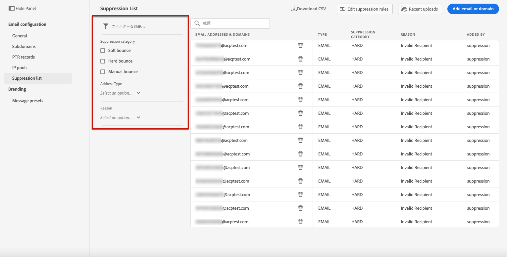
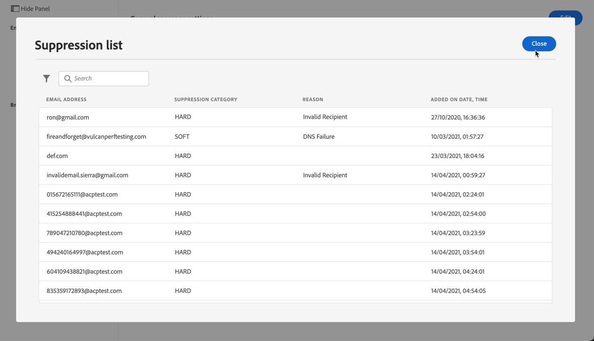

# 抑制リスト{#manage-suppression-list}を管理します

[!DNL Journey Optimizer]を使用すると、ジャーニーでの送信から自動的に除外されるすべてのEメールアドレスを監視できます。例：

* 無効なアドレス（ハードバウンス）や、常にソフトバウンスで、配信にEメールを引き続き含めると、Eメールのレピュテーションに悪影響を与える可能性があるアドレス。
* メールメッセージに対して何らかの形でスパムを申し立てる受信者。

<!--Profiles who unsubscribe from your sendings. Learn more on [opting-out](../consent.md). NOT TRUE as confirmed by eng.: "Subscribe and Unsubscribe are handled by the Consent/Subscription service. A user that opts out will not make it to the suppression list – we won’t send them emails."-->

このような電子メールアドレスは、Journey Optimizerの&#x200B;**抑制リスト**&#x200B;に自動的に収集されます。 詳しくは、[この節](../suppression-list.md)を参照してください。

## 抑制リスト{#access-suppression-list}にアクセスします

除外された電子メールアドレスの詳細なリストにアクセスするには、**[!UICONTROL チャネル]** / **[!UICONTROL 電子メール設定]** / **[!UICONTROL 一般]**&#x200B;メニューを開き、「**[!UICONTROL 抑制リストを表示]**」リンクをクリックします。

リストの参照に役立つフィルターを使用できます。

<!--suppression date,  category and reason, but on staging, only creation date filter is available-->

<!--You can also download the list as a CSV file for analysis and reporting purpose. Won't be available.-->

## 抑制のカテゴリと理由{#suppression-categories-and-reasons}

メッセージをEメールアドレスに配信できない場合、Journey Optimizerは配信が失敗した理由を特定し、抑制カテゴリに関連付けます。

抑制のカテゴリは次のとおりです。

* **ハード**:電子メールアドレスは、即座に抑制リストに送信されます。

* **ソフト**:ソフトエラーは、エラーカウンターが制限しきい値に達すると、アドレスを抑制リストに送信します。[再試行の詳細を説明します](retries.md)

* **無視**:
   * 有効な電子メールアドレスに対してエラーが発生したが、接続の失敗や一時的な技術的問題など、一時的であることがわかっている場合、エラーカウンターが制限しきい値に達すると、電子メールアドレスが抑制リストに追加されます。 [再試行の詳細を説明します](retries.md)。
   * エラーがスパム苦情の結果である場合、苦情を発行した受信者のEメールアドレスが直ちに抑制リストに送信されます。

<!--**Manual**: You can also manually add an email address to the suppression list. => Manual category will be available when manually adding an address to the suppression list (via API)-->

>[!NOTE]
>
>ソフトバウンスとハードバウンスの詳細については、「[配信エラーのタイプ](../suppression-list.md#delivery-failures)」の節を参照してください。

表示される各電子メールアドレスについて、**[!UICONTROL 理由]**&#x200B;をチェックして除外し、抑制リストに追加された日時を確認することもできます。

<!--to replace with suppression-list.png when Manual category is available (through API)-->

配信エラーの理由として考えられるものを以下に示します。

| 理由 | 説明 | 抑制カテゴリ |
---------|----------|--------- |
| **[!UICONTROL 未確定]** | 受信者ドメインメッセージ転送エージェント(MTA)から受け取ったバウンスの理由を識別できませんでした。 | 無視 |
| **[!UICONTROL 無効な受信者]** | 受信者が無効か、存在しません。 | ハード |
| **[!UICONTROL ソフトバウンス]** | メッセージソフトは、この表に示すソフトエラー以外の理由（ISPが推奨する許可率を超えた場合など）でバウンスしました。 | ソフト |
| **[!UICONTROL DNSエラー]** | DNSエラーが原因でメッセージがバウンスしました。 | ソフト |
| **[!UICONTROL メールボックス容量超過]** | 受信者のメールボックスがいっぱいになり、追加のメッセージを受け入れられなかったため、メッセージがバウンスしました。 | ソフト |
| **[!UICONTROL 大きすぎる]** | 受信者に対して大きすぎるため、メッセージがバウンスしました。  取得が実行されます。メッセージサイズを編集し、配信用に再挿入できます。 | 無視 |
| **[!UICONTROL タイムアウト]** | メッセージがタイムアウトし、ソフトバウンスされ、メッセージの再試行制限（3.5日）に達しました。 | 無視 |
| **[!UICONTROL 管理エラー]** | 送信側のシステム管理者が設定したポリシーに従って、メッセージが失敗しました。<!--For example, if emails are blackholed at the global, domain or binding level using the "blackhole" directive, this bounce code is used.--> | 無視 |
| **[!UICONTROL 一般的なバウンス：RCPTなし]** | メッセージの受信者を特定できませんでした。 | 無視 |
| **[!UICONTROL 一般的なバウンス]** | メッセージは、不特定の理由で失敗しました。 | 無視 |
| **[!UICONTROL メールブロック]** | メッセージが受信者（受信者MTA）によってブロックされた。 | 無視 |
| **[!UICONTROL スパムブロック]** | メッセージは、既知のスパムソースから送信されたものとして受信者にブロックされました。 例えば、送信IPブロックを指定できます。 | 無視 |
| **[!UICONTROL スパムコンテンツ]** | メッセージの内容が受信者（受信者MTA）にスパムとしてブロックされました。 | 無視 |
| **[!UICONTROL 禁止添付]** | メッセージに添付ファイルが含まれているため、受信者によってブロックされました。 | 無視 |
| **[!UICONTROL 中継拒否]** | 中継が許可されていないため、受信者によってメッセージがブロックされました。 | ソフト |
| **[!UICONTROL 自動応答]** | メッセージは自動返信/休暇のメールです。 | 無視 |
| **[!UICONTROL 一時的なエラー]** | メッセージの送信が一時的に遅れました。 | 無視 |
| **[!UICONTROL 課題対応]** | このメッセージはチャレンジレスポンスプローブです。 | ソフト |

>[!NOTE]
>
>購読解除されたユーザーは[!DNL Journey Optimizer]からEメールを受信しないので、そのEメールアドレスを抑制リストに送信することはできません。 選択は、Experience Platformレベルで処理されます。 [オプトアウト](../consent.md)の詳細をご覧ください。

<!--
Removed from the table provided by SparkPost/Momentum:
| **[!UICONTROL Subscribe]** | The message is a subscribe request. | Ignored |
| **[!UICONTROL Unsubscribe]** | The message is an unsubscribe request. | Hard |
-->

<!--Note to add eventually: If a user is subscribed and [!DNL Journey Optimizer] fails to send emails to their subscribed email address, they will get added to the suppression list. (not sure it's possible to subscribe through AJO or need to find reference to Experience Platform doc?)-->

