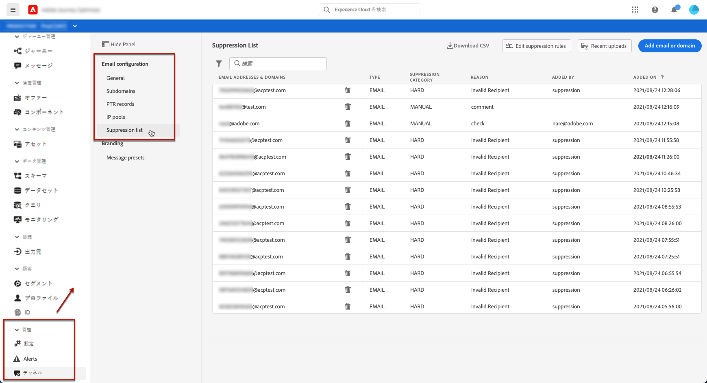
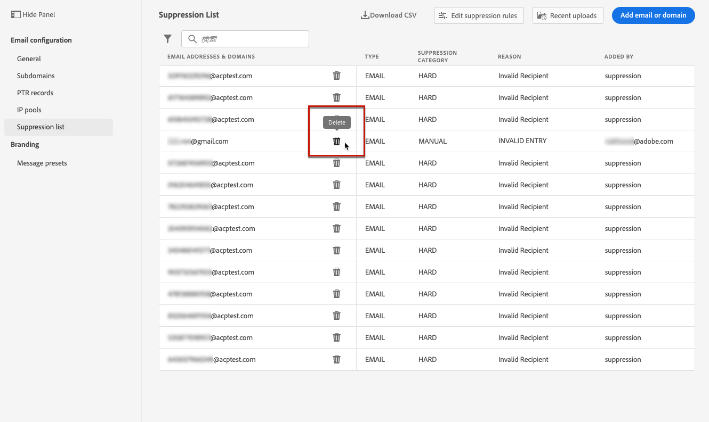
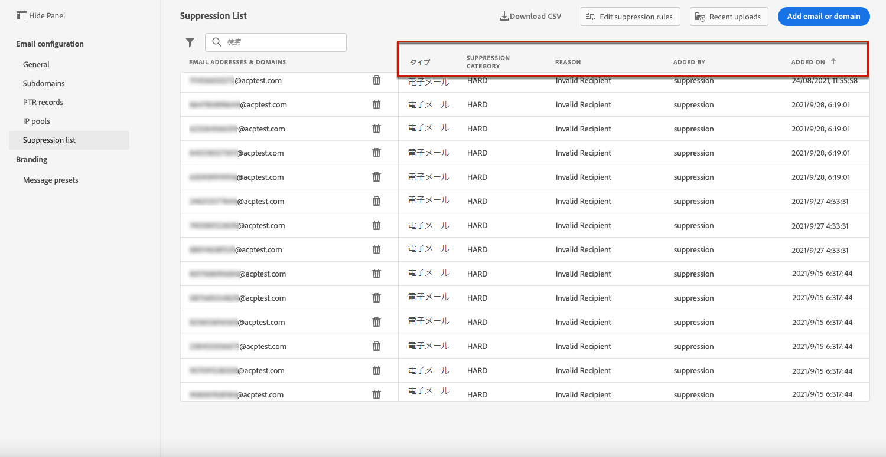
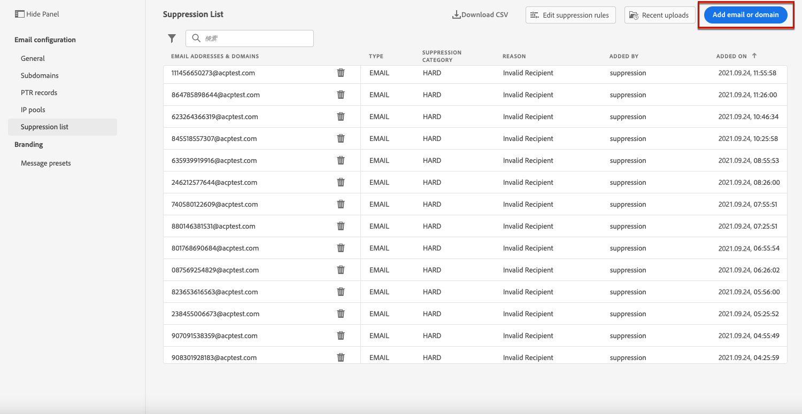
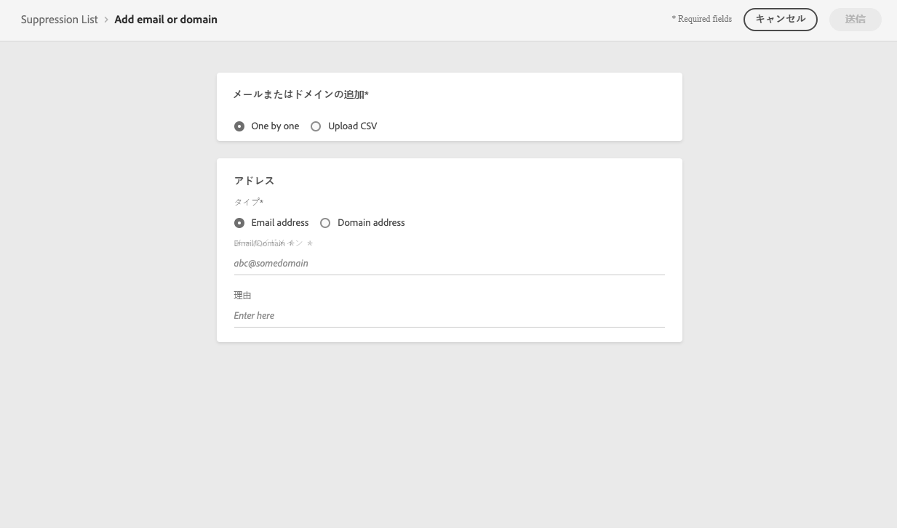
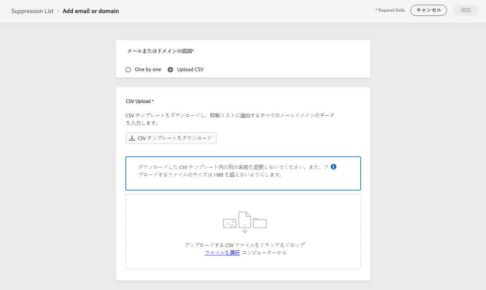
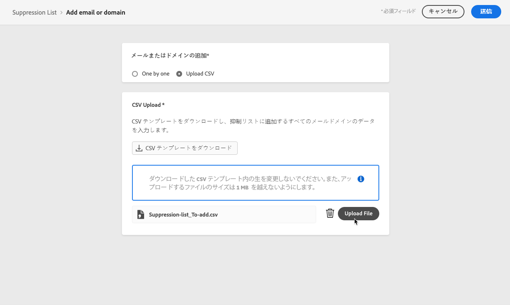
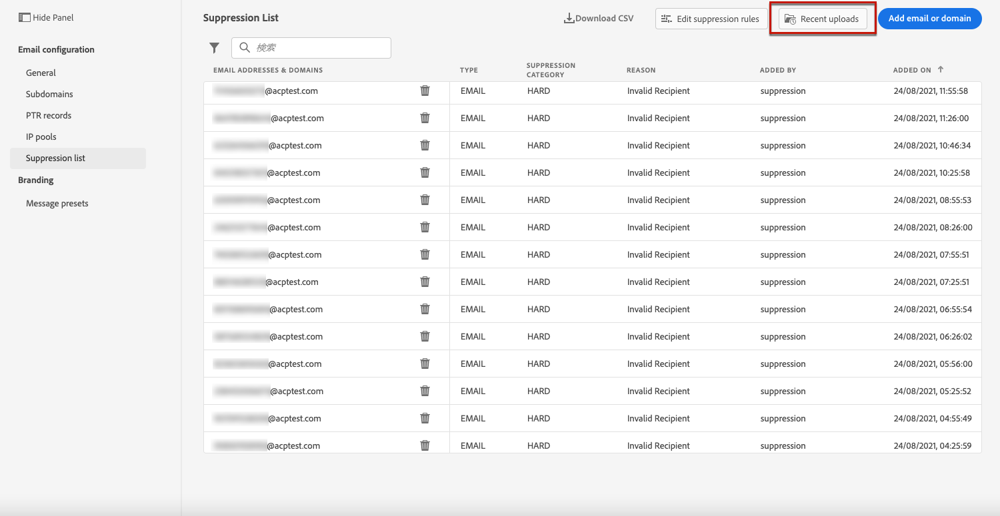
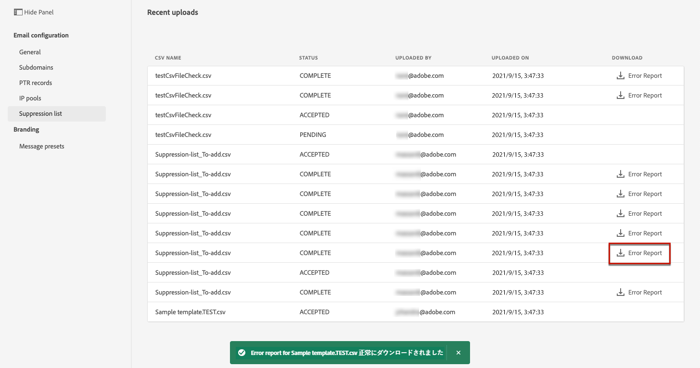

# 抑制リストの管理 {#manage-suppression-list}

[!DNL Journey Optimizer] を使用すると、次のような、ジャーニーでの送信から自動的に除外されるメールアドレスをすべて監視できます。

* 無効なアドレス（ハードバウンス）
* 一貫してソフトバウンスし、引き続き配信に含めるとメールの評価に悪影響を及ぼす可能性があるアドレス
* いずれかのメールメッセージに対して何らかのスパム報告を発行する受信者。

このようなメールアドレスは、Journey Optimizer の&#x200B;**抑制リスト**&#x200B;に自動的に収集されます。[この節](../suppression-list.md)では、抑制リストの概念と使用方法について詳しく説明します。

## 抑制リストへのアクセス {#access-suppression-list}

除外された電子メールアドレスの詳細なリストにアクセスするには、**[!UICONTROL 管理]** / **[!UICONTROL チャネル]** / **[!UICONTROL 電子メール設定]**&#x200B;に移動し、「**[!UICONTROL 抑制リスト]**」を選択します。

>[!CAUTION]
>
>抑制リストを表示、書き出し、管理する権限は、[ジャーニー管理者](../administration/ootb-product-profiles.md#journey-administrator)に制限されます。 [!DNL Journey Optimizer]ユーザーのアクセス権の管理について詳しくは、[この節](../administration/permissions-overview.md)を参照してください。

<!--

You can also display the suppression list content using the **[!UICONTROL View suppression list]** link through the **[!UICONTROL Channels]** > **[!UICONTROL Email configuration]** > **[!UICONTROL General]** menu, but this view does not allow you to edit the list.-->



リストの参照に役立つフィルターを使用できます。

<!---->


**[!UICONTROL 抑制カテゴリ]**、**[!UICONTROL アドレスの種類]**、または&#x200B;**[!UICONTROL 理由]**&#x200B;でフィルタリングできます。 各条件で選択したオプションを選択します。 選択した後で、リストの上部に表示されている各フィルターまたはすべてのフィルターをクリアできます。


電子メールアドレスまたはドメインを手動で誤って追加した場合は、「**[!UICONTROL 削除]**」ボタンを押すと、そのエントリを削除できます。

>[!CAUTION]
>
>**[!UICONTROL 削除]**&#x200B;ボタンを使用して、抑制されたEメールアドレスやドメインを削除しないでください。



抑制リストからEメールアドレスまたはドメインを削除すると、このアドレスまたはドメインへの配信が再び開始されます。 その結果、配信品質とIPのレピュテーションに重大な影響が及ぶ可能性があり、最終的にはIPアドレスや送信ドメインがブロックされる可能性があります。 [この節](../suppression-list.md)で抑制リストを維持する重要性について詳しく説明します。

>[!NOTE]
>
>Eメールアドレスやドメインの削除を検討する場合は、追加の注意が必要です。 不明な点がある場合は、配信品質のエキスパートにお問い合わせください。

**[!UICONTROL 抑制リスト]**&#x200B;ビューから、抑制ルールを編集することもできます。 [詳細情報](retries.md)

抑制リストをCSVファイルとして書き出すには、「**[!UICONTROL CSVをダウンロード]**」ボタンを選択します。


## 抑制のカテゴリと理由 {#suppression-categories-and-reasons}

メッセージをメールアドレスに配信できなかった場合、[!DNL Journey Optimizer] は配信が失敗した理由を特定し、**[!UICONTROL 抑制カテゴリ]**&#x200B;に関連付けます。

抑制のカテゴリは次のとおりです。

* **ハード**：メールアドレスは、即座に抑制リストに送信されます。

   >[!NOTE]
   >
   >エラーがスパムの苦情の結果である場合は、それも&#x200B;**ハード**&#x200B;カテゴリに分類されます。 苦情を出した受信者のメールアドレスは、直ちに抑制リストに送信されます。

* **ソフト**：ソフトエラーは、エラーカウンターが制限しきい値に達すると、アドレスを抑制リストに送信します。[再試行の詳細情報](retries.md)

   <!--
    **Ignored**:
    * When the error occurred for a valid email address but is known to be temporary, such as a failed connection attempt or a temporary technical issue, the email address is added to the suppression list once the error counter reaches the limit threshold. [Learn more on retries](retries.md).
    * When the error is the result of a spam complaint, the email address of the recipient who issued the complaint is immediately sent to the suppression list.
    -->

* **手動**：抑制リストにメールアドレスまたはドメインを手動で追加することもできます。[詳細情報](#add-addresses-and-domains)

>[!NOTE]
>
>ソフトバウンスとハードバウンスについて詳しくは、[配信失敗のタイプ](../suppression-list.md#delivery-failures)の節を参照してください。

一覧表示されているメールアドレスごとに、「**[!UICONTROL タイプ]**」（メールまたはドメイン）、除外する「**[!UICONTROL 理由]**」、追加したユーザーおよび抑制リストに追加された日時を確認することもできます。



配信エラーの理由として考えられるものを以下に示します。

| 理由 | 説明 | 抑制カテゴリ |
| --- | --- | --- |
| **[!UICONTROL 無効な受信者]** | 受信者が無効、または存在しません。 | ハード |
| **[!UICONTROL ソフトバウンス]** | メッセージソフトは、この表に示すソフトエラー以外の理由（ISP が推奨する許可率を超えた場合など）でバウンスしました。 | ソフト |
| **[!UICONTROL DNS エラー]** | DNS エラーが原因でメッセージがバウンスされました。 | ソフト |
| **[!UICONTROL メールボックス容量超過]** | 受信者のメールボックスがいっぱいになり、追加のメッセージを受け入れられなかったため、メッセージがバウンスされました。 | ソフト |
| **[!UICONTROL リレー拒否]** | リレーが許可されていないため、受信者によってメッセージがブロックされました。 | ソフト |
| **[!UICONTROL チャレンジレスポンス]** | このメッセージはチャレンジレスポンスプローブです。 | ソフト |
| **[!UICONTROL スパムに対する苦情]** | 受信者がスパムとしてマークしたため、メッセージはブロックされました。 | ハード |

>[!NOTE]
>
>購読を解除したユーザーは [!DNL Journey Optimizer] からのメールを受信しないので、そのメールアドレスを抑制リストに送信することはできません。 選択は、Experience Platform レベルで処理されます。[オプトアウトの詳細を表示します](../consent.md)

<!--
Removed from the table provided by SparkPost/Momentum:
| **[!UICONTROL Undetermined]** | The bounce reason received from the recipient domain Message Transfer Agent (MTA) could not be identified. | Ignored |
| **[!UICONTROL Too Large]** | The message bounced because it was too large for the recipient. [Retries](retries.md) will be performed: you can edit the message size and re-inject it for delivery. | Ignored |
| **[!UICONTROL Timeout]** | The message timed out, meaning it soft bounced and reached the message retry limit (3.5 days). | Ignored |
| **[!UICONTROL Admin Failure]** | The message was failed according to the policies configured by the sending system administrator. ///For example, if emails are blackholed at the global, domain or binding level using the "blackhole" directive, this bounce code is used. | Ignored |
| **[!UICONTROL Generic Bounce: No RCPT]** | No recipient could be determined for the message. | Ignored |
| **[!UICONTROL Generic Bounce]** | The message failed for unspecified reasons. | Ignored |
| **[!UICONTROL Mail Block]** | The message was blocked by the receiver (i.e. recipient MTA). | Ignored |
| **[!UICONTROL Spam Block]** | The message was blocked by the receiver as coming from a known spam source. It could be a sending IP block for example. | Ignored |
| **[!UICONTROL Spam Content]** | The message content was blocked by the receiver (recipient MTA) as spam. | Ignored |
| **[!UICONTROL Prohibited Attachment]** | The message was blocked by the receiver because it contained an attachment. | Ignored |
| **[!UICONTROL Auto-Reply]** | The message is an auto-reply/vacation mail. | Ignored |
| **[!UICONTROL Transient Failure]** | Message transmission has been temporarily delayed. | Ignored |
| **[!UICONTROL Subscribe]** | The message is a subscribe request. | Ignored |
| **[!UICONTROL Unsubscribe]** | The message is an unsubscribe request. | Hard |
-->

<!--Note to add eventually: If a user is subscribed and [!DNL Journey Optimizer] fails to send emails to their subscribed email address, they will get added to the suppression list.-->

## アドレスとドメインの手動追加 {#add-addresses-and-domains}

メッセージをEメールアドレスに配信できない場合、このアドレスは、定義された抑制ルールまたはバウンス数に基づいて、抑制リストに自動的に追加されます。

ただし、[!DNL Journey Optimizer]抑制リストを手動で設定して、送信から特定のEメールアドレスやドメインを除外することもできます。

CSVファイルのアップロードを通じて、電子メールアドレスやドメイン[を一度に1つずつ追加したり、](#add-one-address-or-domain)一括モード](#upload-csv-file)で[追加したりできます。

それには、「**[!UICONTROL Eメールまたはドメインを追加]**」ボタンを選択し、次のいずれかの方法に従います。



### 1つのアドレスまたはドメインを追加する {#add-one-address-or-domain}

1. 「**[!UICONTROL 1つずつ]**」オプションを選択します。

   

1. アドレスの種類を選択します。**[!UICONTROL Eメールアドレス]**&#x200B;または&#x200B;**[!UICONTROL ドメインアドレス]**。

1. 送信から除外するEメールアドレスまたはドメインを入力します。

   >[!NOTE]
   >
   >有効な電子メールアドレス(abc@companyなど)またはドメイン（abc.company.comなど）を必ず入力してください。

1. 必要に応じて理由を指定します。

1. 「**[!UICONTROL 送信]**」をクリックします。

### CSVファイルのアップロード {#upload-csv-file}

1. 「**[!UICONTROL CSVをアップロード]**」オプションを選択します。

   

1. 使用するCSVテンプレートをダウンロードします。以下の列と形式が含まれます。

   ```
   TYPE,VALUE,COMMENT
   EMAIL,abc@somedomain.com,Comment
   DOMAIN,somedomain.com,Comment
   ```
   このテンプレートは、**[!UICONTROL 抑制リスト]**&#x200B;のメインビューからもダウンロードできます。

   >[!CAUTION]
   >
   >CSVテンプレート内の列の名前は変更しないでください。
   >
   >ファイルサイズは1 MB以下にする必要があります。

1. CSVテンプレートに、抑制リストに追加する電子メールアドレスやドメインを入力します。

1. 完了したら、CSVファイルをドラッグ&amp;ドロップし、「**[!UICONTROL ファイルをアップロード]**」をクリックします。

   

1. 「**[!UICONTROL 送信]**」をクリックします。

### 最近のアップロードステータスの確認 {#recent-uploads}

アップロードした最新のCSVファイルのリストを確認できます。

これをおこなうには、**[!UICONTROL 抑制リスト]**&#x200B;ビューで、「**[!UICONTROL 最近のアップロード]**」ボタンをクリックします。



送信した最新のアップロードと、対応するステータスが表示されます。

エラーレポートがファイルに関連付けられている場合は、ファイルをダウンロードして、発生したエラーを確認できます。



次に、エラーレポートに含まれるエントリのタイプの例を示します。

```
type,value,comments,failureReason
Email,examplemail.com,MANUAL,Invalid format for value: examplemail.com
Email,examplemail,MANUAL,Invalid format for value: examplemail
Email,example@mail,MANUAL,Invalid format for value: example@mail
Domain,example,MANUAL,Invalid format for value: example
Domain,example.!com,MANUAL,Invalid format for value: example.!com
Domain,!examplecom,MANUAL,Invalid format for value: !examplecom
```
