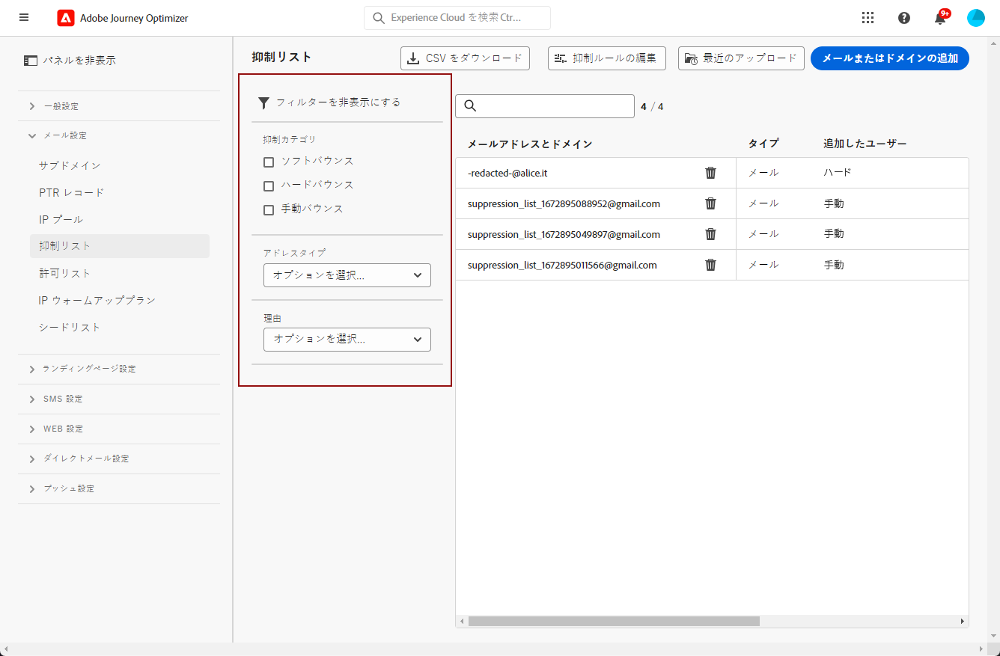
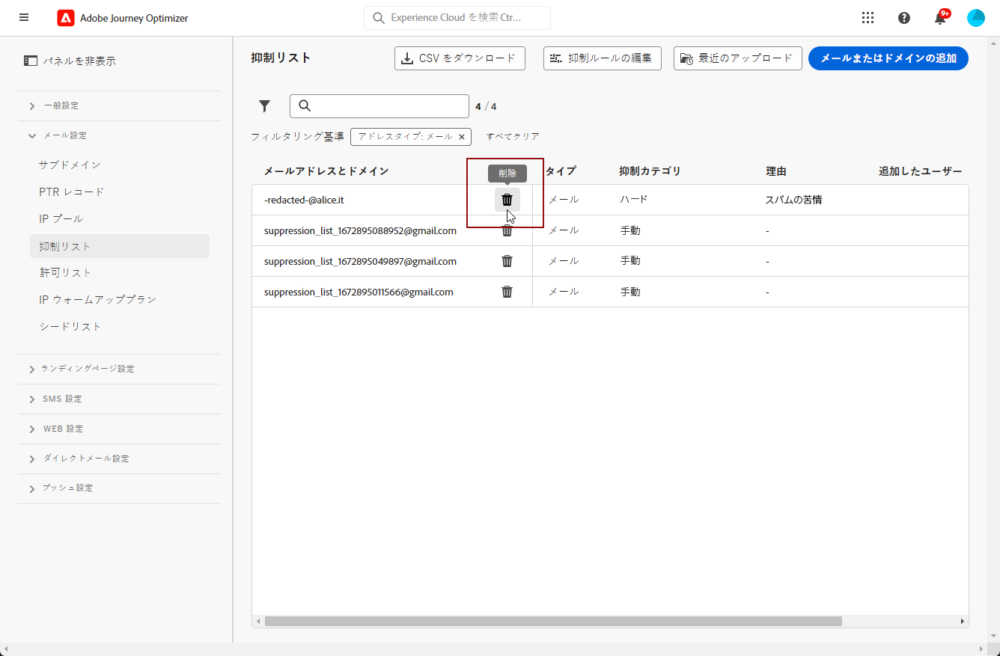
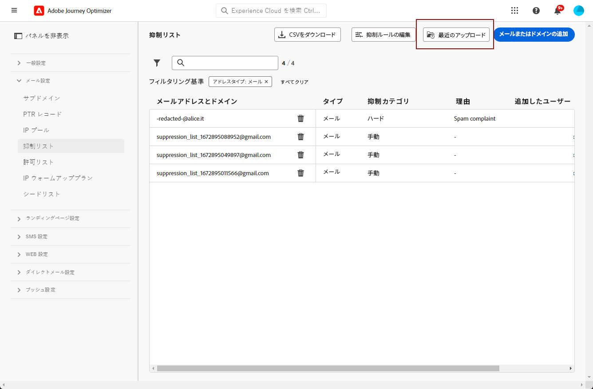

# 抑制リストの管理 {#manage-suppression-list}

[!DNL Journey Optimizer] を使用すると、次のような、ジャーニーでの送信から自動的に除外されるメールアドレスをすべて監視できます。

* 無効なアドレス（ハードバウンス）
* 一貫してソフトバウンスし、引き続き配信に含めるとメールの評価に悪影響を及ぼす可能性があるアドレス
* いずれかのメールメッセージに対して何らかのスパム報告を発行する受信者。

このようなメールアドレスは、Journey Optimizer の&#x200B;**抑制リスト**&#x200B;に自動的に収集されます。抑制リストの概念と使用方法について詳しくは、[この節](../messages/suppression-list.md)を参照してください。

## 抑制リストへのアクセス {#access-suppression-list}

除外されたメールアドレスの詳細なリストにアクセスするには、**[!UICONTROL 管理]**／**[!UICONTROL チャネル]**／**[!UICONTROL メール設定]** に移動し、「**[!UICONTROL 抑制リスト]**」を選択します。

>[!CAUTION]
>
>抑制リストの表示、エクスポートおよび管理を行う権限は、[ジャーニー管理者](../administration/ootb-product-profiles.md#journey-administrator)にのみ付与されます。 [!DNL Journey Optimizer] ユーザーのアクセス権の管理について詳しくは、[この節](../administration/permissions-overview.md)を参照してください。


リストの参照に役立つフィルターを使用できます。



**[!UICONTROL 抑制カテゴリ]**、**[!UICONTROL アドレスタイプ]**、**[!UICONTROL 理由]**&#x200B;のいずれかでフィルタリングできます。 条件ごとに目的のオプションを選択します。 選択したら、リストの上部に表示されている各フィルターまたはすべてのフィルターをクリアできます。


メールアドレスまたはドメインを手動で誤って追加した場合は、「**[!UICONTROL 削除]**」ボタンをクリックして、そのエントリを削除できます。

>[!CAUTION]
>
>抑制されたメールアドレスやドメインの削除に「**[!UICONTROL 削除]**」ボタンを使用しないでください。



抑制リストからメールアドレスまたはドメインを削除すると、このアドレスまたはドメインへの配信が再び開始されることになります。 その結果、配信品質と IP の評価に重大な影響を及ぼす可能性があり、最終的には IP アドレスや送信ドメインがブロックされる可能性があります。 抑制リストの維持の重要性について詳しくは、[この節](../messages/suppression-list.md)を参照してください。

>[!NOTE]
>
>メールアドレスやドメインの削除を検討する際は、細心の注意を払う必要があります。不明な点がある場合は、配信品質のエキスパートにお問い合わせください。

**[!UICONTROL 抑制リスト]**&#x200B;ビューから、抑制ルールを編集することもできます。 [ 詳細情報 ](retries.md)

抑制リストを CSV ファイルとしてエクスポートするには、「**[!UICONTROL CSV をダウンロード]**」ボタンを選択します。


## 抑制のカテゴリと理由 {#suppression-categories-and-reasons}

メッセージをメールアドレスに配信できなかった場合、[!DNL Journey Optimizer] は配信が失敗した理由を特定し、**[!UICONTROL 抑制カテゴリ]**&#x200B;に関連付けます。

抑制のカテゴリは次のとおりです。

* **ハード**：メールアドレスは、即座に抑制リストに送信されます。

   >[!NOTE]
   >
   >エラーがスパムの苦情の結果である場合は、それも&#x200B;**ハード**&#x200B;カテゴリに分類されます。 苦情を出した受信者のメールアドレスは、直ちに抑制リストに送信されます。

* **ソフト**：ソフトエラーは、エラーカウンターが制限しきい値に達すると、アドレスを抑制リストに送信します。[再試行の詳細情報](retries.md)

* **手動**：抑制リストにメールアドレスまたはドメインを手動で追加することもできます。[詳細情報](#add-addresses-and-domains)

>[!NOTE]
>
>ソフトバウンスとハードバウンスについて詳しくは、[配信失敗のタイプ](../messages/suppression-list.md#delivery-failures)の節を参照してください。

一覧表示されているメールアドレスごとに、「**[!UICONTROL タイプ]**」（メールまたはドメイン）、除外する「**[!UICONTROL 理由]**」、追加したユーザーおよび抑制リストに追加された日時を確認することもできます。


配信エラーの理由として考えられるものを以下に示します。

| 理由 | 説明 | 抑制カテゴリ |
| --- | --- | --- |
| **[!UICONTROL 無効な受信者]** | 受信者が無効、または存在しません。 | ハード |
| **[!UICONTROL ソフトバウンス]** | メッセージソフトは、この表に示すソフトエラー以外の理由（ISP が推奨する許可率を超えた場合など）でバウンスしました。 | ソフト |
| **[!UICONTROL DNS エラー]** | DNS エラーが原因でメッセージがバウンスされました。 | ソフト |
| **[!UICONTROL メールボックス容量超過]** | 受信者のメールボックスがいっぱいになり、追加のメッセージを受け入れられなかったため、メッセージがバウンスされました。 | ソフト |
| **[!UICONTROL リレー拒否]** | リレーが許可されていないため、受信者によってメッセージがブロックされました。 | ソフト |
| **[!UICONTROL チャレンジレスポンス]** | このメッセージはチャレンジレスポンスプローブです。 | ソフト |
| **[!UICONTROL スパムの苦情]** | 受信者にスパムと見なされたので、メッセージはブロックされました。 | ハード |

>[!NOTE]
>
>購読を解除したユーザーは [!DNL Journey Optimizer] からのメールを受信しないので、そのメールアドレスを抑制リストに送信することはできません。 選択は、Experience Platform レベルで処理されます。[オプトアウトの詳細情報](../messages/consent.md)

## アドレスとドメインの手動追加 {#add-addresses-and-domains}

メッセージをメールアドレスに配信できない場合、このアドレスは、定義済みの抑制ルールまたはバウンス数に基づいて、抑制リストに自動的に追加されます。

ただし、[!DNL Journey Optimizer] 抑制リストに手動で入力して、特定のメールアドレスやドメインを送信から除外することもできます。

メールアドレスやドメインは、[1 つずつ](#add-one-address-or-domain)追加することも、CSV ファイルのアップロードを通じて[一括モードで](#upload-csv-file)追加することもできます。

それには、「**[!UICONTROL メールまたはドメインを追加]**」ボタンを選択し、次のいずれかの方法に従います。


### 1 つのアドレスまたはドメインの追加 {#add-one-address-or-domain}

1. 「**[!UICONTROL 1 つずつ]**」オプションを選択します。

   

1. アドレスタイプとして、「**[!UICONTROL メールアドレス]**」または「**[!UICONTROL ドメインアドレス]**」を選択します。

1. 送信から除外するメールアドレスまたはドメインを入力します。

   >[!NOTE]
   >
   >必ず有効なメールアドレス（abc@company など）または有効なドメイン（abc.company.com など）を入力してください。

1. 必要に応じて理由を指定します。

1. 「**[!UICONTROL 送信]**」をクリックします。

### CSV ファイルのアップロード {#upload-csv-file}

1. 「**[!UICONTROL CSV をアップロード]**」オプションを選択します。

   

1. 使用する CSV テンプレートをダウンロードします。これには、以下の列と形式が含まれています。

   ```
   TYPE,VALUE,COMMENT
   EMAIL,abc@somedomain.com,Comment
   DOMAIN,somedomain.com,Comment
   ```
   このテンプレートは、**[!UICONTROL 抑制リスト]**&#x200B;のメインビューからダウンロードすることもできます。

   >[!CAUTION]
   >
   >CSV テンプレート内の列の名前は変更しないでください。
   >
   >ファイルサイズは 1 MB 以下にする必要があります。

1. 抑制リストに追加するメールアドレスやドメインを CSV テンプレートに入力します。

1. 完了したら、CSV ファイルをドラッグ＆ドロップしたあと、「**[!UICONTROL ファイルをアップロード]**」をクリックします。

   

1. 「**[!UICONTROL 送信]**」をクリックします。

### 最近のアップロードステータスの確認 {#recent-uploads}

アップロードした最新の CSV ファイルのリストを確認できます。

それには、**[!UICONTROL 抑制リスト]**&#x200B;ビューで、「**[!UICONTROL 最近のアップロード]**」ボタンをクリックします。



送信した最新のアップロードと、それに対応するステータスが表示されます。

エラーレポートがファイルに関連付けられている場合は、そのファイルをダウンロードして、発生したエラーを確認できます。


エラーレポートに表示されるエントリのタイプの例を以下に示します。

```
type,value,comments,failureReason
Email,examplemail.com,MANUAL,Invalid format for value: examplemail.com
Email,examplemail,MANUAL,Invalid format for value: examplemail
Email,example@mail,MANUAL,Invalid format for value: example@mail
Domain,example,MANUAL,Invalid format for value: example
Domain,example.!com,MANUAL,Invalid format for value: example.!com
Domain,!examplecom,MANUAL,Invalid format for value: !examplecom
```
