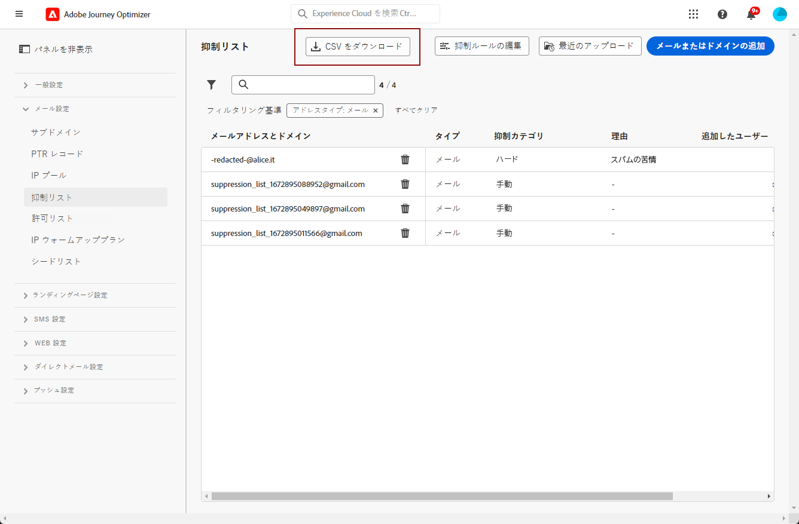

# 抑制リストの管理 {#manage-suppression-list}

を使用 [!DNL Journey Optimizer]を使用すると、ジャーニーまたはキャンペーンでの送信から自動的に除外されたすべての電子メールアドレス（ハードバウンス、ソフトバウンス、スパムの苦情など）を監視できます。

このようなメールアドレスは、Journey Optimizer の&#x200B;**抑制リスト**&#x200B;に自動的に収集されます。抑制リストは、オーディエンスから除外するアドレスとドメインで構成されます。 単一のクライアント環境（サンドボックス ID に関連付けられた組織 ID に固有の環境）で、すべてのメーリングをまたいで抑制されるメールアドレスとドメインを収集します。

抑制リストの概念と使用方法について詳しくは、[この節](../reports/suppression-list.md)を参照してください。


## 抑制リストへのアクセス {#access-suppression-list}

除外された E メールアドレスとドメインの詳細なリストにアクセスするには、以下を参照してください： **[!UICONTROL 管理]** > **[!UICONTROL チャネル]** > **[!UICONTROL 電子メール設定]**&#x200B;を選択し、 **[!UICONTROL 抑制リスト]**.


>[!CAUTION]
>
>抑制リストの表示、エクスポートおよび管理を行う権限は、[ジャーニー管理者](../administration/ootb-product-profiles.md#journey-administrator)にのみ付与されます。[!DNL Journey Optimizer] ユーザーのアクセス権の管理について詳しくは、[この節](../administration/permissions-overview.md)を参照してください。


リストの参照に役立つフィルターを使用できます。


**[!UICONTROL 抑制カテゴリ]**、**[!UICONTROL アドレスタイプ]**、**[!UICONTROL 理由]**&#x200B;のいずれかでフィルタリングできます。条件ごとに 1 つ以上のオプションを選択します。 選択したら、リストの上部に表示されている各フィルターまたはすべてのフィルターをクリアできます。


## 失敗の理由の理解 {#suppression-categories-and-reasons}

メッセージをメールアドレスに配信できなかった場合、[!DNL Journey Optimizer] は配信が失敗した理由を特定し、**[!UICONTROL 抑制カテゴリ]**&#x200B;に関連付けます。

抑制のカテゴリは次のとおりです。

* **ハード**:ハードバウンスは、無効な電子メールアドレス（存在しない電子メールアドレス）を示します。 これには、アドレスが無効であることを明示的に示す受信メールサーバーからのバウンスメッセージが含まれます。電子メールアドレスが直ちに抑制リストに送信されます。

   エラーがスパムの苦情の結果である場合は、それも&#x200B;**ハード**&#x200B;カテゴリに分類されます。苦情を出した受信者のメールアドレスは、直ちに抑制リストに送信されます。

* **ソフト**:ソフトバウンスは、有効な電子メールアドレスに対して発生した一時的な電子メールバウンスです。 この電子メールアドレスは、数回再試行した後で抑制リストに追加されます。 ソフトエラーは、エラーカウンターが制限しきい値に達すると、アドレスを抑制リストに送信します。 [再試行の詳細](retries.md)

* **手動**:手動のエラーが抑制リストに手動で追加されました。 [詳細情報](#add-addresses-and-domains)

一覧表示されているメールアドレスごとに、「**[!UICONTROL タイプ]**」（メールまたはドメイン）、除外する「**[!UICONTROL 理由]**」、追加したユーザーおよび抑制リストに追加された日時を確認することもできます。


配信エラーの理由として考えられるものは次のとおりです。

| 理由 | 説明 | カテゴリ |
| --- | --- | --- |
| **[!UICONTROL 無効な受信者]** | 受信者が無効、または存在しません。 | ハード |
| **[!UICONTROL ソフトバウンス]** | メッセージソフトは、この表に示すソフトエラー以外の理由（ISP が推奨する許可率を超えた場合など）でバウンスしました。 | ソフト |
| **[!UICONTROL DNS エラー]** | DNS エラーが原因でメッセージがバウンスされました。 | ソフト |
| **[!UICONTROL メールボックス容量超過]** | 受信者のメールボックスがいっぱいになり、追加のメッセージを受け入れられなかったため、メッセージがバウンスされました。 | ソフト |
| **[!UICONTROL リレー拒否]** | リレーが許可されていないため、受信者によってメッセージがブロックされました。 | ソフト |
| **[!UICONTROL チャレンジレスポンス]** | このメッセージはチャレンジレスポンスプローブです。 | ソフト |
| **[!UICONTROL スパムの苦情]** | 受信者にスパムと見なされたので、メッセージはブロックされました。 | ハード |

>[!NOTE]
>
>購読を解除したユーザーは [!DNL Journey Optimizer] からのメールを受信しないので、そのメールアドレスを抑制リストに送信することはできません。選択は、Experience Platform レベルで処理されます。[オプトアウトの詳細情報](../privacy/opt-out.md)


### 抑制ルール  {#suppression-rules}

次の **[!UICONTROL 抑制リスト]** 表示では、抑制ルールに関連付けられた再試行パラメーターを **[!UICONTROL 抑制ルールを編集]** 」ボタンをクリックします。 現在のサンドボックスの再試行しきい値を更新するには、このオプションを使用します。 [再試行の詳細](retries.md).


## 抑制リストにアドレスとドメインを追加{#add-addresses-and-domains}

>[!CONTEXTUALHELP]
>id="ajo_admin_suppression_list_header"
>title="抑制リストにメールもしくはドメインを追加"
>abstract="Journey Optimizer 抑制リストに手動で入力して、特定のメールアドレスやドメインを送信から除外することができます。"

>[!CONTEXTUALHELP]
>id="ajo_admin_suppression_list"
>title="抑制リストにメールもしくはドメインを追加"
>abstract="抑制リストへの入力は、CSV ファイルのアップロードを通じて、手動でメールアドレスまたはドメインを 1 つずつ追加するか、一括モードで追加します。これらの特定のメールアドレスやドメインは、送信から除外されます。"

メッセージをメールアドレスに配信できない場合、このアドレスは、定義済みの抑制ルールまたはバウンス数に基づいて、抑制リストに自動的に追加されます。

ただし、[!DNL Journey Optimizer] 抑制リストに手動で入力して、特定のメールアドレスやドメインを送信から除外することもできます。

>[!NOTE]
>
>の所要時間は最大 60 分です [!DNL Journey Optimizer] 送信メールの抑制済みアドレスを考慮に入れるため。

メールアドレスやドメインは、[1 つずつ](#add-one-address-or-domain)追加することも、CSV ファイルのアップロードを通じて[一括モードで](#upload-csv-file)追加することもできます。

### 1 つのアドレスまたはドメインの追加 {#add-one-address-or-domain}

>[!CONTEXTUALHELP]
>id="ajo_admin_suppression_list_address"
>title="抑制リストに項目を 1 つ追加"
>abstract="抑制リストに入力するには、電子メールアドレスやドメインを 1 つずつ追加します。"

抑制リストに電子メールアドレスまたはドメインを追加するには、次の手順に従います。

1. 「**[!UICONTROL メールまたはドメインの追加]**」ボタンを選択します。

   

1. を選択します。 **[!UICONTROL 1 つずつ]** オプション。

   

1. 次のアドレスのタイプを選択します。 **[!UICONTROL 電子メール]** または **[!UICONTROL ドメイン]**.

1. 送信から除外するメールアドレスまたはドメインを入力します。

   >[!NOTE]
   >
   >必ず有効なメールアドレス（abc@company.com など）または有効なドメイン（abc.company.com など）を入力してください。

1. （オプション）理由を入力します。 32～126 文字で構成される ASCII 印刷可能文字はすべて、このフィールドで使用できます。

1. 以下を使用： **[!UICONTROL 送信]** ボタンをクリックして確定します。

### CSV ファイルのアップロード {#upload-csv-file}

>[!CONTEXTUALHELP]
>id="ajo_admin_suppression_list_csv"
>title="CSV をアップロードして抑制リストに項目を追加"
>abstract="抑制リストに入力するには、除外する電子メールアドレス／ドメインが入力された CSV ファイルをアップロードします。"

抑制リストに電子メールアドレスのグループまたはドメインを追加するには、次の手順に従います。

1. 「**[!UICONTROL メールまたはドメインの追加]**」ボタンを選択します。
1. を選択します。 **[!UICONTROL CSV をアップロード]** オプション。

   

1. 使用する CSV テンプレートをダウンロードします。これには、以下の列と形式が含まれています。

   ```
   TYPE,VALUE,COMMENT
   EMAIL,abc@somedomain.com,Comment
   DOMAIN,somedomain.com,Comment
   ```

1. 抑制リストに追加する電子メールアドレスやドメインを CSV テンプレートに入力します。 32 ～ 126 の範囲で構成される ASCII 印刷可能文字は、 **コメント** 列。

   >[!CAUTION]
   >
   >CSV テンプレート内の列の名前を変更しないでください。
   >
   >ファイルサイズは 1 MB 以下にする必要があります。

1. 完了したら、CSV ファイルをドラッグ&amp;ドロップし、 **[!UICONTROL 送信]** ボタンをクリックして確定します。

   

アップロードが完了したら、 [最近のアップロード](#recent-uploads) ボタンを使用します。

### アップロードステータスの確認 {#recent-uploads}

以下を使用： **[!UICONTROL 最近のアップロード]** ボタンをクリックして、最新のアップロードされた CSV ファイルのステータスを確認します。


可能なステータスは次のとおりです。

* **[!UICONTROL 保留中]**:ファイルのアップロードを処理中です。
* **[!UICONTROL エラー]**:技術的な問題またはファイル形式のエラーが原因で、ファイルのアップロードプロセスに失敗しました。
* **[!UICONTROL 完了]**:ファイルのアップロード処理が正常に完了しました。

アップロード中に、正しい形式でないアドレスがある場合、それらのアドレスは [!DNL Journey Optimizer] 抑制リスト。

その場合、アップロードが完了すると、レポートに関連付けられます。 ダウンロードして、発生したエラーを確認できます<!-- and understand why they were not added to the suppression list-->.


エラーレポートに表示されるエントリのタイプの例を以下に示します。

```
type,value,comments,failureReason
Email,examplemail.com,MANUAL,Invalid format for value: examplemail.com
Email,examplemail,MANUAL,Invalid format for value: examplemail
Email,example@mail,MANUAL,Invalid format for value: example@mail
Domain,example,MANUAL,Invalid format for value: example
Domain,example.!com,MANUAL,Invalid format for value: example.!com
Domain,!examplecom,MANUAL,Invalid format for value: !examplecom
```

## 抑制リストからアドレスを削除{#remove-from-suppression-list}

抑制リストは手動で更新できます。 強制隔離から E メールアドレスを削除する操作は機密性が高く、IP のレピュテーションと配信品質の割合に影響を与える可能性があります。 必ず注意して進めてください。

抑制リストから E メールアドレスまたはドメインを削除する際、Adobe Journey Optimizerは、このアドレスまたはドメインへの配信を再び開始できます。  での配信品質の詳細を説明します [この節](../reports/deliverability.md).

抑制リストからアドレスを削除するには、 **[!UICONTROL 削除]** 」ボタンをクリックします。


>[!NOTE]
>
>メールアドレスやドメインの削除を検討する際は、細心の注意を払う必要があります。不明な点がある場合は、配信品質のエキスパートにお問い合わせください。


例えば、インターネットサービスプロバイダー (ISP) の機能停止が発生した場合、E メールは受信者に正常に配信できないので、誤ってハードバウンスとマークされることがあります。 これらの電子メールアドレスは、抑制リストから削除する必要があります。

これを実行するには、抑制リストをフィルターして、影響を受ける E メールアドレスまたはドメインを表示します。 例えば、ISP の停止が 2022 年 11 月 11 日から 2022 年 11 月 13 日 ( **test.com** ドメインで、その期間に抑制リストに追加されたアドレスを次のようにフィルターします。


また、停止の詳細に応じて、バウンスのタイプに関するフィルターを追加する必要があります。 これらの詳細は、送信者に返される正確なエラーコードなど、ISP から提供されます。 例： `550 <email address> recipient rejected` または `550 5.1.1 ‘email address’: user lookup success but no user record found`.

特定されたアドレスは、 **[!UICONTROL 削除]** 」ボタンをクリックします。 その後、これらのアドレスを今後の E メールキャンペーンに含めることができます。

## 抑制リストのダウンロード {#download-suppression-list}

<!--
>[!CONTEXTUALHELP]
>id="ajo_admin_suppression_list_download"
>title="Export the list as a CSV file"
>abstract="To download the suppression list, you can either export the current list by generating a new file, or download the file that was previously generated."
-->

抑制リストを CSV ファイルとして書き出すには、次の手順に従います。

1. 「**[!UICONTROL CSV をダウンロード]**」ボタンを選択します。 

   

1. ファイルが生成されるまで待ちます。

   

   >[!NOTE]
   >
   >ダウンロード時間は、ファイルサイズ（抑制リストにあるアドレスの数）によって異なります。
   >
   >特定のサンドボックスに対して、一度に 1 つのダウンロードリクエストを処理できます。

1. ファイルが生成されると、通知が届きます。 画面の右上にあるベルアイコンをクリックして、表示します。

1. 通知自体をクリックして、ファイルをダウンロードします。

   

   >[!NOTE]
   >
   >リンクは 24 時間有効です。

<!--When downloading the CSV file, you can choose to either:

* Download the file that was previously generated by another user or yourself.

* Generate a new file in order to export the current suppression list.-->