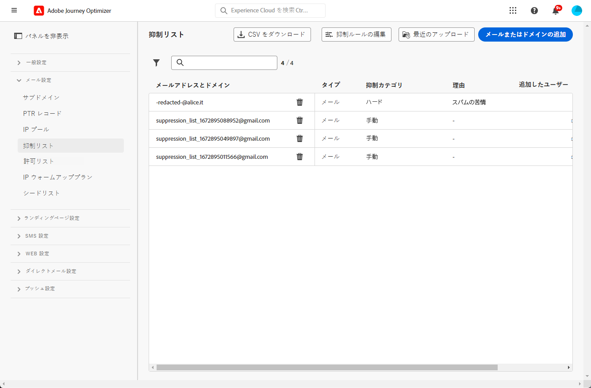
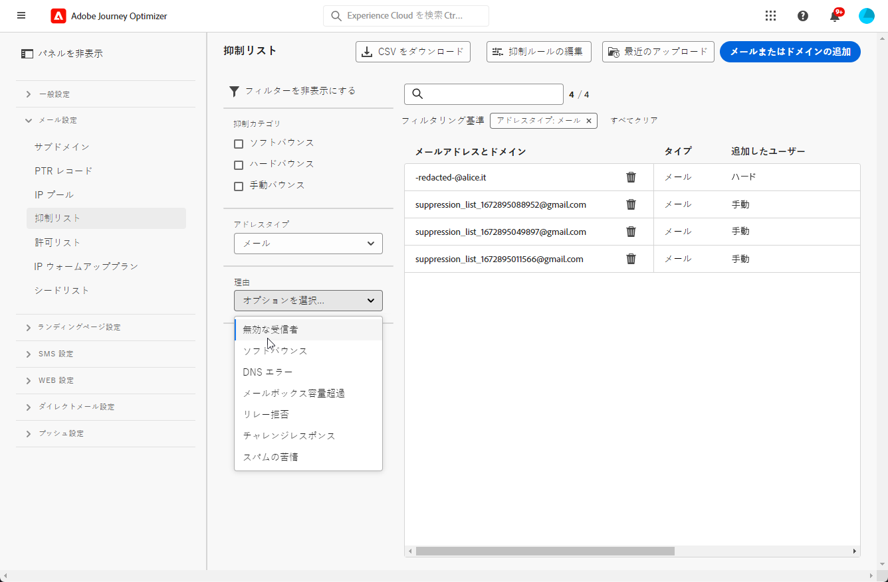

# 抑制リストの管理 {#manage-suppression-list}

[!DNL Journey Optimizer] では、ハードバウンス、ソフトバウンス、スパムの苦情など、ジャーニーやキャンペーンでの送信から自動的に除外されるメールアドレスをすべて監視できます。

このようなメールアドレスは、Journey Optimizer の&#x200B;**抑制リスト**&#x200B;に自動的に収集されます。抑制リストは、オーディエンスから除外するアドレスとドメインで構成されます。単一のクライアント環境（サンドボックス ID に関連付けられた組織 ID に固有の環境）におけるすべてのメール送信で抑制されるメールアドレスとドメインが収集されます。

抑制リストの概念と使用方法について詳しくは、[この節](../reports/suppression-list.md)を参照してください。

>[!NOTE]
>
>アドビは、エンゲージメントやメーリングレピュテーションに悪影響を与えることが判明している既知の不正なアドレスのリストを絶えず更新して、それらのアドレスにメールが配信されないようにしています。このリストは、すべてのアドビのお客様に共通のグローバル抑制リストで管理されます。グローバル抑止リストに含まれているアドレスやドメイン名は非公開です。除外された受信者の数のみが配信レポートに含まれます。

また、Journey Optimizer の **Suppression REST API** を活用すると、抑制リストと許可リストを使用して送信メッセージを制御できます。[Suppression REST API の使用方法を学ぶ](https://developer.adobe.com/journey-optimizer-apis/references/suppression/){target="_blank"}

## 抑制リストへのアクセス {#access-suppression-list}

除外されたメールアドレスとドメインの詳細なリストにアクセスするには、**[!UICONTROL 管理]**／**[!UICONTROL チャネル]**／**[!UICONTROL メール設定]**&#x200B;を参照し、「**[!UICONTROL 抑制リスト]**」を選択します。




>[!CAUTION]
>
>抑制リストの表示、エクスポートおよび管理を行う権限は、[ジャーニー管理者](../administration/ootb-product-profiles.md#journey-administrator)にのみ付与されます。[!DNL Journey Optimizer] ユーザーのアクセス権の管理について詳しくは、[この節](../administration/permissions-overview.md)を参照してください。


リストの参照に役立つフィルターを使用できます。


**[!UICONTROL 抑制カテゴリ]**、**[!UICONTROL アドレスタイプ]**、**[!UICONTROL 理由]**&#x200B;のいずれかでフィルタリングできます。条件ごとに 1 つ以上のオプションを選択します。選択したら、リストの上部に表示されている各フィルターまたはすべてのフィルターをクリアできます。




## 失敗理由の把握 {#suppression-categories-and-reasons}

メッセージをメールアドレスに配信できなかった場合、[!DNL Journey Optimizer] は配信が失敗した理由を特定し、**[!UICONTROL 抑制カテゴリ]**&#x200B;に関連付けます。

抑制カテゴリは次のとおりです。

* **ハード**：ハードバウンスは、無効なメールアドレス（存在しないメールアドレスなど）を示します。これには、アドレスが無効であることを明示している、受信メールサーバーからのバウンスメッセージが含まれます。このメールアドレスは、即座に抑制リストに送信されます。

  エラーがスパムの苦情の結果である場合は、それも&#x200B;**ハード**&#x200B;カテゴリに分類されます。苦情を出した受信者のメールアドレスは、直ちに抑制リストに送信されます。

* **ソフト**：ソフトバウンスは、有効なメールアドレスに対して発生した一時的なメールバウンスです。 このメールアドレスは、数回再試行された後で抑制リストに追加されます。 ソフトエラーの場合は、エラーカウンターが上限しきい値に達すると、アドレスが抑制リストに送信されます。[再試行の詳細情報](retries.md)

* **手動**：手動エラーは手動で抑制リストに追加されたものです。[詳細情報](#add-addresses-and-domains)

リストに登録されているメールアドレスごとに、**[!UICONTROL タイプ]**（メールまたはドメイン）、除外する&#x200B;**[!UICONTROL 理由]**、追加したユーザーおよび抑制リストに追加された日時を確認することもできます。

配信エラーの理由として考えられるものは次のとおりです。

| 理由 | 説明 | カテゴリ |
| --- | --- | --- |
| **[!UICONTROL 無効な受信者]** | 受信者が無効、または存在しません。 | ハード |
| **[!UICONTROL ソフトバウンス]** | メッセージソフトは、この表に示すソフトエラー以外の理由（ISP が推奨する許可率を超えた場合など）でバウンスしました。 | ソフト |
| **[!UICONTROL DNS エラー]** | DNS エラーが原因でメッセージがバウンスされました。 | ソフト |
| **[!UICONTROL メールボックス容量超過]** | 受信者のメールボックスがいっぱいになり、追加のメッセージを受け入れられなかったため、メッセージがバウンスされました。 | ソフト |
| **[!UICONTROL リレー拒否]** | リレーが許可されていないため、受信者によってメッセージがブロックされました。 | ソフト |
| **[!UICONTROL チャレンジレスポンス]** | このメッセージはチャレンジレスポンスプローブです。 | ソフト |
| **[!UICONTROL スパムの苦情]** | 受信者にスパムと見なされたので、メッセージはブロックされました。 | ハード |

>[!NOTE]
>
>購読を解除したユーザーは [!DNL Journey Optimizer] からのメールを受信しないので、そのメールアドレスを抑制リストに送信することはできません。選択は、Experience Platform レベルで処理されます。[オプトアウトの詳細情報](../privacy/opt-out.md)


### 抑制ルール  {#suppression-rules}

**[!UICONTROL 抑制リスト]**&#x200B;表示では、「**[!UICONTROL 抑制ルールの編集]**」ボタンを使用して、抑制ルールに関連付けられている再試行パラメーターを編集することもできます。現在のサンドボックスの再試行しきい値を更新する場合は、このオプションを使用します。 [再試行の詳細情報](retries.md)


## 抑制リストへのアドレスやドメインの追加{#add-addresses-and-domains}

>[!CONTEXTUALHELP]
>id="ajo_admin_suppression_list_header"
>title="抑制リストへのメールやドメインの追加"
>abstract="Journey Optimizer 抑制リストに手動で入力して、特定のメールアドレスやドメインを送信から除外することができます。"

>[!CONTEXTUALHELP]
>id="ajo_admin_suppression_list"
>title="抑制リストにメールもしくはドメインを追加"
>abstract="抑制リストへの入力は、CSV ファイルのアップロードを通じて、手動でメールアドレスまたはドメインを 1 つずつ追加するか、一括モードで追加します。これらの特定のメールアドレスやドメインは、送信から除外されます。"

メッセージをメールアドレスに配信できない場合、このアドレスは、定義済みの抑制ルールまたはバウンス数に基づいて、抑制リストに自動的に追加されます。

ただし、[!DNL Journey Optimizer] 抑制リストに手動で入力して、特定のメールアドレスやドメインを送信から除外することもできます。

>[!NOTE]
>
>[!DNL Journey Optimizer] が送信メールの抑制済みアドレスを考慮するには最大 60 分かかる場合があります。

メールアドレスやドメインの追加は、[1 つずつ](#add-one-address-or-domain)行うことも、CSV ファイルのアップロードを通じて[一括モードで](#upload-csv-file)行うこともできます。

### 1 つのアドレスまたはドメインの追加 {#add-one-address-or-domain}

>[!CONTEXTUALHELP]
>id="ajo_admin_suppression_list_address"
>title="抑制リストに項目を 1 つ追加"
>abstract="抑制リストに入力するには、電子メールアドレスやドメインを 1 つずつ追加します。"

抑制リストに 1 つのメールアドレスまたはドメインを追加するには、次の手順に従います。

1. 「**[!UICONTROL メールまたはドメインの追加]**」ボタンを選択します。

   

1. 「**[!UICONTROL 1 つずつ]**」オプションを選択します。

   

1. アドレスタイプとして、「**[!UICONTROL メール]**」または「**[!UICONTROL ドメイン]**」を選択します。

1. 送信から除外するメールアドレスまたはドメインを入力します。

   >[!NOTE]
   >
   >必ず有効なメールアドレス（abc@company.com など）または有効なドメイン（abc.company.com など）を入力してください。

1. （オプション）理由を入力します。ASCII コード 32 から 126 までの ASCII 印刷可能文字はすべて、このフィールドで使用できます。

1. 「**[!UICONTROL 送信]**」ボタンを使用して、確定します。

### CSV ファイルのアップロード {#upload-csv-file}

>[!CONTEXTUALHELP]
>id="ajo_admin_suppression_list_csv"
>title="CSV をアップロードして抑制リストに項目を追加"
>abstract="抑制リストに入力するには、除外する電子メールアドレス／ドメインが入力された CSV ファイルをアップロードします。"

抑制リストにメールアドレスまたはドメインのグループを追加するには、次の手順に従います。

1. 「**[!UICONTROL メールまたはドメインの追加]**」ボタンを選択します。
1. 「**[!UICONTROL CSV をアップロード]**」オプションを選択します。

   

1. 使用する CSV テンプレートをダウンロードします。これには、以下の列と形式が含まれています。

   ```
   TYPE,VALUE,COMMENT
   EMAIL,abc@somedomain.com,Comment
   DOMAIN,somedomain.com,Comment
   ```

1. 抑制リストに追加するメールアドレスやドメインを CSV テンプレートに入力します。ASCII コード 32 から 126 までの ASCII 印刷可能文字はすべて、「**コメント**」列で使用できます。

   >[!CAUTION]
   >
   >CSV テンプレート内の列の名前は変更しないでください。
   >
   >ファイルサイズは 1 MB 以下にしてください。
   >

1. 入力が完了したら、CSV ファイルをドラッグ＆ドロップし、「**[!UICONTROL 送信]**」ボタンをクリックして確定します。

   

アップロードが完了したら、「[最近のアップロード](#recent-uploads)」ボタンを使用してステータスを確認できます（下図を参照）。

### アップロードステータスの確認 {#recent-uploads}

「**[!UICONTROL 最近のアップロード]**」ボタンを使用すると、アップロードされた最新の CSV ファイルのステータスを確認できます。


考えられるステータスは次のとおりです。

* **[!UICONTROL 保留中]**：ファイルのアップロードを処理中です。
* **[!UICONTROL エラー]**：技術的な問題またはファイル形式のエラーが原因で、ファイルのアップロードプロセスに失敗しました。
* **[!UICONTROL 完了]**：ファイルのアップロードプロセスが正常に完了しました。

アップロード中に、正しい形式でないアドレスがある場合、それらのアドレスは [!DNL Journey Optimizer] 抑制リストに追加されません。

その場合、アップロードが完了すると、レポートに関連付けられます。ダウンロードして、発生したエラーを確認できます<!-- and understand why they were not added to the suppression list-->。


エラーレポートに表示されるエントリのタイプの例を以下に示します。

```
type,value,comments,failureReason
Email,examplemail.com,MANUAL,Invalid format for value: examplemail.com
Email,examplemail,MANUAL,Invalid format for value: examplemail
Email,example@mail,MANUAL,Invalid format for value: example@mail
Domain,example,MANUAL,Invalid format for value: example
Domain,example.!com,MANUAL,Invalid format for value: example.!com
Domain,!examplecom,MANUAL,Invalid format for value: !examplecom
```

## 抑制リストからのアドレスの削除 {#remove-from-suppression-list}

抑制リストは手動で更新できます。 強制隔離からのメールアドレスの削除は慎重に扱うべき操作で、IP のレピュテーションと配信品質の評価に影響を与える可能性があります。必ず慎重に行ってください。

抑制リストからメールアドレスまたはドメインを削除すると、このアドレスまたはドメインへの配信を Adobe Journey Optimizer で再開できます。配信品質について詳しくは、[この節](../reports/deliverability.md)を参照してください。

抑制リストからアドレスを削除するには、「**[!UICONTROL 削除]**」ボタンを使用します。


>[!NOTE]
>
>メールアドレスやドメインの削除を検討する際は、細心の注意を払う必要があります。不明な点がある場合は、配信品質のエキスパートにお問い合わせください。

例えば、インターネットサービスプロバイダー（ISP）のサービスが停止した場合、メールは受信者に正常に配信できないので、誤ってハードバウンスとマークされます。これらのメールアドレスは、抑制リストから削除する必要があります。

これらのアドレスを取得するには、サービス停止のコンテキストに応じて、カスタムパラメーターを含んだ特定のクエリを実行します。詳しくは、[このサンプル](../data/datasets-query-examples.md#isp-outage-query)を参照してください。

影響を受けるメールアドレスが特定されたら、抑制リストをフィルタリングしてそれらを表示します。 例えば、**test.com** ドメインで 2022年11月11日から 2022年11月13日まで ISP のサービス停止が発生した場合は、その期間に抑制リストに追加されたアドレスを次のように抜き出します。

その後、「**[!UICONTROL 削除]**」ボタンを使用して、強制隔離されたメールアドレスを抑制リストから削除できます。

## 抑制リストのダウンロード {#download-suppression-list}

<!--
>[!CONTEXTUALHELP]
>id="ajo_admin_suppression_list_download"
>title="Export the list as a CSV file"
>abstract="To download the suppression list, Qou can either export the current list by generating a new file, or download the file that was previously generated."
-->

抑制リストを CSV ファイルとして書き出すには、次の手順に従います。

1. 「**[!UICONTROL CSV をダウンロード]**」ボタンを選択します。 

   

1. ファイルが生成されるまで待ちます。

   >[!NOTE]
   >
   >ダウンロード時間は、ファイルサイズ（抑制リストにあるアドレスの数）によって異なります。
   >
   >特定のサンドボックスに対して、一度に 1 つのダウンロードリクエストを処理できます。

1. ファイルが生成されると、通知が届きます。 画面の右上にあるベルアイコンをクリックして、表示します。

1. 通知自体をクリックして、ファイルをダウンロードします。

   

   >[!NOTE]
   >
   >リンクは 24 時間有効です。

<!--When downloading the CSV file, you can choose to either:

* Download the file that was previously generated by another user or yourself.

* Generate a new file in order to export the current suppression list.-->