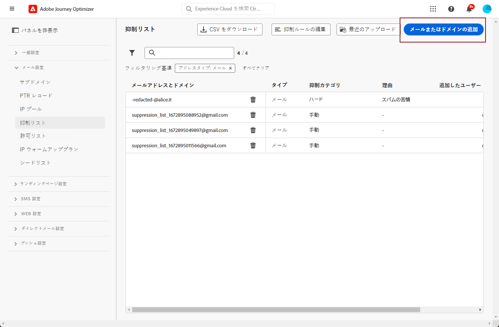
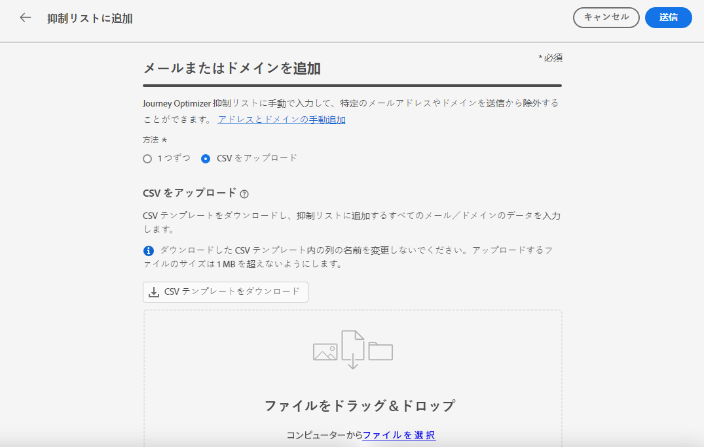

# 抑制リストの管理 {#manage-suppression-list}

で [!DNL Journey Optimizer] は、次のようなような旅またはキャンペーンで自動的に除外される電子メールアドレスをすべて監視することができます。

* 無効なアドレス (ハードバウンス)。
* 一貫した postscript の電子メールを送信しても、電子メールの評判に悪影響を与えることはありません。
* 電子メールメッセージの1つに対して何らかのスパムクレームを発行する受信者。

>[!NOTE]
>
>抑制リストはサンドボックスレベルで管理されます。

このような電子メールアドレスは、自動的に旅のオプティマイザー **抑制リスト** に集められます。 抑制リストの概念と使用方法については、このセクション ](../reports/suppression-list.md) で [ 詳しく説明しています。

アドレスまたはドメイン ](#add-addresses-and-domains) を抑制リストに手動で **追加することも[** できます。

>[!NOTE]
>
>出力電子メールで抑制されたアドレスを考慮するには、0 ~ 60 分 [!DNL Journey Optimizer] の時間がかかります。

## 抑制リストへのアクセス {#access-suppression-list}

除外される電子メールアドレスの詳細リストにアクセスするには、> **[!UICONTROL Channels]** > **[!UICONTROL Email configuration]** に **[!UICONTROL Administration]** 移動し、「」を選択 **[!UICONTROL Suppression list]** します。

>[!CAUTION]
>
>抑制リストの表示、エクスポートおよび管理のパーミッションは、旅の管理者 ](../administration/ootb-product-profiles.md#journey-administrator) に [ 制限されます。この節 ](../administration/permissions-overview.md) では、 [ ユーザーによるアクセス権の管理 [!DNL Journey Optimizer] について詳しく説明しています。


フィルターを使用して、リスト内を参照することができます。


では、、、または **[!UICONTROL Reason]** にフィルター **[!UICONTROL Suppression category]** **[!UICONTROL Address type]** を適用することができます。各条件について、選択したオプションを選択します。 選択すると、リストの上部に表示されているフィルターやすべてのフィルターをクリアすることができます。


電子メールアドレスやドメインを誤って追加した場合は、そのエントリを削除するためのボタンが **[!UICONTROL Delete]** 表示されます。

>[!CAUTION]
>
>このボタンを使用して、抑制された **[!UICONTROL Delete]** 電子メールアドレスやドメインを削除することはできません。


「抑制」リストから「電子メールアドレス」または「ドメイン」を削除すると、以降はこのアドレスまたはドメインを使用して配信が開始されます。 その結果、deliverability と IP の評判に深刻な影響を与える可能性があります。これによって、最終的には IP アドレスを取得したり、ドメインをブロックしたりすることができます。 この節 ](../reports/suppression-list.md) で [ は、抑制リストを維持する重要性について詳しく説明しています。

>[!NOTE]
>
>電子メールアドレスやドメインの削除を検討している場合は、注意して続行します。 ご不明な点がある場合は、deliverability のエキスパートまでお問い合わせください。

**[!UICONTROL Suppression list]**&#x200B;このビューでは、抑制規則を編集することもできます。[詳細情報](retries.md)

## 抑制リストのダウンロード {#download-suppression-list}

<!--
>[!CONTEXTUALHELP]
>id="ajo_admin_suppression_list_download"
>title="Export the list as a CSV file"
>abstract="To download the suppression list, you can either export the current list by generating a new file, or download the file that was previously generated."
-->

抑制リストを CSV ファイルとして書き出すには、次の手順に従います。

1. **[!UICONTROL Download CSV]**&#x200B;ボタンを選択します。

   

1. ファイルが生成されるまで待ちます。

   

   >[!NOTE]
   >
   >ダウンロードにかかる時間は、ファイルサイズ、つまり抑制リストに表示されているアドレスの数によって異なります。
   >
   >特定のサンドボックスについては、一度に1つのダウンロード要求を処理することができます。

1. ファイルが生成されると、通知が表示されます。 画面の右上にあるベルアイコンをクリックして表示します。

1. 通知自体をクリックして、ファイルをダウンロードします。

   

   >[!NOTE]
   >
   >このリンクは、24時間有効になります。

<!--When downloading the CSV file, you can choose to either:

* Download the file that was previously generated by another user or yourself.

* Generate a new file in order to export the current suppression list.-->

## 抑制カテゴリーと理由 {#suppression-categories-and-reasons}

電子メールアドレスへの配信に失敗した場合は、 [!DNL Journey Optimizer] 配信に失敗した理由を特定して、 **[!UICONTROL Suppression category]** に関連付けます。

抑制カテゴリーは以下のとおりです。

* **Hard** : 電子メールアドレスは、抑制リストに直ちに送信されます。

   >[!NOTE]
   >
   >エラーがスパムの苦情によって発生した場合は、それが「Hard **」カテゴリーに** もなります。クレームを発行した受信者の電子メールアドレスが、抑制リストに直ちに送信されます。

* **Soft** : エラーカウンターが制限しきい値に達したら、ソフトエラーによって抑制リストにアドレスが送信されます。 [リトライについて詳しくは、](retries.md)

* **手動** : 抑制リストに電子メールアドレスまたはドメインを手動で追加することもできます。 [詳細情報](#add-addresses-and-domains)

>[!NOTE]
>
>配信エラータイプ ](../reports/suppression-list.md#delivery-failures) セクションにあるソフトバウンスとハードバウンスについて詳しくは、 [ こちらを参照してください。

リストされている電子メールアドレスのそれぞれについて、「電子メール」または「ドメイン」を **[!UICONTROL Reason]** 確認 **[!UICONTROL Type]** することもできます。除外する場合は、「電子メール」または「ドメイン」を指定します。これは、抑制リストに追加された日時を指定することもできます。


配信が失敗する理由は、次のとおりです。

| ため | つい | 抑制カテゴリー |
| --- | --- | --- |
| **[!UICONTROL Invalid Recipient]** | 受信者が無効であるか、または存在しません。 | つらい |
| **[!UICONTROL Soft Bounce]** | ISP により推奨されたレートを使用して送信する場合など、この表に示したソフトエラー以外の理由により、メッセージが表示されます。 | ソフト |
| **[!UICONTROL DNS Failure]** | DNS エラーにより、メッセージがバウンスされています。 | ソフト |
| **[!UICONTROL Mailbox Full]** | メッセージがバウンスされています。これにより、受信者のメールボックスがいっぱいになり、メッセージを受信できなくなります。 | ソフト |
| **[!UICONTROL Relaying Denied]** | リレーは許可されていないので、メッセージは受信者によってブロックされました。 | ソフト |
| **[!UICONTROL Challenge-Response]** | このメッセージは、チャレンジ/レスポンス検証を行うプローブです。 | ソフト |
| **[!UICONTROL Spam Complaint]** | 受信者がスパムとしてマークしたため、メッセージはブロックされました。 | つらい |

>[!NOTE]
>
>購読者のユーザーは電子メール [!DNL Journey Optimizer] を受信していないので、その電子メールアドレスを抑制リストに送信することはできません。 これらの選択は、操作プラットフォームレベルで処理されます。 [オプトアウトについて詳しくは、](../privacy/opt-out.md)

## アドレスとドメインの手動追加 {#add-addresses-and-domains}

>[!CONTEXTUALHELP]
>id="ajo_admin_suppression_list_header"
>title="抑制リストへの電子メールまたはドメインの追加"
>abstract="送信から特定の電子メールアドレスやドメインを除外するために、旅のオプティマイザー抑制リストを手動で設定することができます。"

>[!CONTEXTUALHELP]
>id="ajo_admin_suppression_list"
>title="抑制リストへの電子メールまたはドメインの追加"
>abstract="抑制リストを設定するには、一度に1つまたは複数の電子メールアドレスを手動で追加するか、CSV ファイルのアップロードを使用して一括モードにします。 このような特定の電子メールアドレスとドメインは、送信から除外されます。"

電子メールアドレスへのメッセージ配信に失敗した場合は、定義された抑制規則またはバウンス数に基づいて、このアドレスが抑制リストに自動的に追加されます。

ただし、抑制リストを手動で設定 [!DNL Journey Optimizer] して、送信から特定の電子メールアドレスやドメインを除外することもできます。

電子メールアドレスまたはドメイン [ は [ 、一度に ](#add-one-address-or-domain) 1 つずつ追加することも、CSV ファイルアップロードを使用して一括モード ](#upload-csv-file) で追加することもできます。

これを行うには、ボタンを選択 **[!UICONTROL Add email or domain]** し、以下のいずれかの手順に従います。



### アドレスまたはドメインを1つ追加 {#add-one-address-or-domain}

>[!CONTEXTUALHELP]
>id="ajo_admin_suppression_list_address"
>title="抑制リストに1つのアイテムを追加します。"
>abstract="電子メールアドレスやドメインを1つずつ追加することによって、抑制リストを設定することができます。"

1. **[!UICONTROL One by one]**&#x200B;このオプションを選択します。

   

1. アドレスタイプ **[!UICONTROL Email address]** **[!UICONTROL Domain address]** を選択します。

1. 送信から除外する電子メールアドレスまたはドメインを入力します。

   >[!NOTE]
   >
   >有効な電子メールアドレス (abc@company.com など) またはドメイン (abc.company.com など) を入力していることを確認してください。

1. 必要に応じて、理由を指定します。

   >[!NOTE]
   >
   >32と126の間で構成されている ASCII 文字はすべて、 **[!UICONTROL Reason]** フィールドに使用できます。 完全なリストについては、次のページ ](https://en.wikipedia.org/wiki/Wikipedia:ASCII#ASCII_printable_characters) を参照 [ してください。 {target = &quot;_blank&quot;} などが挙げられます。

1. をクリック **[!UICONTROL Submit]** します。

### CSV ファイルのアップロード {#upload-csv-file}

>[!CONTEXTUALHELP]
>id="ajo_admin_suppression_list_csv"
>title="リストにアイテムを追加するには CSV をアップロードします。"
>abstract="このような抑制リストを作成するには、対象の電子メールアドレスまたはドメインに入力された CSV ファイルをアップロードします。"

1. **[!UICONTROL Upload CSV]**&#x200B;このオプションを選択します。

   

1. 使用する CSV テンプレートをダウンロードします。このテンプレートには、次のような列とフォーマットが含まれています。

   ```
   TYPE,VALUE,COMMENT
   EMAIL,abc@somedomain.com,Comment
   DOMAIN,somedomain.com,Comment
   ```

   >[!CAUTION]
   >
   >CSV テンプレートでは、列の名前を変更しないでください。
   >
   >ファイルサイズは、1 MB を超えないようにしてください。

1. CSV テンプレートに、抑制リストに追加する電子メールアドレスまたはドメインを入力します。

   >[!NOTE]
   >
   >32 ~ 126 の間にあるすべての ASCII 文字は、 **Comment** 列に入力できます。 完全なリストについては、次のページ ](https://en.wikipedia.org/wiki/Wikipedia:ASCII#ASCII_printable_characters) を参照 [ してください。 {target = &quot;_blank&quot;} などが挙げられます。

1. 操作が完了したら、CSV ファイルをドラッグ &amp; ドロップして、をクリック **[!UICONTROL Submit]** します。

   

>[!NOTE]
>
>アップロードが完了したら、インターフェイスから状態を確認してアップロードが成功したかどうかを確認してください。 [方法について説明します。](#recent-uploads)

### 最近使用したアップロードの状態を確認 {#recent-uploads}

アップロードした最新の CSV ファイルのリストを確認することができます。

これを行うには、ビューから **[!UICONTROL Suppression list]** ボタンをクリック **[!UICONTROL Recent uploads]** します。


送信された最新のアップロードと、それに対応するステータスが表示されます。

エラーレポートがファイルに関連付けられている場合は、それをダウンロードしてエラーを確認することができます。


エラーレポートに表示されるエントリの種類の例を次に示します。

```
type,value,comments,failureReason
Email,examplemail.com,MANUAL,Invalid format for value: examplemail.com
Email,examplemail,MANUAL,Invalid format for value: examplemail
Email,example@mail,MANUAL,Invalid format for value: example@mail
Domain,example,MANUAL,Invalid format for value: example
Domain,example.!com,MANUAL,Invalid format for value: example.!com
Domain,!examplecom,MANUAL,Invalid format for value: !examplecom
```
