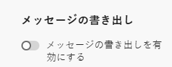

# メッセージコンテンツのエクスポート {#message-export}

>[!CONTEXTUALHELP]
>id="ajo_admin_msg_export"
>title="送信済みコンテンツの保持と書き出し"
>abstract="このオプションを選択すると、この設定を使用して送信済みメールまたは SMS メッセージのコンテンツを [!DNL Experience Platform] データセットに書き込むことができます。 レコードは 3 日間保持され、その間、独自のストレージに書き出すことができます。"

>[!AVAILABILITY]
>
>この機能は現在、一連の組織でのみ使用できます（使用制限あり）。 詳しくは、アドビ担当者にお問い合わせください。

**メッセージの書き出し** を使用すると、送信されたメールと SMS メッセージのコンテンツを [!DNL Journey Optimizer] から [!DNL Adobe Experience Platform] の宛先を介して独自のストレージに転送できます。これにより、[!DNL Experience Platform] から外部エンドポイントにデータを配信できます。 [詳細情報](https://experienceleague.adobe.com/ja/docs/experience-platform/destinations/home){target="_blank"}

この機能により、書き出し用にマークされた [!DNL Journey Optimizer] を介して送信されたメールおよび SMS メッセージのコンテンツは、[!DNL Experience Platform] **AJO Message Export Dataset** に書き込まれます。

その後、レコードは 3 日間、**AJO メッセージ書き出しデータセット** に保持され、その間、選択した外部システムに書き出すことができます。
<!--
## Terminology

* **[!DNL Experience Platform] destinations** - Framework to deliver data out of Experience Platform into external endpoints. [Learn more](https://experienceleague.adobe.com/en/docs/experience-platform/destinations/home){target="_blank"}
* **AJO Message Export Dataset** - An [!DNL Experience Platform] dataset which stores the message content of email and SMS messages sent via [!DNL Journey Optimizer] which have been marked for export.
* **Retention**: Records in the AJO Message Export Dataset are retained for 3 calendar days from ingestion.-->

## ガードレール

* この機能は、メールおよび SMS チャネルのみをサポートします。
* AJO メッセージ書き出しデータセットのレコードは、取り込みから 3 カレンダー日間保持されます。
* 以下に説明するように、メッセージの書き出しを有効にする前に送信されたメッセージに対しては、バックフィルはサポートされていません。

## メッセージのエクスポートを有効にする {#enable-message-export}

メッセージの書き出し機能のオンボーディングプロセスは、次の 2 つの手順で構成されます。

1. [ で ](#set-up-export-dataflow) 書き出しデータフローを設定 [!DNL Experience Platform] します。
1. [ のチャネル設定で ](#config-message-export) メッセージの書き出しを有効にする [!DNL Journey Optimizer]。

>[!WARNING]
>
>書き出しとメッセージ送信を有効にした後の新しいレコードのみが表示されます。 書き出しプロセスを設定し、「メッセージを書き出し」オプションを有効にする前のコンテンツのバックフィルはサポートされていません。

### 書き出しデータフローの設定 {#set-up-export-dataflow}

データを書き出す前に、書き出し先と使用するデータセットを定義して、書き [!DNL Experience Platform] しプロセスを設定する必要があります。 次の手順に従います。

>[!NOTE]
>
>この設定は、サンドボックスごとに設定する必要があります。

1. Experience Platform[ 宛先タイプ ](https://experienceleague.adobe.com/en/docs/experience-platform/destinations/destination-types){target="_blank"} を選択します。 データを受信する準備が整った、使用可能な宛先プラットフォームのリストは、[ このページ ](https://experienceleague.adobe.com/en/docs/experience-platform/destinations/catalog/overview){target="_blank"} で入手できます。

1. [!DNL Experience Platform] では、資格情報、バケット/コンテナ、パスのプレフィックス、セキュリティオプションを定義して、宛先を設定します。 [詳細情報](https://experienceleague.adobe.com/en/docs/experience-platform/destinations/ui/activate/export-datasets){target="_blank"}

1. 次のデータを使用して、データセット書き出しフローを作成します。

   * Source データセット：**AJO メッセージ書き出しデータセット** を選択します。
   * ファイル形式：「JSON」または「Parquet」を選択します（ダウンストリームツールに基づいて選択）。
   * スケジュール：3 日間の保持期間内に実行されるようにします。

### チャネル設定でのメッセージの書き出しの有効化 {#config-message-export}

メッセージエクスポートをキャンペーンとジャーニーに適用するには、チャネル設定レベルで専用オプションを有効にする必要があります。 次の手順に従います。

1. [!DNL Journey Optimizer] で、目的のメールまたは SMS を編集または作成します [ チャネル設定 ](channel-surfaces.md#create-channel-surface)。

1. 「**[!UICONTROL メッセージの書き出しを有効にする]**」オプションを選択します。

   

1. 変更を保存し、チャネル設定を送信します。

このチャネル設定を使用するキャンペーンやジャーニーを通じて送信されたメールおよび SMS メッセージは、**AJO メッセージエクスポートデータセット** に書き込まれます。 その後、定義した書き出しデータフローに基づいて、レコードが選択したストレージの宛先に書き出されます。

**[!UICONTROL メッセージの書き出しを有効にする]** 切替スイッチを無効にすると、このチャネル設定の新しいレコードがデータセットに取り込まれなくなります。 既存のレコードは、リテンションが期限切れになるまで残ります。
