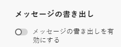
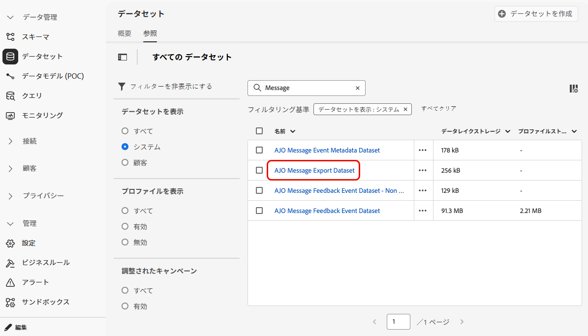
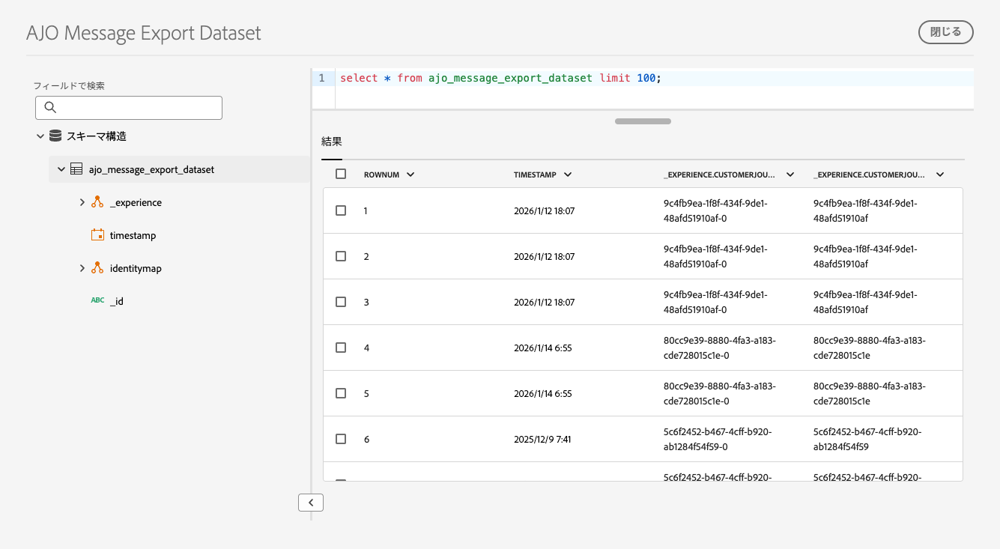

# メッセージコンテンツの書き出し {#message-export}

>[!CONTEXTUALHELP]
>id="ajo_admin_msg_export"
>title="送信済みコンテンツを保持および書き出し"
>abstract="このオプションを選択すると、この設定を使用して送信済みメールまたは SMS メッセージのコンテンツを [!DNL Experience Platform] データセットに書き込むことができます。 レコードは 7 日間保持され、その間、独自のストレージに書き出すことができます。"

>[!AVAILABILITY]
>
>この機能は、メッセージのエクスポートのアドオン機能を購入した組織がメールおよび SMS チャネルでのみ使用できます。 詳しくは、アドビ担当者にお問い合わせください。

**メッセージ書き出し**&#x200B;を使用すると、送信された電子メールやSMS メッセージのコンテンツを[!DNL Journey Optimizer]から[[!DNL Adobe Experience Platform] 宛先](https://experienceleague.adobe.com/ja/docs/experience-platform/destinations/home){target="_blank"}経由で自分のストレージに転送できます。これにより、[!DNL Experience Platform]から外部エンドポイントにデータを配信できます。

この機能を使用すると、書き出し用にマークされた[!DNL Journey Optimizer]経由で送信された電子メールとSMS メッセージの内容が[!DNL Experience Platform] [AJO メッセージ書き出しデータセット ](message-export-schema.md)に書き込まれます。

その後、レコードは取り込みから7日間データセットに保持され、その間、任意の外部システムに書き出すことができます。

➡️一般的な質問と回答については、[ メッセージ書き出しに関するFAQ](#message-export-faq)を参照してください。

## ガードレール

* この機能は、**電子メール**&#x200B;および&#x200B;**SMS** チャネルのみをサポートしています。
* AJO メッセージ書き出しデータセットのレコードは、取り込みから7日間&#x200B;**保持されます。**
* 以下に説明するように、メッセージの書き出しを有効にする前に送信されたメッセージでは、バックフィルはサポートされません。

## メッセージの書き出しを有効にする {#enable-message-export}

メッセージの書き出し機能のオンボーディングプロセスは、次の 2 つの手順で構成されます。

1. [!DNL Experience Platform] で[書き出しデータフローを設定](#set-up-export-dataflow)。
1. [!DNL Journey Optimizer] のチャネル設定で[メッセージの書き出しを有効化](#config-message-export)。

>[!WARNING]
>
>書き出しを有効にしてメッセージを送信した後の新しいレコードのみが表示されます。 書き出しプロセスを設定し、「メッセージの書き出し」オプションを有効にする前のコンテンツのバックフィルはサポートされていません。

### 書き出しデータフローを設定 {#set-up-export-dataflow}

データを書き出す前に、[!DNL Experience Platform]宛先とデータセット書き出しフローを定義して、書き出しプロセスを設定します。

詳細な手順、サポートされているクラウドの宛先、必要な権限などについては、[この節](../data/export-datasets.md#export-datasets)を参照してください。

>[!NOTE]
>
>この設定は、サンドボックスごとに設定する必要があります。

1. Experience Platform の[宛先タイプ](https://experienceleague.adobe.com/ja/docs/experience-platform/destinations/destination-types){target="_blank"}を選択します。 データを受信する準備が整った、使用可能な宛先プラットフォームのリストについて詳しくは、[このページ](https://experienceleague.adobe.com/ja/docs/experience-platform/destinations/catalog/overview){target="_blank"}を参照してください。

1. [!DNL Experience Platform] では、資格情報、バケット／コンテナ、パスプレフィックス、セキュリティオプションを定義して、宛先を設定します。 [方法についてはこちらを参照](https://experienceleague.adobe.com/ja/docs/experience-platform/destinations/ui/activate/export-datasets){target="_blank"}

1. 次のデータを使用して、データセット書き出しフローを作成します。

   * ソースデータセット:「**AJO メッセージの書き出しデータセット**」を選択します。
   * ファイル形式：「JSON」または「Parquet」を選択します（ダウンストリームツールに基づいていずれかを選択します）。
   * スケジュール：7日間のリテンションウィンドウ内で実行することを確認します。

### チャネル設定でメッセージの書き出しを有効にする {#config-message-export}

キャンペーンやジャーニーにメッセージの書き出しを適用するには、チャネル設定レベルで専用オプションを有効にする必要があります。 次の手順に従います。

1. [!DNL Journey Optimizer] で、目的のメールまたは SMS [チャネル設定](channel-surfaces.md#create-channel-surface)を編集または作成します。

1. 「**[!UICONTROL メッセージの書き出しを有効化]**」オプションを選択します。

   

1. 変更を保存し、チャネル設定を送信します。

このチャネル設定を使用してキャンペーンまたはジャーニーを介してメッセージを送信すると、電子メールおよびSMS メッセージが&#x200B;**AJO メッセージ書き出しデータセット**&#x200B;に書き込まれます。 次に、[ データセット内のレコード ](#access-exported-data)にアクセスし、定義した書き出しデータフローに基づいて、選択したストレージ宛先に書き出すことができます。

>[!NOTE]
>
>**[!UICONTROL メッセージの書き出しの有効化]**&#x200B;切替スイッチを無効にすると、このチャネル設定の新しいレコードがデータセットに取り込まれなくなります。 既存のレコードは保持が期限切れになるまで残ります。

## 書き出されたメッセージデータへのアクセス {#access-exported-data}

メッセージの書き出しが有効になっているチャネル設定を使用してメッセージを送信した後、**AJO メッセージ書き出しデータセット**&#x200B;で書き出したデータにアクセスして確認できます。

書き出されたメッセージデータを表示するには：

1. [!DNL Journey Optimizer]で、左側のナビゲーションで&#x200B;**[!UICONTROL データ管理]** > **[!UICONTROL データセット]**&#x200B;に移動します。 [詳しくは、データセットを参照してください](../data/get-started-datasets.md)

1. システム生成データセットを表示していることを確認します。

1. リストから「**AJO メッセージ書き出しデータセット**」を選択します。

   

1. データセットの詳細ページで、**[!UICONTROL データセットのプレビュー]**&#x200B;をクリックして、最新のレコードを表示します。

   

データセットには、メッセージの書き出しが有効になっているチャネル設定を介して送信される各メッセージの包括的な情報が含まれます。これには、件名、メッセージ本文、受信者のメールアドレスまたは電話番号、送信者のアドレスまたは電話番号、送信日時、パーソナライゼーションデータなどが含まれます。

➡️ データセット構造と使用可能なすべてのフィールドの全体像については、[AJO メッセージ書き出しスキーマ ](message-export-schema.md)を参照してください。

データセット内のすべてのレコードは、取り込みから&#x200B;**7暦日**&#x200B;間保持されます。 この保存期間中は、コンプライアンス監査、法的問い合わせ、または設定されたExperience Platformの宛先を介して独自のストレージシステムに書き出すデータにアクセスできます。

## エクスポートされたJSONの例 {#sample-exported-json}

次の例は、SMSおよび電子メール用のAJO メッセージ書き出しデータセットに書き込まれたレコードの全体的な形状を示しています。 識別子、スキーマ参照、タイムスタンプ、コンテンツなどの値は実例です。書き出しは、サンドボックス、スキーマ、送信メッセージを反映します。

各セクションを展開して、完全なサンプル JSONを表示します。

+++ SMS書き出しの例

```json
{
  "header": {
    "msgId": "f06d2a6d-65c3-472b-9ca7-cc4224af2df4",
    "xactionId": "9ccd6e76-9ee5-4a12-bff3-fea240228121",
    "msgType": "xdmEntityCreate",
    "imsOrgId": "906E3A095DC834230A495FD6@AdobeOrg",
    "sandboxId": "db3adc95-dcf6-49c3-badc-95dcf639c345",
    "sandboxName": "ajo-e2e",
    "createdAt": 1773591102107,
    "datasetId": "689653509dd3432b92f6323f",
    "schemaRef": {
      "id": "https://ns.adobe.com/aemonacpprodcampaign/schemas/64cb5d9d26c2aae6b08bdc9b7882deb90202439ec53836e7",
      "contentType": "application/vnd.adobe.xed-full+json;version=1"
    },
    "source": {
      "name": "message-execution-service"
    },
    "originalTimestamp": 1773591102107,
    "tags": [
      "ups:segmentation=false"
    ]
  },
  "body": {
    "xdmEntity": {
      "_experience": {
        "customerJourneyManagement": {
          "messageExecution": {
            "messageExecutionID": "CSM-09561055",
            "messageID": "15fe77c8-ab73-49e4-abbb-c25b859162ff-0",
            "messageType": "marketing",
            "campaignID": "5638ce57-5264-4a96-995f-5ae34eddafd7",
            "campaignVersionID": "f9019155-3d6a-44a1-9b6f-5f9cd49e7cf5",
            "campaignActionID": "dfa7f59f-477c-42ec-9db2-831d294b5779",
            "batchInstanceID": "5e23a286fb72411f1cdf1443a81ad2eb",
            "messagePublicationID": "15fe77c8-ab73-49e4-abbb-c25b859162ff",
            "audience": {
              "id": "4c339f63-b66e-4e72-8d56-db624b5277f2",
              "type": "targeted"
            }
          },
          "messageProfile": {
            "channel": {
              "_id": "https://ns.adobe.com/xdm/channels/sms",
              "_type": "https://ns.adobe.com/xdm/channel-types/sms"
            },
            "messageProfileID": "7ff5aefb-7583-38c4-8c32-b63cced94aa7",
            "variant": "5c1092da-5ba2-4bcc-b591-713ee7999f7d"
          },
          "messageRenderedContent": {
            "smsContent": {
              "message": "AJO Campaigns - Prod - E2E Test Text VA7"
            }
          },
          "messageDeliveryMetadata": {
            "smsMetadata": {
              "recipient": {
                "number": "+19256260201"
              },
              "sender": {
                "numbers": [
                  "12345678"
                ]
              }
            }
          }
        }
      },
      "identityMap": {
        "email": [
          {
            "id": "rlyajoqa+messageExport1@adobe.com",
            "primary": true
          }
        ]
      },
      "_id": "b0001846-cafa-379a-be96-1d8ee973e047",
      "timestamp": "2026-03-15T16:11:42.184Z"
    }
  }
}
```

+++

+++ メール書き出しの例

```json
{
  "header": {
    "msgId": "1e64d2c4-7887-4f80-8b28-5c20d3da8baf",
    "xactionId": "5yfSV2Gs7VJM5TKo1uEkbiDd4iuakgzQ",
    "msgType": "xdmEntityCreate",
    "imsOrgId": "745F37C35E4B776E0A49421B@AdobeOrg",
    "sandboxId": "068abf40-575e-11ea-8512-9b1bfdb82603",
    "sandboxName": "prod",
    "createdAt": 1754489661211,
    "datasetId": "68912b8881572a2b267380c1",
    "schemaRef": {
      "id": "https://ns.adobe.com/cjmstage/schemas/1684477c0160376b8bb6975a80b5e5bd384696329faa1c42",
      "contentType": "application/vnd.adobe.xed-full+json;version=1"
    },
    "source": {
      "name": "message-execution-service"
    },
    "originalTimestamp": 1754489659000,
    "tags": [
      "ups:segmentation=false"
    ]
  },
  "body": {
    "xdmEntity": {
      "_experience": {
        "customerJourneyManagement": {
          "messageExecution": {
            "messageExecutionID": "HUMA-62208933",
            "messageID": "d0d02f68-afea-42fc-b898-6819cee643e6-0",
            "messageType": "transactional",
            "campaignID": "ce2331c2-c259-47ff-a1dd-f6d1eae08801",
            "campaignVersionID": "4272bb9f-e154-44e9-89f1-6548c77d1455",
            "batchInstanceID": "03587190-72cf-11f0-938b-31e7c9f96d89",
            "messagePublicationID": "d0d02f68-afea-42fc-b898-6819cee643e6",
            "audience": {
              "type": "all"
            }
          },
          "messageProfile": {
            "channel": {
              "_id": "https://ns.adobe.com/xdm/channels/email",
              "_type": "https://ns.adobe.com/xdm/channel-types/email"
            },
            "messageProfileID": "5yfSV2Gs7VJM5TKo1uEkbiDd4iuakgzQ",
            "variant": "11cc5796-8017-4738-aa66-ca5db967dfcc"
          },
          "messageRenderedContent": {
            "emailContent": {
              "subject": "test",
              "html": "xxx"
            }
          },
          "messageDeliveryMetadata": {
            "emailMetadata": {
              "recipient": {
                "email": "himanshig@adobe.com"
              },
              "sender": {
                "email": "cjm-team@e2e-personalisation.test.cjmadobe.com",
                "name": "CJM team",
                "replyToEmail": "replyto@marketing.adobecjm.com",
                "replyToName": "replyto",
                "errorEmail": "replyto@e2e-personalisation.test.cjmadobe.com"
              }
            }
          }
        }
      },
      "identityMap": {
        "email": [
          {
            "id": "chijain@adobe.com",
            "primary": true
          }
        ]
      },
      "_id": "ea48ce1b-80c9-3c6a-b05f-d1c998989e02",
      "timestamp": "2025-08-06T14:14:22.814Z"
    }
  }
}
```

+++

## メッセージの書き出しに関するFAQ {#message-export-faq}

+++ メッセージ書き出しとは何ですか？

メッセージの書き出しにより、エンドユーザーに送信された完全にレンダリングされたメッセージ（電子メールおよびSMS）を書き出すことができます。 書き出されたデータは、標準の[!DNL Adobe Experience Platform] （AEP）書き出し機能を使用して外部の宛先に配信でき、アーカイブ、コンプライアンスレビュー、分析、ダウンストリーム統合などの目的で使用されます。

+++

+++ どのチャネルがサポートされていますか？

メッセージの書き出しは次の機能をサポートしています。

* メール
* SMS

+++

+++ メッセージの書き出しはどのようなデータを生成しますか？

メッセージ書き出しは、送信時にメッセージのスナップショットを含むシステム生成データセットを[!DNL Adobe Experience Platform]に作成します。 このデータセットは、サポートされている宛先（クラウドストレージやサードパーティシステムなど）に書き出すことができます。

メッセージの書き出しは、お客様がAdobe システムからメッセージ データを取り出すためのイネーブルメント メカニズムとして設計されています。お客様は、独自のアーカイブまたはコンプライアンスソリューションでデータを変換、保存、管理する責任があります。

+++

+++ メッセージの書き出しは、完全にパーソナライズされたメッセージをキャプチャしますか？

はい。 メッセージの書き出しは、各受信者に送信された完全にレンダリングされたメッセージをキャプチャします。これには、送信時にレンダリングされたパーソナライゼーションと動的コンテンツが含まれます。

+++

+++ メッセージの書き出しを使用して、元のメッセージを再現できますか？

はい。 書き出されたHTMLを使用すると、元の送信メッセージをブラウザーで再現できます。

ただし、複製は、外部でホストされているアセット（画像など）の可用性に依存します。 メッセージの書き出しは、メディアファイルを書き出しに直接埋め込みません。

+++

+++ 書き出しに画像とメディアが含まれていますか？

メッセージの書き出しには、画像やその他のメディアへの参照（URL）を含むHTML コンテンツが含まれます。 メディアアセットは、書き出しに埋め込まれません。

送信後に画像やアセットのURLが無効、制限、または非公開になった場合、メッセージの書き出しはそのアセットを復元できません。

+++

+++ メッセージの書き出しでは、リンクはどのように処理されますか？

書き出されたメッセージには、送信時のリンクの処理方法に従って、暗号化された追跡リンクが含まれています。 これらの暗号化されたリンクは書き出しに保存され、プラットフォームの設計に従って解決できます。

+++

+++ PIIとパーソナライゼーションデータの扱い方？

データは、レンダリングされたメッセージに表示されるとおりに正確に保存されます。

* メッセージにレンダリングされたPersonalizationの値（名など）は、テキストとして表示されます。
* 暗号化された要素（トラッキングされたリンクなど）は暗号化されたままです。
* メッセージの書き出しは、レンダリングされたメッセージコンテンツを自動的に匿名化または墨消ししません。

+++

+++ メッセージ書き出しデータの保持期間を教えてください。

メッセージ書き出しデータは、[!DNL Adobe Experience Platform]内の7日間の保持ウィンドウに従います。

顧客はこの期間内にデータをエクスポートし、より長い保持が必要な場合は独自のシステムに保存する必要があります。

+++

+++ お客様は購入前にメッセージの書き出しをテストできますか？

メッセージの書き出しには、体験版または「購入前に試用」オプションはありません。

メッセージの書き出しは標準のAEP データセットと宛先機能に依存しているため、サンプルの書き出しファイルを使用してダウンストリームシステムを検証できます。

+++

+++ 購入前にメッセージ書き出しスキーマを使用できますか？

いいえ。 メッセージ書き出しデータセットとスキーマは、メッセージ書き出しアドオンを購入して有効にした後にのみ、製品で使用できるようになります。

+++

+++ メッセージの書き出しは完全なアーカイブまたはコンプライアンスソリューションですか？

いいえ。 メッセージの書き出しは、完全なアーカイブ製品やコンプライアンス製品ではなく、イネーブラです。

顧客には、次のような期待があります。

* Adobeからのメッセージデータのエクスポート
* 必要に応じて変形または強化
* データを独自のアーカイブまたはコンプライアンスシステムに保存して管理します

+++

+++ 一般的なユースケースは何ですか？

お客様は通常、次の目的でメッセージ書き出しを使用します。

* 規制/コンプライアンスのレビュー
* メッセージのアーカイブ
* サードパーティシステムとの統合
* 内部監査またはサポートワークフロー
* Adobe以外のアプリケーションでも

+++

+++ メッセージの書き出しで実行できない操作

メッセージの書き出しは次の操作を実行しません。

* 外部画像またはメディアアセットの埋め込み
* Adobeシステムで無制限または長期的なデータ保持を提供します
* 体験版の提供
* Adobeの外部にメッセージを自動的にアーカイブ

+++
