# メッセージプリセットの作成 {#message-presets-creation}

[!DNL Journey Optimizer] では、メッセージプリセットを設定して、メールとプッシュ通知メッセージに必要な技術的パラメーター（メールのタイプ、送信者のメールと名前、モバイルアプリなど）を定義しておくことができます。

>[!CAUTION]
>
> * メッセージプリセットは、ジャーニー管理者のみが設定できます。 [詳細](../administration/ootb-product-profiles.md#journey-administrator)
>
> * メッセージプリセットを作成する前に、メール設定ステップと[プッシュ設定](../messages/push-configuration.md)ステップを実行する必要があります。

メッセージプリセットを設定したら、メッセージを作成する際に「**[!UICONTROL プリセット]**」リストからメッセージプリセットを選択できるようになります。

➡️ [メールプリセットの作成および使用方法については、このビデオを参照](#video-presets)

## メッセージプリセットの作成 {#create-message-preset}

メッセージプリセットを作成するには、次の手順に従います。

1. **[!UICONTROL チャネル]**／**[!UICONTROL ブランディング]**／**[!UICONTROL メッセージプリセット]**&#x200B;メニューにアクセスし、「**[!UICONTROL メッセージプリセットを作成]**」をクリックします。

   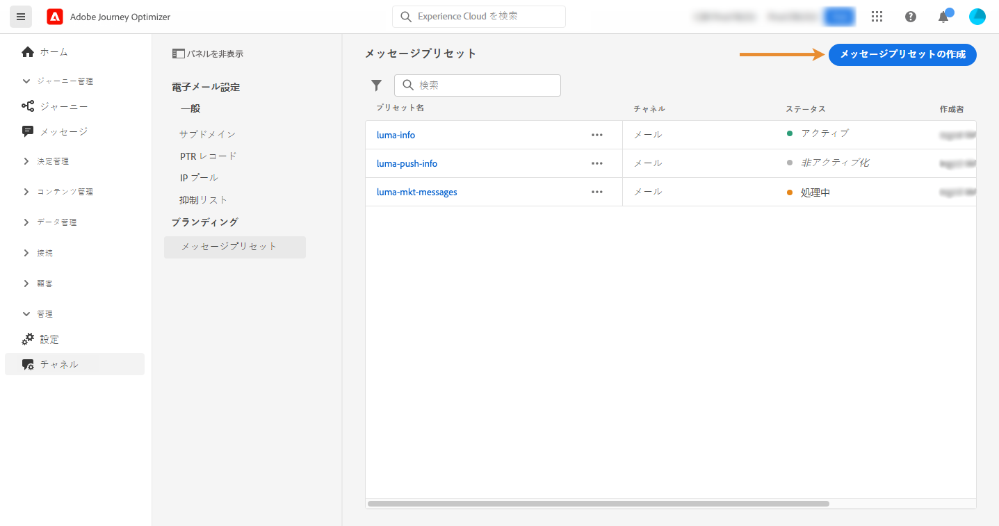

1. プリセットの名前と説明（オプション）を入力し、設定するチャネルを選択します。

   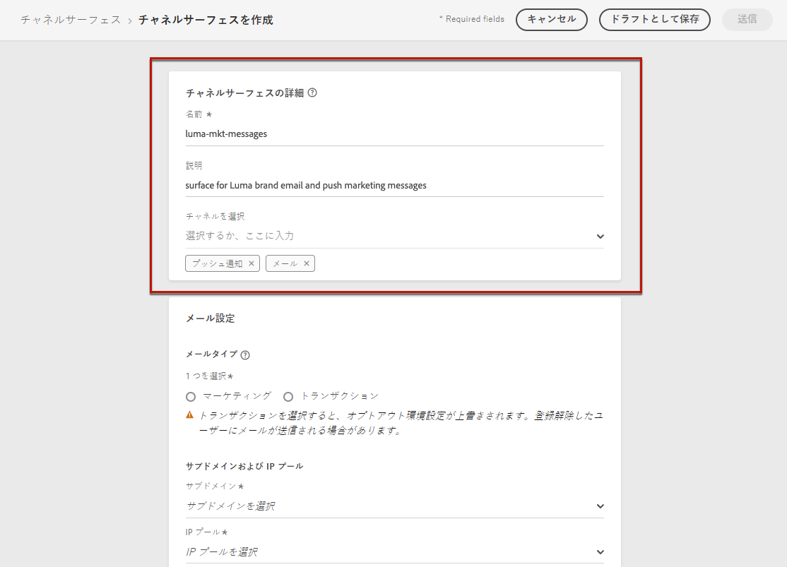

   >[!NOTE]
   >
   > 名前は、文字（A ～ Z）で始める必要があります。使用できるのは英数字のみです。 アンダースコア（`_`）、ドット（`.`）、ハイフン（`-`）も使用できます。

1. **メール**&#x200B;の設定を行います。[詳細情報](#configure-email-settings)

1. **プッシュ通知**&#x200B;の設定を行います。[詳細情報](#configure-push-settings)

   <!--Configure SMS settings. [Learn more](#configure-sms-settings) -->

1. すべてのパラメーターを設定したら、「**[!UICONTROL 送信]**」をクリックして確定します。 なお、メッセージプリセットをドラフトとして保存し、後で設定を再開することもできます。

   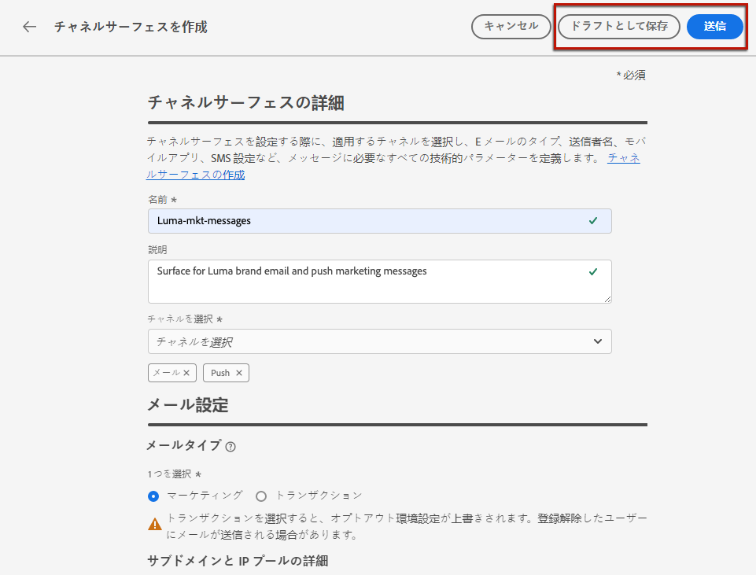

1. メッセージプリセットが作成されると、リストに「**[!UICONTROL 処理中]**」のステータスで表示されます。

   この段階では、メッセージプリセットが適切に設定されていることを確かめるために、いくつかのチェックが実行されています。 処理時間はおよそ **48～72 時間**&#x200B;で、最長で **7～10 営業日**&#x200B;かかることがあります。

   このチェックには、アドビ システムズがおこなう設定および技術テストが含まれています。

   * SPF 検証
   * DKIM 検証
   * MX レコードの検証
   * 拒否リストへの IP 登録の検証
   * Helo ホストの検証
   * IP プールの検証
   * A/PTR レコード、t/m/res サブドメインの検証

   >[!NOTE]
   >
   >チェックが成功しなかった場合、考えられる失敗理由について詳しくは[この節](#monitor-message-presets)を参照してください。

1. チェックが正常に完了すると、メッセージプリセットのステータスが「**[!UICONTROL アクティブ]**」になります。メッセージの配信に使用する準備が整いました。

   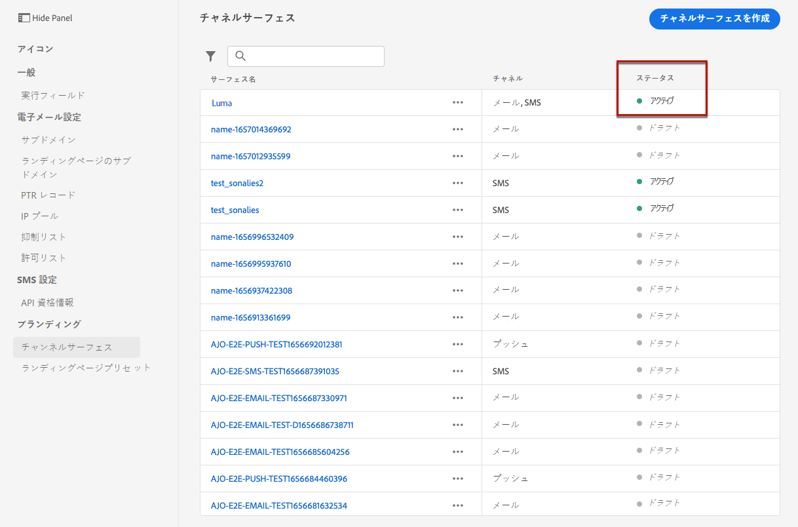

## メール設定 {#configure-email-settings}

電子メールの設定は、メッセージプリセット設定の専用のセクションで定義します。

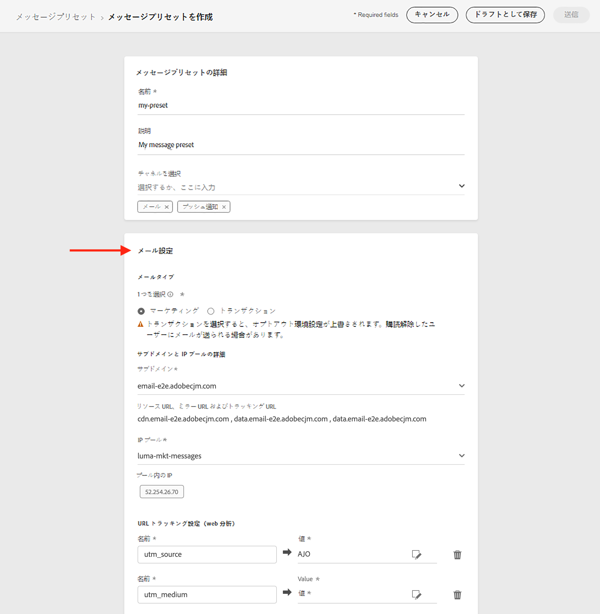

以下の説明に従って、設定を指定します。

### 電子メールのタイプ{#email-type}

内 **電子メールのタイプ** 「 」セクションで、プリセットと共に送信されるメッセージのタイプを選択します。 **マーケティング** または **トランザクション**.

選択 **マーケティング** プロモーションメッセージの場合：これらのメッセージにはユーザーの同意が必要です。

選択 **トランザクション** （注文の確認、パスワードリセット通知、配信情報など、非商用メッセージの場合）

>[!CAUTION]
>
>**トランザクション**&#x200B;メッセージは、アドビからのお知らせで購読を解除したプロファイルに送信できます。これらのメッセージは、特定のコンテキストでのみ送信できます。

### サブドメインおよび IP プール {#subdomains-and-ip-pools}

内 **サブドメインおよび IP プールの詳細** セクションで、以下を実行する必要があります。

1. メールの送信に使用するサブドメインを選択します。 [詳細](about-subdomain-delegation.md)

1. プリセットに関連付ける IP プールを選択します。 [詳細](ip-pools.md)

### URL トラッキング{#url-tracking}

ユーザーがリンクをクリックした場所と理由を特定するために、  **[!UICONTROL URL トラッキング設定（WEB 分析）]** 」セクションに入力します。

定義したパラメーターに基づいて、UTM コードがメッセージコンテンツに含まれる URL の末尾に適用されます。 その後、Adobe Analyticsなどの Web 分析ツールで結果を比較できます。 <!--For example: https://yourwebsite.com/?utm_source=Adobe_CJM&utm_medium=email&utm_campaign=cart_abandonment_journey... In this example, the UTM code identifies the link as an email from an abandonment cart journey. You can either select a journey/message attribute from a predefined list, or enter your own text.-->

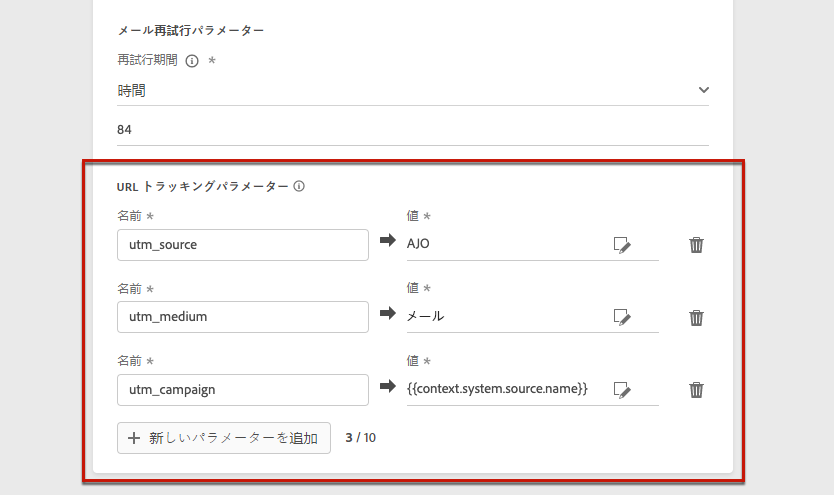

デフォルトでは、3 つの UTM パラメーターが使用可能です。 最大 10 個のトラッキングパラメーターを追加できます。 UTM パラメーターを追加するには、 **[!UICONTROL 新しい UTM パラメーターの追加]** 」ボタンをクリックします。

UTM パラメーターを設定するには、目的の値を **[!UICONTROL 名前]** および **[!UICONTROL 値]** フィールドを選択するか、次のオブジェクトに移動して、事前定義済みの値のリストから選択します。

* ジャーニー属性：ソース ID、ソース名、ソースバージョン ID
* メッセージ属性：アクション ID、アクション名
* Offer decisioning属性：オファー ID、オファー名

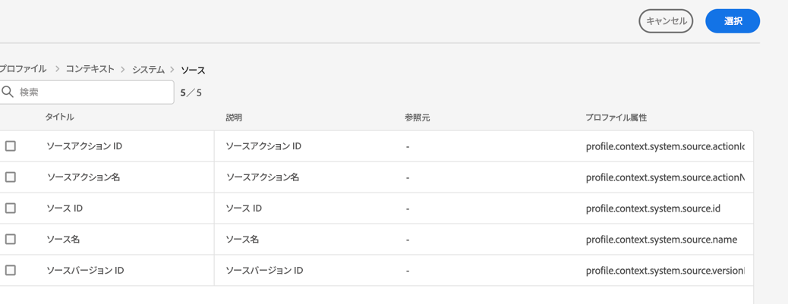

>[!CAUTION]
>
>フォルダーは選択しないでください：必要なフォルダーを参照し、UTM 値として使用するプロファイル属性を選択します。

### ヘッダーパラメーター{#email-header}

内 **[!UICONTROL ヘッダーパラメーター]** 「 」セクションで、そのプリセットを使用して送信されたメッセージに関連付けられた電子メールアドレスを入力します。 これらのメールアドレスは、現在選択されている [委任サブドメイン](about-subdomain-delegation.md).

次の電子メールアドレスを設定する必要があります

* **[!UICONTROL 送信者名]**：送信者の名前（会社のブランド名など）。

* **[!UICONTROL 送信者のメール]**：コミュニケーションに使用するメールアドレス。例えば、デリゲートされたサブドメインが *marketing.luma.com* の場合は、*contact@marketing.luma.com* を使用できます。

* **[!UICONTROL 返信先（名前）]**：受信者がメールクライアントソフトウェアの「**返信**」ボタンをクリックしたときに使用する名前。

* **[!UICONTROL 返信先（メール）]**：受信者がメールクライアントソフトウェアの「**返信**」ボタンをクリックしたときに使用するメールアドレス。デリゲートされたサブドメインに定義されたアドレス（例：*reply@marketing.luma.com*）を使用する必要があります。このアドレスを使用していないメールは破棄されます。

* **[!UICONTROL エラーメール]**：メールを配信してから数日後に ISP で発生したすべてのエラー（非同期バウンス）は、このアドレスで受信されます。

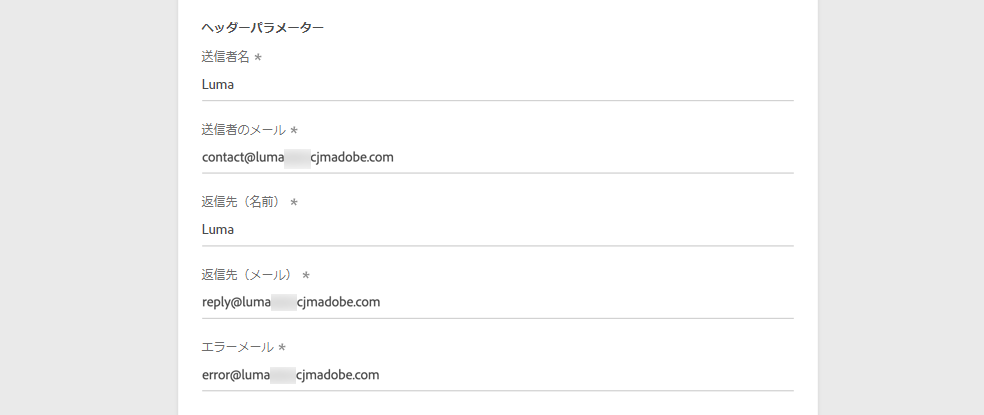

>[!NOTE]
>
>アドレスは、文字 (A ～ Z) で始まる必要があり、英数字のみを含めることができます。 アンダースコア（`_`）、ドット（`.`）、ハイフン（`-`）も使用できます。

### E メールの再試行パラメーター{#email-retry}

次の項目を設定できます。 **E メールの再試行パラメーター**.

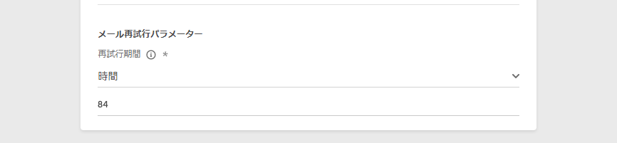

デフォルトでは、[再試行期間](retries.md#retry-duration)は 84 時間に設定されていますが、必要に応じてこの設定を調整できます。

次の範囲内の整数値（時間または分）を入力する必要があります。

* マーケティング E メールの場合、再試行の最小期間は 6 時間です。
* トランザクション E メールの場合、再試行の最小期間は 10 分です。
* どちらのメールタイプでも、再試行期間の上限は 84 時間（5040 分）です。

## プッシュ設定 {#configure-push-settings}

プッシュ設定は、メッセージプリセット設定の専用のセクションで定義します。

メッセージプリセットに関連付けられたプッシュ設定を定義するには、次の手順に従います。

1. 少なくとも 1 つのプラットフォーム（**iOS**、**Android** もしくは両方）を選択します。

1. 各プラットフォームで使用するモバイルアプリケーションを選択します。

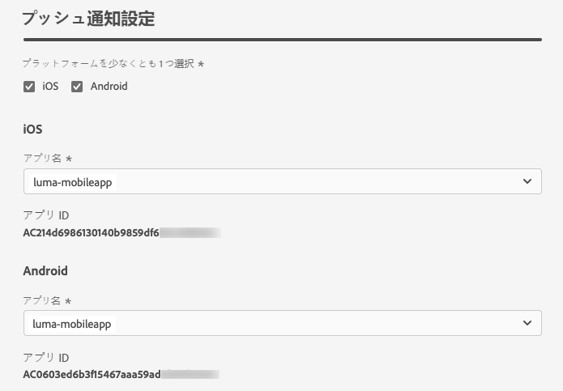

プッシュ通知を送信する環境の設定方法については、[この節](../messages/push-gs.md)を参照してください。

<!--
## Configure SMS settings {#configure-sms-settings}

1. Select the **[!UICONTROL SMS Type]** that will be sent with the preset: **[!UICONTROL Transactional]** or **[!UICONTROL Marketing]**.

    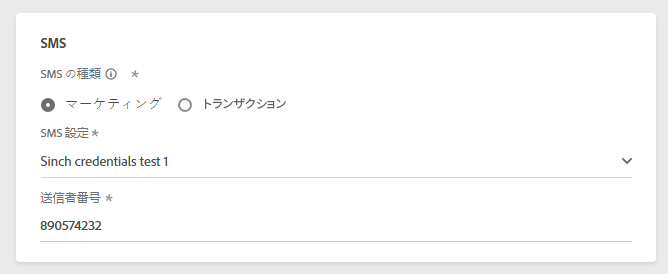
    
1. Select the **[!UICONTROL SMS configuration]** to associate with the preset.
        
    For more on how to configure your environment to send SMS messages, refer to [this section](sms-configuration.md).

1. Enter the **[!UICONTROL Sender number]** ​you want to use for your communications.
-->

## メッセージプリセットの監視 {#monitor-message-presets}

すべてのメッセージプリセットは、**[!UICONTROL チャネル]**／**[!UICONTROL メッセージプリセット]**&#x200B;メニューに表示されます。フィルターを使用すると、チャネルタイプ、ユーザー、ステータスに応じてリストを参照できます。

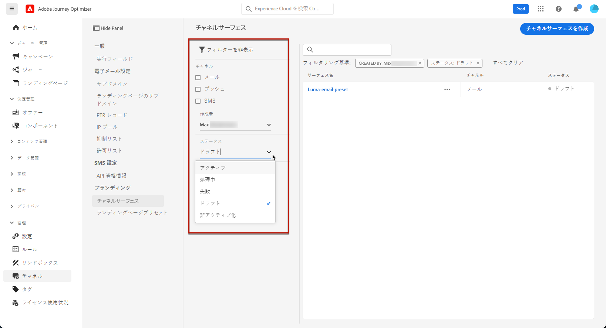

メッセージプリセットを作成すると、次のステータスを持つことができます。

* **[!UICONTROL ドラフト]**：メッセージプリセットは下書きとして保存されており、まだ送信されていません。設定を再開するには、これを開きます。
* **[!UICONTROL 処理中]**：メッセージプリセットが送信され、いくつかの検証手順を実行中です。
* **[!UICONTROL アクティブ]**：メッセージプリセットは検証済みであり、選択してメッセージを作成できます。
* **[!UICONTROL 失敗]**：メッセージプリセットの検証中に、1 つ以上のチェックが失敗しました。
* **[!UICONTROL 非アクティブ]**：メッセージプリセットが非アクティブになっています。新しいメッセージの作成には使用できません。

メッセージプリセットの作成に失敗した場合、考えられる各エラー理由の詳細は次のとおりです。

これらのエラーのいずれかが発生した場合は、 [Adobeカスタマーケア](https://helpx.adobe.com/jp/enterprise/admin-guide.html/enterprise/using/support-for-experience-cloud.ug.html){target=&quot;_blank&quot;} でサポートを受けてください。

* **SPF 検証に失敗しました**：SPF（Sender Policy Framework）はメール認証プロトコルで、特定のサブドメインからメールを送信できる承認済み IP を指定できます。SPF 検証エラーは、SPF レコードの IP アドレスが、メールボックスプロバイダーへのメール送信に使用される IP アドレスと一致しないことを意味します。

* **DKIM 検証に失敗しました** : DKIM（DomainKeys Identified Mail）を使用すると、受信したメッセージが関連ドメインの正規の送信者によって送信されたこと、および元のメッセージの内容が途中で改変されていないことを受信サーバーが検証できます。DKIM 検証の失敗は、メッセージコンテンツの信頼性とメッセージコンテンツの送信ドメインとの関連付けを受信メールサーバーが検証できないことを意味します。

* **MX レコードの検証に失敗しました** : MX（Mail eXchange）レコードの検証の失敗は、特定のサブドメインに代わって受信メールを受け取るべきメールサーバーが正しく設定されていないことを意味します。

* **配信品質の設定に失敗しました**：配信品質の設定の失敗は、次のいずれかの理由で起こる可能性があります。
   * 割り当てられた IP がブロックリストに登録されている
   * `helo` 名が無効
   * 対応するプリセットの IP プールで指定された IP 以外の IP からメールが送信される
   * Gmail や Yahoo などの主要な ISP の受信ボックスにメールを配信できない

## メッセージプリセットの編集 {#edit-message-preset}

メッセージプリセットを編集するには、次の手順に従います。

>[!NOTE]
>
>**[!UICONTROL プッシュ通知設定]**&#x200B;は編集できません。メッセージプリセットがプッシュ通知チャネル用にのみ設定されている場合は、編集できません。

1. リストでメッセージプリセット名をクリックして開きます。

   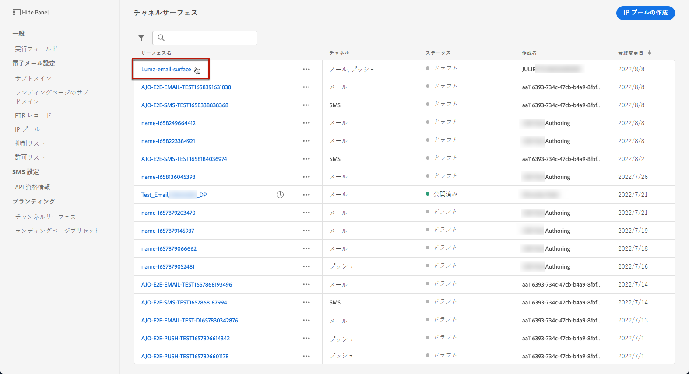

1. そのプロパティを必要に応じて編集します。

   >[!NOTE]
   >
   >メッセージプリセットのステータスが&#x200B;**[!UICONTROL アクティブ]**&#x200B;の場合、「**[!UICONTROL 名前]**」、「**[!UICONTROL チャネルを選択]**」および「**[!UICONTROL サブドメイン]**」フィールドは灰色表示になっており、編集できません。

1. 「 **[!UICONTROL 送信]**」をクリックして、変更を確定します。

   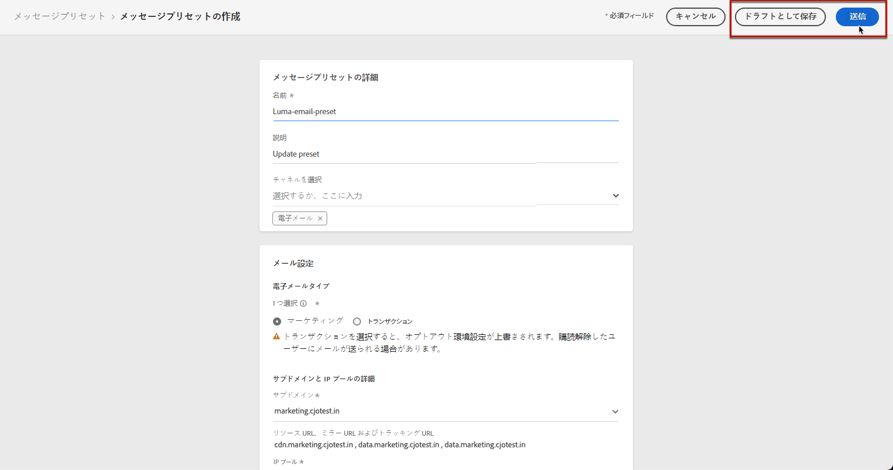

   >[!NOTE]
   >
   >なお、メッセージプリセットをドラフトとして保存し、後で更新を再開することもできます。

変更が送信されると、メッセージプリセットは、[プリセットの作成](#create-message-preset)時と同じような検証サイクルを経ます。

>[!NOTE]
>
>編集するフィールドが「**[!UICONTROL 説明]**」、「**[!UICONTROL メールタイプ]**」または「**[!UICONTROL メールの再試行パラメーター]**」のみの場合、更新は即時に行われます。

ステータスが&#x200B;**[!UICONTROL アクティブ]**&#x200B;のメッセージプリセットの場合は、更新内容の詳細を確認できます。それには、以下の手順を実行します。

* アクティブなプリセットの名前の横に表示されている「**[!UICONTROL 最新の更新]**」アイコンをクリックします。

   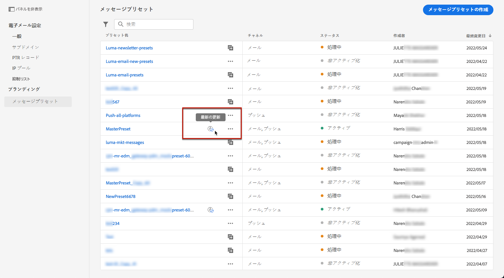

* 更新の処理中に、アクティブなメッセージプリセットの更新の詳細にアクセスすることもできます。

   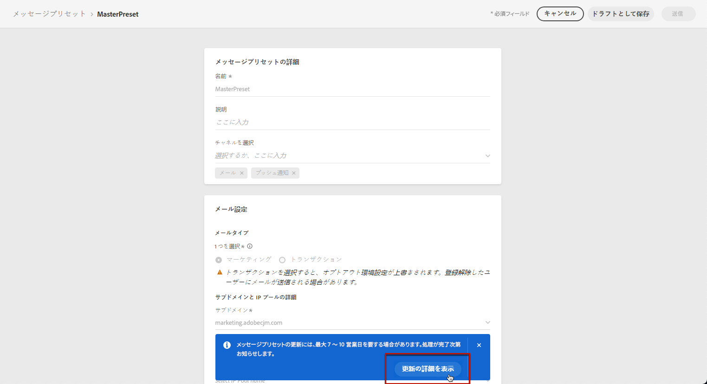

**[!UICONTROL 最新の更新]**&#x200B;画面には、更新ステータスやリクエストされた変更のリストなどの情報が表示されます。

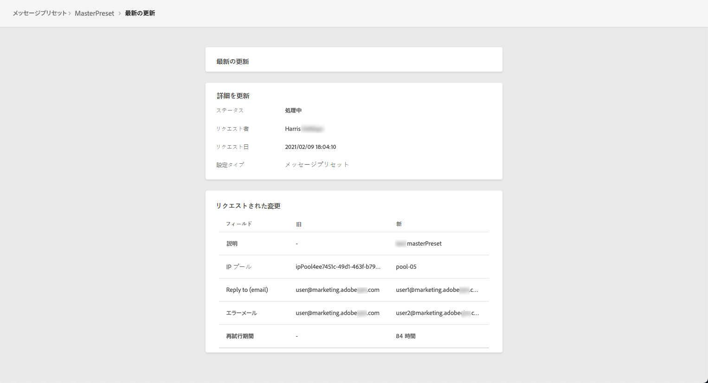

### 更新ステータス {#update-statuses}

メッセージプリセットの更新には、次のステータスがあります。

* **[!UICONTROL 処理中]**：メッセージプリセットの更新が送信され、いくつかの検証ステップを実行中です。
* **[!UICONTROL 成功]**：更新されたメッセージプリセットが検証済みであり、それを選択してメッセージを作成できます。
* **[!UICONTROL 失敗]**：メッセージプリセットの更新の検証中に、1 つ以上のチェックが失敗しました。

各ステータスについて以下で詳しく説明します。

### 処理中

いくつかの配信品質チェックが実行されて、プリセットが正しく更新されたかどうかが検証されます。

>[!NOTE]
>
>編集するフィールドが「**[!UICONTROL 説明]**」、「**[!UICONTROL メールタイプ]**」または「**[!UICONTROL メールの再試行パラメーター]**」のみの場合、更新は即時に行われます。

処理時間はおよそ **48～72 時間**&#x200B;で、最長で **7～10 営業日**&#x200B;かかることがあります。検証サイクルで実行されるチェックについて詳しくは、[この節](#create-message-preset)を参照してください。

既にアクティブになっているプリセットを編集する場合：

* 検証プロセスが進行中の間は、ステータスは&#x200B;**[!UICONTROL アクティブ]**&#x200B;のまま変わりません。

* メッセージプリセットリスト内のプリセット名の横に「**[!UICONTROL 最新の更新]**」アイコンが表示されます。

* 検証プロセス中は、このプリセットを使用してメッセージを設定しても、古いバージョンのプリセットが引き続き使用されます。

>[!NOTE]
>
>更新中は、メッセージプリセットを変更できません。 名前はクリックできますが、フィールドはすべて灰色表示になっています。 変更は、更新が正常に完了するまで反映されません。

### 成功 {#success}

検証プロセスが正常に完了すると、このプリセットを使用するすべてのメッセージで、新しいバージョンのプリセットが自動的に使用されます。 ただし、次の待機時間が必要になることがあります。
* 単一メッセージで使用されるまでに数分間
* バッチメッセージで有効になるには、そのプリセットの次のバッチまで

### 失敗 {#failed}

検証プロセスが失敗した場合は、古いバージョンのプリセットが引き続き使用されます。

考えられる失敗理由について詳しくは、[この節](#monitor-message-presets)を参照してください。

更新が失敗すると、プリセットが再び編集可能になります。 プリセットの名前をクリックし、修正する必要のある設定を更新できます。

## メッセージプリセットの非アクティブ化 {#deactivate-preset}

**[!UICONTROL アクティブ]**&#x200B;なメッセージプリセットを新しいメッセージの作成に使用できないようにするには、そのプリセットを非アクティブにします。 ただし、このプリセットを使用して公開されたメッセージは影響を受けず、引き続き機能します。

>[!NOTE]
>
>更新の処理中にメッセージプリセットを非アクティブにすることはできません。 更新が正常に完了するか失敗するまで待つ必要があります。 詳しくは、[メッセージプリセットの編集](#edit-message-preset)およびその中の[更新ステータス](#update-statuses)を参照してください。

1. メッセージプリセットリストにアクセスします。

1. 対象となるアクティブなプリセットで、「**[!UICONTROL その他のアクション]**」ボタンをクリックします。

1. 「**[!UICONTROL 非アクティブ化]**」を選択します。

   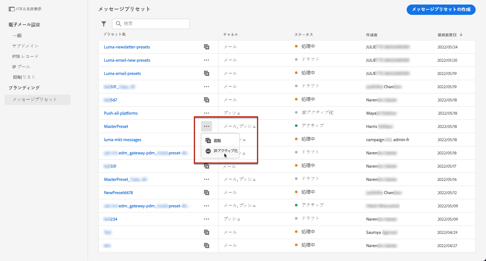

>[!NOTE]
>
>非アクティブ化されたメッセージプリセットは削除できません。メッセージの送信にそのプリセットを使用しているジャーニーで問題が発生しないようにするためです。

非アクティブ化されたメッセージプリセットは直接編集できません。 ただし、プリセットのコピーを作成し編集して新しいバージョンを作成し、それを使用して新しいメッセージを作成することはできます。 また、プリセットを再度アクティブにし、更新が正常に完了するまで待って編集することもできます。

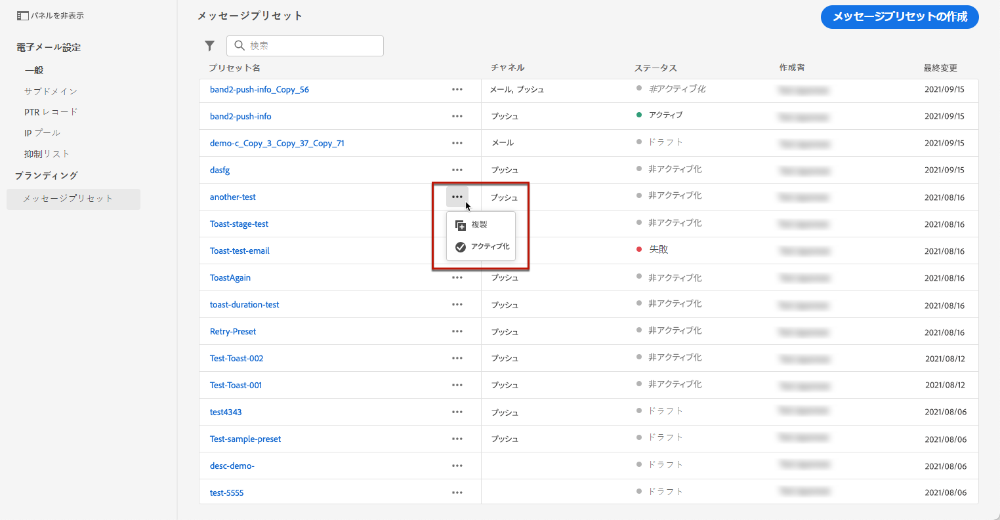

## ハウツービデオ{#video-presets}

メッセージプリセットの作成方法と使用方法、サブドメインのデリゲート方法および IP プールの作成方法について説明します。

>[!VIDEO](https://video.tv.adobe.com/v/334343?quality=12)
