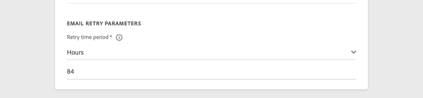
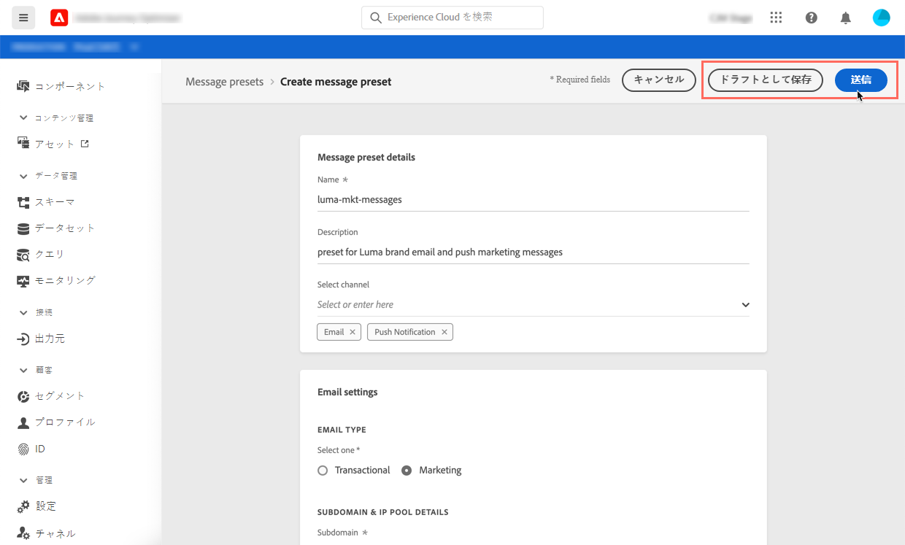

# メッセージプリセットの作成

[!DNL Journey Optimizer] では、メッセージプリセットを設定して、メールとプッシュ通知メッセージに必要な技術的パラメーター（メールのタイプ、送信者のメールと名前、モバイルアプリなど）を定義しておくことができます。

>[!CAUTION]
>
> * メッセージプリセットは、ジャーニー管理者のみが設定できます。 [詳細](../administration/ootb-product-profiles.md#journey-administrator)
>
> * メッセージプリセットを作成する前に、メールとプッシュの設定手順を実施します。

メッセージプリセットを設定すると、メッセージを作成する際に「**[!UICONTROL プリセット]**」リストからメッセージプリセットを選択できるようになります。

➡️ [メールプリセットの作成および使用方法については、このビデオを参照](#video-presets)

## メッセージプリセットの作成 {#create-message-preset}

メッセージプリセットを作成するには、次の手順に従います。

1. **[!UICONTROL チャネル]**／**[!UICONTROL メッセージプリセット]**&#x200B;メニューにアクセスし、「**[!UICONTROL メッセージプリセットの作成]**」をクリックします。

   

1. プリセットの名前と説明（オプション）を入力し、設定するチャネルを選択します。

   

   >[!NOTE]
   >
   > 名前は、文字（A ～ Z）で始める必要があります。使用できるのは英数字のみです。 アンダースコア（`_`）、ドット（`.`）、ハイフン（`-`）も使用できます。

1. **email**&#x200B;を設定します。

   

   * プリセットを使用して送信するメッセージのタイプ（**トランザクション**&#x200B;または&#x200B;**マーケティング**）を選択します。

      >[!CAUTION]
      >
      > **トランザクション**&#x200B;メッセージは、アドビからのお知らせで購読を解除したプロファイルに送信できます。トランザクションメッセージは、パスワードのリセット、注文のステータス、配信の通知など、特定のコンテキストでのみ送信できます。

   * メールの送信に使用するサブドメインを選択します。 [詳細](about-subdomain-delegation.md)
   * プリセットに関連付ける IP プールを選択します。 [詳細](ip-pools.md)
   * そのプリセットを使用して送信されるEメールのヘッダーパラメーターを入力します。

      >[!CAUTION]
      >
      >**返信先（転送先メール）**&#x200B;フィールドを除き、メールアドレスのドメインは、現在選択している[デリゲートされたサブドメイン](about-subdomain-delegation.md)を使用する必要があります。

      * **[!UICONTROL 送信者名]**：送信者の名前（会社のブランド名など）。

      * **[!UICONTROL 送信者のメール]**：コミュニケーションに使用するメールアドレス。例えば、デリゲートされたサブドメインが *marketing.luma.com* の場合は、*contact@marketing.luma.com* を使用できます。

      * **[!UICONTROL 返信先（名前）]**：受信者がメールクライアントソフトウェアの「**返信**」ボタンをクリックしたときに使用する名前。

      * **[!UICONTROL 返信先（メール）]**：受信者がメールクライアントソフトウェアの「**返信**」ボタンをクリックしたときに使用するメールアドレス。このアドレスに送信されたメールは、下記の&#x200B;**[!UICONTROL 返信先（転送先メール）]**&#x200B;アドレスに転送されます。 デリゲートされたサブドメインに定義されたアドレス（例：*reply@marketing.luma.com*）を使用する必要があります。使用しないと、メールは破棄されます。

      * **[!UICONTROL 返信先（転送先メール）]**：デリゲートされたサブドメインに対して [!DNL Journey Optimizer] が受信したすべてのメールは、このメールアドレスに転送されます。デリゲートされたサブドメインで定義されたメールアドレスを除き、任意のアドレスを指定できます。 例えば、デリゲートされたサブドメインが *marketing.luma.com* の場合、*abc@marketing.luma.com* のようなアドレスは禁止されます。

      * **[!UICONTROL エラーメール]**：メールを配信してから数日後に ISP が生成したすべてのエラー（非同期バウンス）は、このアドレスで受信します。

      

      >[!NOTE]
      >
      >名前は、文字（A ～ Z）で始める必要があります。使用できるのは英数字のみです。 アンダースコア（`_`）、ドット（`.`）、ハイフン（`-`）も使用できます。

   * **Eメール再試行パラメーター**&#x200B;を設定します。 デフォルトでは、[再試行期間](retries.md#retry-duration)は84時間に設定されていますが、必要に応じてこの設定を調整できます。

      

      次の範囲内の整数値（時間または分）を入力する必要があります。
      * マーケティングEメールタイプの場合、再試行の最小期間は6時間です。
      * トランザクションEメールタイプの場合、再試行の最小期間は10分です。
      * どちらのEメールタイプでも、再試行の最大時間は84時間（または5040分）です。

1. **プッシュ通知**&#x200B;を設定します。

   

   * 少なくとも 1 つのプラットフォーム（**iOS** または／および **Android**）を選択します。

   * 各プラットフォームで使用するモバイルアプリケーションを選択します。

      プッシュ通知を送信する環境の設定方法については、[この節](../push-gs.md)を参照してください。

1. すべてのパラメーターを設定したら、「**[!UICONTROL 送信]**」をクリックして確定します。 なお、メッセージプリセットをドラフトとして保存し、後で設定を再開することもできます。

   

1. メッセージプリセットが作成されると、リストに「**[!UICONTROL 処理中]**」のステータスで表示されます。

   この段階では、メッセージプリセットが適切に設定されていることを確かめるために、いくつかのチェックが実行されています。 処理時間は、おおよそ **48 時間から 72 時間**、長くても **7 日から 10 日**&#x200B;です。

   このチェックには、Adobe の配信品質チームがおこなう配信品質試験が含まれています。

   * SPF 検証
   * DKIM 検証
   * MX レコードの検証
   * 拒否リストへの IP 登録の検証
   * Helo ホストの検証
   * IP プールの検証
   * A/PTR レコード、t/m/res サブドメインの検証

   >[!NOTE]
   >
   >チェックが成功しなかった場合は、考えられる失敗理由について詳しく[この節](#monitor-message-presets)を参照してください。

1. チェックが正常に完了すると、メッセージプリセットのステータスが「**[!UICONTROL アクティブ]**」になります。メッセージの配信に使用する準備が整いました。

   <!-- later on, users will be notified in Pulse -->

   

## メッセージプリセットの監視 {#monitor-message-presets}

すべてのメッセージプリセットは、**[!UICONTROL チャネル]**／**[!UICONTROL メッセージプリセット]**&#x200B;メニューに表示されます。フィルターを使用すると、チャネルタイプ、ユーザー、ステータスに応じてリストを参照できます。

メッセージプリセットには、次のステータスがあります。

* **[!UICONTROL ドラフト]**：メッセージプリセットは下書きとして保存されており、まだ送信されていません。設定を再開するには、これを開きます。
* **[!UICONTROL 処理中]**：メッセージプリセットが送信され、いくつかの検証手順を実行中です。
* **[!UICONTROL アクティブ]**：メッセージプリセットは検証済みであり、選択してメッセージを作成できます。
* **[!UICONTROL 失敗]**：メッセージプリセットの検証中に、1 つ以上のチェックが失敗しました。
* **[!UICONTROL 非アクティブ]**：メッセージプリセットがアクティブ化されていません。新しいメッセージの作成には使用できません。

メッセージプリセットの作成が失敗した場合は、考えられる各エラー理由の詳細を以下に示します。

これらのエラーの1つが発生した場合は、[Adobeカスタマーケアサポートチーム](https://helpx.adobe.com/jp/enterprise/admin-guide.html/enterprise/using/support-for-experience-cloud.ug.html){target=&quot;_blank&quot;}にお問い合わせください。

* **SPF検証に失敗しました**:SPF(Sender Policy Framework)は、特定のサブドメインからEメールを送信できる承認済みIPを指定できるEメール認証プロトコルです。SPF検証エラーは、SPFレコードのIPアドレスが、メールボックスプロバイダーにEメールを送信する際に使用されるIPアドレスと一致しないことを意味します。

* **DKIM検証に失敗しました**:DKIM(DomainKeys Identified Mail)を使用すると、受信したメッセージが関連ドメインの正規の送信者によって送信されたこと、および元のメッセージの内容が途中で変更されていないことを受信者サーバーが検証できます。DKIM検証の失敗とは、受信メールサーバーが、メッセージコンテンツの信頼性と、送信ドメインとの関連性を検証できないことを意味します。

* **MXレコードの検証に失敗しました**:MX(Mail eXchange)レコードの検証エラーは、特定のサブドメインに代わって受信Eメールを受け入れる役割を持つメールサーバーが正しく設定されていないことを意味します。

* **配信品質の設定に失敗しました**:配信品質の設定に失敗する原因は、次のいずれかです。
   * 割ブロックリストに加えるり当てIPの
   * 無効な`helo`名
   * 対応するプリセットのIPプールで指定された電子メール以外のIPから送信される電子メール
   * GmailやYahooなどの主要なISPの受信ボックスにEメールを配信できない

## メッセージプリセットの編集

メッセージプリセットを編集するには、まず、メッセージプリセットを非アクティブにして、新しいメッセージを作成できないようにしておく必要があります（このプリセットで公開済みのメッセージは影響を受けず、引き続き機能します）。 次に、メッセージプリセットを複製して、新しいメッセージの作成に使用する新しいバージョンのプリセットを作成します。

1. メッセージプリセットリストにアクセスし、編集するメッセージプリセットのアクティベートを解除します。

   

1. 非アクティブにしたメッセージプリセットを複製します。 「**[!UICONTROL ドラフト]**」ステータスのコピーが自動的にリストに追加されます。

   

1. 複製したメッセージプリセットを開き、必要に応じて変更し、変更を送信します。 メッセージプリセットは、[作成手順](#create-message-preset)と同じ検証サイクルを経ます。

1. 検証が完了すると、「**[!UICONTROL アクティブ]**」ステータスになり、新しいメッセージの作成に使用できるようになります。

   >[!NOTE]
   >
   >非アクティブ化されたメッセージプリセットは、これらのプリセットを使用してメッセージを送信するジャーニーの問題を回避するために削除できません。

## ハウツービデオ{#video-presets}

メッセージプリセットの作成方法と使用方法、サブドメインのデリゲート方法および IP プールの作成方法について説明します。

>[!VIDEO](https://video.tv.adobe.com/v/334343?quality=12)
