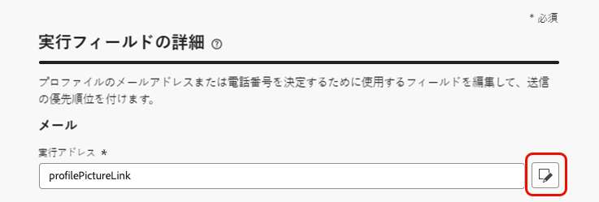
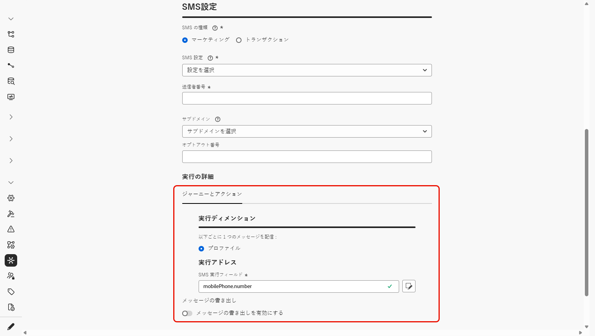
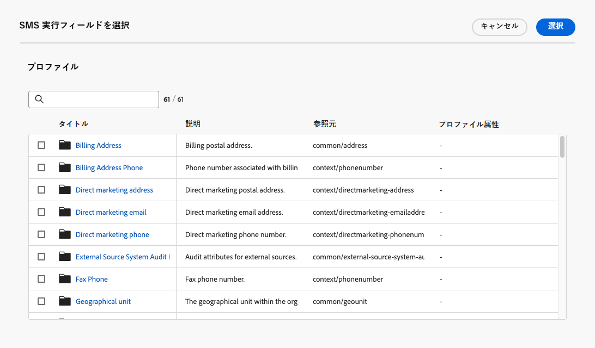

# 実行アドレスの変更 {#change-primary-email}

>[!CONTEXTUALHELP]
>id="ajo_admin_execution_address"
>title="使用するアドレスを定義"
>abstract="複数のメールアドレスまたは電話番号がデータベースで使用可能な場合 (個人用、仕事用など)、送信で優先するものを選択できます。"

>[!CONTEXTUALHELP]
>id="ajo_admin_execution_address_header"
>title="使用するアドレスを定義"
>abstract="プロファイルのメールアドレスまたは電話番号を決定するために使用するフィールドを編集して、送信の優先順位を付けます。"

プロファイルをターゲットにする場合、データベースで複数のメールアドレスや電話番号（プロのメールアドレス、個人の電話番号など）を使用できる場合があります。

その場合、[!DNL Journey Optimizer] は&#x200B;**[!UICONTROL 実行フィールド]**&#x200B;を使用して、優先してプロファイルサービスから使用するメールアドレスまたは電話番号を決定します。

現在デフォルトで使用されているフィールドを確認するには、**[!UICONTROL 管理]**／**[!UICONTROL チャネル]**／**[!UICONTROL 一般設定]**／**[!UICONTROL 実行フィールド]**&#x200B;メニューにアクセスします。

{width=90%}

>[!NOTE]
>
>実行フィールドは、メールチャネル、SMS チャネルおよび WhatsApp チャネルで使用できます。

現在の値は、サンドボックスレベルのすべての配信に使用されます。必要に応じて、これらのフィールドを更新できます。

ほとんどの場合、実行フィールドをグローバルに変更し、すべてのメール、SMS または WhatsApp のメッセージに使用する値を定義します。

## 管理設定を更新します {#admin-settings}

サンドボックスレベルで実行フィールドをグローバルに変更するには、次の手順に従います。

1. **[!UICONTROL チャネル]**／**[!UICONTROL 一般設定]**／**[!UICONTROL 実行フィールド]**&#x200B;メニューにアクセスします。

1. デフォルト値を変更する場合は「**[!UICONTROL 編集]**」をクリックします。

   {width=70%}

1. 選択した現在のフィールドまたは編集アイコンをクリックして、新しいフィールドを選択します。

   {width=70%}

1. 使用可能なメールタイプの XDM フィールドのリストが表示されます。使用するフィールドを選択します。

   {width=90%}

1. 「**[!UICONTROL 保存]**」をクリックして選択内容を確定します。

実行フィールドが更新され、プライマリアドレスとして使用されるようになります。

<!--1. You can also select an additional field to use as secondary email address. This allows you to determine which field to use if the primary field is empty for a profile. -->

## ジャーニーパラメーターのデフォルトの実行フィールドの上書き {#override-execution-address-journey}

>[!CONTEXTUALHELP]
>id="ajo_journey_execution_address"
>title="カスタム値の定義"
>abstract="いくつかの特定のケースでは、デフォルトの実行アドレスを上書きできます。フィールドの右側にある **パラメーターの上書きを有効にする** アイコンを使用して、カスタムプライマリアドレスを定義します。"
>additional-url="https://experienceleague.adobe.com/ja/docs/journey-optimizer/using/configuration/primary-email-addresses#journey-parameters" text="実行アドレスについて"

特定のユースケースでは、グローバルに設定された実行フィールドを上書きし、ジャーニーレベルで異なる値を定義できます。

この値の上書きは、例えば次のような場合に便利です。

* 配信のテスト。自分のメールアドレスや電話番号を追加できる：ジャーニーを公開するとメール、SMS または WhatsApp のメッセージが届きます。
* リスト上の購読者に対するメッセージの送信。詳しくは、[このユースケース](../building-journeys/message-to-subscribers-uc.md)を参照してください。

**[!UICONTROL メール]**&#x200B;アクション、**[!UICONTROL SMS]** アクションまたは **[!UICONTROL WhatsApp]** アクションを[ジャーニー](../email/create-email.md#create-email-journey-campaign)に追加すると、プライマリメールアドレスや電話番号がジャーニーの詳細設定パラメーターの下に表示されます。

フィールドの右側にある「**[!UICONTROL パラメーターの上書きを有効にする]**」アイコンを使用して、この値を上書きします。

{width=85%}

>[!CAUTION]
>
>メールアドレスや電話番号の上書きは、特定のユースケースに対してのみ使用してください。ほとんどの場合、サンドボックスレベルの&#x200B;**[!UICONTROL 実行フィールド]**&#x200B;でプライマリアドレスとして定義されている値を使用する必要があるため、メールアドレスを変更する必要はありません。

## チャネル設定のデフォルトの実行フィールドの上書き {#override-execution-address-channel-config}

>[!CONTEXTUALHELP]
>id="ajo_email_config_execution_address"
>title="使用するデフォルトの実行アドレスの上書き"
>abstract="複数のメールアドレスまたは電話番号がデータベースで使用可能な場合 (個人用、仕事用など)、送信で優先するものを選択できます。プライマリアドレスはサンドボックスレベルで定義されますが、ここでは、この特定のチャネル設定のデフォルト設定を上書きできます。"

特定のメール、SMS または WhatsApp の[チャネル設定](channel-surfaces.md)のデフォルトの実行アドレスを変更できます。

これを行うには、「**[!UICONTROL 実行ディメンション]**」セクションに移動し、**[!UICONTROL 実行アドレス]**&#x200B;の下の専用フィールドを編集します。

>[!NOTE]
>
>[WhatsApp チャネル](../whatsapp/whatsapp-configuration.md#whatsapp-configuration)の場合、**[!UICONTROL WhatsApp 実行フィールド]**&#x200B;は「**[!UICONTROL WhatsApp 設定]**」セクションの下にあります。

{width=85%}

次に、使用可能なメールタイプの XDM フィールドのリストから項目を選択します。

実行フィールドが更新され、このチャネル設定を使用するキャンペーンまたはジャーニーのプライマリアドレスとして使用されます。サンドボックスレベルで定義された[一般設定](#admin-settings)が上書きされます。

<!--[Learn more on the execution address in the email configuration ](../email/email-settings.md#execution-address)-->
