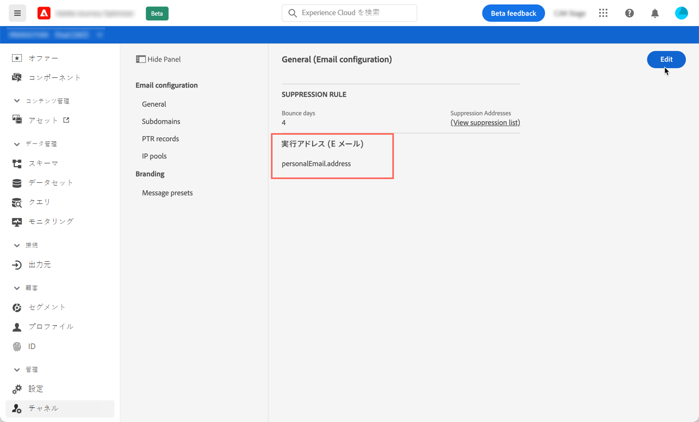
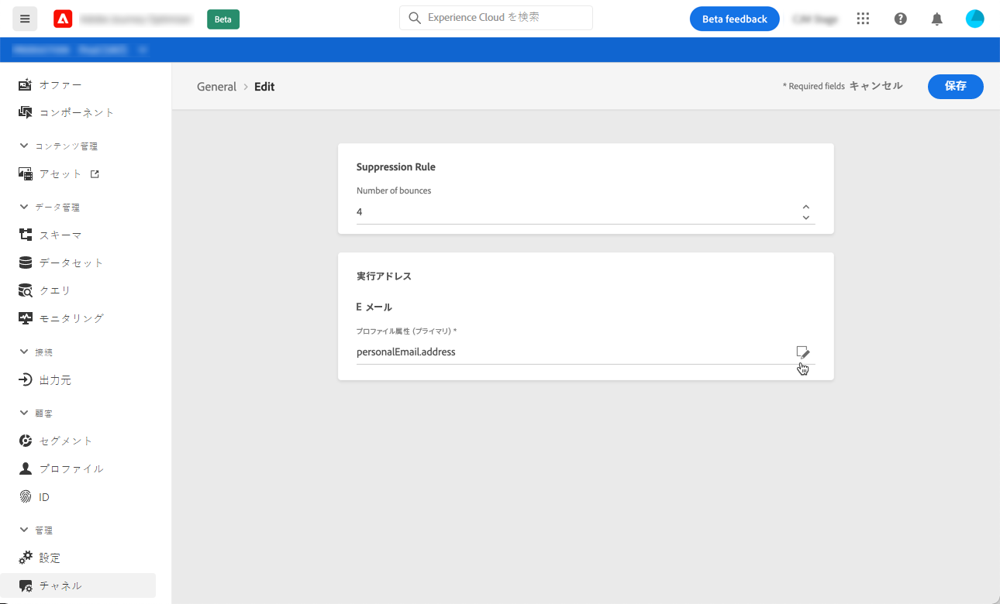
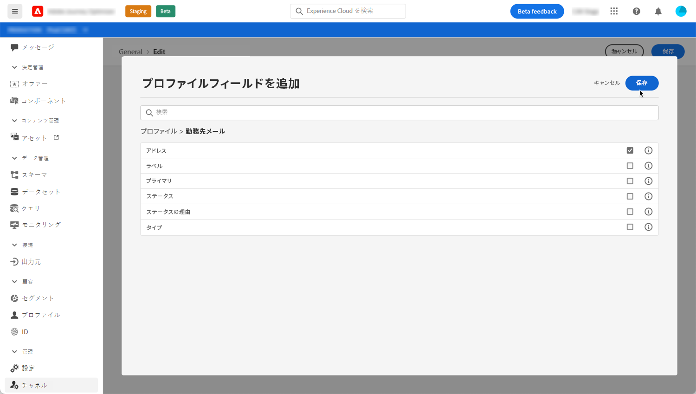

# プロファイルのプライマリアドレスの決定

プロファイルをターゲットにする場合、データベース内で複数の電子メールアドレス（個人用、職業用の電子メールアドレスなど）を使用できる場合があります。

Journey Optimizerでは、プロファイルサービスから使用する電子メールアドレスを決定し、複数のアドレスが使用可能な場合に優先順位を付けることができます。 それをおこなうには、次の手順に従います。

1. **[!UICONTROL チャネル]** / **[!UICONTROL 一般]**&#x200B;メニューにアクセスします。
1. プロファイルのEメールアドレスを決定するために現在デフォルトで使用されているフィールドがこの画面に表示されます。 「**[!UICONTROL 編集]**」をクリックして変更します。

   

1. 「変更」ボタンをクリックして、プライマリ電子メールアドレスとして使用する新しいフィールドを選択します。

   

1. 使用可能なEメールタイプのXDMフィールドのリストが表示されます。 使用するフィールドを選択し、「**[!UICONTROL 保存]**」をクリックします。

   

<!--1. You can also select an additional field to use as secondary email address. This allows you to determine which field to use if the primary field is empty for a profile. >> will be done later on-->
