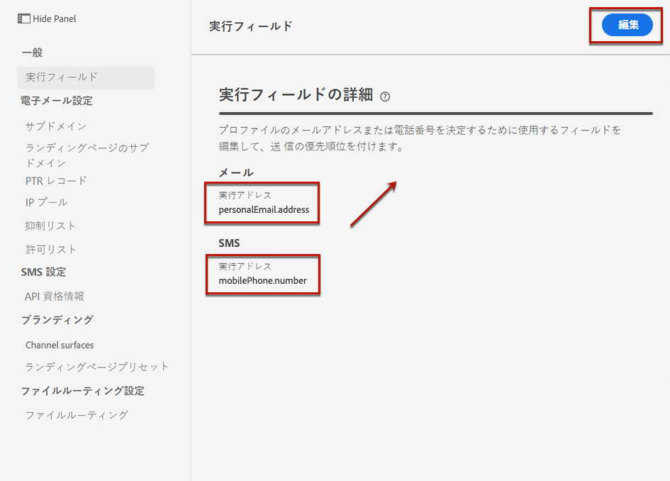
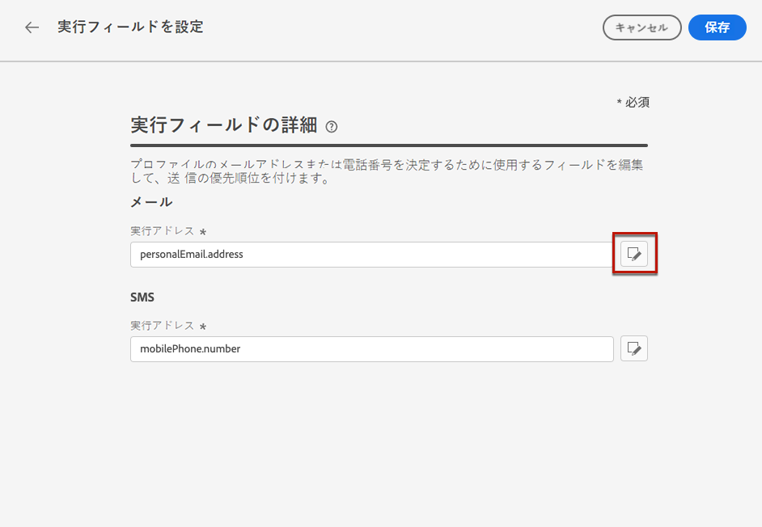
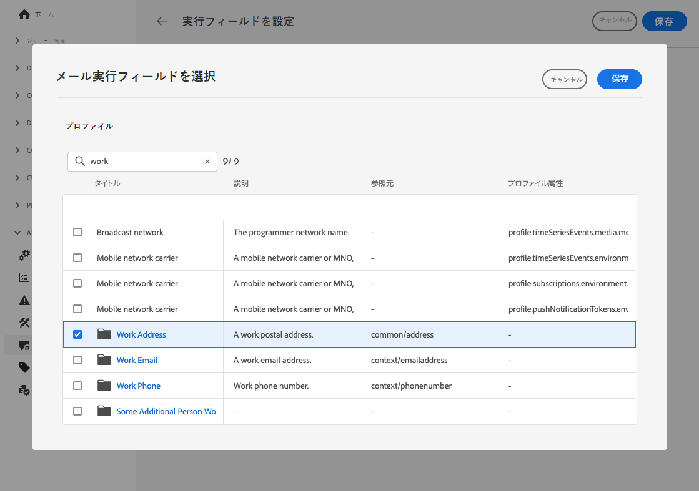
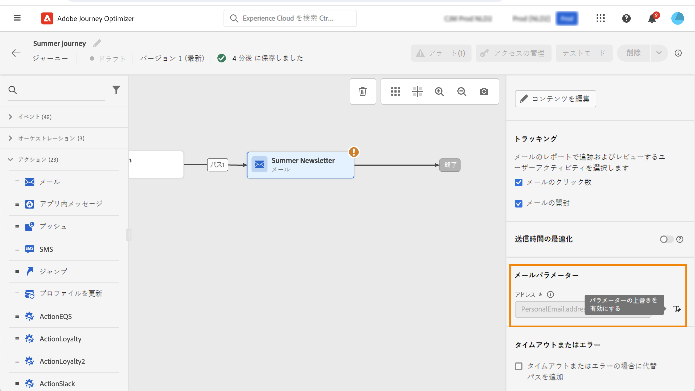

# 実行アドレスの変更 {#change-primary-email}

>[!CONTEXTUALHELP]
>id="ajo_admin_execution_address"
>title="使用するアドレスを定義"
>abstract="複数のメールアドレスまたは電話番号がデータベースで使用可能な場合 (個人用、仕事用など)、送信で優先するものを選択できます。"

>[!CONTEXTUALHELP]
>id="ajo_admin_execution_address_header"
>title="使用するアドレスを定義"
>abstract="プロファイルのメールアドレスまたは電話番号を決定するために使用するフィールドを編集して、送信の優先順位を付けます。"

プロファイルをターゲットにする場合、データベースで複数のメールアドレスや電話番号（プロのメールアドレス、個人の電話番号など）を使用できる場合があります。

その場合、[!DNL Journey Optimizer] は&#x200B;**[!UICONTROL 実行フィールド]**&#x200B;を使用して、優先してプロファイルサービスから使用するメールアドレスまたは電話番号を決定します。

現在デフォルトで使用されているフィールドを確認するには、**[!UICONTROL 管理]**／**[!UICONTROL チャネル]**／**[!UICONTROL 一般]**／**[!UICONTROL 実行フィールド]**&#x200B;メニューにアクセスします。

現在の値は、サンドボックスレベルのすべての配信に使用されます。必要に応じて、これらのフィールドを更新できます。

ほとんどの場合、実行フィールドをグローバルに変更し、すべてのメールまたは SMS のメッセージに使用する値を定義します。<!--[Learn how](#admin-settings)-->

<!--In some specific use cases only, you can override the value set globally and define a different value at the journey level. [Learn more](#journey-parameters)-->

## 管理設定を更新します {#admin-settings}

サンドボックスレベルで実行フィールドをグローバルに変更するには、次の手順に従います。

1. **[!UICONTROL チャネル]**／**[!UICONTROL 一般]**／**[!UICONTROL 実行フィールド]**&#x200B;メニューにアクセスします。

1. デフォルト値を変更する場合は「**[!UICONTROL 編集]**」をクリックします。

   

1. 選択した現在のフィールドまたは編集アイコンをクリックして、新しいフィールドを選択します。

   

1. 使用可能なメールタイプの XDM フィールドのリストが表示されます。使用するフィールドを選択します。

   

1. 「**[!UICONTROL 保存]**」をクリックして選択内容を確定します。

実行フィールドが更新され、プライマリアドレスとして使用されるようになります。

<!--1. You can also select an additional field to use as secondary email address. This allows you to determine which field to use if the primary field is empty for a profile. -->

## ジャーニーパラメーターの値の上書き {#journey-parameters}

特定の使用例に限り、グローバルに設定された実行フィールドを上書きし、特にメールチャネルに対してジャーニーレベルで異なる値を定義できます。

**[!UICONTROL メール]**&#x200B;アクションを[ジャーニー](../email/create-email.md#create-email-journey-campaign)に追加すると、プライマリメールアドレスがジャーニーの詳細設定パラメーターの下に表示されます。

特定のコンテキストでは、**[!UICONTROL 住所]**&#x200B;フィールドの右側にある「**[!UICONTROL パラメーターの上書きを有効にする]**」アイコンを使って、この値を上書きすることができます。

>[!CAUTION]
>
>メールアドレスの上書きは、特定のユースケースに対してのみ使用してください。ほとんどの場合、**[!UICONTROL 実行フィールド]**&#x200B;でプライマリアドレスとして定義されている値を使用する必要があるため、メールアドレスを変更する必要はありません。

この値の上書きは、例えば次のような場合に便利です。

* メールのテスト。自分のメールアドレスを追加できる：ジャーニーを公開するとメールが届きます。
* リストのサブスクライバーにメールを送信します。詳しくは、[このユースケース](../building-journeys/message-to-subscribers-uc.md)を参照してください。
