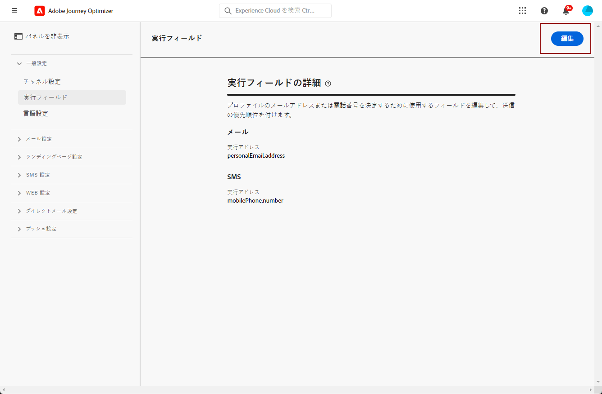

# プライマリメールアドレスの変更 {#change-primary-email}

>[!CONTEXTUALHELP]
>id="ajo_admin_execution_address"
>title="使用するアドレスを定義"
>abstract="複数のアドレスがデータベースで使用可能な場合（個人、職場など）に、送信を優先する電子メールアドレスを選択できます。"

プロファイルをターゲットにする場合、使用できるメールアドレスがデータベース内に複数ある（個人用、仕事用のメールアドレスなど）場合があります。

を使用 [!DNL Journey Optimizer]を使用すると、プロファイルサービスから、使用する電子メールアドレスを決定し、複数のアドレスが使用可能な場合に優先付けをおこなうことができます。 それには、次の手順に従います。

1. 次にアクセス：  **[!UICONTROL チャネル]** > **[!UICONTROL 一般]** > **[!UICONTROL 実行フィールド]** メニュー

   

1. プロファイルの E メールアドレスを決定するためにデフォルトで使用されているフィールドがこの画面に表示されます。 「**[!UICONTROL 編集]**」をクリックして変更します。

   

1. 現在のフィールドまたは編集アイコンをクリックして、新しいフィールドを選択します。

   

1. 使用可能なメールタイプの XDM フィールドのリストが表示されます。 使用するフィールドを選択します。

   

1. クリック **[!UICONTROL 保存]** をクリックして選択を確定します。

   

   実行フィールドが更新され、プライマリアドレスとして使用されるようになります。

<!--1. You can also select an additional field to use as secondary email address. This allows you to determine which field to use if the primary field is empty for a profile. -->
