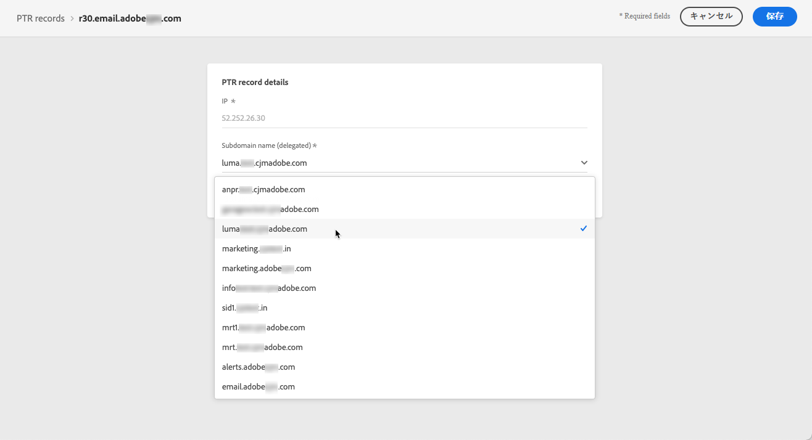
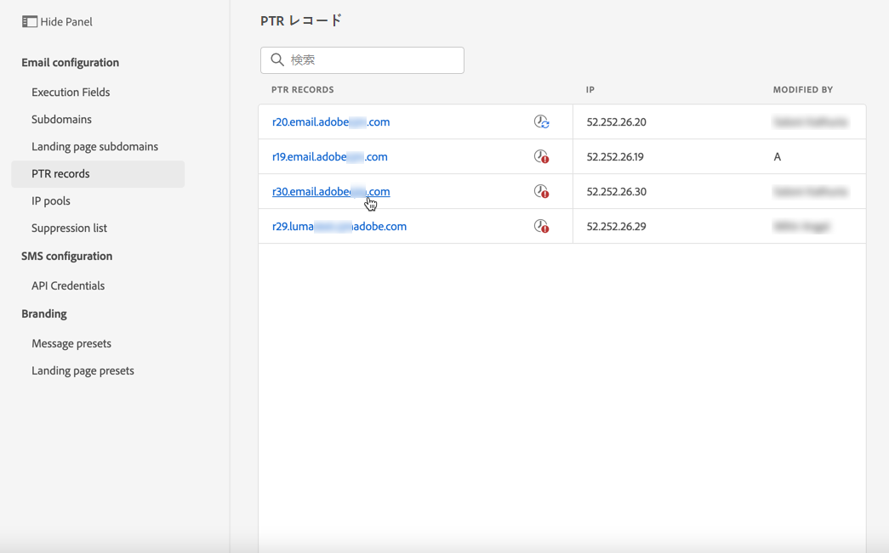
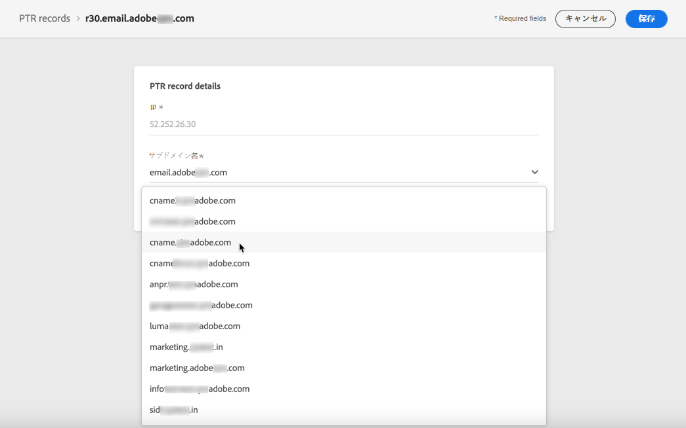
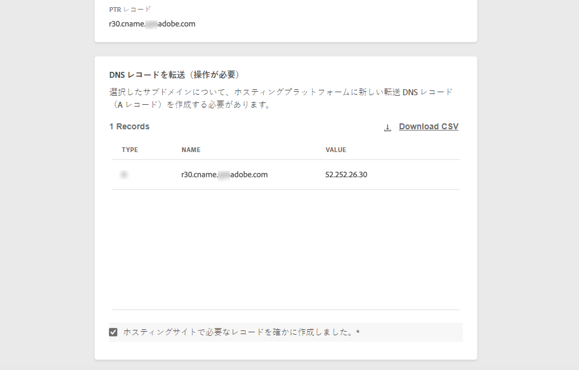
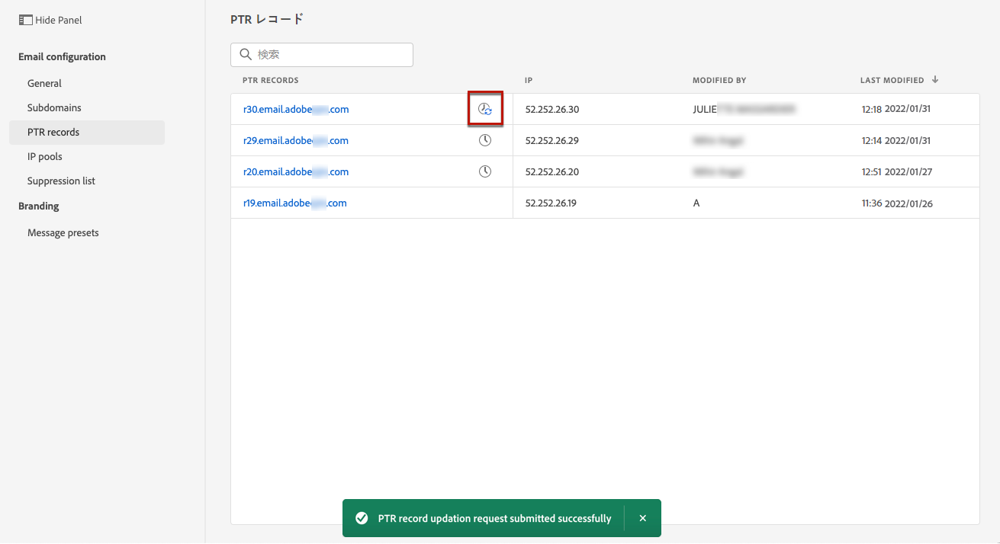
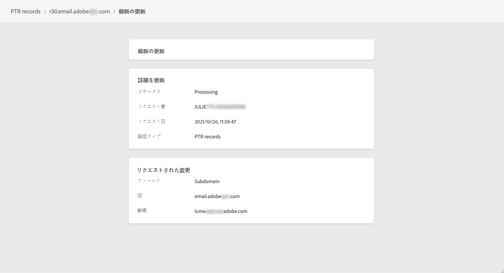

# PTR レコード {#ptr-records}

## PTR レコードについて {#about-ptr-records}

ポインタレコード（PTR）は、IP アドレスと関連付けたドメイン名を提供する DNS（Domain Name System）レコードの一種です。

PTR レコードを使用すると、受信メールサーバーは、送信メールサーバーの IP アドレスが接続先の名前に対応しているかどうかを識別することにより、送信メールサーバーの信頼性を確認できます。

## サブドメインの PTR レコードへのアクセス {#access-ptr-records}

Adobe Journey Optimizer で[サブドメインがデリゲート](delegate-subdomain.md)されると、PTR レコードが自動的に作成され、このサブドメインに関連付けられます。**[!UICONTROL チャネル]**／**[!UICONTROL メール設定]**／**[!UICONTROL PTR レコード]**&#x200B;メニューからアクセスできます。

このリストには、以下の構文を使用して、デリゲートされたサブドメインごとに生成された PTR レコードが表示されます。

* レコードの場合は「r」。
* IP アドレスの最後の 2 桁には「xx」。
* サブドメイン名。

リストから PTR レコードを開くと、関連するサブドメイン名と IP アドレスを表示できます。

## PTR レコードの編集 {#edit-ptr-record}

PTR レコードを編集して、IP アドレスに関連付けられたサブドメインを変更できます。

>[!NOTE]
>
>「**[!UICONTROL IP]**」フィールドと「**[!UICONTROL PTR レコード]**」フィールドは変更できません。

### 完全にデリゲートされたサブドメイン {#fully-delegated-subdomains}

サブドメイン ( [完全に委任された](delegate-subdomain.md#full-subdomain-delegation) をAdobeするには、次の手順に従います。

1. リストから、PTR レコード名をクリックして開きます。

   

1. サブドメインを選択 [完全に委任された](delegate-subdomain.md#full-subdomain-delegation) をリストからAdobeに追加します。

   

1. 「 **[!UICONTROL 保存]**」をクリックして変更を確定します。

### CNAME メソッドを使用したデリゲートされたサブドメイン {#edit-ptr-subdomains-cname}

を使用して、Adobeにデリゲートされたサブドメインを持つ PTR レコードを編集するには [CNAME メソッド](delegate-subdomain.md#cname-subdomain-delegation)、次の手順に従います。

1. リストから、PTR レコード名をクリックして開きます。

   

1. 次を使用して、ドメインにデリゲートされたAdobeのサブドメインを選択 [CNAME メソッド](delegate-subdomain.md#cname-subdomain-delegation) を選択します。

   

1. ホスティングプラットフォーム上に新しい転送 DNS レコードを作成する必要があります。 これをおこなうには、「Adobe」で生成されたレコードをコピーします。 完了したら、「I confirm...」チェックボックスをオンにします。

   

   >[!NOTE]
   >
   >このメッセージが表示された場合：「最初にフォワード DNS を作成してから、もう一度やり直してください」と、以下の手順に従ってください。
   >   * 転送 DNS レコードが正常に作成されたかどうかを DNS プロバイダーで確認します。
   >   * DNS 全体のレコードがすぐに同期されない場合があります。 数分待ってから、もう一度やり直してください。

1. 「 **[!UICONTROL 保存]**」をクリックして変更を確定します。

## PTR レコードの更新の詳細を確認 {#check-ptr-record-update}

A **[!UICONTROL 処理中]** リスト内の PTR レコードの名前の横にアイコンが表示されます。

PTR レコードの更新の詳細を確認するには、「**[!UICONTROL 更新中]**」アイコンまたは「**[!UICONTROL 最近の更新]**」アイコンをクリックします。

更新ステータスやリクエストされた変更などの情報が表示されます。

## PTR レコードの更新ステータス {#ptr-record-update-statuses}

PTR レコードの更新には、次のステータスがあります。

* **[!UICONTROL 処理中]**：PTR レコードの更新が送信され、検証中です。
* **[!UICONTROL 成功]**：更新された PTR レコードが検証され、新しいサブドメインが IP アドレスに関連付けられました。
* **[!UICONTROL 失敗]**：PTR レコードの更新を検証中に、1 つまたは複数の検査に失敗しました。

### 処理中 {#processing}

IP アドレスに関連付ける新しいサブドメインが有効であることを検証するために、いくつかの配信品質チェックが実行されます。 <!--The processing time is around **48h-72h**, and can take up to **7-10 days**.-->

>[!NOTE]
>
>更新中は、PTR レコードを変更できません。名前はクリックできますが、「**[!UICONTROL サブドメイン]**」フィールドは灰色表示になります。変更は、更新が正常に完了するまで反映されません。

検証中は、古いサブドメインがまだ IP アドレスに関連付けられています。

### 成功 {#success}

検証が成功すると、新しいサブドメインが IP アドレスに自動的に関連付けられます。

### 失敗 {#failes}

検証プロセスが失敗した場合は、古い PTR レコードが表示されます。以前に IP アドレスに関連付けられていた有効なサブドメインは変更されません。

考えられる更新エラーのタイプは次のとおりです。
* PTR レコードの新しい転送 DNS の作成に失敗
* レコードの更新に失敗
* アフィニティの再オンボーディングに失敗

更新に失敗すると、PTR レコードが再び編集可能になります。レコードの名前をクリックして、サブドメインを再度更新できます。
