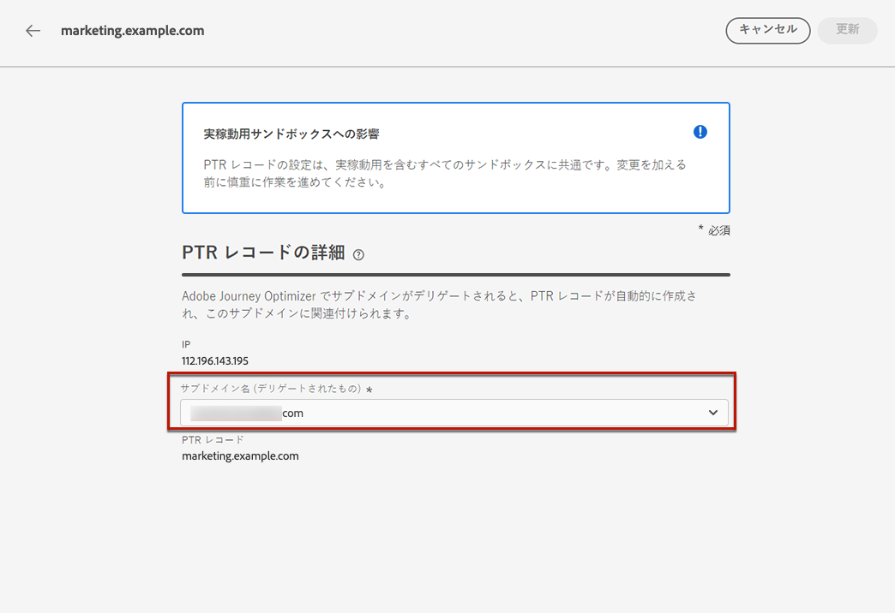

# PTR レコードの作成と編集 {#ptr-records}

>[!CONTEXTUALHELP]
>id="ajo_admin_ptr_record"
>title="サブドメインの PTR レコード"
>abstract="ポインターレコード（PTR）は、IP アドレスにリンクされたドメイン名を提供する DNS レコードの一種で、受信メールサーバーが送信者の IP アドレスを確認するのに役立ちます。配信品質のエキスパートとの間で検討および議論が終わった後に、PTR レコードを編集するだけです。"

>[!CONTEXTUALHELP]
>id="ajo_admin_ptr_record_header"
>title="サブドメインの PTR レコード"
>abstract="最初のサブドメインを Journey Optimizer でアドビにデリゲートすると、PTR レコードが自動作成されます。"

## PTR レコードについて {#about-ptr-records}

ポインタレコード（PTR）は、IP アドレスと関連付けたドメイン名を提供する DNS（Domain Name System）レコードの一種です。

PTR レコードを使用すると、受信メールサーバーは、送信メールサーバーの IP アドレスが接続先の名前に対応しているかどうかを識別することにより、送信メールサーバーの信頼性を確認できます。

## サブドメインの PTR レコードへのアクセス {#access-ptr-records}

[!DNL Journey Optimizer] で最初のサブドメインをアドビに[デリゲート](delegate-subdomain.md)すると、IP に対して PTR レコードが自動作成されます。**[!UICONTROL 管理]**／**[!UICONTROL チャネル]**／**[!UICONTROL メール設定]**／**[!UICONTROL PTR レコード]**&#x200B;メニューからアクセスできます。

このリストには、以下の構文を使用して、生成された PTR レコードが表示されます。

* レコードの場合は「r」。
* IP アドレスの最後の 2 桁には「xx」。
* サブドメイン名。

リストから PTR レコードを開くと、関連するサブドメイン名と IP アドレスを表示できます。

## PTR レコードの編集 {#edit-ptr-record}

[!DNL Journey Optimizer] では、PTR レコードを手動で作成できません。代わりに、最初のサブドメインをアドビに[デリゲート](delegate-subdomain.md)すると、IP に対して PTR レコードが自動作成されます。

各 IP は 1 つの PTR レコードを受信します。すべての PTR レコードの形式は「rxx.subdomain」です。「subdomain」は、[!DNL Journey Optimizer] でデリゲートした最初のサブドメインです。

追加のサブドメインを作成する場合は、1 つ以上の PTR レコードを変更し、その新しいサブドメインを割り当てる必要があります。これを行うには、以下の手順に従います。

>[!CAUTION]
>
>PTR レコードは、すべての環境に共通です。したがって、PTR レコードを変更すると、実稼働用サンドボックスにも影響します。
>
>PTR レコードを編集する際は、細心の注意を払って作業を進めます。不明な点がある場合は、配信品質のエキスパートにお問い合わせください。

### 完全にデリゲートされたサブドメイン {#fully-delegated-subdomains}

アドビに[完全にデリゲートされた](delegate-subdomain.md#full-subdomain-delegation)サブドメインを持つ PTR レコードを編集するには、次の手順に従います。

1. リストで PTR レコード名をクリックして開きます。

   

1. リストからアドビに[完全にデリゲートされた](delegate-subdomain.md#full-subdomain-delegation)サブドメインを選択します。

   

1. 「 **[!UICONTROL 保存]**」をクリックして変更を確定します。

>[!NOTE]
>
>「**[!UICONTROL IP]**」フィールドと「**[!UICONTROL PTR レコード]**」フィールドは変更できません。

### CNAME メソッドを使用したデリゲートされたサブドメイン {#edit-ptr-subdomains-cname}

[CNAME メソッド](delegate-subdomain.md#cname-subdomain-delegation)を使用してアドビにデリゲートされたサブドメインを持つ PTR レコードを編集するには、次の手順に従います。

1. リストで PTR レコード名をクリックして開きます。

   

1. リストの [CNAME メソッド](delegate-subdomain.md#cname-subdomain-delegation)を使用して、アドビにデリゲートされたサブドメインを選択します。

   

1. ホスティングプラットフォーム上に新しい転送 DNS レコードを作成する必要があります。これを行うには、アドビが生成したレコードをコピーします。完了したら、「確認しました」チェックボックスをオンにします。

   

   >[!NOTE]
   >
   >「最初に転送 DNS を作成してからもう一度お試しください」というメッセージが表示された場合は、以下の手順に従ってください。
   >   * 転送 DNS レコードが正常に作成されたかどうかを DNS プロバイダーで確認します。
   >   * DNS をまたいだレコードはただちに同期されない場合があります。数分待ってから、もう一度お試しください。

1. 「 **[!UICONTROL 保存]**」をクリックして変更を確定します。

>[!NOTE]
>
>「**[!UICONTROL IP]**」フィールドと「**[!UICONTROL PTR レコード]**」フィールドは変更できません。

## PTR レコードの更新の詳細を確認 {#check-ptr-record-update}

PTR レコードの編集を確認すると、リスト内の PTR レコードの名前の横に「**[!UICONTROL 処理中]**」アイコンが表示されます。

>[!NOTE]
>
>[更新処理](#processing)には 3 時間かかる場合があります。

PTR レコードの更新の詳細を確認するには、その横にあるアイコンをクリックします。様々なアイコンに関連付けられたステータスについて詳しくは、[この節](#ptr-record-update-statuses)を参照してください。

更新ステータスやリクエストされた変更などの情報が表示されます。

## PTR レコードの更新ステータス {#ptr-record-update-statuses}

PTR レコードの更新には、次のステータスがあります。

*  **[!UICONTROL 処理中]**：PTR レコードの更新が送信され、検証プロセスを実行中です。
* **[!UICONTROL 成功]**：更新された PTR レコードが検証され、新しいサブドメインが IP アドレスに関連付けられました。
* **[!UICONTROL 失敗]**：PTR レコードの更新を検証中に、1 つ以上のチェックが失敗しました。

### 処理中 {#processing}

IP アドレスに関連付ける新しいサブドメインが有効であることを検証するために、いくつかの配信品質チェックが実行されます。これには、最大 3 時間かかることがあります。

>[!NOTE]
>
>更新中は、PTR レコードを変更できません。名前はクリックできますが、「**[!UICONTROL サブドメイン]**」フィールドは灰色表示になります。変更は、更新が正常に完了するまで反映されません。

検証中は、古いサブドメインがまだ IP アドレスに関連付けられています。

### 成功 {#success}

検証が成功すると、新しいサブドメインが IP アドレスに自動的に関連付けられます。

### 失敗 {#failes}

検証プロセスが失敗した場合は、古い PTR レコードが表示されます。以前に IP アドレスに関連付けられていた有効なサブドメインは変更されません。

考えられる更新エラーのタイプは次のとおりです。
* PTR レコードの新しい転送 DNS の作成に失敗
* レコードの更新に失敗
* アフィニティの再オンボーディングに失敗

更新に失敗すると、PTR レコードが再び編集可能になります。レコードの名前をクリックして、サブドメインを再度更新できます。
