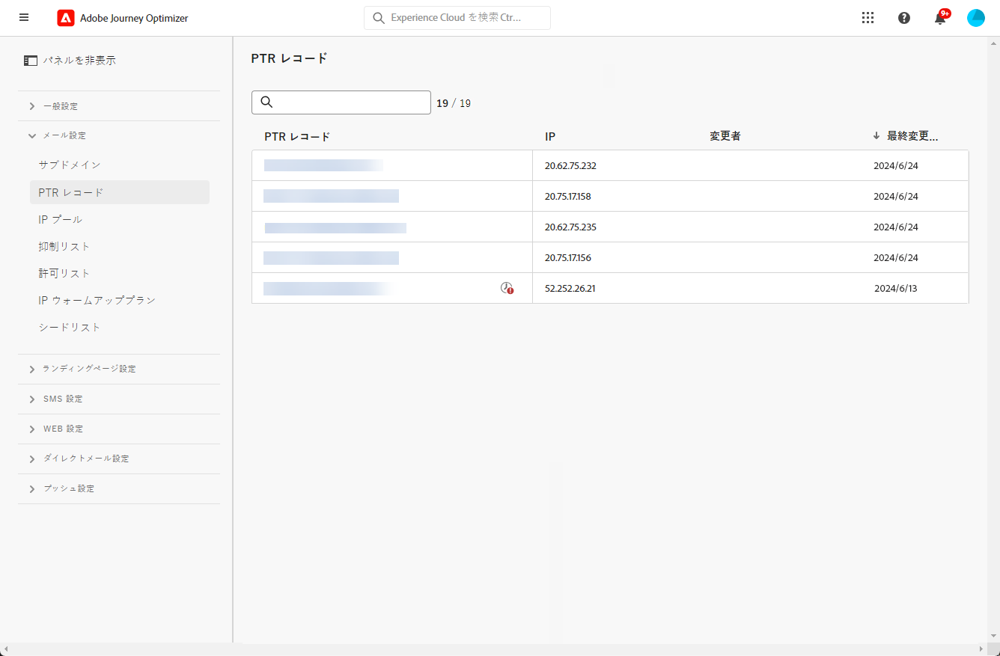
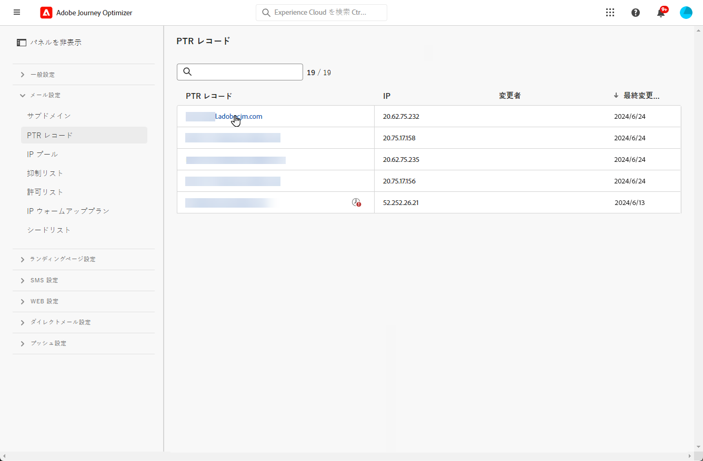
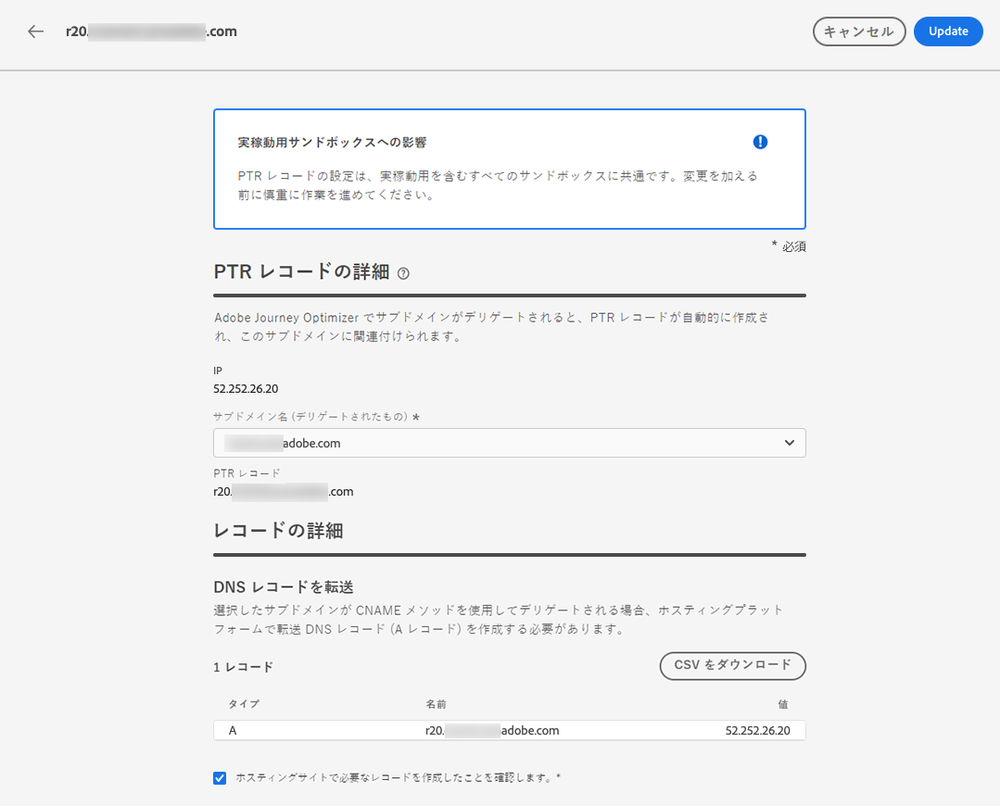
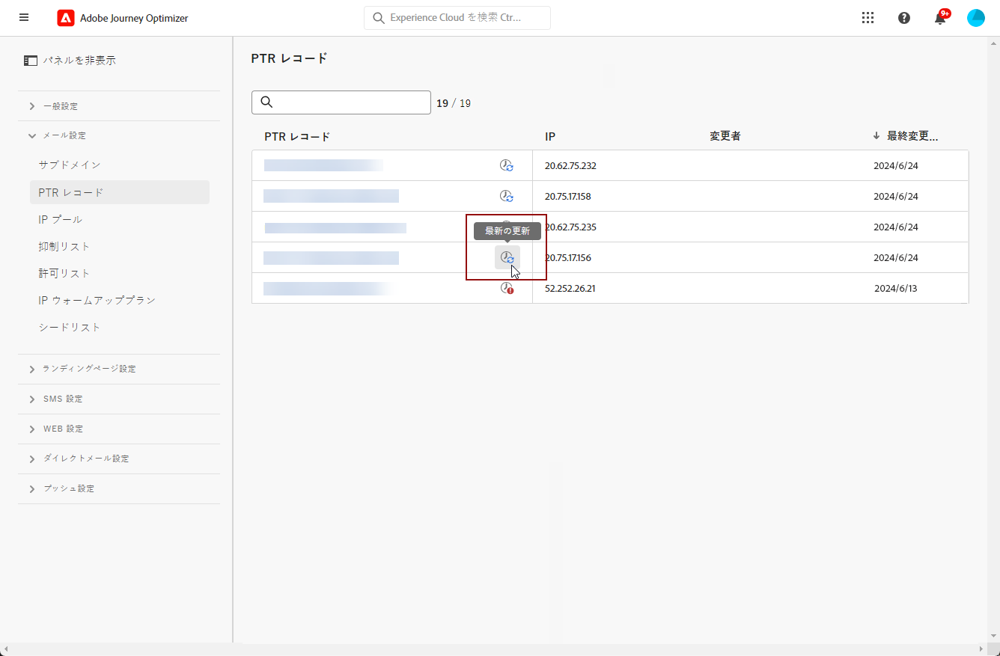

# PTR レコード {#ptr-records}

>[!CONTEXTUALHELP]
>id="ajo_admin_ptr_record"
>title="サブドメインの PTR レコード"
>abstract="ポインタレコード (PTR) は、IP アドレスにリンクされたドメイン名を提供する DNS レコードの一種です。これは、受信側のメールサーバーが送信者の IP アドレスを確認するのに役立ちます。 Deliverability エキスパートを使用して、締め切り後に PTR レコードのみを編集するようにしてください。"

>[!CONTEXTUALHELP]
>id="ajo_admin_ptr_record_header"
>title="サブドメインの PTR レコード"
>abstract="このサブドメインが旅オプティマイザーで Adobe に委任されると、PTR レコードが自動的に作成され、このサブドメインに関連付けられます。"

## PTR レコードについて {#about-ptr-records}

ポインターレコード (PTR) は、IP アドレスにリンクされたドメイン名を提供する、ドメインネームシステム (DNS) レコードの一種です。

PTR レコードを使用すると、受信メールサーバーは、サーバーが接続している名前と一致しているかどうかを識別することによって、メールサーバーの送信を確認することができます。

## サブドメインの PTR レコードへのアクセス {#access-ptr-records}

[サブドメインが Adobe の旅のオプティマイザーによって委任 ](delegate-subdomain.md) されると、PTR レコードが自動的に作成され、このサブドメインに関連付けられます。このファイルにアクセスするには、 **[!UICONTROL Administration]** > **[!UICONTROL Channels]** > **[!UICONTROL Email configuration]** > **[!UICONTROL PTR records]** メニューを参照してください。

一覧には、次のシンタックスを使用して、委任された各サブドメインに対して生成される PTR レコードが表示されます。

* レコードの場合は &quot;r&quot;、
* IP アドレスの最後の2つの数字を「xx」で指定します。
* サブドメイン名を指定します。

リストから PTR レコードを開くと、関連付けられたサブドメイン名と IP アドレスを表示することができます。

## PTR レコードの編集 {#edit-ptr-record}

PTR レコードは、IP アドレスに関連付けられたサブドメインを編集するために変更することができます。

>[!CAUTION]
>
>PTR レコードは、すべての環境に共通です。 このため、PTR レコードに変更を加えると、運用サンドボックスにも影響します。
>
>PTR レコードを編集するときは、注意が必要です。 ご不明な点がある場合は、deliverability のエキスパートまでお問い合わせください。

### 完全に委任されたサブドメイン {#fully-delegated-subdomains}

Adobe に完全に委任 ](delegate-subdomain.md#full-subdomain-delegation) され [ たサブドメインと共に PTR レコードを編集するには、次の手順に従います。

1. リストから、PTR レコード名をクリックして開きます。

   

1. リストから Adobe に完全に委任 ](delegate-subdomain.md#full-subdomain-delegation) されているサブドメイン [ を選択します。

   

1. 変更を確認するには、をクリックし **[!UICONTROL Save]** ます。

>[!NOTE]
>
>および **[!UICONTROL PTR record]** フィールドは **[!UICONTROL IP]** 変更できません。

### CNAME メソッドを使用したサブドメインの委任 {#edit-ptr-subdomains-cname}

CNAME メソッド ](delegate-subdomain.md#cname-subdomain-delegation) を使用して [ Adobe に委任されたサブドメインで PTR レコードを編集するには、次の手順を実行します。

1. リストから、PTR レコード名をクリックして開きます。

   

1. リストから CNAME メソッド ](delegate-subdomain.md#cname-subdomain-delegation) を使用して Adobe に委任されて [ いるサブドメインを選択します。

   

1. ホスティングプラットフォームに新しい DNS レコードを作成する必要があります。 これを行うには、Adobe によって生成されたレコードをコピーします。 入力が完了したら、「確認します」というチェックボックスをオンにします。

   

   >[!NOTE]
   >
   >このメッセージが表示された場合は、次の手順を実行して「DNS を作成してから、もう一度実行してください」というメッセージが表示されます。
   >   * フォワード DNS レコードが正常に作成されている場合は、DNS プロバイダーを確認します。
   >   * DNS 上のレコードは、ただちに同期されるとは限りません。 しばらくたってから、もう一度やり直してください。

1. 変更を確認するには、をクリックし **[!UICONTROL Save]** ます。

>[!NOTE]
>
>および **[!UICONTROL PTR record]** フィールドは **[!UICONTROL IP]** 変更できません。

## PTR レコードの更新の詳細を確認する {#check-ptr-record-update}

PTR レコードが編集されたことを **[!UICONTROL Processing]** 確認すると、リスト内の ptr レコードの名前の横にアイコンが表示されます。

>[!NOTE]
>
>[更新処理 ](#processing) には最大3時間かかります。

PTR レコードを更新するための詳細を確認するには、その横にあるアイコンをクリックします。 このセクション ](#ptr-record-update-statuses) で [ は、アイコンに関連付けられたステータスについて詳しく説明しています。

更新状況、要求された変更などの情報が表示されます。

## PTR レコードの更新状態 {#ptr-record-update-statuses}

PTR レコードを更新するには、次のステータスを使用できます。

* **[!UICONTROL Processing]** PTR レコードの更新が送信され、検証プロセスが実行されています。
* **[!UICONTROL Success]**: 更新された PTR レコードが検証され、新しいサブドメインが IP アドレスに関連付けられるようになりました。
* **[!UICONTROL Failed]**: PTR レコードの更新を検証中に、1つまたは複数のチェックが失敗しました。

### 処理 {#processing}

IP アドレスに関連付けられた新しいサブドメインが有効になっているかどうかを確認するために、いくつかの deliverability チェックが実行されます。 これには最大3時間かかります。

>[!NOTE]
>
>更新が進行中の場合、PTR レコードを変更することはできません。 その名前をクリックして **[!UICONTROL Subdomain]** も、フィールドはグレー表示になります。 変更は、更新が成功するまで反映されません。

検証処理中に、古いサブドメインは IP アドレスに関連付けられたままになります。

### 時 {#success}

検証プロセスが成功すると、新しいサブドメインは自動的に IP アドレスに関連付けられます。

### し {#failes}

検証処理が失敗した場合は、古い PTR レコードが表示されます。 IP アドレスと既に関連付けられていた有効なサブドメインは変更されません。

更新エラーの種類には、次のようなものがあります。
* PTR レコードの新しいフォワード DNS を作成できませんでした。
* レコードの更新に失敗した場合
* アフィニティの再配布に失敗します。

更新に失敗した場合、PTR レコードは再び編集可能になります。 その名前をクリックして、再度サブドメインを更新することができます。
